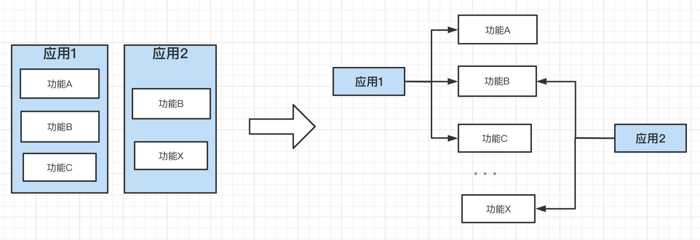
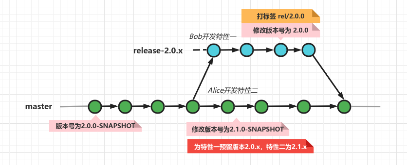

# 版本管理

#### 一、应用与其依赖

随着软件工程的发展，为了减小工程复杂度，分层和解耦越来越成为共识。应用也由庞大的单体应用进行了服务化拆分，单独拆分的微服务具备低复杂度、易升级、高伸缩性等优点。微服务间通过网络和其他微服务进行连接，组成了更大的逻辑应用。

为了减少代码重复和减小复杂度，在工程实践时应用代码往往也需要拆分（我们称之为功能模块），进行单独的版本控制和版本管理，原应用以依赖的形式的引入拆分的功能。这样的好处很多，如方便模块复用减少代码重复、功能模块仓库可以使用更简单的分支模型管理、功能模块的版本管理更容易。另外在面对应用定制部署时，只需要灵活组合功能模块即可，减小了复杂度。

复杂度一直是软件工程的大敌，随着软件的迭代，运维的成本也会随之升高。控制住复杂度，能更好的响应需求，延长应用的腐化时间。把应用解构为多模块以依赖的形式引入，拆分前后应用在功能逻辑上仍是同构的，但大大削减了开发，管理，运维的复杂度。

**此处我们可以把拆分后的功能模块称为模块工程，依赖模块仓库的应用称为聚合工程。**

#### 二、版本管理目标

版本管理的目标是保证应用稳定，通过版本划分应用功能代际，使其能平稳升级及安全回退。工程实践时：借助版本号对应用版本和应用模块（也就是应用依赖）进行管理，使应用提供的功能集与模块的版本号绑定。

**版本号约定**

[major version]：主版本号，重大版本升级时修改

[minor version]：次版本号，小版本升级时修改

[batch version]：修订版本号，FixBug时修改，一般只用于稳定版本。

快照版本：

**[major version].[minor version].0-SNAPSHOT**，如1.1.0-SNAPSHOT

稳定版本：

**[major version].[minor version].[batch version]**，如1.1.1

#### 三、版本管理原则

版本管理原则是为了实现版本管理目标，给予工程实践的一些操作指导原则，非绝对。

**1、单体应用仓库拆分为按功能内聚的功能模块仓库**

单体应用仓库模块复用难、多版本分支管理复杂、快速迭代难，实践时以功能簇为单位进行拆分，不同功能簇位于不同仓库。

想象一下，一个迭代需求反映在模块仓库时就很少会出现交叉开发和交叉上线现象，在可以简化分支开发模型的同时，也可以简化模块版本规划。即便出现交叉开发和上线，那么并行度也很低，此时可通过版本占位和短期发布分支解决，如下图所示。

**2、功能模块仓库建议使用TBD工作流**

随着GitFlow分支模型被炒的火热，好多团队也跟风的使用它作为工作流。在选择分支模型时，没有最好的，只有更合适的。

每个分支模型都有其适用的场景，GitFlow和TBD对比而言，有以下几个差异：

1）GitFlow分支类型多，目的是使开发距离主干（版本发布）更远。TBD分支则少的多，除主干分支外不会存在开发分支，开发距离主干（版本发布）更近。

2）GitFlow比TBD有更加严格的流程，往往适用于团队规模大且新手多的情况（团队成员可信度低）。TBD则推崇一天至少一次的主干合并，快速迭代，适合团队规模小和团队成员经验丰富（团队成员可信度高）。

3）GitFlow适合大型的，复杂的、开源的项目开发，而TBD则使用于小型的，低复杂度，公司内部的项目开发。

4）GitFlow由流程驱动，TBD由Team驱动。

在如上我们对单体应用进行拆分后，模块仓库的复杂度也线性下降。此时适用TBD特性，更简单的分支模型使规则更易于遵守，执行过程中噪点更少。

**3、应用（即聚合工程）通过依赖方式引入和关联功能模块**

应用代码拆分为多个模块仓库后，在组织应用功能时通过依赖方式引入模块功能。具体而言，Java工程实践时，把模块仓库的代码发布为Maven构件至Maven私服，应用通过pom.xml依赖对应构件的版本。

**4、应用（即聚合工程）通过BOM统一约束第三方依赖**

关于第三方依赖，使用Maven对Java工程进行管理时，最好使用一个BOM工程对他们进行版本约束。这样可以把第三方依赖收口到一处，将来面临依赖升级（如近期的log4j-core Bug升级）时，只需要修改一处即可。

我们当然也需要对BOM工程也进行版本管理，这样才能实现多应用环境下的灰度升级。另外建议在BOM工程里增加CHANGELOG，用来说明依赖变更的原因，便于溯源。

**5、不同环境或定制部署的应用通过不同聚合工程对模块功能不同版本的依赖实现**

应用拆分后还带来一个好处，那就是简化了应用的差异化部署。在应用的不同聚合工程里差异化的声明模块版本就可以实现，避免了在单体仓库管理的复杂度。

**6、线上应用依赖稳定（RELEASE）的功能模块版本，而非快照版本**

线上环境的聚合工程一定要使用稳定版本，因为快照版本可能被复写，无法保证不同时间打的包是一致的。为此Maven的`release`插件的`prepare`MOJO可以对此进行检测，如下的第2步。命令`mvn release:prepare`。

> [release:prepare的步骤：](https://maven.apache.org/maven-release/maven-release-plugin/examples/prepare-release.html)
>
> - Check that there are no uncommitted changes in the sources
> - Check that there are no SNAPSHOT dependencies
> - Change the version in the POMs from x-SNAPSHOT to a new version (you will be prompted for the versions to use)
> - Transform the SCM information in the POM to include the final destination of the tag
> - Run the project tests against the modified POMs to confirm everything is in working order
> - Commit the modified POMs
> - Tag the code in the SCM with a version name (this will be prompted for)
> - Bump the version in the POMs to a new value y-SNAPSHOT (these values will also be prompted for)
> - Commit the modified POMs

**7、应用（即聚合工程）全量引入功能模块依赖及声明版本，也就是做到declared used dependency**

使用Maven进行依赖管理时，建议全量的声明应用模块的版本，避免传递依赖。Maven进行依赖调停时，可能结果并不符合你的预期，如你的期望依赖版本可能被其他路径更短的间接错误依赖短路，或者被同深度的先声明的错误间接依赖短路。

为此Maven的`dependency`插件的`analyze`MOJO可以分析pom.xml中`used and declared`、`used and undeclared`、`unused and declared`的依赖集。命令：`mvn dependency:analyze`。在使用时，我们需要关注undeclared的依赖，unused的不用关注，因为聚合工程里原则上没有java代码，所有的模块依赖都是unused，即便一个普通工程也有很多SPI等方式加载的依赖，在编译时是`unused`。

**8、使用版本而不是分支进行版本管理**

据观察，存在一些工程直接使用分支进行版本管理，即编译时指定分支，在该分支上进行代码全量编译和打包。这属于早期单体应用仓库统一管理代码的现象，此时即便模块有版本号，那么也相当于是快照版本，每次编译都是新的快照，这使得版本号失去了意义。

应用拆分后，我们要严禁杜绝这种使用分支进行版本管理的方式。

**9、模块功能版本变更时，仓库级整体变更**

模块仓库包含了内聚的功能簇，也就是说模块仓库也可以聚合多个子模块。当个别模块应需求而改变时，此时建议仓库级别升级版本，而非单子模块升级。

这样做的好处很多，如：

1）管理简单，打标签无需加子模块前缀，在仓库里也容易定位变更位置。

2）整体升级可避免同一功能簇版本参差现象，当功能簇的各个子模块版本一致时，我们就可以确定当前功能簇是稳态的，而不用去检查某个版本是否处于某个安全区间，如[1.2.0, 1.4.0)

**10、代码仓库内各分支应该是同构的，即潜在可合并**

无论采用那种分支模型进行开发，都避免不了同一时刻多分支并存的现象。我们原则上要求，一个仓库内的多个分支应该是同构的，他们最终将通过合并（merge或cherry-pick）方式趋同。

如果两个分支处于异构态，无法进行合并那么可以认为是两个主体，应尽早拆分避免相互影响，减小复杂度。