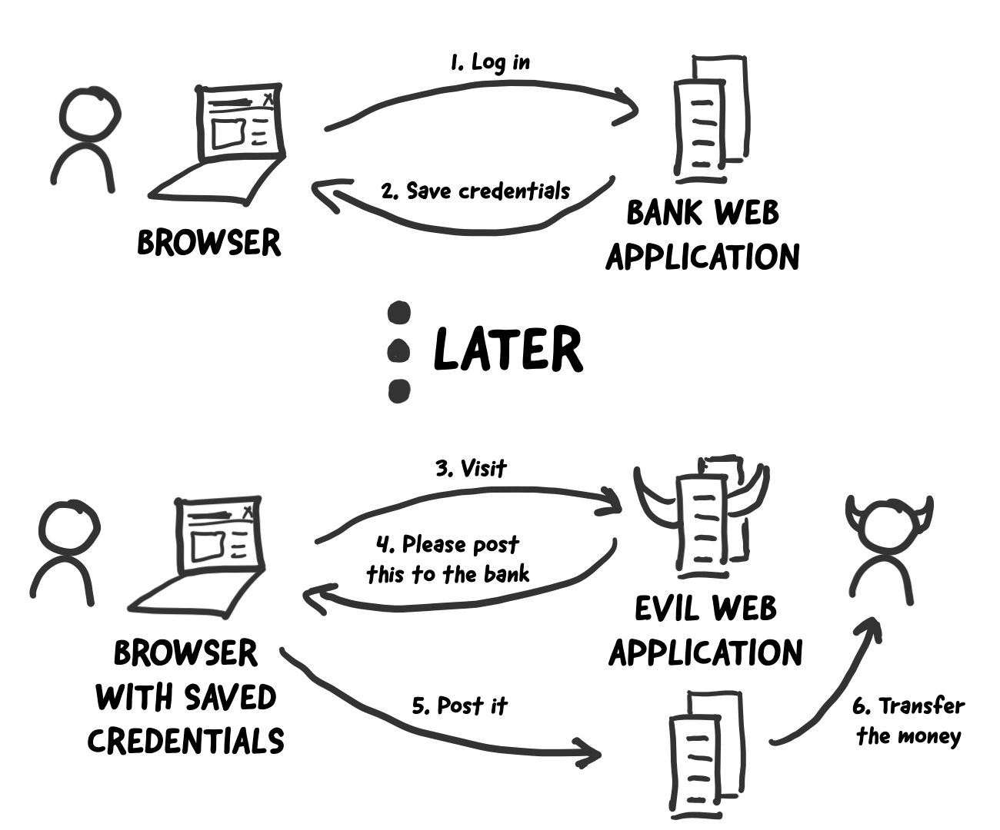
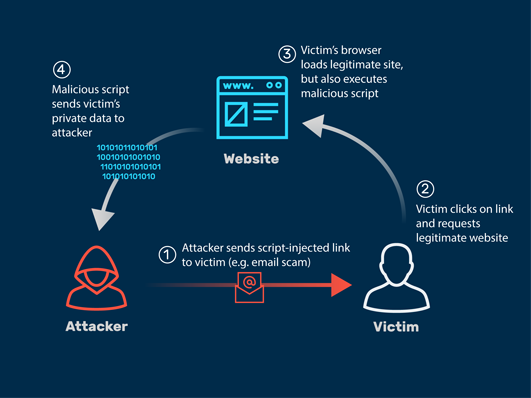
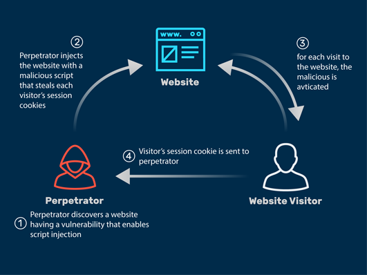

#### 一、XSRF

> XSRF（Cross-site request forgery），即跨站请求伪造攻击。

XSRF发生过程：

1）首先用户登陆正常网站A站后，服务端会把认证相关信息写入浏览器Cookie；

2）然后用户访问恶意网站B站，B站会构造访问A站的请求，该请求会携带A站写在浏览器中的Cookie；

3）A站服务器在收到B站发出的伪造请求时，A站只根据之前写入的Cookie验证操作的合法性，误执行了跨站的伪造请求。

图片来源：https://medium.com/tresorit-engineering/modern-csrf-mitigation-in-single-page-applications-695bcb538eec

#### 二、XSS

> XSS（Cross-Site Scripting），即跨站脚本攻击。

本质是网站被恶意脚本注入攻击，恶意脚本通过持久化或非持久化的方式从正常可信的网站返回后，完美绕开浏览器同源策略的限制，其可在脚本中读取用户的Cookie信息，以便利用其身份做一些危险操作。

以下图片来源：https://www.myrasecurity.com/en/what-is-cross-site-scripting/

##### 1）非持久化XSS

攻击者构造包含恶意脚本的URL，发送给被害用户让其在浏览器中访问。

##### 2）持久化XSS

攻击者把包含恶意脚本的内容上传至目标网站，可被其他用户浏览。

#### 三、XSRF vs XSS

>引自：https://portswigger.net/web-security/csrf/xss-vs-csrf
>
>CSRF通常只适用于用户能够执行的操作的子集。许多应用程序通常实现CSRF防御，但忽略了一个或两个暴露的操作。相反，成功的XSS攻击通常可以诱导用户执行用户能够执行的任何操作，而不管漏洞出现的功能如何。
>
>CSRF可以描述为一种“单向”漏洞，即攻击者可以诱导受害者发出HTTP请求，但他们无法从该请求中检索响应（所以查询类服务往往不受影响）。相反，XSS是“双向的”，因为攻击者注入的脚本可以发出任意请求、读取响应并将数据导出到攻击者选择的外部域。

##### 1）XSRF：允许攻击者诱导被害者执行一些无法感知的请求到目标网站

* 目标网站信任用户

* 攻击者诱导用户的浏览器去发送其伪造的请求到目标网站

* 目标网站执行了攻击者的请求

##### 2）XSS：允许攻击者执行在受害者的浏览器上执行任意脚本

* 用户信任目标网站

* 攻击者把恶意脚本注入到用户信任的网站

* 用户的浏览器执行了攻击者注入的脚本

#### # 参考

1. [WIKI: Cross-site_request_forgery](https://en.wikipedia.org/wiki/Cross-site_request_forgery)
2. [WIKI: XSS](https://en.wikipedia.org/wiki/Cross-site_scripting)
3. https://www.myrasecurity.com/en/what-is-cross-site-scripting/
4. https://portswigger.net/web-security/csrf/xss-vs-csrf

