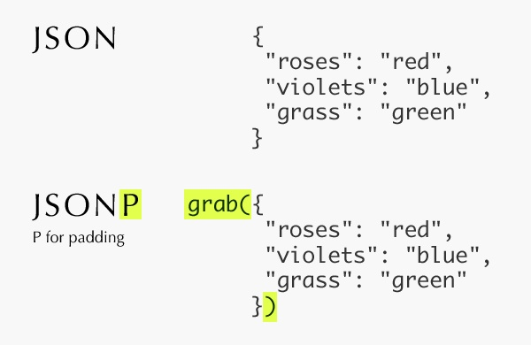

#### 一、什么是跨域？
要先理解跨域，先理解同源的概念。
1） 同源是指两个uri的协议，域名和端口三者完全一致。
2） 跨域可理解为同源的反义。
#### 二、浏览器为什么要限制跨域？
由于浏览器的Cookie是存储在一起的，浏览器并没有区分。此时如果不限制同源，则会出现CSRF。比如访问你在浏览器里先登陆了银行的网站，银行把一些敏感信息写入了Cookie，之后你访问其他网站时都会携带这个Cookie，若果被恶意网站获取就容易被盗取银行信息。

浏览器厂商Netscape 为了避免出现这种高风险的行为，于是提出同源的安全策略来**限制（不是完全禁止）**跨域的发生。
#### 三、浏览器的同源策略
各大主流浏览器都制定了自己的同源策略实现，主要有以下几类：
1）Same-origin policy for DOM access，使用iframe标签场景。 -- 限制比较宽松，一般允许加载；
2）Same-origin policy for XMLHttpRequest，也就是ajax。-- 限制比较严格。
3）Same-origin policy for cookies -- 限制严格，防止CSRF。

但其中共同点都是同源的限制基本都是针对脚本的（即ajax），而对Html的标签则比较宽松，基本都允许加载（但无法跨域读取）。而常见的JSONP解决跨域的思路也是通过把跨域请求伪装为<script>的标签来实现的。

#### 四、两种跨域解决方案

> 两者都需要与被访问后台服务协商，即被访问的端需要对其他域的访问做出改动。

##### 1.JSONP

> **基于浏览器不限制标签跨域。**因为很多图片和JS都是共享在网络的其他域的服务器上的，禁止标签的跨域会带来很大的不便。

###### 1） JSONP是从服务端返回的数据格式而言的。
一般的Rest的返回值为JSON格式，采用JSONP来解决跨域，需要服务器返回JSON的padding格式，也就是JavaScript格式，**其内容为JavaScript函数的调用**。


##### 2）简单示例

* 位于*localserver.com*的*foo.html*
```html
<!DOCTYPE html PUBLIC "-//W3C//DTD XHTML 1.0 Transitional//EN" "http://www.w3.org/TR/xhtml1/DTD/xhtml1-transitional.dtd">
<html xmlns="http://www.w3.org/1999/xhtml">
<head>
    <title></title>
    <script type="text/javascript">
    function jsonp_callback(data){
        console.log(data); 
    };
    </script>
    <script type="text/javascript" src="http://remoteserver.com/remote.js"></script>
</head>
<body></body>
</html>
```
* 位于*remoteserver.com*的*remote.js*
```javascript
jsonp_callback({"data" : "远程返回数据"});
```
###### 3）使用JS和Jquery实现JSONP

* JS需要开发人员自己通过js代码来生成用来访问远程服务的<script>元素;
* Jquery支持JSONP，在ajax里设置dataType为**jsonp**即可;

##### 2.CORS

>**基于浏览器允许的跨域策略**，需要服务端设置*Access-Control-Allow-Origin* 

#### 参考资料

1. [JSONP 的工作原理，JSONP Demo讲解](https://www.sojson.com/blog/121.html)
1. [为什么浏览器要限制跨域访问?](https://www.zhihu.com/question/26379635)
1. [原生js和jquery两种方法实现jsonp跨域](https://www.cnblogs.com/yanayana/p/6994533.html)
1. [https://en.wikipedia.org/wiki/Same-origin_policy](https://en.wikipedia.org/wiki/Same-origin_policy)
1. [https://www.w3.org/Security/wiki/Same_Origin_Policy](https://www.w3.org/Security/wiki/Same_Origin_Policy)
1. [https://web.dev/same-origin-policy/](https://web.dev/same-origin-policy/)
1. [https://code.google.com/archive/p/browsersec/wikis/Part2.wiki#Same-origin_policy](https://code.google.com/archive/p/browsersec/wikis/Part2.wiki#Same-origin_policy)
1. [https://developer.mozilla.org/zh-CN/docs/Web/Security/Same-origin_policy](https://developer.mozilla.org/zh-CN/docs/Web/Security/Same-origin_policy)