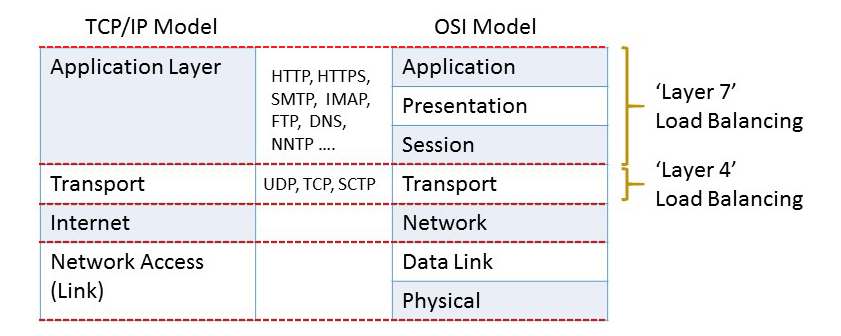

#### 一、网络协议分层

图片来源：https://blog.csdn.net/dgce56105/article/details/102215403

#### 二、负载均衡

负载均衡主要是为了使后端服务器分摊请求压力，不至使热点问题发生。

#### 三、负载均衡四层和七层

目前主流的负载均衡软件如Nginx，HAProxy等都支持配置四层和七层。

|                             | 四层                       | 七层                                                         |
| --------------------------- | -------------------------- | ------------------------------------------------------------ |
| LB设备拆包级别              | 拆包到传输层               | 拆包到应用层                                                 |
| 实现和配置难易              | 易                         | 难                                                           |
| CPU消耗                     | 小                         | 较大                                                         |
| 客户端请求时建立的TCP连接数 | 一个TCP连接，LB只做NAT功能 | 最少两个TCP连接（Client <—> LB，LB<—>Server）；多路复用下，会建立多个LB<—>Server连接 |
| 智能程度                    | 低                         | 高，可基于应用内容做负载均衡                                 |
| 安全程度                    | 不窥探应用内容             | 解析应用内容                                                 |
| 推荐                        | 低                         | 高（优先选择）                                               |

#### #参考

1. [L4 vs L7 Load Balancing](https://levelup.gitconnected.com/l4-vs-l7-load-balancing-d2012e271f56)
2. [load-balancing-layer-4-and-layer-7](https://freeloadbalancer.com/load-balancing-layer-4-and-layer-7/)
3. [layer-4-vs-layer-7-load-balancing](https://www.resonatenetworks.com/2020/04/29/layer-4-vs-layer-7-load-balancing/)

