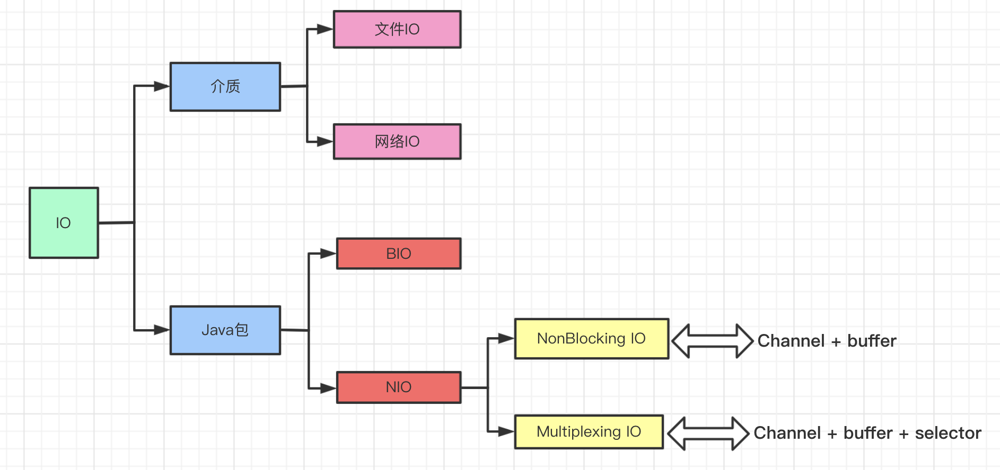
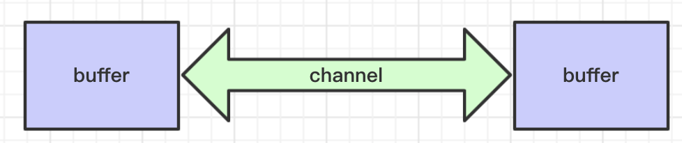
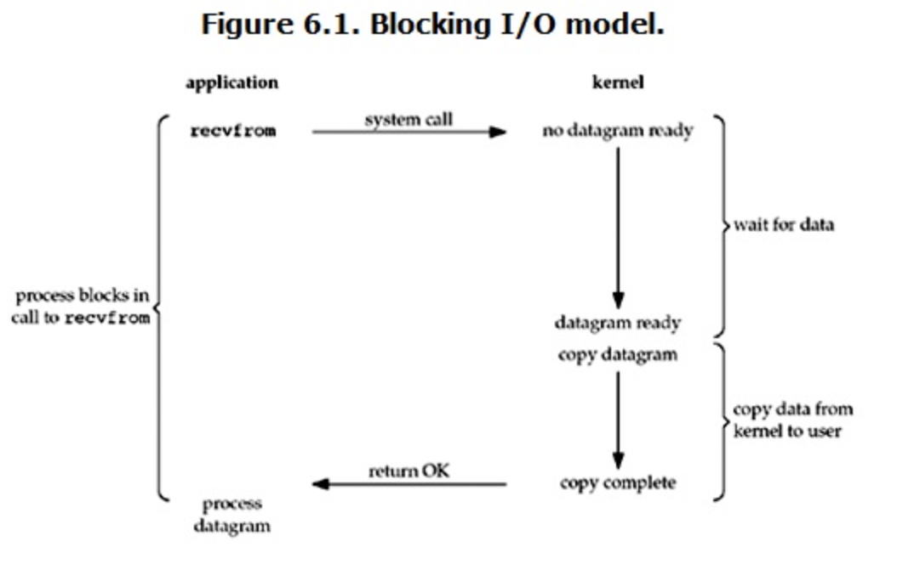
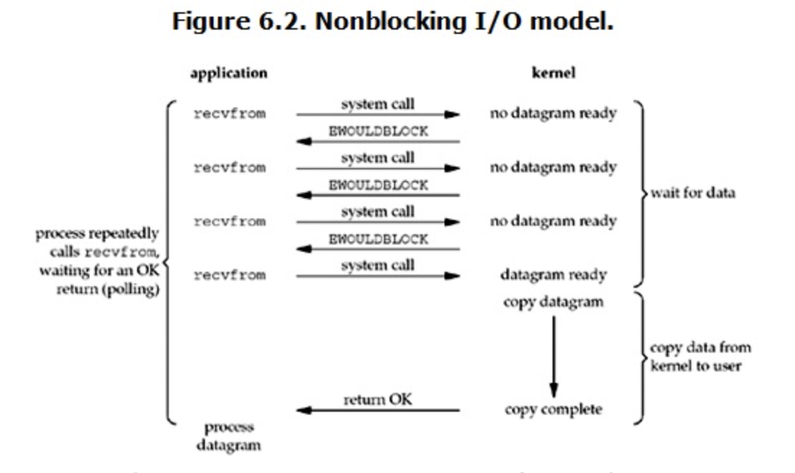
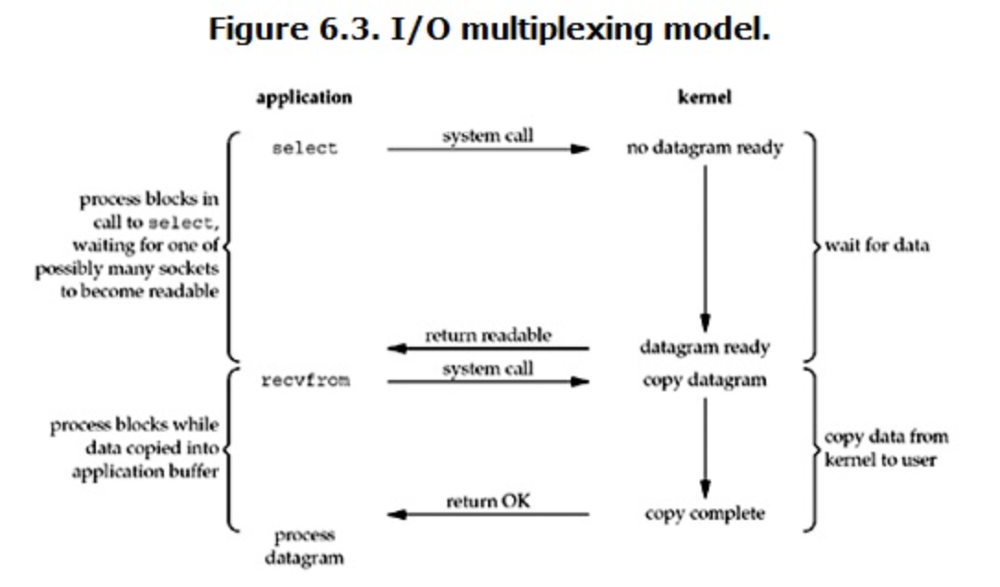
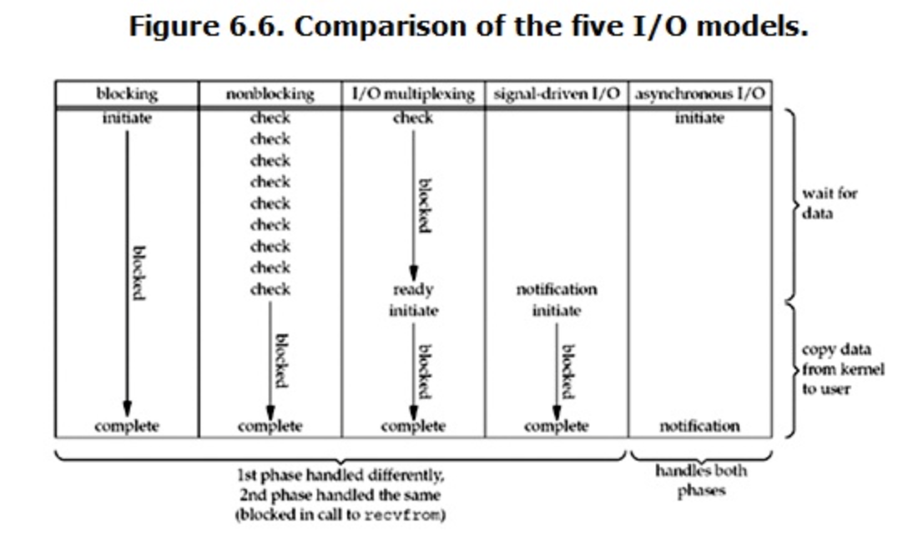

### 一、IO概念

IO是计算机程序和磁盘，网卡等外部资源进行交互的接口。而这些敏感资源都是由操作系统进行统一管理的，所有计算机语言的IO操作最终都是通过操作系统提供的系统调用函数来实现的。



#### 1. IO介质分类

文件IO：一般指和本机的磁盘进行交互；

网络IO：通过网卡设备和网络上的其他主机进行通信；在Linux里网络连接也被视为一种文件，但是比文件IO增加了新的处理方法，如accept()。

#### 2. Java包分类

Java源码在rt.jar中io分为两个包：

* *java.io.\**：传统的IO类，也被成为BIO（Blocking IO/阻塞IO）。

* *java.nio.\**：jdk1.4引入的包，称为new IO。

> NOTE：也有人把NIO称为*Non-blocking IO/非阻塞IO*，但是其中的多路复用是阻塞的，所以如果叫非阻塞IO有点狭义和以偏概全，不利于新人理解。

nio包下关键类：

```text
java.nio  (since jdk1.4)
|__channels
|  |___Channel
|  |___SocketChannel
|  |___ServerSocketChannel
|  |___Selector
|  |___SelectionKey
|
|__ByteBuffer
|__DirectByteBuffer
|__HeapByteBuffer
|__MappedByteBuffer
```

##### BIO和NIO相同点

1）【适用文件IO/网络IO】读取数据时，都是阻塞的；

##### BIO和NIO区别

1）【适用文件IO/网络IO】BIO是面向流（stream，数据单向传输），NIO基于通道（channel，数据双向传输）面向块（buffer），后者效率更高。



2）【适用网络IO】等待数据阶段，BIO是阻塞的，而NIO是非阻塞的，及其升级版多路复用，基于事件。

#### 3. NIO特性之面向Buffer

NIO在读写数据时都是通过buffer来和channel交互的。


##### 1. Java示例

代码示例一：读文件（[来源](https://www.ibm.com/developerworks/cn/education/java/j-nio/j-nio.html)）

```java
// 1. 获取通道
FileInputStream fin = new FileInputStream( "readandshow.txt" );
FileChannel fc = fin.getChannel();

// 2. 创建缓冲区 
ByteBuffer buffer = ByteBuffer.allocate( 1024 );

// 3. 读文件内容到缓冲区
fc.read( buffer );
```

代码示例二：写文件（[来源](https://www.ibm.com/developerworks/cn/education/java/j-nio/j-nio.html)）

```java
// 1. 获取通道
FileOutputStream fout = new FileOutputStream( "writesomebytes.txt" );
FileChannel fc = fout.getChannel();

// 2. 创建缓冲区，并写入内容
ByteBuffer buffer = ByteBuffer.allocate( 1024 );
for (int i=0; i<message.length; ++i) {
     buffer.put( message[i] );
}
buffer.flip();

// 3. 写文件
fc.write(buffer);
```

#####  2. 缓冲区类型


1）间接缓冲区

```java
ByteBuffer buffer = ByteBuffer.allocate( 1024 );
```

2）直接缓冲区

> 定义：*给定一个直接字节缓冲区，Java 虚拟机将尽最大努力直接对它执行本机 I/O 操作。也就是说，它会在每一次调用底层操作系统的本机 I/O 操作之前(或之后)，尝试避免将缓冲区的内容拷贝到一个中间缓冲区中(或者从一个中间缓冲区中拷贝数据)*

* 直接缓冲区（参考：[com.ibm.developerworks.nio.FastCopyFile](../../src/main/java/com/ibm/developerworks/nio/FastCopyFile.java)）

```java
ByteBuffer buffer = ByteBuffer.allocateDirect( 1024 );
```

* 内存映射文件（参考：[com.ibm.developerworks.nio.UseMappedFile](../../src/main/java/com/ibm/developerworks/nio/UseMappedFile.java)）

  使程序可以操作那些无法拷贝到内存的大尺寸文件。

```java
MappedByteBuffer mbb = fileChannel.map(FileChannel.MapMode.READ_WRITE, 0, 1024 );
```
##### 3. 使用ByteBuffer类操作缓冲区

```java
 /** 
* Direct vs. non-direct buffers
* A byte buffer is either direct or non-direct. Given a direct byte buffer, the Java 
* virtual machine will make a best effort to perform native I/O operations directly upon 
* it. That is, it will attempt to avoid copying the buffer's content to (or from) an 
* intermediate buffer before (or after) each invocation of one of the underlying 
* operating system's native I/O operations.
* A direct byte buffer may be created by invoking the allocateDirect factory method of 
* this class. The buffers returned by this method typically have somewhat higher 
* allocation and deallocation costs than non-direct buffers. The contents of direct 
* buffers may reside outside of the normal garbage-collected heap, and so their impact 
* upon the memory footprint of an application might not be obvious. It is therefore 
* recommended that direct buffers be allocated primarily for large, long-lived buffers 
* that are subject to the underlying system's native I/O operations. In general it is 
* best to allocate direct buffers only when they yield a measureable gain in program performance.
* A direct byte buffer may also be created by mapping a region of a file directly into 
* memory. An implementation of the Java platform may optionally support the creation of 
* direct byte buffers from native code via JNI. If an instance of one of these kinds of 
* buffers refers to an inaccessible region of memory then an attempt to access that 
* region will not change the buffer's content and will cause an unspecified exception to 
* be thrown either at the time of the access or at some later time.
* Whether a byte buffer is direct or non-direct may be determined by invoking its 
* isDirect method. This method is provided so that explicit buffer management can be 
* done in performance-critical code. 
 **/
public abstract class ByteBuffer extends Buffer implements Comparable<ByteBuffer> {		
    public static ByteBuffer allocate(int capacity) {
        if (capacity < 0)
            throw new IllegalArgumentException();
        return new HeapByteBuffer(capacity, capacity);
    }
    
    public static ByteBuffer allocateDirect(int capacity) {
        return new DirectByteBuffer(capacity);
    }
    
    ...
}
```

从注释中可看出DirectByteBuffer和HeapByteBuffer的区别如下：

|                          | DirectByteBuffer                                             | HeapByteBuffer                              |
| ------------------------ | ------------------------------------------------------------ | ------------------------------------------- |
| 分配位置                 | 堆外直接内存，属于直接缓冲区                                 | 堆内存，属于间接缓冲区                      |
| 和内核数据交互时拷贝次数 | 避免了数据内核态到用户态的内存拷贝（即零拷贝）               | 需要从内核态拷贝到用户态，即拷贝到JVM堆空间 |
| 分配销毁开销             | 开销较大                                                     | 开销较小                                    |
| 读写速度                 | 读写较快                                                     | 读写较慢                                    |
| 使用建议                 | 衡量使用DirectByteBuffer带来的收益，建议程序中池化DirectByteBuffer，减少分配和销毁的开销 |                                             |

#### 4. NIO特性之非阻塞（网络IO等待数据准备阶段）

以下通过三种不同的Socket代码来展示其区别，实验时可通过*telnet*命令发送数据给指定端口。

##### 1. Blocking IO



```java
public void testBlocking() throws IOException {
        ServerSocket serverSocket = new ServerSocket(9000);
        while (true) {
            System.out.println("开始监听");
            Socket socket = serverSocket.accept();
            System.out.println("Connection socket: " + socket);

            BufferedReader in = new BufferedReader(new InputStreamReader(socket.getInputStream()));
            while (true) {
                String str = in.readLine();
                if ("END".equals(str))
                    break;
                System.out.println("Accept: " + str);
            }
        }
}
```

##### 2. NonBlocking IO

> 非阻塞是基于channel实现的，serverSocketChannel.configureBlocking(false)。




```java
public void testNoBlocking() throws IOException, InterruptedException {
        ServerSocketChannel serverSocketChannel = ServerSocketChannel.open();
        serverSocketChannel.socket().bind(new InetSocketAddress(9000));
        serverSocketChannel.configureBlocking(false);
        while (true) {
            System.out.println("开始监听");
            SocketChannel socketChannel = serverSocketChannel.accept();

            if (socketChannel == null) {
                Thread.sleep(1000);
                continue;
            }

            System.out.println("Connection socket: " + socketChannel);
            socketChannel.configureBlocking(false);
            while (true) {
                ByteBuffer buffer = ByteBuffer.allocate(1024);
                int read = socketChannel.read(buffer);
                if (read != 0) {
                    String content = new String(buffer.array(), 0, read);
                    System.out.print(content);
                }
                Thread.sleep(1000);
            }
        }
    
```

##### 3. 多路复用/事件IO




```java
  public void testMultiplexing() throws IOException {
        Selector selector = Selector.open();
        ServerSocketChannel serverSocketChannel = ServerSocketChannel.open();
        serverSocketChannel.socket().bind(new InetSocketAddress(9000));
        serverSocketChannel.configureBlocking(false);
        serverSocketChannel.register(selector, SelectionKey.OP_ACCEPT);
        while (true) {
            selector.select();
            Iterator<SelectionKey> iterator = selector.keys().iterator();
            while (iterator.hasNext()) {
                SelectionKey key = iterator.next();
                if (key.isAcceptable()) {
                    ServerSocketChannel channel = (ServerSocketChannel) key.channel();
                    SocketChannel accept = channel.accept();
                    if (accept != null) {
                        accept.configureBlocking(false);
                        accept.register(selector, SelectionKey.OP_READ);
                        System.out.println("Connection: " + accept.socket());
                    }
                } else if (key.isReadable()) {
                    SocketChannel channel = (SocketChannel) key.channel();
                    ByteBuffer buffer = ByteBuffer.allocate(1024);
                    int read = channel.read(buffer);
                    if (read != 0) {
                        String content = new String(buffer.array(), 0, read);
                        System.out.print("accept: " + content);
                    }
                }
            }
        }
    }
```

##### 4. 三者对比



### 二、Linux下IO函数


| 函数名称 | 是否阻塞                  | 时间复杂度 | 说明                                   |
| -------- | ------------------------- | ---------- | -------------------------------------- |
| recvfrom | 同步，阻塞/非阻塞两种模式 | -          |                                        |
| select   | 同步阻塞，IO多路复用      | o(n)       | 有数据就绪时中断阻塞，轮询所有fd集合； |
| poll     | 同步阻塞，IO多路复用      | o(n)       | 类似select，区别是没有连接限制         |
| epoll    | 同步阻塞，IO多路复用      | o(1)       | 类似poll，增加了就绪列表，只遍历它即可 |

```
# man select
select - synchronous I/O multiplexing
DESCRIPTION:
    select() and pselect() allow a program to  monitor  multiple  file  de‐
    scriptors,  waiting  until  one  or more of the file descriptors become
    "ready" for some class of I/O operation (e.g., input possible).  A file
    descriptor  is  considered  ready if it is possible to perform a corre‐
    sponding  I/O  operation  (e.g.,  read(2),  or  a  sufficiently   small
    write(2)) without blocking.
```


```
# man poll
poll - wait for some event on a file descriptor
DESCRIPTION
       poll() performs a similar task to select(2): it waits for one of a set
       of file 	descriptors to become ready to perform I/O
```


```
# man epoll
epoll - I/O event notification facility
DESCRIPTION
       The  epoll  API  performs  a  similar task to poll(2): monitoring multiple file descriptors to see if I/O is possible on any of them.  The epoll API can be used either as an edge-triggered or a
       level-triggered interface and scales well to large numbers of watched file descriptors.
       The central concept of the epoll API is the epoll instance, an in-kernel data structure which, from a user-space perspective, can be considered as a container for two lists:
       *   The interest list (sometimes also called the epoll set): the set of file descriptors that the process has registered an interest in monitoring.
       *   The ready list: the set of file descriptors that are "ready" for I/O.  The ready list is a subset of (or, more precisely, a set of references to) the file descriptors in the  interest  list
           that is dynamically populated by the kernel as a result of I/O activity on those file descriptors.

       The following system calls are provided to create and manage an epoll instance:

       *  epoll_create(2) creates a new epoll instance and returns a file descriptor referring to that instance.  (The more recent epoll_create1(2) extends the functionality of epoll_create(2).)

       *  Interest in particular file descriptors is then registered via epoll_ctl(2), which adds items to the interest list of the epoll instance.

       *  epoll_wait(2)  waits for I/O events, blocking the calling thread if no events are currently available.  (This system call can be thought of as fetching items from the ready list of the epoll instance.)
```


### 三、Java调用epoll的时机

| Java方法                                                     | Linux方法                                                    |      |
| ------------------------------------------------------------ | ------------------------------------------------------------ | ---- |
| Selector selector = Selector.open()                          | epoll_create                                                 |      |
| serverSocketChannel.register(selector, SelectionKey.OP_ACCEPT) | 把socketChannell加入PollArrayWrapper暂存                     |      |
| selector.select();                                           | 1）取PollArrayWrapper中的句柄执行epoll_ctl<br/>2）然后执行epoll_wait |      |

### # 参考

1. [NIO 入门 - IBM开发者](https://www.ibm.com/developerworks/cn/education/java/j-nio/j-nio.html)

2. [Linux IO模式及 select、poll、epoll详解](https://segmentfault.com/a/1190000003063859)


