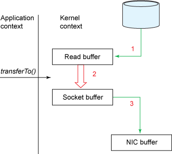
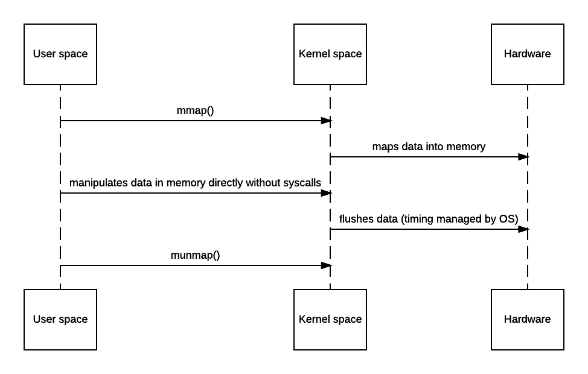
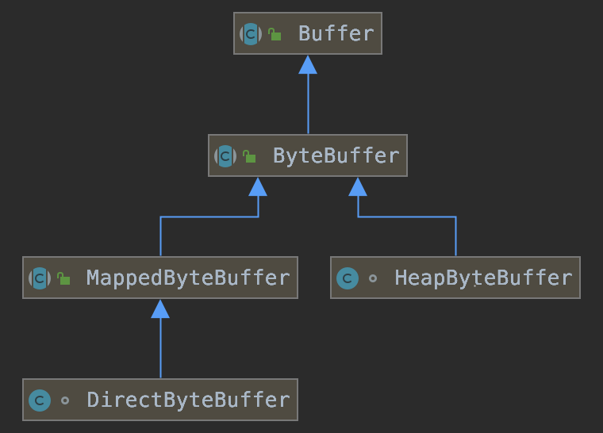

#### 零、零拷贝概念

> "**Zero-copy**" describes computer operations in which the CPU does not perform the task of copying data from one memory area to another. —— wikipedia

如维基百科所说，零拷贝是指避免CPU在不同的内存区域间拷贝数据。这可具体细分为操作系统级（OS level）别和用户态（User level）级别。

##### zero copy on OS level

针对设备驱动，文件系统，网络协议栈等内核态资源，程序可利用操作系统提供的系统函数调用，避免数据从内核态和用户态间的拷贝，充分利用操作系统资源，获得更高的性能。

具体而言，操作系统通过相应的系统函数使CPU移交总线控制权给DMA，由DMA负责内核态间数据复制操作，不通过用户态进行中转。与此同时CPU并行去处理其他复杂的逻辑，也减少了上下文切换带来的开销。

##### zero copy on User level

应用程序在用户态通过一些操作避免数据拷贝，也可以称为零拷贝。如Netty的CompositeByteBuf，可通过逻辑聚合多个ByteBuffer，避免物理复制多个ByteBuffer到一个大的ByteBuffer，来减少拷贝。

#### 一、操作系统的Zero Copy

##### 1. Linux零拷贝系统函数

* sys/socket.h中的sendfile，sendfile64

* splice，tee，vmsplice
* process_vm_readv, process_vm_writev
* copy_file_range
* mmap，AF_XDP

经常有人mmap和sendfile放在一起进行比较，而忽略了他们的应用场景。

##### 2. sendfile

1）适用场景：适用于程序不参与处理数据，数据只在系统内核态间传输

* 不使用sendfile


* 使用sendfile


2）方法描述：由DMA负责在内核态进行数据拷贝，不再经过用户态中转

3）优点：减少了数据拷贝（内核态和用户态的拷贝为零）；减少了上下文切换；对文件大小没有限制；性能更好，约比使用read,write提高65%性能。

* 不实用sendfile时，发生了4次拷贝


* 使用sendfile时，发生了3次拷贝，用户态拷贝为零。（如果网络接口支持*gather operations*，可以再减少一次拷贝: Read buffer-> Socket buffer）



* 不实用sendfile时，发生了四次上下文切换


* 使用sendfile时，只有两次上下文切换


4）缺点：程序不能参与处理

##### 3. mmap

1）适用场景：适用于程序参与处理数据，修改系统内核态的数据



2）方法描述：把文件或设备映射到内存，他通过给定的位置读取文件对应的块到内存。用户对这块内存的修改会直接反应到内核空间，与此同时，内核空间的修改，也会直接反应到用户空间。

3）优点：程序参与处理数据；处理小文件时性能高

4）缺点：没有减少上下文切换带来的开销；处理大文件时开销较大；

##### 4. 总结

|                          | Sendfile                                                     | Mmap                                                |
| ------------------------ | ------------------------------------------------------------ | --------------------------------------------------- |
| 适用场景                 | 程序不处理数据                                               | 程序参与数据处理                                    |
| 上下文切换次数           | 2次                                                          | 4次                                                 |
| 数据拷贝次数             | 3次或2次                                                     | 3次                                                 |
| 文件大小与性能           | 无限制                                                       | 小文件性能好                                        |
| Java NIO对系统调用的封装 | *FileChannel.transferTo(long position, long count,WritableByteChannel target)* | *MappedByteBuffer*类，可通过*FileChannel.map()*获取 |

其中，*MappedByteBuffer*是Java的一种direct byteBuffer。

#### 二、Java direct vs non-direct byte buffer

>  **直接缓冲区中通过文件映射创建的MappedByteBuffer与前面提到的mmap是一一对应的，体现了零拷贝的概念，其他类型缓冲区与OS level的零拷贝无关。**

##### 1. 直接缓冲区和非直接缓冲区的区别

> 1) The first difference between non-direct and direct byte buffer comes from the fact, **how you create them**. You can create non-direct byte buffer either by allocating space for buffer's content or by wrapping an existing byte array into a buffer. While a Direct byte buffer may be created by calling factory method allocateDirect() or by mapping a region of a file directly into memory , known  as MappedByteBuffer.
>
> 2) In the case of Direct byte buffer, JVM performs **native IO operation** directly into the buffer, without copying them into any intermediate buffer, this makes it very attractive for performing high-speed IO operation on them, but this facility comes with care. If a memory mapped file is shared between multiple processes then you need to ensure that it won't get corrupted i.e. some regions of memory mapped file not becoming unavailable.
>
> 3) One more difference between direct and non-direct byte buffers are that former's **memory footprint** may not be obvious because they are allocated outside of Java heap while non-direct buffers consume heap space and are subject to garbage collection.
>
> 4) You can check whether a byte buffer is direct or non-direct by calling **isDirect()** method from java.nio.ByteBuffer class. It returns true if byte buffer is direct.
>
> Read more: https://javarevisited.blogspot.com/2015/08/difference-between-direct-non-direct-mapped-bytebuffer-nio-java.html#ixzz6lqSEEIpV

##### 2. ByteBuffer

如图所示，Java提供了三种ByteBuffer实现：



1）HeapByteBuffer

是非直接内存，用来在JVM堆上申请管理缓存，通常是字节数组的包装类。受JVM GC控制。

2）MappedByteBuffer

也是一种直接内存，是用来映射文件到直接内存中的，不受JVM GC控制。**其通过系统函数mmap调用实现，利用缺页中断机制实现直接访问文件，避免数据拷贝到用户态，体现了零拷贝**。

FileChannel.map最终也是调用了DirectByteBuffer的构造函数*DirectByteBuffer(int cap, long addr, FileDescriptor fd, Runnable unmapper)*。

3）DirectByteBuffer

是直接内存，用来在JVM堆外申请和管理内存，不受JVM GC控制。*ByteBuffer.allocateDirect(int capacity)*会调用构造函数*DirectByteBuffer(int cap)*。

```java
// Primary constructor
DirectByteBuffer(int cap)

// Invoked to construct a direct ByteBuffer referring to the block of
// memory. A given arbitrary object may also be attached to the buffer.
DirectByteBuffer(long addr, int cap, Object ob)

// Invoked only by JNI: NewDirectByteBuffer(void*, long)
private DirectByteBuffer(long addr, int cap)

// For memory-mapped buffers -- invoked by FileChannelImpl via reflection
protected DirectByteBuffer(int cap, long addr, FileDescriptor fd, Runnable unmapper)
    
// For duplicates and slices
DirectByteBuffer(DirectBuffer db, int mark, int pos, int lim, int cap, int off)
```


#### 三、常见Java中间件对零拷贝的使用

##### 1）Netty

* OS-level：FileRegion封装了FileChannel.transferTo()
* User-level：`Transparent zero copy is achieved by built-in composite buffer type`，类CompositeByteBuf避免了ByteBuf间的拷贝。

##### 2）Kafka

* OS-level：Customer从broker消费数据，采用sendfile；
* OS-level：Producer生产的数据持久化到broker，采用mmap文件映射；

##### 3）RocketMQ

* OS-level：生产和消费，采用mmap；

#### # 参考

1. ✽[It’s all about buffers: zero-copy, mmap and Java NIO](https://shawn-xu.medium.com/its-all-about-buffers-zero-copy-mmap-and-java-nio-50f2a1bfc05c)
2. ✽[Efficient data transfer through zero copy - IBM developer](https://developer.ibm.com/articles/j-zerocopy/)
3. ✽[Difference between Direct, Non Direct and Mapped ByteBuffer in Java](https://javarevisited.blogspot.com/2015/08/difference-between-direct-non-direct-mapped-bytebuffer-nio-java.html#axzz6lqPbftlt)
4. ✽[Zero-copy - wikipedia](https://en.wikipedia.org/wiki/Zero-copy)
5. ✽[DirectByteBuffer and MappedByteBuffer](https://www.programmersought.com/article/53865537623/)
6. [Zero Copy I: User-Mode Perspective](https://www.linuxjournal.com/article/6345?page=0,0)
7. [Netty与Zero Copy](https://binglau7.github.io/2018/12/10/Netty%E4%B8%8EZero-Copy/)
8. [is-nettys-zero-copy-different-from-os-level-zero-copy](https://stackoverflow.com/questions/20727615/is-nettys-zero-copy-different-from-os-level-zero-copy)
9. [理解Netty中的Zero-copy](https://developer.aliyun.com/article/43594)
10. [Kafka零拷贝](https://zhuanlan.zhihu.com/p/78335525)
11. [零拷贝](https://www.imooc.com/article/299872)

