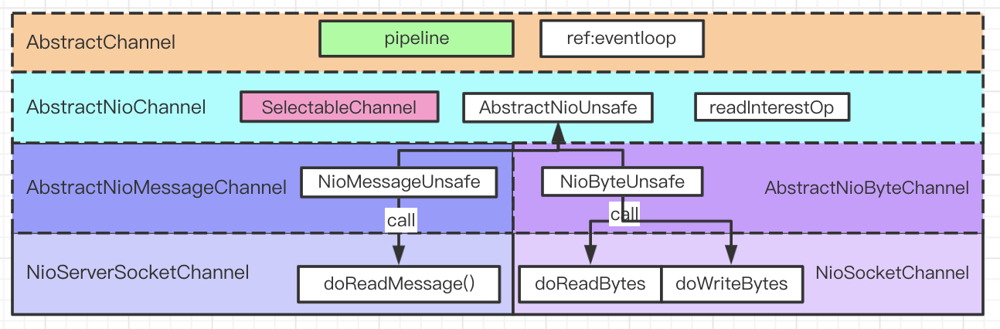
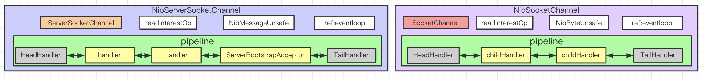
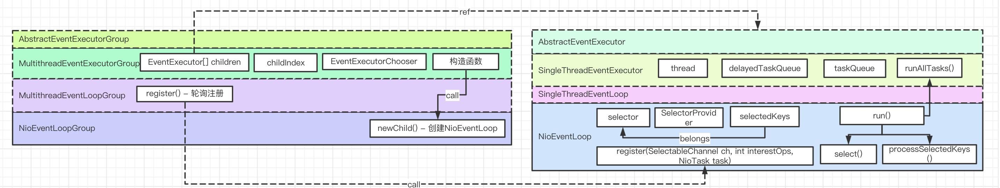
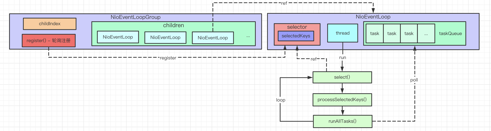
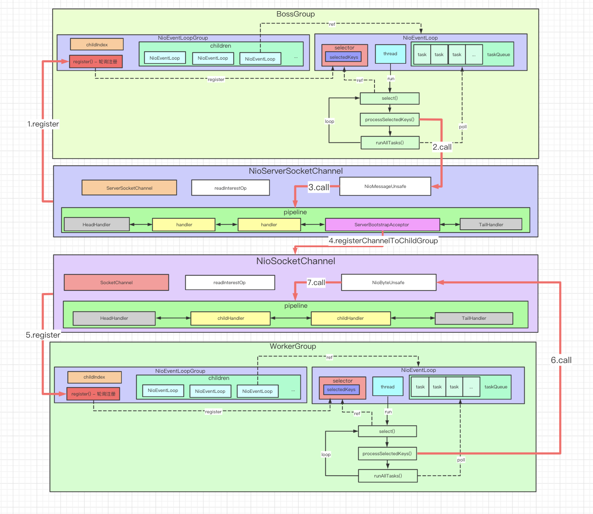
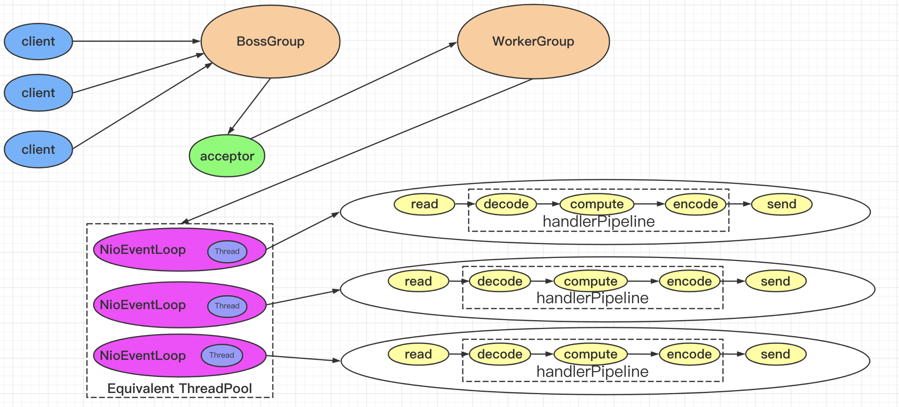

> 以下结构图和流程图通过阅读netty-all-4.0.19.Final.jar源码分析而来。本文主要是以Server端执行过程进行分析。

#### 零、Netty使用示例代码

```java
class ChatServer {
  public static void main(String[] args) throws InterruptedException {
      EventLoopGroup bossGroup = new NioEventLoopGroup(1);
      EventLoopGroup workerGroup = new NioEventLoopGroup();

      ServerBootstrap serverBootstrap = new ServerBootstrap();
      serverBootstrap.group(bossGroup, workerGroup)
        .channel(NioServerSocketChannel.class)
        .childHandler(new ChannelInitializer<SocketChannel>() {
          @Override
          public void initChannel(SocketChannel ch) {
            ch.pipeline().addLast(new DelimiterBasedFrameDecoder(MAX_FRAME_LENGTH, DELIMITER));
            ch.pipeline().addLast(new StringDecoder());
            ch.pipeline().addLast(new StringEncoder());
            ch.pipeline().addLast(new ChatServerHandler());
          }
        });
    
      ChannelFuture channelFuture = serverBootstrap.bind(LISTEN_PORT).sync();
      System.out.println("ChatServer started.");    
      channelFuture.channel().closeFuture().await();
  }
}
```


#### 一、NioServerSocketChannel和NioSocketChannel

##### 1. 类继承结构



##### 2. 简化版



#### 二、NioEventLoopGroup和NioEventLoop

##### 1. 类继承结构



##### 2. 简化版



#### 三、整体结构图



#### 四、对比ScalableIOInJava的多反应器模型

##### 1. ScalableIOInJava的多反应器模型


##### 2. Netty的多反应器模型

