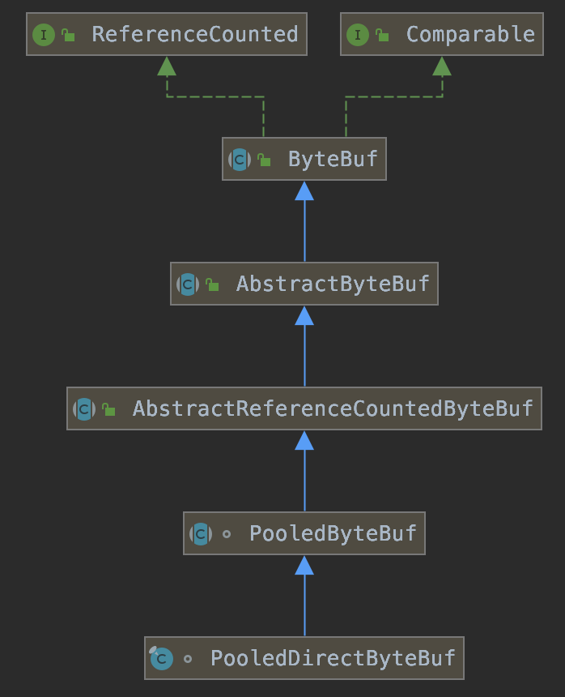
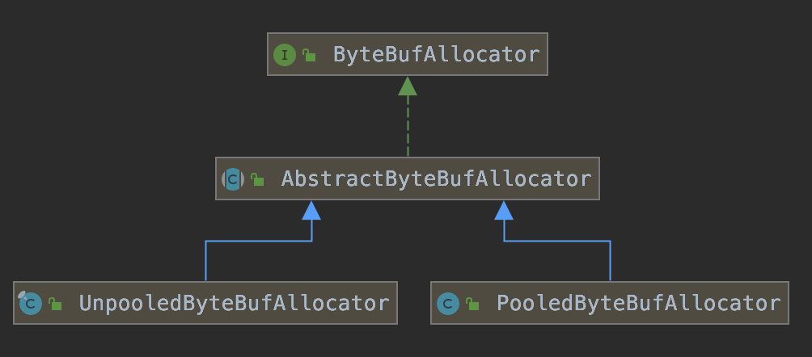

#### 一、Netty高性能分析

1）使用NIO多路复用技术，使其能高效的支持大量的客户端连接

2）使用主从Reactor模型，BossGroup和WorkerGroup分工明确，BossGroup只负责接收Channel，加快了客户端建立连接的速度。

3）使用多线程Reactor模型，WorkerGroup分配多个NioEventLoop，使CPU和IO达到一个更好的平衡，提升了CPU利用率，加快了客户端的响应效率

4）采用单线程处理客户端请求，避免同步带来的开销（无锁串行化）

5）支持高性能序列化协议

6）采用零拷贝技术（use DirectBuffer），减少内存拷贝的开销

7）ByteBuf内存池化设计，减少了分配和销毁Direct Buffer带来的开销

8）灵活的TCP配置

#### 二、ByteBuffer

##### 1. 类继承关系


##### 2. 使用ByteBuffer分配缓存

```java
 /** 
 * <h2> Direct <i>vs.</i> non-direct buffers </h2>
 * <p> A byte buffer is either <i>direct</i> or <i>non-direct</i>.  Given a
 * direct byte buffer, the Java virtual machine will make a best effort to
 * perform native I/O operations directly upon it.  That is, it will attempt to
 * avoid copying the buffer's content to (or from) an intermediate buffer
 * before (or after) each invocation of one of the underlying operating
 * system's native I/O operations.
 *
 * <p> A direct byte buffer may be created by invoking the {@link
 * #allocateDirect(int) allocateDirect} factory method of this class.  The
 * buffers returned by this method typically have somewhat higher allocation
 * and deallocation costs than non-direct buffers.  The contents of direct
 * buffers may reside outside of the normal garbage-collected heap, and so
 * their impact upon the memory footprint of an application might not be
 * obvious.  It is therefore recommended that direct buffers be allocated
 * primarily for large, long-lived buffers that are subject to the underlying
 * system's native I/O operations.  In general it is best to allocate direct
 * buffers only when they yield a measureable gain in program performance.
 **/
public abstract class ByteBuffer extends Buffer implements Comparable<ByteBuffer> {		
		public static ByteBuffer allocate(int capacity) {
        if (capacity < 0)
            throw new IllegalArgumentException();
        return new HeapByteBuffer(capacity, capacity);
    }
    
    public static ByteBuffer allocateDirect(int capacity) {
        return new DirectByteBuffer(capacity);
    }
    
    ...
}
```

从注释中可看出DirectByteBuffer和HeapByteBuffer的区别如下：

|                          | DirectByteBuffer                                             | HeapByteBuffer                              |
| ------------------------ | ------------------------------------------------------------ | ------------------------------------------- |
| 分配位置                 | 堆外直接内存                                                 | 堆内存                                      |
| 和内核数据交互时拷贝次数 | 避免了数据内核态到用户态的内存拷贝（即零拷贝）               | 需要从内核态拷贝到用户态，即拷贝到JVM堆空间 |
| 分配销毁开销             | 开销较大                                                     | 开销较小                                    |
| 读写速度                 | 读写较快                                                     | 读写较慢                                    |
| 使用建议                 | 衡量使用DirectByteBuffer带来的收益，建议程序中池化DirectByteBuffer，减少分配和销毁的开销 |                                             |

#### 三、Netty的ByteBuf对DirectByteBuffer的池化

##### 1. PooledDirectByteBuf继承结构



##### 2. PooledDirectByteBuf分配的工具类

1）PooledByteBufAllocator



2）ByteBufUtil（配置`io.netty.allocator.type=pooled`）

```java
public final class ByteBufUtil {				
	static {
        String allocType = SystemPropertyUtil.get("io.netty.allocator.type", "unpooled").toLowerCase(Locale.US).trim();
        ByteBufAllocator alloc;
        if ("unpooled".equals(allocType)) {
            alloc = UnpooledByteBufAllocator.DEFAULT;
            logger.debug("-Dio.netty.allocator.type: {}", allocType);
        } else if ("pooled".equals(allocType)) {
            alloc = PooledByteBufAllocator.DEFAULT;
            logger.debug("-Dio.netty.allocator.type: {}", allocType);
        } else {
            alloc = UnpooledByteBufAllocator.DEFAULT;
            logger.debug("-Dio.netty.allocator.type: unpooled (unknown: {})", allocType);
        }
  }
}
```

#### 四、Linux支持的两种零拷贝技术

##### sendfile

##### mmap

#### 

#### # Netty对Select空循环Bug的修复

参考代码：*io.netty.channel.nio.NioEventLoop#select*，该方法内部会对空轮训进行计数，默认达到512次后会调用rebuildSelector()方法重新构建一个新的Selector。

```java
private void select() throws IOException {
  Selector selector = this.selector;
  try {
    int selectCnt = 0;
    long currentTimeNanos = System.nanoTime();
    long selectDeadLineNanos = currentTimeNanos + delayNanos(currentTimeNanos);
    for (;;) {
      long timeoutMillis = (selectDeadLineNanos - currentTimeNanos + 500000L) / 1000000L;
      if (timeoutMillis <= 0) {
        if (selectCnt == 0) {
          selector.selectNow();
          selectCnt = 1;
        }
        break;
      }

      int selectedKeys = selector.select(timeoutMillis);
      selectCnt ++;
			
      // 有事件发生，被唤醒或者任务队列非空时跳出循环
      if (selectedKeys != 0 || oldWakenUp || wakenUp.get() || hasTasks()) {
        break;
      }
      if (selectedKeys == 0 && Thread.interrupted()) {
        // Thread was interrupted so reset selected keys and break so we not run into a busy loop.
        // As this is most likely a bug in the handler of the user or it's client library we will
        // also log it.  See https://github.com/netty/netty/issues/2426
        if (logger.isDebugEnabled()) {
          logger.debug("Selector.select() returned prematurely because " +
                       "Thread.currentThread().interrupt() was called. Use " +
                       "NioEventLoop.shutdownGracefully() to shutdown the NioEventLoop.");
        }
        selectCnt = 1;
        break;
      }
      if (SELECTOR_AUTO_REBUILD_THRESHOLD > 0 &&
          selectCnt >= SELECTOR_AUTO_REBUILD_THRESHOLD) {
        // The selector returned prematurely many times in a row. Rebuild the selector to work around the problem.
        logger.warn("Selector.select() returned prematurely {} times in a row; rebuilding selector.", selectCnt);

        rebuildSelector();
        selector = this.selector;

        // Select again to populate selectedKeys.
        selector.selectNow();
        selectCnt = 1;
        break;
      }

      currentTimeNanos = System.nanoTime();
    }

    if (selectCnt > MIN_PREMATURE_SELECTOR_RETURNS) {
      if (logger.isDebugEnabled()) {
        logger.debug("Selector.select() returned prematurely {} times in a row.", selectCnt - 1);
      }
    }
  } catch (CancelledKeyException e) {
    if (logger.isDebugEnabled()) {
      logger.debug(CancelledKeyException.class.getSimpleName() + " raised by a Selector - JDK bug?", e);
    }
    // Harmless exception - log anyway
  }
}
```

