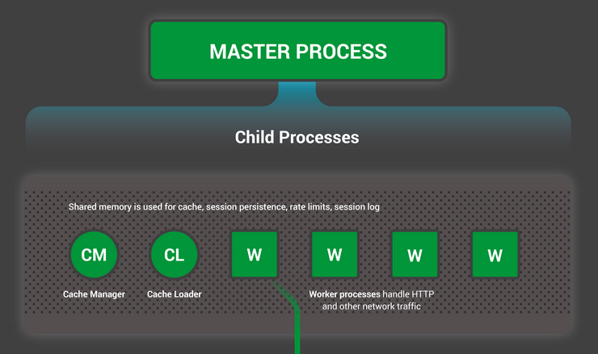
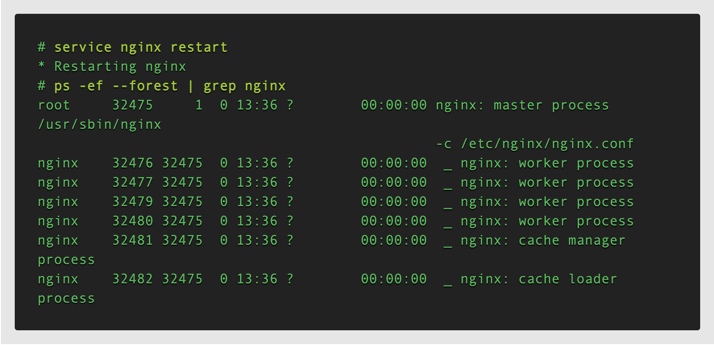
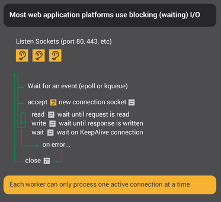
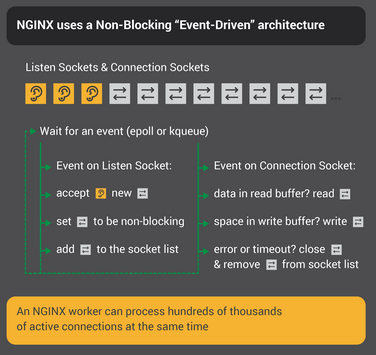
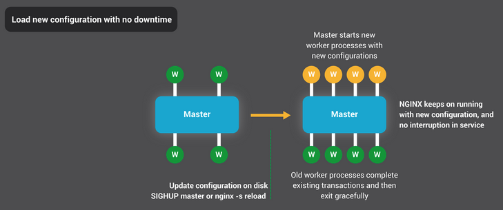
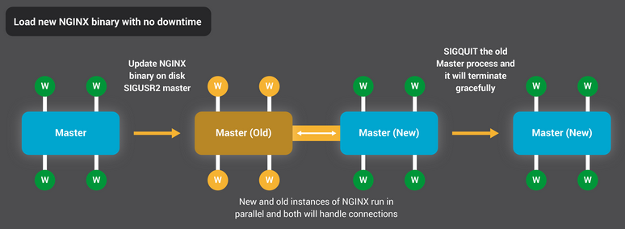

### Inside NGINX: How We Designed for Performance & Scale

NGINX在web性能方面处于领先地位，这完全归功于软件的设计方式。许多web服务器和应用程序服务器使用简单的线程或基于进程的体系结构，而NGINX则以复杂的事件驱动体系结构脱颖而出，使其能够在现代硬件上扩展到数十万个并发连接。

内部NGINX信息图从高级流程架构向下展开，以说明NGINX如何在单个流程中处理多个连接。本博客将进一步详细介绍这一切的工作原理。

#### 设置场景–NGINX流程模型



为了更好地理解这种设计，您需要了解NGINX是如何运行的。NGINX有一个主进程（它执行特权操作，如读取配置和绑定到端口）以及许多Worker进程和辅助进程。



在这个四核服务器上，NGINX主进程创建了四个Worker进程和两个缓存辅助进程（用于管理磁盘内容缓存）。

#### 为什么架构很重要？

任何Unix应用程序的基本基础都是线程或进程。（从Linux操作系统的角度来看，线程和进程基本相同；主要区别在于它们共享内存的程度。）线程或进程是一组自包含的指令，这些指令可以被操作系统在CPU内核上调度执行。大多数复杂的应用程序并行运行多个线程或进程，原因有两个：

* 他们可以同时使用更多的计算核。

* 线程和进程使并行操作变得非常容易（例如，同时处理多个连接）。

进程和线程消耗资源。它们各自使用内存和其他操作系统资源，需要在内核进行交换（一种称为上下文切换的操作）。大多数现代服务器可以同时处理数百个小型活动线程或进程，但一旦内存耗尽或高I/O负载导致大量上下文切换，性能就会严重下降。

设计网络应用程序的常用方法是为每个连接分配一个线程或进程。此体系结构简单且易于实现，但当应用程序需要处理数千个同时连接时，它无法扩展。

#### NGINX是如何工作的？

NGINX使用如下进程模型，该模型根据可用的硬件资源进行调整：

* **主进程执行特权操作**，如读取配置和绑定到端口，然后创建少量子进程（下三种类型）。

* **缓存加载程序进程在启动时运行，将基于磁盘的缓存加载到内存中，然后退出**。它的日程安排比较保守，因此其资源需求较低。

* **缓存管理器进程定期运行，并从磁盘缓存中删除条目，使其保持在配置的大小内。**

* **工作进程完成了所有工作**！它们处理网络连接，将内容读写到磁盘，并与上游服务器通信。

在大多数情况下推荐的NGINX配置（每个CPU核运行一个工作进程）可以最有效地利用硬件资源。您可以通过在`worker_processs`指令上设置`auto`参数来配置它：

```
worker_processes auto;
```

当NGINX服务器处于活动状态时，只有Worker进程繁忙。每个Worker进程以非阻塞方式处理多个连接，减少了上下文切换的数量。


每个Worker进程都是单线程的，独立运行，可以获取新的连接并进行处理。这些进程可以使用共享内存进行通信，以获取共享缓存数据、会话持久性数据和其他共享资源。

#### 在NGINX Worker进程内部


每个NGINX Worker进程都使用NGINX配置进行初始化，并由主进程提供一组侦听套接字。

NGINX Worker进程首先等待侦听套接字上的事件（[accept_mutex](https://nginx.org/en/docs/ngx_core_module.html#accept_mutex)和[kernel socket sharding](https://www.nginx.com/blog/socket-sharding-nginx-release-1-9-1/)）。事件由新的 incoming connections启动。这些连接被分配给状态机–HTTP状态机是最常用的，但NGINX还为stream（原始TCP）traffic和许多邮件协议（SMTP、IMAP和POP3）实现状态机。


状态机本质上是告诉NGINX如何处理请求的一组指令。大多数执行与NGINX相同功能的web服务器使用类似的状态机——区别在于实现。

#### 调度状态机

把状态机想象成国际象棋的规则。每个HTTP事务都是一局象棋游戏。棋盘的一边是web服务器——一个可以快速做出决策的大师。另一边是远程客户端，即通过相对较慢的网络访问站点或应用程序的web浏览器。

然而，游戏规则可能非常复杂。例如，web服务器可能需要与其他方通信（代理到上游应用程序）或与身份验证服务器通信。web服务器中的第三方模块甚至可以扩展游戏规则。

#### 阻塞状态机

回想一下，我们将进程或线程描述为操作系统可以调度他在CPU内核上运行的一组自包含指令。大多数web服务器和web应用程序使用*process‑per‑connection*或者*thread‑per‑connection*来下棋。每个进程或线程都包含从一个游戏玩到最后的指令。在服务器运行该进程的过程中，它将大部分时间用于“阻塞”——等待客户端完成下一步操作。



1. web服务器进程侦听listen sockets的新连接（由客户端启动的新游戏）。
2. 当它得到一个新的游戏时，它会玩这个游戏，在每次移动后阻塞，等待客户的响应。
3. 游戏完成后，web服务器进程可能会等待客户端是否希望启动新游戏（这对应于keepalive连接）。如果连接关闭（客户端关闭或出现超时），web服务器进程将返回侦听新游戏。

需要记住的重要一点是，每个活动HTTP连接（每局国际象棋游戏）都需要一个专用的进程或线程（一个特级大师）。该体系结构简单，易于使用第三方模块进行扩展（“新规则”）。然而，存在一个巨大的不平衡：相当轻量级的HTTP连接（由文件描述符和少量内存表示）映射到一个单独的线程或进程，一个非常重的操作系统对象。这是一种编程的便利，但却是极大的浪费。

#### NGINX是一位象棋大师

也许你听说过同步展示赛，一位国际象棋大师同时与数十名对手对弈？


这就是NGINX Worker进程下“国际象棋”的方式。每个Woker（记住，通常一个Woker分配一个CPU核）都是一个象棋大师，可以同时玩数百（事实上，数十万）个游戏。



1. Woker进程等待listern和connection套接字上的事件。

2. 套接字上发生事件时，Woker进程会处理这些事件：

    * listen套接字上的事件表示客户端已开始新的国际象棋游戏。Woker进程创建一个新的connection套接字。

    * connection套接字上的事件表示客户端进行了新的移动。Woker迅速作出反应。

工作者从不阻塞在network traffic上等待其“对手”（客户端）响应。当它移动后，Worker立即进入其他游戏，来处理等待中的移动命令，或者欢迎新玩家进入。

#### 为什么这比阻塞、多进程体系结构更快？

NGINX可以很好地扩展，以支持每个Woker进程处理十万级连接。每个新连接都会创建另一个文件描述符，并在工作进程中消耗少量额外内存。每个连接的额外开销很少。NGINX进程可以固定在cpu上。上下文切换相对较少，只在没有工作要做时发生切换。

在阻塞、connection‑per‑process的方法中，每个连接都需要大量额外的资源和开销，并且上下文切换（从一个进程切换到另一个进程）非常频繁。

要获得更详细的解释，请查看这篇关于NGINX架构的[文章](https://www.aosabook.org/en/nginx.html)，作者是NGINX，Inc.公司的企业发展副总裁兼联合创始人安德鲁·阿列克谢夫。

通过适当的[系统调优](https://www.nginx.com/blog/tuning-nginx/)，NGINX可以扩展到每个工作进程处理数十万个并发HTTP连接，并且可以处理流量峰值（新游戏的涌入），而不会打乱节奏。

#### 更新配置和升级NGINX

NGINX的进程体系结构具有少量Woker进程，可以非常高效地更新配置，甚至NGINX二进制文件本身。



更新NGINX配置是一个非常简单、轻量级和可靠的操作。它通常只意味着运行`nginx -s reload`命令，该命令检查磁盘上的配置并向主进程发送SIGHUP信号。

当主进程收到SIGHUP时，它会执行两项操作：

* 重新加载配置并派生一组新的Worker进程。这些新的Worker进程立即开始接受连接和处理流量（使用新的配置设置）。
* 指示旧Worker进程正常退出。Woker进程停止接受新连接。只要当前的每个HTTP请求完成，Woker进程就会干净地关闭连接（也就是说，没有延迟的keepalives）。关闭所有连接后，Worker进程将退出。

这个重新加载过程可能会导致CPU和内存使用量的小幅增加，但与活动连接的资源负载相比，这通常是难以察觉的。您可以每秒多次重新加载配置（许多NGINX用户正是这样做的）。当有多代NGINX工作进程等待连接关闭时，很少会出现问题，但即使是这些问题也会很快得到解决。

NGINX的二进制升级过程实现了高可用性的圣杯——您可以动态升级软件，而无需任何连接中断、停机或服务中断。



二进制升级过程类似于优雅地重新加载配置。新的NGINX主进程与原始主进程并行运行，它们共享侦听套接字。这两个进程都是活动的，它们各自的worker进程处理流量。然后，您可以向老主人及其工作人员发出信号，让他们优雅地退出。

在[控制NGINX](https://nginx.org/en/docs/control.html)中对整个过程进行了更详细的描述。

#### 结论

[NGINX的内部信息图](https://www.nginx.com/resources/library/infographic-inside-nginx/)提供了NGINX如何运行的高级概述，但在这个简单的解释背后是十多年的创新和优化，使NGINX能够在各种硬件上提供尽可能最佳的性能，同时保持现代web应用程序所需的安全性和可靠性。

如果您想阅读更多关于NGINX中优化的信息，请查看以下伟大的参考资料：

- [Installing and Tuning NGINX for Performance](https://www.nginx.com/resources/webinars/installing-tuning-nginx/) (webinar; [slides](https://speakerdeck.com/nginx/nginx-installation-and-tuning) at Speaker Deck)
- [Tuning NGINX for Performance](https://www.nginx.com/blog/tuning-nginx/)
- [The Architecture of Open Source Applications – NGINX](https://www.aosabook.org/en/nginx.html)
- [Socket Sharding in NGINX Release 1.9.1](https://www.nginx.com/blog/socket-sharding-nginx-release-1-9-1/) (using the `SO_REUSEPORT` socket option)

### # 参考

1. https://www.nginx.com/blog/inside-nginx-how-we-designed-for-performance-scale/
2. https://www.nginx.com/resources/library/infographic-inside-nginx/
3. https://www.aosabook.org/en/nginx.html