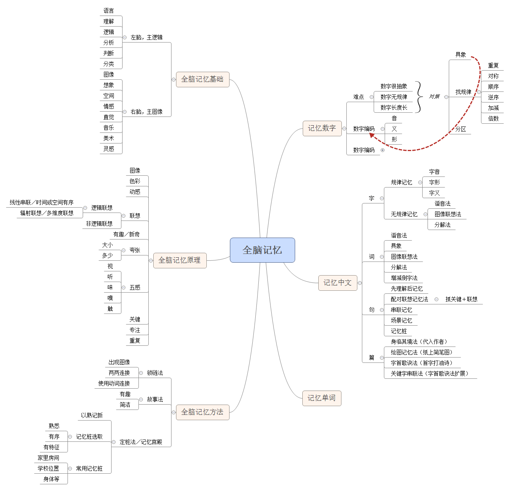
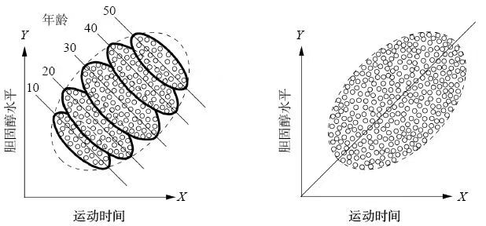

<!-- date: modify -->

### 全脑记忆 2021/01/29

---

### 我们为什么要睡觉 2023/11/01

> 在睡觉之前，参与者从海马体的短期存储位置获取记忆——一个临时仓库，对于新的记忆来说，这个仓库是一个不易长期生存的地方。但是第二天早上，情况就大不一样了。记忆搬家了。经过整夜的睡眠之后，参与者此时会从位于大脑顶部的新皮层处获取同一信息——这是基于事实的记忆的长期存储位置，记忆可以在这里安全地生存，甚至可能是永久性地留存。

> 换句话说，在一夜的睡眠之后，你可以重新获得睡前想不起来的记忆。就像电脑硬盘一样，一些文件已经损坏，无法访问，而睡眠会在晚上提供恢复服务。它可以修复这些记忆项目，把它们从忘记的魔掌中拯救出来，第二天早上醒来后，就能够轻松而准确地找到那些一度不可用的记忆文件。这就是那种可能在经过了一夜安眠后，突然感到“啊，对，现在我想起来了”的感觉。

> 运动记忆被转移到了在意识层面以下运作的大脑回路中，而不是像保存事实信息所需的那样从短期储存处到长期储存处的记忆转移。结果，那些技能行为成了本能一般的习惯，很容易从身体里流露出来，而不会感到费力和刻意。也就是说，睡眠帮助大脑实现了动作序列的自动化，使其成为第二天性，这正是许多奥运会教练在提升精英运动员的技能时的目标。

> 快速眼动睡眠时的梦提供了一种夜间疗法。也就是说，快速眼动睡眠时的梦会从你白天经历的困难，甚至是创伤性的情绪事件中把令你痛苦的刺剔除，于是第二天早晨醒来时，你的情绪问题就能得到缓解。

---

### 刻意练习：如何从新手到大师 2024/04/12

1、练习路径

建立心理表征，也就是问题和解决方式建模 → 针对薄弱点或能力边界练习 → 获得反馈，调整模型

* 建立心理模型，可以寻找行业出色的人，网络等一切资源

* 生物基础是，大脑是可塑的，刻意练习可以成长

---

### 这样读书就够了 2024/11/17

知识不值钱，反思和反馈才是价值

> 经济学早有定论，任何市场要想健康发展，实现“良币驱逐劣币”，从来不是靠卖家的自律，而是靠买方的辨别力。

> 著名教育家克里提克斯（Criticos）曾说：“经验本身有价值吗？并非如此——真正有价值的是在对经验进行反思之后的智力发展。有效的学习来自有效的反思，而非积极的经验。”
> 同样，阅读本身也不能创造价值，理解和记忆知识都不能创造价值。改变行为才有可能创造价值。并且改变行为只发生在将读来或者听来的知识内化和反思之后。

> 问个问题：一个月之后，你还能记住书中这段内容吗？
> 再问个问题：无论是否看得懂，是否记得住，一个月之后，读过的这段内容会对你的生活和工作有一丁点儿影响吗？
> 不会有影响。如果不会，是否看懂、是否记住，就不是很重要的问题。
> 自我导向的阅读，不太关心看不懂和记不住的问题，只关心能不能通过阅读提升自己的能力，改变行为。
> 相信你已有所感悟，对致用类阅读来说，重要的不是看懂，而是能和自己的经验发生联系；重要的不是记住，而是能够将知识用到自己的工作和生活中。

> 在任何一个领域、任何一本书中（包括本书）都有很多你能学习的知识，但是其中也有相当多的知识是你不需要学习的。这是没有必要读完一本书的第一个原因。
> 第二个原因是，读得越多，不见得用得越多。不妨回忆一下，近年来你彻底读完的一本书是不是对你帮助最大的一本书？或者你读过的最厚的一本书是不是为你创造价值最多的一本书？恐怕未必。
> 第三个原因是，只要你能将读的书在工作中用上一丁点儿，图书给你创造的价值就已经远远超过书价。

> 知识就像水，本身很好、很重要，但在信息时代，额外得到一份知识太容易了：且不说网上书店和搜索引擎，仅仅是打开微信、微博，就有各类知识直接推送到我们眼前。然后，人们点赞、收藏、转发……然后，就没有然后了。总之，人们为一份新知识付出的边际成本可以忽略不计，一份新知识能带来的边际利益也可以忽略不计。于是，经济学原理验证了我们的结论：知识是好东西，但不值钱。

学会提问

> 汉迪把这个方法内化和应用到工作中，他说：“我们不提供建议，只是不停地问为什么。这有助于人们澄清自己的观点。这是我从苏格拉底那儿学到的。”

> 高级学习者在阅读中常常提问，可能是追问读到的信息，也可能是追问自己过去的理念。然后，高级学习者会思考这些信息与自己有什么关系，他会搜索和对照自己过去的经验，并且追问现象背后的本质。他还会思考和规划怎样用这些新知识解决自己的实际问题。

> 一种提问是为了得到正确答案；另一种提问是为了进行有效学习。前者常问“是什么”“为什么”，后者常问“如何”“你都考虑哪些方面”。

> 善于学习的人在反思和追问时，会尽量用“如何”来取代“为什么”。例如：把“为什么客户说我的产品不实用”的问题，换为“客户是如何对我的产品形成不实用的印象的”；把“你为什么在外面找小三”的问题，换为“你是如何变得有家不愿回的”；把“为什么我找不到喜欢的工作”的问题，换为“我是如何规划自己的工作和能力的”……

> 一种回答是能够给出正确答案，另一种回答是能够促进正确思考。

> 有时在上课中途，我会问大家记笔记了没有。很多学员都点头，有的还拿起自己的笔记翻给我看。大部分人记的都是我的原话。我赞赏这样的学习态度，而后我会告诉他们：“在成人学习中，最不值钱的就是你记的这些信息。这些都是知识，而你有无数的渠道得到这些知识。你主动创造的信息才是最有价值的。如果今明两天你最大的收获就是满满一本笔记，那就叫买椟还珠。”

> 熊十力要学生徐复观去读《读通鉴论》。徐很快读完，谈了许多对这本书的批评。熊十力斥之：你这个东西，怎么会读得进书！任何书的内容，都有好的地方，也有坏的地方。你为什么不先看出它好的地方，却专门去挑坏的；这样读书，就是读了百部千部，你会受到书的什么益处？读书是要先看出它的好处，再批评它的坏处，这就像吃东西一样，经过消化摄取了营养。多年后，徐复观回忆道：这对于我是起死回生的一骂。

> 要知道，任何对问题的描述都是在赋予经验和事实以意义，都暗含了因果推断。看似是对事实的描述，其实都可以灵活地进行诠释。所以，绝大多数情况下，未经反思的经验都是不可靠的，未经追问的问题都不是真正的问题。

拆书法学习方式

> “干货式学习”仍存两个方面的误区：首先，“得到书的精华就是学习”是成人学习的歧途；其次，干货也不是书的精华。学习能力的重要维度之一就是对照信息加工出上下文，加工成对自己有价值的知识。

> 知识管理这个概念于20世纪80年代提出，30年间已经完善了很多。总的来说，知识管理有两大分支：学院派的知识管理和实践派的知识管理。学院派的知识管理对应学院式学习，以知识学习为中心，用更多、更好、更清晰、更系统和更易提取的知识指导科研、梳理框架、撰写论文；实践派的知识管理对应成人学习，以促进应用、解决问题、创造价值为目标，企业、军队等大型组织对其更为关注。

---

### 好好学习：个人知识管理精进指南 2024/11/22

> 知识管理就是通过对外部信息进行加工，提高我们改变认知或行动的速度

> 于是，我读书不再追求速度；相反，我会刻意放慢速度，花时间记录读书笔记——不是仅仅摘记名言，而是描述读书后受到的启发，以及这些启发和我过去的哪些经验相关。

> 过去，如果我做一件事情没效果，我会认为这件事情没用。而这一次，我做出一个全新的假设：反思日记一定是有用的，只是我没有做对。
> 这个假设的重要改变在于：过去，我把责任归于外部——事情是不对的，我是没问题的；而这次，我把问题归因于自己——事情是没错的，是我的方法有问题。

> 有一次，我听到一个朋友说：“教育的根本定义是改变自己，改变自己对经验的解读方式。”

> 大前研一在《思考的技术》这本书中提到的一个方法：你在处于职员位置的时候，就要思考这样的问题——“如果我的职级比现在高两级，我会怎么做？”

> 日本的“经营之神”稻盛和夫认为：面对复杂的问题，要从简单的、基本的原则入手。而查理·芒格则明确提出：我们要真正认识这个世界，就必须理解并掌握重要学科的基本规律，并把它们当作基本的思维模型来处理问题。

> 索罗斯后来总结道：“我认识到，要存活下来就必须采取积极行动。我父亲的经验就是：如果你在那些规则已经不适用的地方遵守规则的话，你就死定了。”

---

### 穷查理宝典 2025/04/15

> 查理一般会先注意应该避免什么，也就是说，先弄清楚应该别做什么事情，然后才会考虑接下来要采取的行动。“我只想知道我将来会死在什么地方，这样我就可以永远不去那里啦。”这是查理很喜欢的一句妙语。

> 随大流只会让你往平均值靠近（只能获得中等的业绩）。

> 一件事情如果不值得做，就不值得把他做好。

> 这种现象造成的结果让我想起曾经有个乡下教师，为了便于教学，他试图将圆周率π简化成3。这违背了爱因斯坦的教导：“一切应该尽可能简单——但不能过于简单。”

> 富兰克林在《穷查理年鉴》中说过：“如果你想要说服别人，要诉诸利益，而非诉诸理性。

---

### 一个数学家的叹息 2025/07/04

> 现在，让我说清楚我到底在反对什么。不是公式，也不是背记一些有趣的事实。在某些情境下，这是可以的，就像学习词汇必须要记忆一样——这可以帮助我们创造更丰富、更微妙的艺术作品。但是，三角形面积是长方形面积的一半，这个“事实”并不重要。重要的是，以辅助线来切割的这个巧妙构思，以及这个构思可能激发出其他美妙的构思，进而引导出在其他问题上的创造性突破——光是事实的陈述绝不可能给你这些的。
> 拿掉了创造性的过程，只留下过程的结果，保证没有人能真正全身心投入这个科目。

> 我可以理解训练学生娴熟于特定技巧的想法——我也会这样做。但这绝不是训练的目的。数学上的技巧，就如同其他艺术里的技巧，应该是配合背景而为的。伟大的问题、问题的历史、创意的过程——这才是完整的背景。丢给学生一个好的问题，让他们花力气去解决并尝到挫折，看看他们能得到什么。直到他们亟须一个想法时，再给他们一些技巧，但是不要给太多。

> 萨尔维阿蒂：不是这样！学校里的数学课关心的许多事， 都和社会上的生存能力无关——例如代数和三角函数。这些学习和日常生活完全没有关联。我只是在建议，如果我们要将这类课题放入大部分学生的基本教育之中，我们就要用活生生的、符合自然天性的方式来做。同时，如同我先前说过的，一门学科碰巧具有一些世俗上实际的用途，不代表我们必须将这个用途当作教导和学习的焦点

> 我们全部的人，出生到这个世界，到一定时候都会死掉，这就是人生。在这段时间里，让我们好好享受我们的心智，享受我们的心智创造出来的奇妙又好玩的事物吧。我是不知道你的情况怎样，但我可是乐在其中呢。

---

### 为什么：关于因果关系的新科学 2025/09/21

思维胜于数据

> 我们知道，禁止言论就意味着禁止了思想，同时也扼杀了与此相关的原则、方法和工具。

> 我对语言的强调也源于一个坚定的信念，即语言会塑造我们的思想。你无法回答一个你提不出来的问题，你也无法提出一个你的语言不能描述的问题

> 我特别想强调数据在上述过程中发挥的作用。首先，请注意，我们是在完成了以下步骤之后才收集的数据：根据假设确定了因果模型，提出了我们想要解决的科学问题，推导出被估量。这与上面提到的传统统计方法形成了鲜明对比，后者甚至没有用到因果模型。

> 通过观察许多服用药物D的患者的存活期L，某研究者能够预测出某个具有Z特征的病人存活L年的概率。现在，假设她被调职到位于城市另一地区的医院，而那里的人口总体特征（饮食、卫生、工作习惯）与原来的地区有所不同。即使这些新特性仅仅改变了以前她所记录的变量之间的数值关系，她仍不得不重新自我训练，再次从头学习新的预测函数。这就是深度学习程序所能做的：将函数与数据拟合。而如果该研究者掌握了药物的作用机制，并且新地区的因果模型结构仍与原来保持一致，那么她在以往的训练中获得的被估量就依然有效，可被应用于新数据，产生一个新的关于特定总体的预测函数。

因果关系至梯

> 本书将会经常提到的一种典型的关联度量方法，即“相关分析”或“回归分析”，其具体操作是将一条直线拟合到数据点集中，然后确定这条直线的斜率。有些关联可能有明显的因果解释，有些可能没有。但无论如何，统计学本身并不能告诉我们，牙膏或牙线哪个是因，哪个是果。从销售经理的角度看，这件事也许并不重要——好的预测无须好的解释，就像猫头鹰不明白老鼠为何总是从A点跑到B点，但这不改变它仍然是一个好猎手的事实。

因果网络的三种接合形式

> 1.A→B→C。这种接合形式是被称为“链”接合或中介接合的最简单的表现形式。在科学中，人们常常将B视为某种机制，或“中介物”，它将A的效应传递给C。一个熟悉的例子是“火灾→烟雾→警报”。虽然我们称这个系统为“火灾警报”，但实际上它应该叫烟雾报警。火灾本身并没有引起警报，所以这里也就没有从火灾直接指向警报的箭头。火灾也不会通过任何其他的变量，比如高温来引发警报，只有火灾向空气中释放的烟雾分子才会触发警报。如果我们禁用这个链中的第二个连接，例如我们利用通风管道吸走了所有的烟雾分子，那么警报就不会被触发了。
> 
> 2.A←B→C。这种接合形式被称为“叉”接合，B通常被视作A和C的共因（common cause）或混杂因子（confounder）。混杂因子会使A和C在统计学上发生关联，即使它们之间并没有直接的因果关系。一个好例子（来自大卫·弗里德曼）是“鞋的尺码←孩子的年龄→阅读能力”。穿较大码的鞋的孩子往往阅读能力较强。但这种关系是非因果的——给孩子穿大一号的鞋不会让他有更强的阅读能力！相反，这两个变量的变化都可以通过第三个变量，即孩子的年龄来解释。越年长的孩子鞋码越大，他们的阅读能力也越强。
> 
> 3.A→B←C。这是最让人着迷的一种接合形式，被称作“对撞”（collider）接合。菲利克斯·艾尔威特和克里斯·文史普以好莱坞演员的三个特征为例阐释了这个接合的含义。这个例子是：才华→名人←美貌。在此，我们认定才华和美貌都有助于演员的成功，但对于一般人而言，美貌和才华完全不相关。

混杂和去混杂

> 但是费舍尔意识到，得到对正确问题的不确定答案比得到对错误问题的高度确定的答案要好得多。如果你向自然精灵提出了一个错误的问题，那么你就永远不会得到你想知道的答案。如果你提出了正确的问题，那么偶尔得到一个错的答案就完全不成问题了。你可以估计出答案的不确定性，因为这种不确定性来自随机化的过程（这一过程是已知的）而不是土壤各个方面的特性（这一点是未知的）。
> 因此，随机化实际上带来了两个好处。第一，它消除了混杂偏倚（它向大自然提出了正确的问题）。第二，它使研究者能够量化不确定性

争论

> 多尔和希尔意识到，如果病例—对照研究中的确存在隐藏的偏倚，那么仅仅靠重复研究肯定是无法消除偏倚的。因此，他们于1951年开始了一项前瞻性研究，向6万名英国医生发放调查问卷，采集关于其吸烟习惯的信息，并对他们进行追踪调查。（美国癌症协会也在同一时间发起了一项类似的、规模更大的研究。）在短短的5年里，一些戏剧性的差异就出现了。在接受了追踪调查的医生中，重度吸烟者患肺癌死亡的概率是不吸烟者的24倍。在美国癌症协会发表的研究结果中，情况甚至更加严峻：一方面，吸烟者死于肺癌的概率是不吸烟者的29倍，而重度吸烟者死于肺癌的概率更是不吸烟者的90倍。另一方面，曾经吸烟，然后戒烟的那些人，其患病风险降低了一半。所有这些结果都表明了一个一致的结论：吸烟越多，患肺癌的风险就越高，而戒烟能降低这种风险。这是一个强有力的因果证据。医生们称此类结论为“剂量—响应效应”（dose-response effect）：如果物质A会导致生物反应B，则通常而言（但不是百分之百），更大剂量的A会导致更强的反应B。

> 芝加哥库克郡医院的理查德·戴维在这篇文章中写道：“在当今社会中占支配地位的群体往往会通过辩称其所支配的群体本身就基因低劣来维护自己的立场，在这种社会背景下，研究者很难保持中立。在追求‘纯粹的科学’的过程中，一位出于善意的研究者很可能会被看作或者在事实上用他的研究维护和巩固了他所憎恶的某种社会秩序。”
> 科学家因阐明了可能导致不良社会后果的真理而受到道德斥责，类似的事件在历史中屡见不鲜。罗马教廷对伽利略思想的批判无疑是出于对当时社会秩序的真诚的关注和维护。查尔斯·达尔文的进化论和弗朗西斯·高尔顿的优生学也遭受了同样的待遇。然而，此类由新的科学发现带来的文化冲击，最终往往是通过消化了这些发现的文化重组，而不是通过对这些发现的拒斥和掩盖来解决的。这种文化重组的一个先决条件是，在各种观点派生出无数衍生主张并产生激烈交锋之前，我们要先将科学从文化中梳理出来

大量的悖论

> 谁能直面矛盾，谁就能触摸现实。
> ——弗里德里希·迪伦马特（1962）

> 在蒙提·霍尔悖论中，主持人为我们打开了门；在伯克森的悖论中，一个粗心的研究者可能为了方便而选择以住院病人为研究对象，却没有意识到这种做法为自己的研究带来了偏倚。
> 对撞的扭曲棱镜在日常生活中同样普遍存在。正如乔丹·埃伦伯格在《魔鬼数学》（How Not to Be Wrong）中提出的问题：你有没有注意到，在你约会的人当中，那些有魅力的人往往是混蛋？与其为解释这一现象而费力构建复杂的社会心理理论，不如考虑一种更简单的解释。你对约会对象的选择取决于两个因素：魅力和个性。你会冒险约会一个刻薄而有魅力的人，或者一个和蔼但缺乏魅力的人，你当然也会与既和蔼又有魅力的人约会，但你肯定不会与既刻薄又没有魅力的人约会。换句话说，你删掉了所有“负—负”的结果，这与你在抛掷两枚硬币的例子中所做的筛选是相同的，而正是这种筛选造成了魅力和个性之间的伪负相关。可悲的事实是，没有魅力的人可能会和有魅力的人一样刻薄，但你永远意识不到这一点了，因为你永远不会约会既刻薄又没有魅力的人。

> 辛普森逆转是一个纯粹的数字事实：在合并样本时，两个或多个不同的样本关于某一特定事件的相对频率出现反转，如表6.4所示。在我们的例子中，我们可以看到两组相对频率：3/40>1/20（这是女性患者中服用D药者和未服用D药者的心脏病发作的相对频率），和8/20>12/40（这是男性患者中用药者与不用药者的心脏病发作的相对频率）。然而，当我们把男女样本的数据合并在一起时，不等式的方向就发生了逆转：（3+8）/（40+20）<（1+12）/（20+40）。如果你认为这样的逆转在数学上是不可能的，那么你很可能是误用或记错了分数的属性。很多人似乎相信，如果A/B>a/b且C/D>c/d，那么（A+C）/（B+D）>（a+c）/（b+d）就是自然成立的。但这种民间智慧是完全错误的。我们刚才给出的例子就明确驳斥了这一判断。

> 假设有一项关于各年龄段群体每周的运动时间与其体内胆固醇水平之关系的研究。如图6.6（a）所示，我们以x轴表示运动时间，以y轴表示胆固醇水平。一方面，我们在每个年龄组中都看到了向下的趋势，表明运动可能的确有降低人体胆固醇水平的效果。另一方面，如果我们使用相同的散点图，但不按年龄对数据进行分层，如图6.6（b）所示，那么我们就会看到一个明显向上的趋势，表明运动得越多，人体胆固醇水平就越高。看起来我们再次遇到了BBG药物的情况，其中运动就是那个药物：它似乎对每个年龄组都产生了有益的影响，却对整个总体有害。
> 
> 图6.6 辛普森悖论：对于每个年龄组来说，运动似乎都是有益的（向下的趋势线），但对整个总体而言，运动似乎是有害的（向上的趋势线）。
> 
> 像往常一样，要决定运动是有益的还是有害的，我们需要考察数据背后的故事。数据显示，总体中年龄越大的人运动得越多。因为更可能发生的是年龄影响运动，而不是反过来。同时，年龄可能对胆固醇水平也有因果效应。因此我们得出结论，年龄可能是运动时间和胆固醇水平的混杂因子，我们应该对年龄进行变量控制。换言之，我们应该看的是按照年龄组别进行分层后的数据，并据其得出结论：无论年龄大小，运动都是有益的。

中介：寻找隐藏的作用机制

> 是的，吸烟基因与肺癌有关。它有两个变异体，一个常见，一个不太常见。继承了两份不常见变异体的人（大约占总人口的1/9）有大约77%的风险患肺癌。吸烟基因似乎也与吸烟行为有关。携带此高风险变异体基因的人似乎需要更多的尼古丁才能满足，对于他们来说，戒烟相当困难。然而，我们也有一些好消息：这些人对尼古丁替代疗法的反应比不携带此吸烟基因的人要好。

---

### 社会正义谬误 2025/09/26

> 你有权发表观点，但无权专断事实。
> ——丹尼尔·帕特里克·莫伊尼汉

第一章 “机会平等”谬误

> 在现实世界中，就算一切能影响结果的因素在每个人那里都一样，也很少有平等的结果。就算一个社会能提供平等的机会，也就是能以同一套标准评判每个个体，背景各异的人也未必想做同样的事，更不用说花时间和精力去发展同种技能与特长了。

个体间的不平等

> 当美国儿童在不同的社会阶层、不同的培养方式中长大时，他们在成年后以平等能力继续发展的概率会显著降低。研究表明，由有专职工作的父母抚养的孩子，每小时听到的词语数量是依赖福利救济的家庭孩子的3倍以上。更重要的是，这些词语，在父母都有工作时大多是积极肯定的，在家庭依赖救济时经常是消极否定的

群体间的不平等

> 各大洲之间的差异也大相径庭。尽管论陆地面积，非洲几乎是欧洲的3倍，但论海岸线长度，欧洲要比非洲长数千公里。这听起来似乎不可能。但欧洲的海岸线蜿蜒曲折，创造了许多“天然港口”，船舶得以在此安全地停靠，躲避远海汹涌的波涛。就此而言，这些港口甚至是比更长的海岸线本身更大的优势。

> 长期以来，欧洲人比非洲人更频繁地从海上贸易中获益，还会令人意外吗？18世纪时，亚当·斯密已经指出这一地理差异，并且反对那些关于非洲人在种族上地位低贱的主张。其他学者也已经陆续认识到，撒哈拉沙漠以南的非洲有许多极其不利的地理条件。对此，杰出的法国历史学者费尔南·布罗代尔总结说：“在理解‘黑非洲’上，地理学比历史学更重要。”

> 港口仅仅是对人类经济与社会发展有重大影响的各种航道中的一种。航道之所以重要，是因为水路运输和陆路运输的成本差距相当悬殊。例如，在古代，横跨2000余英里的地中海运一件货的成本，比在路程仅75英里的内陆运同一件货的还要低。这意味着，生活在沿海的人同其他沿海人群及地点的经济与社会交流，要比生活在内陆的人同其他内陆人群或沿海同胞的交流广泛得多。

环境和人力资本

> 约翰·穆勒在19世纪指出，一个社会的诚实或欺诈水平是决定该社会经济状况的主要因素。穆勒以俄国的严重腐败为例，总结说它必然是“经济进步的巨大阻力”。自那时起，无论是在沙皇统治时期、苏联时期还是俄罗斯时期，腐败现象普遍存在。曾经，一些俄国人会被其同胞形容为“和德国人一样诚实”，这不啻一种默认——这样的品质在俄国人那里并不常见。
> 反过来说，发生在英国的工业革命之所以获得了外国的资金支持，原因之一就在于，那些投资者信赖英国法律的诚实、公正。

偶发因素

> 你是希望航空公司的飞行员是在人口统计学意义上来自不同群体的代表，还是希望他们经过专业的筛选、能熟练应对一切复杂情况，从而提高你所乘坐航班安全抵达终点的概率？一旦我们承认许多因素会使“发展起来的能力”存在差异，“人人机会平等”就变成了在后果上非常不同于“机会均等”的主张。而结果其实比——或应该比——某些看似诱人、时髦的论说更重要。

第二章 种族谬误

> “种族之间的差异”并不必然是“种族差异”——无论是在基因意义上还是在种族歧视的意义上。一些行为模式在不同种族中会导致相似的结果，因此，结果上的悬殊所能反映的，其实是出于各种原因的行为上的悬殊，而不一定意味着基因决定论或社会性的歧视。

早期的进步主义

> 那个时代基因决定论者的结论以及后一时期进步主义者的相反结论，最根本的问题在于他们使用经验证据的方式。在这两个时期，进步主义者都带着一种“先入之见”出发，并且在找到看似符合他们先入之见的数据时停止检验证据。这样的程序可能足以提供话题，但如果目标是求得真理，就必须继续调查，看看有无其他与最初信念相冲突的数据。

> “优生学”这一术语是由弗朗西斯·高尔顿爵士提出的，它被用来描述这么一个计划：减少甚至阻止被认为基因低劣之人的生存。他说：“基于情感反对逐渐灭亡一个低贱种族的看法，在很大程度上是不合理的。”美国经济学会的开创者之一理查德·T. 埃利教授，曾这样谈论在他看来基因低劣的人群：“我们必须向落后于我们这个社会进步的、最绝望的阶层提供尽可能完善的看护，包括性别隔离和监禁措施，以阻止其繁衍。”

> 康芒斯教授反对自由市场竞争的理由是：“竞争是对优越种族的不尊重”，会让“所必需的事物最少的种族取代其他种族”。

后来的进步主义

> 在美国历史上，跨越种族界限并且就种族议题达成最广泛共识的时刻，或许是1963年马丁·路德·金在林肯纪念堂发表历史性演说之时。那时他说，自己的梦想是建立一个世界，其中的人“将不再因外在的肤色受到评判，取而代之的标准是内在的品格”。这里的要旨，是无论种族的个体平等机会。但这一议程以及它所拥有的广泛共识，后来却逐渐遭到破坏。目标从无论种族的“个体平等机会”变成了无论种族、性别等范畴的“群体平等结果”。

第三章 棋子谬误

财富再分配

> 这意味着，在特定的管辖范围内对“富人”提高税率的实际后果，是一个事实问题。结果不一定是可预测的，潜在的后果可能说明计划中的充公行得通，也可能说明它行不通。将税率提高×%，无法确保税收也能增长×%，甚至无法确保它会有所提高。唯有从理论和空谈回到历史事实，才能检验社会正义愿景的显性与隐性假设。

税率与税收

> 几个世纪之后，美国国内也出现了类似的退出征税管辖范围的情况。以马里兰州为例，该州希望通过对年收入100万美元及以上的个人提高税率，以征得至少1亿美元的额外税收。但随着新税率在2008年生效，生活在马里兰州的此类人口数从近8000降至不到6000。预期中能增加1亿多美元的税收，实际上反而减少了2亿多美元。

> 反过来说，税率的降低也不会理所当然地导致税收的减少。无论是提高还是降低税率，人都不是任由他人摆布的棋子。就像高税率会赶走生意人和投资人一样，低税率也可能会吸引他们。在冰岛，随着企业税税率在1991年至2001年逐渐从45%降至18%，其税收增加了两倍。

通货膨胀“税”

> 通货膨胀、价格上涨的最终结果是，每个人手里的货币都会贬值，无论他们收入多少。这就像一种税，从最贫困到最富有的人都要缴纳，每个人所适用的税率都与“百万富豪和亿万富豪”一样。但货币不是工厂、地产一般的有形资产，在通货膨胀期间，后者的市场价值不降反升；因此，“对货币征税”和“对有形资产征税”是两码事。这一切的最终结果是，名副其实的通货膨胀“税”会在最贫困人群那里夺走更高比例的资产：这群人不太可能有自己的工厂、地产或其他能在通货膨胀期间升值的有形资产，所以货币在其全部资产中的比例更高。

最低工资法

> 最低工资法会降低歧视者的歧视成本。由于政府所规定的工资水平高于一个竞争市场中的供求关系所决定的水平，“工人”和“雇主”势必像其他并非棋子的“卖方”和“买方”那样做出反应。
> 更高的工资率会吸引更多的求职者，但更高的劳工成本往往使雇主减少所雇劳工的数量。最终的结果是，受最低工资法影响的低薪工作的求职者长期过剩。在这样的条件下，雇主就算拒绝了合格的少数族裔求职者，也能轻易从长期过剩的求职申请中签下其他不仅合格，而且不是少数族裔的求职者。这种情况下的歧视可能无须雇主付出任何代价。

> 歧视者的歧视成本越低，歧视越多；反之，歧视越少

"停滞的"收入增长

> 关于美国整体收入增长“停滞”的危言耸听的说法也由来已久。例如，从1969年至1996年，在这超过25年的时间里，美国户均实际收入——排除通货膨胀因素后的货币收入，仅仅增长了6%。但同一时期的美国人均实际收入增长了51%。这两个数据怎么可能都是对的？这是因为那些年间美国的户均人数逐渐减少。美国人口普查局表示，早在1966年，户均人数就开始减少。

第四章 知识谬误

> 在许多社会议题中，最重要的决策是谁来做决策。社会正义的倡导者和他们的批评者，虽然都同意许多重大社会决策最好由那些掌握最相关知识的人做出，但论及谁掌握了最相关的知识，他们的假设根本不同。
> 这部分是因为，关于知识的内涵和外延，他们的构想根本不同。像“什么构成了知识”这样的意见差异，可追溯至成百上千年前。

重要知识

> 所谓“重要知识”，是能对事关人生轨迹的决策造成影响的知识。例如，控制泰坦尼克号的高级船员无疑了解许多有关船舶与航行细节的复杂知识。但在某个晚上，最重要的知识，却是关于某座冰山位置的普通知识，因为“撞上冰山”是泰坦尼克号受损沉没的根源。

孩子们

> 原因不难发现：到了1976年，15岁至19岁各年龄段发生过性行为的青少年未婚女性在此年龄段女性中的占比都比仅仅5年前更高。此外，当所谓的“性教育”包含以下内容时，出现这一趋势的原因也不难理解了：
> 一个针对13岁至14岁初中学生的性教育项目，会播放四对赤身裸体的伴侣（两对同性恋、两对异性恋）进行各种露骨性行为的影像片段，性教育学者还告诫教师不得向父母或朋友展示这些资料：“若脱离了本项目的语境，许多项目资料会引起误解和麻烦。

含义

> 许多有耀眼成就的智识分子似乎认为，那些成就会为他们对无数议题发表的见解赋予合理性，即使许多议题远超其成就所在的领域。但一个人超越其专业领域无异于跃下悬崖。
> 作为抢占他人决策权的基础，“智商高”和“信息少”是一种危险的组合——如果这种抢占行为发生在代决策者无须因自己犯错而付出代价的情况下，就更危险了。

第五章 言行与危险

> 哈耶克的深刻见解是，一个大社会之运作所必需的全部重要知识，都存在于其总体，不存在于任一特定的个体、阶层或机构。因此，一个大社会之运作及延续，需要无数持有无数重要知识片段的人通力合作。这使哈耶克反对各种导向集中控制的体制，无论是中央计划经济、为了社会正义的全面代理决策制，还是假定“社会”应对其全部成员的命运幸厄负有道德责任——在没人拥有担负这一责任所需的知识时——的体制。

优点

> 为了厘清那些引起争议的新议题，他们所需要的“教育”，必须使他们具备彻底审视并系统分析对立观点的技能、知识以及经验。而这正是他们在被灌输任何当前流行的事物时都不曾习得的东西。
> 灌输式的“教育”，使一代又一代人成了容易被那些精明政客用操纵情绪的花言巧语蛊惑的工具。

反歧视行动

> 乔治梅森大学的法学院曾受到威胁，如果它不继续录取那些资格条件不如其他学生的少数族裔学生，它就会失去官方认证，即使数据显示这并不符合少数族裔学生自己的最大利益。“统计数据中群体代表性的悬殊态势就意味着种族歧视”这种甚嚣尘上的社会正义谬误影响重大。校园里的少数族裔学生就像人肉盾牌一样保护着学校的利益，而人肉盾牌中的牺牲者可谓不计其数。

## 社会契约论 2025/10/29

> [法] 让-雅克·卢梭
>  
> 第一卷
> 原文：从天然状态到公民状态的转变在人类身上产生了令人瞩目的变化，使得人类行为中本能的成分被正义所取代，赋予了各项活动之前所没有的道德性。也就是说，只有当义务的呼声取代了生理冲动，当权利取代了嗜欲时，在此之前眼中只有自己的人类，方才发现必须遵守除了冲动欲望之外的原则，在听任自己的喜好之前还需要进行理智的考量。
>  
> 原文：我想要做出一点说明—这一点应当是整个社会体系的基础，即基本公约并非摧毁自然的平等，相反，是用道德合法的平等取代大自然可能在人与人之间造成的不平等。也就是说，人或许在能力或天资上不平等，但通过协约在法律地位上都是平等的
>  
>  
> 第二卷
> 原文：全体民众的意愿和公共意志之间往往有区别，后者只关乎公共利益（intérêt commun），前者关乎私人利益（intérêt privé），只是个体意志的总和而已。但这些意志中不统一部分抵消后，余下的总和便是公共意志。
>  
> 原文：当全体人民为整体做出裁定时，所考虑的只有自己了。如果就此形成一种关系，那就是，一个角度下整体的人民对另一个角度下整体的人民之间的关系，对整体没有任何分割。而所裁决的内容是普遍公共的，恰如做出裁决的意志是普遍公共的。这种行为，就是我所认为的法律。
>  
>  
> 第三卷
> 原文：我承认，假如臣民能够始终完美地服从君主，那么君主的确会希望人民变得强大，好让这股力量为自己所用，震慑周边四邻。但由于这一利益仅仅是次要的、从属的，何况顺从与强大这两项假设本身就不可兼得，那么君主自然总是更愿意选择直接有利的做法
>  
> 原文：有些消耗得多，有些消耗得少，各种区别取决于下面这条原则：税收距离源头越远，负担越大。衡量捐税负担并不在于捐税数量的多少，而在于赋税取之于民再用之于民所经过的距离。
>  
> 原文：由此可以得出推论，随着人民与政府之间距离的增加，赋税越来越繁重。所以在民主国家，人民负担最轻；在贵族政府中，负担略重；在君主制国家，人民承担着最沉重的赋税。所以，君主制只适合富足的国家，贵族制适合财富和规模都适中的国家，民主制则适合小而贫穷的国家。 实际上，我们越仔细思考这一问题，就越能发现自由国家与君主制国家的不同：在自由的国度，一切都为公共效益（utilité commune）而努力；在君主国家，公共力量和个体力量相互牵制，此消彼长。也就是说，专制政府的统治并不以臣民幸福为目的，而是要让臣民生活疾苦以便于统治。
>  
> 原文：政治联合体的目的是什么？那就是成员的生存和繁荣。那么判断成员生存和繁荣的最可靠特征是什么呢？那就是人口数量。所以，不必另往他处寻找这个众说纷纭的特征了。在其他一切条件相同的前提下，在不借助外力、不依靠外援、没有殖民地的条件下，能让公民安居乐业、人丁兴旺的政府，毋庸置疑就是最好的政府；人民数量减少而日渐衰败的，就是最坏的政府。
>  
> 原文：为了给不同事物不同的名称，我将篡夺皇权权威者称为暴君，将篡夺主权权力者称为独裁者（despote）。暴君违反的是依法统治的法律；独裁者则是将自己凌驾于法律之上。这样一来，暴君未必是独裁者，但独裁者一定是暴君。
>  
>  
> 第四卷
> 原文：两条基本原则可以帮助我们调整这些比例关系：其一，要协商的事宜越事关重大，决定它的观点就应当越接近全体一致；其二，磋商事宜越亟待解决，就越应当降低对不同观点票数之差的要求。对于需要立刻做出决定的事务，仅仅一票之胜便已足够。第一条看起来更符合法律精神，第二条更符合实务精神。无论如何，二者有机结合才能建立起最佳比例关系，才能达到足以宣告公共意志的大多数
