<!-- date: 2025.09.11 11:00 -->

### 指标陷阱 2024/09/11

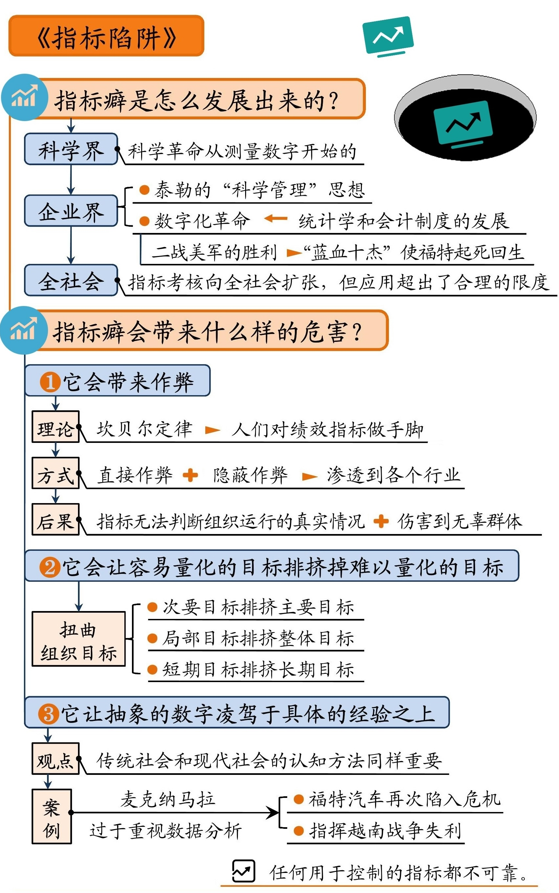

---

### 复盘思维：用经验提升能力的有效方法 2025/02/10

1、分析问题的工具

1）清晰描述和表达问题：TECCA - 泰卡原则。即时间原则（Time）、事件原则（Event）、清晰原则（Clear）、对比原则（Contrast）、避免歧义原则（Ambiguity）。

2）5W2H：用于描述问题，可与TECCA一起使用。

3）人机料法环：用于生产质量的分析。

4）人事时地物：用于管理问题的分析。

5）5Why：即上游思维，用于分析根因。

> 还有一个很有意思的案例，据说美国华盛顿广场有名的杰斐逊纪念堂，因年深日久，墙面出现裂纹。为修复这些裂纹，政府已经花费了上百万美元的费用，结果却并不尽如人意。于是，为了保护好这幢建筑，有关专家进行了专门研讨。
> 最初大家认为，损害建筑物表面的元凶是有侵蚀性的酸雨。专家们进一步研究，却发现墙体遭到侵蚀的最直接的原因是每天冲洗墙壁所用的清洁剂对建筑物的酸蚀作用。
>
> 问题一：为什么每天要冲洗墙壁呢？
> 答案一：因为墙壁上每天都有大量的鸟粪。
>
> 问题二：为什么会有那么多鸟粪呢？
> 答案二：因为纪念堂周围住了很多燕子。
>
> 问题三：为什么会有那么多燕子呢？
> 答案三：因为墙上有很多燕子爱吃的蜘蛛。
>
> 问题四：为什么会有那么多蜘蛛呢？
> 答案四：因为大厦四周有蜘蛛喜欢吃的飞虫。
>
> 问题五：为什么有那么多飞虫？
> 答案五：因为飞虫在这里繁殖得特别快。
>
> 问题六：为什么飞虫在这里繁殖得特别快？
> 答案六：因为这里的尘埃最适宜飞虫繁殖。
>
> 问题七：为什么这里最适宜飞虫繁殖？
> 答案七：因为开着窗阳光充足，大量飞虫住在此处，超常繁殖。
>
> 由此发现解决问题的办法很简单，只要关上整幢建筑的窗帘即可解决政府花了几百万元都未能解决的问题。而这就是五问法的威力。

2、解决问题的工具

1）大胆假设，小心求证。（问卷、访谈、观测、专家）

2）象限法/波士顿矩阵法，对问题的优先级进行定义和筛选

3）用水平思考法想出更多的问题解决方案

3、水平思考法

> 通常，我们认为只有脑子灵活的人才能想出更多的主意，但实际上这可以通过后天培养，甚至我们只需要一些简单的工具就可以“思如泉涌”，想出很多的主意，而打开丰富创意大门的钥匙就是爱德华·德·波诺所创造的水平思考法了。
> 我们先来看一个例子。某饮料企业的设计团队挖空心思思考“如何改进产品包装”，一直找不到很好的方案。后来，在一位思维训练师的指导下，大家进行了水平思考，在很短时间内找到了多个可选方案。
> 这位思维训练师手里拿着一副像扑克牌一样的牌，叫团队中的成员随意抽出一张，这位成员抽出的是印有蜡烛的牌。随后，思维训练师让大家围绕蜡烛进行联想，大家只花了3分钟的时间，很自然地罗列了蜡烛的一系列特征：圆柱体、发光发热、多种颜色、浪漫等。
> 接着，思维训练师引导大家把以上想到的蜡烛的特征与思考的主体“如何改进饮料的产品包装”结合起来，让蜡烛来帮助大家产生创意。很快，大家便产生了很多的创意：浪漫让大家想到开发一种情侣包装，即带有双头吸管的饮料，进而从情侣包装想到家庭包装；由圆柱体的外形想到带托的咖啡杯、红酒杯的包装；由发热想到开发带有夹层的外包装，冬季有自发热夹层给产品加热，夏季有自降温夹层给产品降温，以此来增加产品口感；由多种颜色想到随存储温度而变化颜色的包装，以及保质期渐近色柱就会变短的包装，以此来提醒商家和消费者注意产品的温度和保质期。
> 这就是水平思考法所激发的立竿见影的效果。上述关于改进饮料包装的方法是水平思考法中一个最简单的随机输入法。
> **随机输入法的步骤很简单。第一，随便找一个物体，这个物体可以是一辆自行车、一根蜡烛、一束玫瑰、一支笔、一个手机等；第二，找出这个随机选取的物体的一些特征；第三，将随机选取的物体的特征和需要思考的问题进行比对，问自己，这个特征对我们需要思考的问题来说有什么借鉴意义？这时候，源源不断的好主意就会涌现出来。**
> 我们再来看一个很有意思的水平思考法——概念提取，即我们从最先想到的主意开始，提取出一些概念，然后沿着这些概念进一步扩展，从而产生更多的主意。例如，针对需要解决的焦点问题——“如何鼓励员工创新”，一开始有人提出了一个想法：“用员工的名字冠名，来鼓励创新。”
> 在这个想法的基础上，我们可以思考这个想法背后的真正目的是什么，那就是让个人有成就感。这时候我们发现，用员工的名字冠名只是让个人有成就感的方法中的一个。
> 那么接下来，我们以“个人成就感”为固定点进行思考，又想出了多个主意：对公司创新有特殊贡献的员工，在公司特定产品上面印上其肖像，以示奖励；创立“公司名人堂”；奖励其作为“终身员工”；以其名字命名基金；奖励其为产品命名；奖励其与CEO共进晚餐等。
> 我们还可以提取更多的概念，再以这些新的概念为固定点，想出更多的新办法。
> 所以，总结起来，**概念提取法的步骤是：
> （1）想出一个初始问题的解决办法；
> （2）当我们想出一个解决办法之后，我们要将这个办法重新定义，提取出一个核心概念；
> （3）以提取出来的概念作为出发点，衍生出其他更多的办法。**
> 通过两个非常容易操作的水平思考的工具，我们可以打开思路、想出多个解决问题的方案

---

### 复盘：对过去的事情做视为演练 2025/02/16

> 复盘得出的结论是否可靠，必须在复盘的当时作出判断，一般来说可以通过4条原则来评判：
>
> 1）复盘结论的落脚点是否在偶发性的因素上？
>
> 2）复盘结论是只想人还是指向事？
>
> 3）复盘结论的提出，是否有过3次以上的连续的whey或者why not的追问？
>
> 4）是否经过交叉验证得出的结论

---

### 复盘(沈磊) 2025/02/27

1、5大步骤

1）梳理过程；

2）回顾目标

3）评估结果：全面对比“结果”和“目标”

> 在本阶段，需要评估目标和目的，完成组织的双环学习

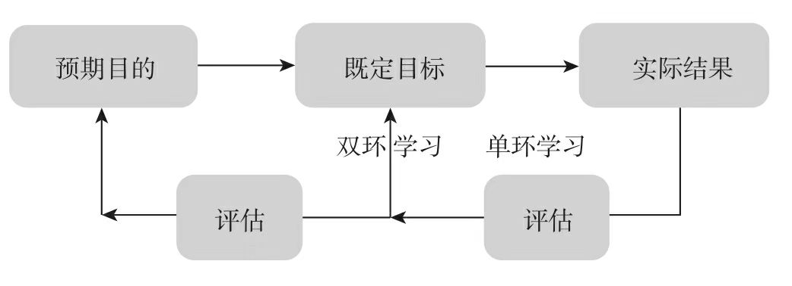

先评估目标，在评估举措，最后评估目的。因为目标和举措更具有衡量性，而目的则稍差。直接评估目的容易空对空，言之无物，陷入空谈和逻辑假设证明。

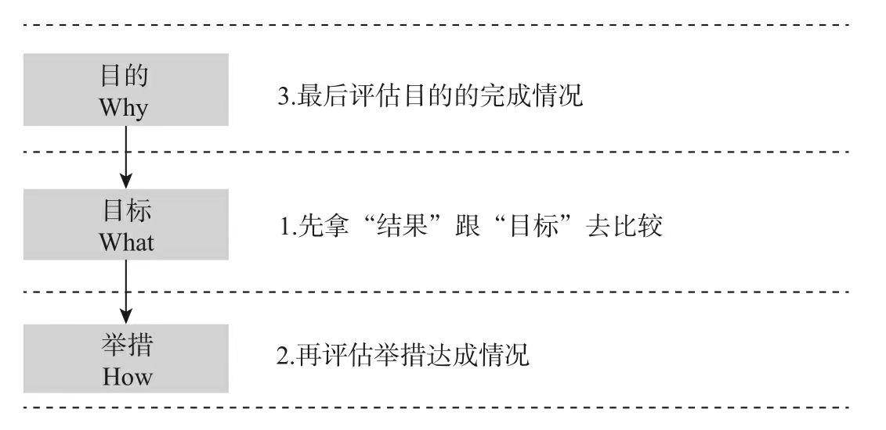

4）分析原因：聚焦解决而非问题本身

* 丰田“五步问题解决法”：第一步，确定最需要优先解决的问题；第二步，澄清问题，找出问题的原因所在；第三步，执行五个“为什么”，找出根本原因；第四步，制定并测试解决方案；第五步，确认结果并进行总结。

* 思路模式1：聚焦问题的流程和方法，类似丰田的五步分析解决法。

  > 虽然我们天天都在应用因果推理，日积月累，似乎早应该练就了很强的推理本领，但实际上，因果关系远非我们认为的那么简单。比如，在哲学领域，大卫·休谟认为，人们只是习惯于把前后相继的事件联系起来，但并不能严谨地证明因果关系的存在；在统计学领域，辨识相关关系与因果关系始终是需要谨慎处理的难题；在认知心理学领域，丹尼尔·卡尼曼指出人们惯用的“启发法”常常是错误的；在投资领域，查理·芒格将“重视理由的倾向”归为人类的误判心理之一；在管理领域，彼得·圣吉的应用系统动力学原理揭示了线性因果思维的局限性；而在复杂科学领域，复杂巨系统呈现出的非线性、混沌、自组织、涌现、分形等属性更是让自认为擅于因果推理的人类感到鞭长莫及。

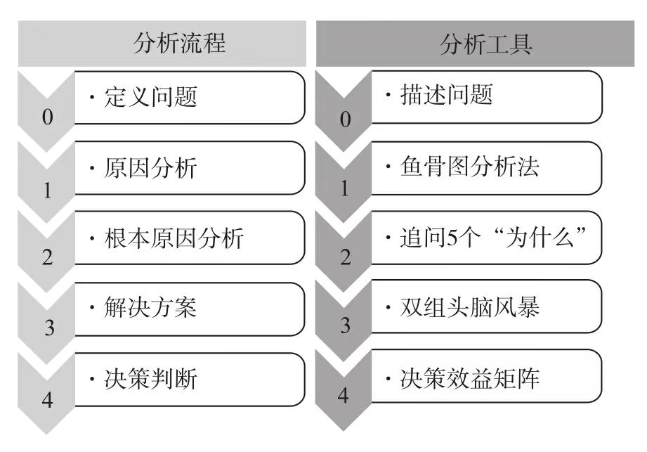

* 思路模式2：聚焦解决的流程和方法，找最佳实践和做的好的。

  > “聚焦问题”的思路重在搞清楚究竟出了什么问题，进而探寻根本原因并设计解决方案。比如，在越南儿童营养不良的案例中，卫生状况差、农村生活贫困、清洁饮用水匮乏、居民不重视儿童营养状况等都是问题的根本原因。据此设计出的解决方案就属于“复杂度高且耗时漫长”的情况。别说执行了，只要想一想就觉得太过复杂，于是这类解决方案可以暂不考虑。没有行动，自然就不会有结果，因此就出现了一个奇怪的现象：分析鞭辟入里，对于解决问题却于事无补。
  > “聚焦解决”的思路则另辟蹊径，重在搞清楚“怎么做有用”，寻找亮点特例，从中发现行之有效的做法，并对这些做法进行研究，看看究竟是什么因素在起作用。在越南儿童营养不良的案例中，在孩子的食物中添加小蟹、小虾和甘薯叶就是有效的做法。在通过有组织的推广后，成千上万的越南儿童从中受益。由此可见，正向思考和行动导向是“聚焦解决”思维的典型特点。

    * 第一步，正向思考：别找问题，而是找亮点
    * 第二步，描述亮点：不是想法是做法
    * 第三步，推广方案：不要动作要效果
    * 第四步，持续点亮：不要运动要机制

* 综合运用

  > 在通过“评估结果”发现偏差之后，接下来的分析原因有两种应对的思维方式：看墙的“聚焦问题”和看路的“聚焦解决”。在实战中，我们建议有条件的情况下可以同时运用两种思维方式，也就是将一个团队分成两组，一组“聚焦问题”分析，一组“聚焦解决”探询。

5）总结经验：好的复盘在于生成新洞察

> 因此，“总结经验”重在提炼通过复盘“我们学到了什么”，而最深刻的学习来自对核心假设的重构、放弃和新增，也就是当复盘会结束时，我们最需要获得的是通过复盘获得的洞察力。
> 那么，具体该如何总结呢？“总结经验”的主要内容之一就是画一张呈两列的表格，注明主题——意想不到的转变，并分为两个方面：原先的核心假设是什么；现在的核心假设是什么。从形式上看，这很简单，但实际上并不容易，这是我们最深刻的体会。

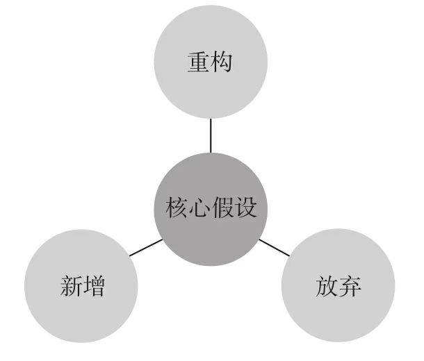

---

### 结构化复盘:打造能拿结果的进化型团队 2025/03/06

1、回顾历程的小工具

决策质量问题适合使用“推理阶梯”工具复原决策历程；偏执行过程的问题适合使用“事实看板”或“时间轴”工具。

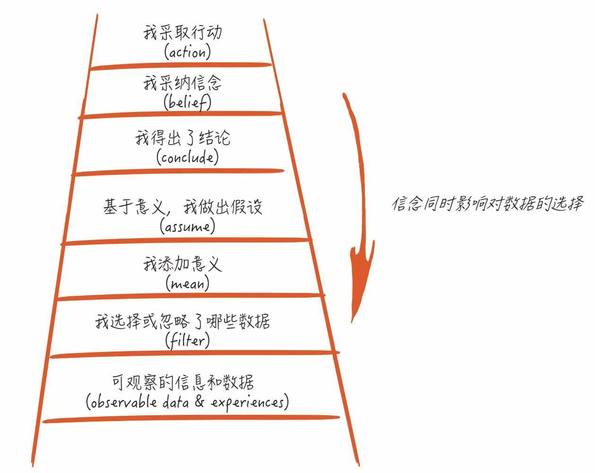

---

### 不上班咖啡馆 2025/04/25

> “在新行业里，鸡头比凤尾，离风头更近。”

> “到了三十多岁，年龄不是价值，专业不是壁垒，公司不是家。”

> 30+的六条新出路：
>
> 1. 专业线：成为领域内专家
> 2. 管理线：在组织内成为管理者
> 3. 转型线：带着积累去新的行业、岗位，进体制（做公务员、考事业编）
> 4. 平衡线：先以家庭为重心，度过经济压力期再找机会
> 5. 自由职业线：以自己的热爱为抓手，创造自己的职业
> 6. 创业线：创办一家自己的公司

> “第一次工业革命的时候，因为技术进步，机器并不需要复杂的操作，工人经过简单培训就能上岗。结果在英国，童工竟然变成了就业的主力——他们听话、好管理，更不会像成年人一样聚众闹事，而且要价很低。最后，这些童工把自己父母的饭碗也抢走了。一个工人家庭往往不是靠父母，而是靠孩子养活，你能想象吗？最后，英国政府实在看不下去了，推行法律禁止了童工。”

> “在匈牙利有个医生叫汉斯·赛尔，一次他给小白鼠做实验，注射一种药剂，结果小白鼠纷纷死亡。他很奇怪，因为这种药剂并不会毒死小白鼠。后来他发现，杀死小白鼠的，不是药剂本身，而是注射的过程。如果太紧张，小白鼠会感受到巨大压力，因此是死于免疫力下降带来的疾病。
> “他第一次意识到，除了毒药，压力也会伤人，哦，是伤鼠。他继续这个研究，他让小白鼠在高压力状态下，持续地游泳，不间断地电击。几周后，他观察到，那些可怜的小家伙都患上类似的病，有一些是胃溃疡，有一些是心血管病。这些看不见的压力，竟然产生了致命的伤害。他提出一个观点：压力本身产生的伤害，和真正的疾病、毒素一样强大。”

> “当你在梦里的时候，捏一下自己不疼，就知道这是在梦里，因为感知绕过了思维，没法作假。当你陷入思维给你放的恐怖片，你可以数一下自己的呼吸、心跳，可以感知一下自己的右脚第二个脚趾的位置……这都是醒来的方式。你当下的感受，就是开灯的开关。”

---

### 明星员工的思维模型 2025/05/27

> 要素1：超越职责，关注需求
> 要素2：挺身而出，适时后退
> 要素3：预见问题，坚持到底
> 要素4：寻求反馈，做出调整
> 要素5：共同担责，轻松工作

**领导者的职责：**

> 怀斯曼认为领导者不应该单打独斗，而应该运用自己的智慧去激发周围人的最大潜能。这就像在球场上，教练的角色是在场边指挥，而非亲自下场。

**超越职责：**

> 普通员工总是将自己囿于固定职位。他们能完成公司分配给自己的工作，但同时也会变得目光短浅，以至于忽视公司的整体战略，从而偏离正轨。相反，明星员工将自己视为解决问题的人。他们不会囿于过时的组织结构，也不过分囿于自己的职位。他们不仅会完成自己的工作，而且会找到能发挥自己最大价值的工作。

> 明星员工不仅会完成自己的工作，同时也会关注复杂组织的罅隙和真空地带。

> 我们所调查的管理者表示，在98%的情况下，顶级贡献者往往会在无人提醒的情况下完成工作。相比之下，典型贡献者的比例为48%，贡献不足者的比例为12%。

> 当一个紧迫的问题变得棘手时，你会只顾着扮演自己的角色，把问题推给别人来处理，还是说，你会找到问题的源头？当你不再囿于固定职位而变成问题解决者时，影响力便会随之增加。

> 如何识别侵蚀组织生产力的背景问题：
>
> 1. 无人认领。背景问题就像流浪狗，人人都知道它的存在，但没人知道它的主人是谁。
> 2. 随口抱怨。人们喜欢发牢骚，但并不真正着手解决背景问题。
> 3. 可以使用小伎俩和权宜之计规避。规避背景问题比解决它更容易。
> 4. 解决方法没有正式记录。可以解决背景问题的权宜之计虽然会得到传播，但不会被记录在任何培训手册中。
> 5. 具有隐性成本。在将所有权宜之计的成本累加之前，背景问题的代价看起来并不高昂。
> 6. 只被部分人看见。背景问题能被受其影响最大的人感知到，但有能力解决问题的人看不见。

**关注需求：**

> 善于总结不成文规则。经过研究，我们得出一个主要结论：明星员工比普通员工更加了解职场规则。他们能总结出不成文的规则手册，即一个人在特定的工作或组织中应该遵守的行为标准。他们关注组织的需求，并能洞察身边同事所重视的事情；他们清楚自己需要完成的工作，并能找到完成工作的正确方法。

> 大多数管理者和组织都有一个目标，即解决其关心的一系列问题。有的时候，这些目标是有形的，以任务说明、战略方案或某一特定时期的优先事项的形式呈现。然而在动态环境中，战术目标需要随着条件的变化和新信息的出现而调整，也就是说，官方陈述的目标往往不是真正的目标。真正的目标是当下最重要的事项，它定义了成功所需的相关和必要因素。但是，真正的目标很少会被写下来。

**挺身而出：**

> 美国副总统卡玛拉·哈里斯（Kamala Harris）写道：“永远不要征求任何人的许可，只管去领导就好。”

> 1976年8月10日，贝蒂·威廉姆斯做出的决定改变了历史的进程，推动了该地区暴力事件的终结。她带头的意愿让她在接下来的30年里走上了倡导权益的道路。2008年6月，威廉姆斯表示：“30年的经验让我树立了一个信念，那就是没有自上而下的答案。答案不在政府那里，不仅如此，恰恰截然相反，很多时候，政府没有答案，而是问题症结所在。如果想要致力于为全世界的儿童贡献一份力量，我们就必须着手自下而上创造解决方案。”她决定努力打造出理想中的世界，而不是满足于现状。

> 终止当前的报告、主动请缨处理更大的问题，这是一个大胆的举动。会议室里负责把控解决方案的高层管理者本可以对梭尼的大胆举动提出质疑，但梭尼已赢得了他们的信任，成为大家乐于支持的领导者。

**寻求反馈：**

> 寻求指导，而不仅仅是反馈。由于反馈重在评价而不是改善，因此，如果你能寻求建议或指导而不仅仅是反馈，便很可能得到更多且更有分量的回应。与其让别人对你的表现给出反馈，不如寻求一些能帮助你更好地完成任务的建议或指导。你可以提出这样的问题，“我想把这件事做好，你有什么建议吗？”“你有什么建议可以帮助我下次做这件事时表现得更好吗？”“我该多做什么？”“我该少做什么？”“如果我下次只做出一个改变，你有什么建议？”

> 关注工作而非个人。影响人们接受反馈的最大阻碍，就是将反馈视作对我们本人的评判，而不是对我们工作的评判。

> 相比之下，将自我价值视为内在固有特质，是指相信自己具备稳定的价值和能力，这是明星员工具备内在价值的体现。如果一个人认为自己本身具有价值，即使明知自己会表现得很糟糕，仍然乐意尝试新鲜事物。在这种思维模式下，自我价值是独立于工作表现而存在的。我们不需要成为别人眼中有价值的人，因为我们本来就有价值。我们明白，尽管我们热爱自己的工作并能从中获得满足感，但自我价值不等于工作价值，工作并不能决定我们作为一个人的价值。

**预见问题：**

> 管理者给出的回答中，最常见的是员工没有事先尝试找出解决方案，就把问题抛给管理者。比如，有的员工“不做尝试，而是像猫一样把死耗子扔在你的大门前”。管理者的第三大烦恼是他们必须跟在员工身后督促他们完成任务，这使管理者沦为“唠叨专业户”或微观管理者。除此之外，令人猝不及防的意外也令管理者颇为烦恼，比如员工在没有补救余地的最后关头才向管理者汇报某个坏消息。这就像举办了一场让管理者颜面扫地的聚会，客人刚来赴约，而你的猫咪却在大门前扔了一只死耗子。

> 这听来可能很奇怪，但我真的早就思考过这些问题。因为我对待急救工作的态度向来如此：提早准备，提出尖锐的问题，找出解决方案，在心中预演计划。如果已经制定了解决方案，你就不必等到挑战来临时再跨越心理障碍了。

**坚持到底：**

> 我从辅导领导者的经验中发现，大多数变革之所以失败，通常是由于领导者野心过大，而不是缺乏野心。我们总是试图一口气尝试太多新的做法。加里·凯勒（Gary Keller）在他的著作《最重要的事，只有一件》（The One Thing）中写道：“想要成功，无须做到想象中那么自律，原因很简单：成功是做对的事，而不是把每件事都做对。”

> 项目一旦开始就一定要坚持完成，这种做法可能导致精力的错误分配和资源的浪费。我的一位朋友曾经半开玩笑地说，当他意识到自己把所有时间都花在了别人未来的妻子身上时，他终于下定决心分手。同样，面对低效的项目，如果我们非要等到项目快完成才决定是否放弃，就会剥夺组织本应投入在更高价值机会中的时间和资源。另外，我们还有可能把自己搞得精疲力竭。与其不惜一切代价地完成工作，不如放弃一些项目，及时止损。想要避免皮洛士式的胜利，我们应深思熟虑，并以全面的视角制定决策，不要考虑之前的行动造成的沉没成本，而要专注于一味坚持所带来的损失和机会成本。

> 然而，即使是言之有物的报警者也会带来不良影响。这些人会提醒上级注意潜在危险，但次数太过频繁。如果有人拉响警报却没有提供相应的解决方案，管理者会立即采取措施，在原本无须亲自参与的领域进行微观管理。

**其他：**

> 有些人认为，站在大舞台的亮光下，会让人变得伟大起来。然而亮光所揭示的，只是你在黑暗中所做的工作。
> ——杰夫·巴耶纳鲁（Jeff Bajenaru）

> 为之命名：将一种行为与特定的词语或生动的意象联系起来，便于回忆和探讨。

---

### 用数据说服：如何设计、呈现和捍卫你的数据 2025/07/11

第一部分 理解感知：数据图为何有用，如何发挥作用

> 数据沟通主要有三大挑战，如表1.1所示。

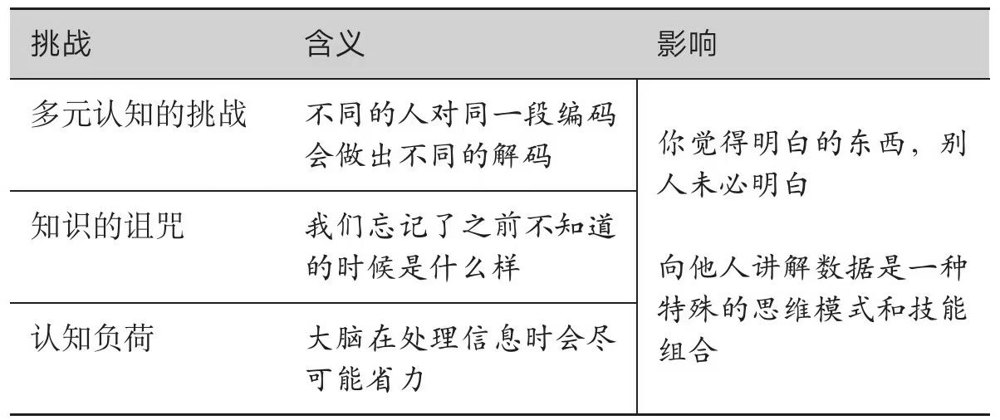

> 速查表：如何向他人解释数据

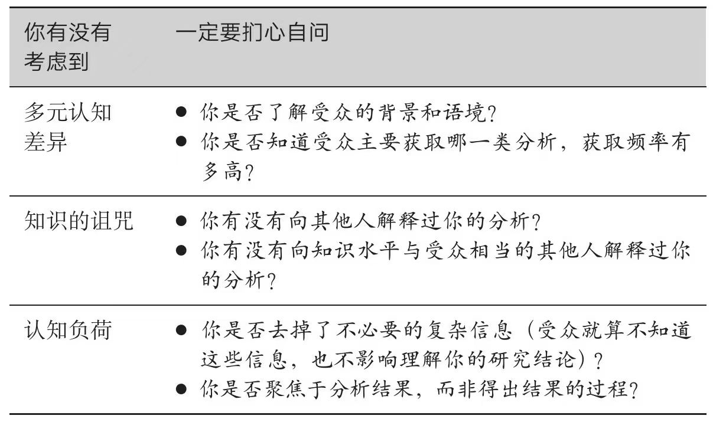

第三部分 数据组织：如何将数据组织为有说服力的沟通内容

> 用明托金字塔建立沟通结构：明托金字塔是一种着眼于最终沟通形式的思维组织工具，如图6.1所示，得名于推广者芭芭拉·明托（Barbara Minto）。明托金字塔的内核是：受众需要知道哪些信息？受众需要哪些证据才能认可你的观点？

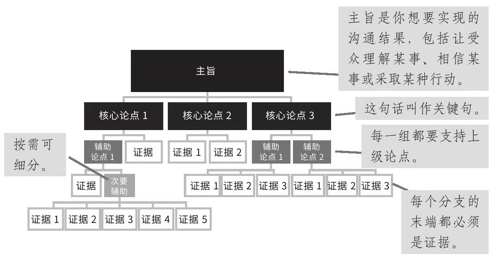

> 开始分析前就要建好金字塔：明托金字塔是大纲。刚开始研究就列好学期论文大纲，这样做有利于整理思路和研究聚焦。同理，用分叉树来建立思考框架在分析初期也是有价值的。你可以用金字塔结构来拆解问题，建立分析框架。
> 如果你要在开始分析前就建立金字塔，你可以将金字塔理解为一组要通过数据和分析来肯定或否定的假设。科学假设会提出关于结果的假设，目的是说明哪些实验可能会否定这些假设。同理，你提出的关于“数据可能会表明什么观点”的假设，也有助于你找到能高效肯定或否定假设的分析。头脑清楚了，你就能够聚焦地运用时间和精力。接下来，你会根据实际发现来修改金字塔，正如优秀科学家会根据实验结果来调整看法。
> 建设性分析过程的出发点与切实的明托金字塔是一样的：要明白你的分析回答了什么问题，你的受众为什么要关心这个问题。这个问题的答案就是金字塔结构的驱动力，而通往问题的道路是由一段故事铺就的。故事的主题是，为什么要进行这段分析？

> 高效沟通者会将认知负荷从受众转移到自己身上。他们会解释论点的含义和相互关系。他们不会专挑有利于自身论点的证据，也会讨论看似不利的数据。具体来说，他们会：
> ·避免提出缺乏思想的（intellectually blank）论点；
> ·直面不利证据。

> 明托金字塔框架各组块内部的各点要满足以下条件：
> ·在语法和概念两个层面对齐；
> ·排序有意义；
> ·相互独立，完全穷尽；
> ·有必要且充分的证据支持。

> 用扎实的推理支持论点：在某个层面上，所有数据沟通都是说服性沟通，都是为了让受众相信给出的数据是成立的，分析是严格的，发现是值得信服的。这种沟通的根基是扎实的逻辑推理，有力、必要且充分的证据支持，以及一双能发现自欺欺人危害的慧眼。

> 无论证据多么有力，你都不能逼迫受众接受一个结论，哪怕他们相信你给出的全部证据。应当记住的一点是，只有时间才能证明任何关于未来事件的结论是对是错。对于没有人能说得准的话题，不要把话说死；如果有人这样做，那你应该警惕。

> 完备结构是高效沟通的基础。明托金字塔速查表见表6.8。

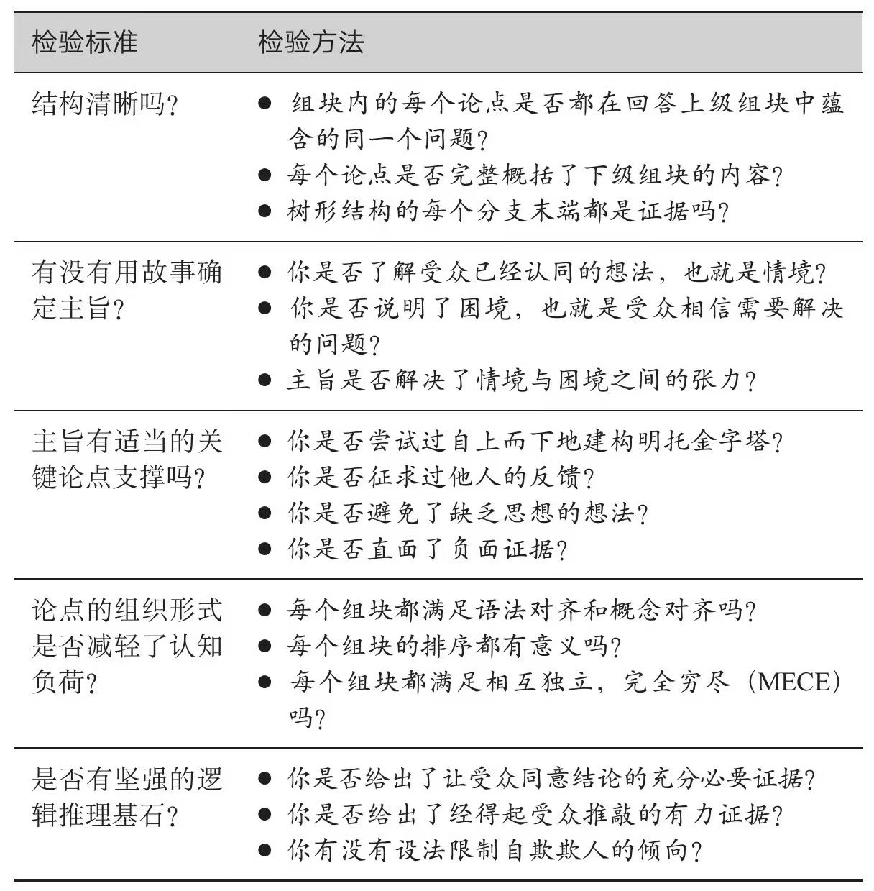

> 理解受众的评判方式
>
> 后果与自身关联越密切，受众就越会深入关注你讲的内容和证据支持。话题的关联越不清晰，受众就越会关注自身与沟通者的关系，以及信息的传递形式。你可以将这两种不同的反应想象成一根数轴的两个端点。
> 一端是说服理论里讲的中枢处理（central processing）。当受众运用中枢处理时，他们会更关注信息本身、论证质量和数据支持，在决策中也更容易容忍高认知负荷。因此，他们在决策中可能会更注重信息的内容。
> 另一端是周围处理（peripheral processing）。当人们运用周围处理时，他们会更依赖这些因素：消息是如何传递的，沟通者是谁，信息是否符合人类用于快捷决策的各种心理捷径。
> 同一个人会用不同路径来处理不同的决策，乃至不同时间的同一决策。影响路径的因素有很多，但牵涉干系越大，后果越切身相关，人就越可能采取中枢处理路径，如表7.1所示。

第四部分 数据呈现与论证：如何预先准备以回应受众

> 如果演示者剥夺了受众的发现机会，直接告知结果，那可能就会触发受众的一种本能，即反驳任何不是亲自得出的观点或结论。抛出惊人发现的另一个危险是，你可能在受众没有完全想清楚之前就往下讲了。很少有受众会大胆举手说：“抱歉。我知道这是一张简单的折线图，我在公司也工作五年了，但我还是不完全明白预订的概念。”相反，他们会质疑你的其他结论。

> 沟通者相信，提问少代表讲得好，数据多能减少受众的反对意见。于是，他们堆砌图表，添加不必要的细节，目的是让自己免遭挑战。他们误以为，没有人反对就意味着大家赞同他们的结论。不要陷入这种误区，反对意味着重视。能确认受众认真听的方法不多，这就是其中一种。

> 受众混淆矩阵要回答两个问题：
>
> 1. 这批受众是否预期某种现象会发生比率变化？
> 2. 这批受众是否观测到某种现象会发生比率变化？

---

### 智能组织：数据与AI重塑的组织管理 2025/09/11

数据驱动可以发现反直觉的原因

> 从第一性原理来看，业务端之所以能更好地应用数据驱动决策，是因为它的数据更符合科学方法的基本要求：可观察性、可重复性和可验证性。

> 效率关注的是“把事做对”，即以最小的投入获得最大的产出。而效能则强调“做对的事”，即确保我们的行动能够产生真正有价值的结果。

> 在捐献同意率低的国家（丹麦、荷兰、英国、德国），人们需要主动选择成为器官捐献者（选择加入系统）。而在捐献同意率高的国家（奥地利、法国、匈牙利、波兰），人们则被默认同意成为器官捐献者，除非他们主动选择退出（选择退出系统）。就是这么简单的不同的默认选项设置，造就了如此巨大的差异。
> 泰勒和桑斯坦将这种通过改变选择架构来影响人们决策的方法称为“助推”（nudge）。他们认为，由于人们往往倾向于选择最容易的选项，或者保持现状，所以通过设置合理的默认选项，可以在不限制人们自由选择的前提下，引导他们做出更有利于自身或社会的决定。这种倾向被行为经济学家称为“默认效应”或“现状偏见”。

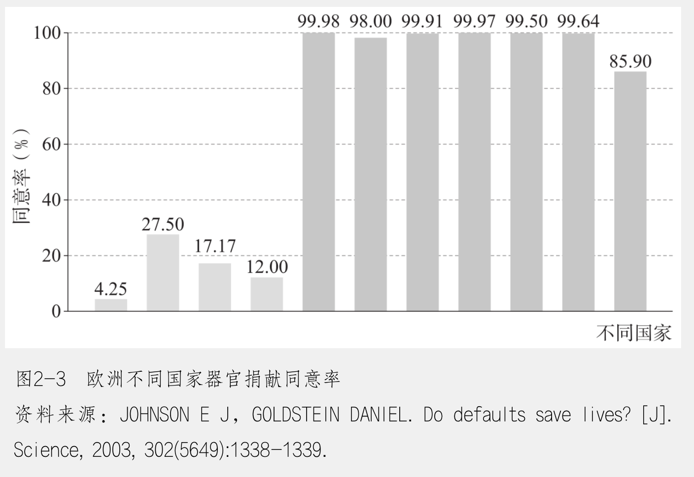

> 这两个试验揭示了人类行为中一些深层次的规律。首先，激励与表现之间并非简单的线性关系。小额奖励可能比无奖励的效果更差，这完全违背了我们的直觉认知。其次，这些试验暗示了一种阈值效应：只有当奖励达到一定规模时，才能产生积极影响。试验中的发现对设计有效的激励机制具有重要意义。

> 理查德·蒂特马斯在1970年的研究中发现，向献血者提供金钱报酬实际上降低了献血率。这一发现与格尼茨和拉切奇尼的研究结果惊人相似。在献血这样的利他行为中，金钱奖励可能会降低人们的内在动机，使献血从一种道德行为转变为一种经济交易。

> 人类在决策过程中不可避免地会受到认知偏差的影响。即使是最优秀的领导者也会犯错，而且往往是因为过度依赖过去的成功经验。这种现象在心理学中被称为“成功陷阱”或“经验陷阱”。这种现象最早可追溯到丹尼·米勒于1990年提出的“伊卡洛斯悖论”（Icarus Paradox）。米勒通过对多家企业进行深入研究后发现，就像希腊神话中飞得太高而坠落的伊卡洛斯，成功的公司往往会因为过度依赖过去的成功经验而陷入困境，在面对新的挑战时反应迟缓或决策错误。

> “工作倒推”（working backwards）流程要求在开始任何新项目之前，先写一份新闻稿，这种方法能确保团队始终关注客户需求，而不是陷入内部偏好。

> 答案或许就藏在管理决策的本质之中。每一个管理决策，本质上都是对未来的一种假设

> 当假设思维成为组织文化的一部分，每个决策者都会自然而然地问：“我们的假设是什么？如何验证这些假设？验证结果告诉我们什么？”这样的组织才能在不确定性中保持清醒，在变化中持续成长。

员工招聘

> 从数据驱动的第一性原理来看，招聘本质上是一个预测候选人未来表现的过程。理想情况下，我们希望候选人在招聘过程中的表现（招聘成绩）与他们未来的工作绩效之间存在强相关性。

> 在人才招聘方面，谷歌利用数据分析优化了整个招聘流程。相关工作人员分析了大量的面试数据，发现传统的脑筋急转弯问题与员工的实际工作表现几乎没有相关性，因此，他们取消了这类问题。相反，他们根据数据分析结果，设计了更能预测候选人未来表现的结构化面试问题。

> 尽管这种做法能大幅提升招聘的效度，但随着谷歌的业务扩展，资源和时间成本的增加使得这样的面试流程难以维持。因此，谷歌依靠内部数据分析，对面试轮次和效度进行了优化。如图4-3所示，通过分析大量的历史招聘数据，谷歌发现：在第4轮面试时，面试效度已经达到86%，即此轮面试所能达到的准确率已经非常接近最佳水平。如果继续增加面试轮次，效度的提升幅度变得极小——每增加一轮面试，效度提升仅1%。虽然这种增益仍然对准确率有帮助，但相对面试消耗的资源和时间成本而言，增加面试轮次变得不再值得。

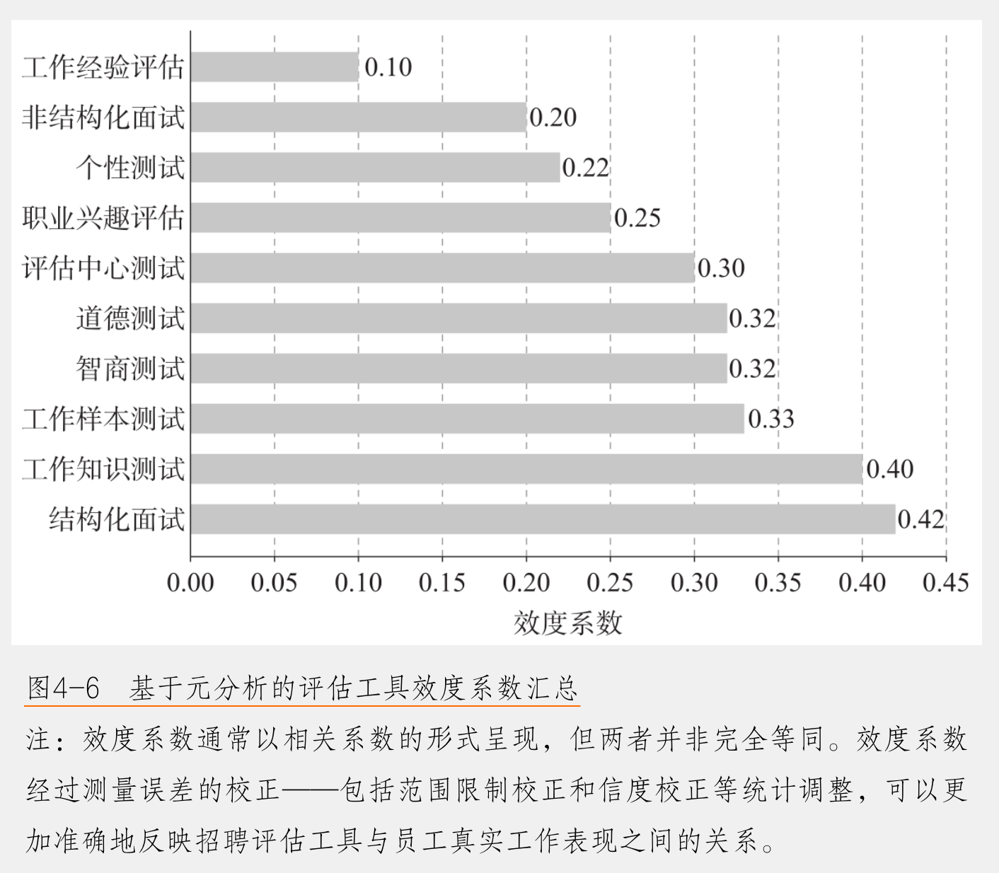

员工评估

> 当一个评估体系中同时夹杂了与目标无关的因素（污染），又遗漏了关键行为（缺失），最终能够真正测量到的“有效”部分就会大大缩水

> 通过深入的数据挖掘和验证，谷歌最终总结出了优秀管理者的八项关键行为，这些行为清晰地展现了管理者如何通过行动推动团队表现。
> ·做一个好的教练 提供个性化反馈，支持员工技能提升和职业发展。
> ·赋能团队，避免微观管理 给予团队信任和自主权，同时提供适时的指导。
> ·关注团队成员的成功和福祉 理解并关心员工的需求与挑战。
> ·高效且注重结果 帮助团队保持专注，确保任务按时高质量完成。
> ·善于沟通 倾听并分享信息，创建开放的交流环境。
> ·提供职业发展支持 与员工讨论职业目标，提供成长机会。
> ·制定清晰的愿景和战略 为团队设定明确的方向，并将目标分解为可执行的计划。
> ·具备技术能力 能够在专业领域为团队提供支持和指导。

员工与组织

> 要了解组织网络这张“看不见的网”，可以从图论（graph theory）与社会网络分析入手。在图论中，“节点”代表个体或实体，“边”则表示节点之间的联结。套用在企业场景里，“节点”可以是一名员工、一支团队，甚至一个外部合作伙伴，而“边”则代表信息流动、资源互换等联系。
> 在传统的组织结构图中，人们只看到谁是上级、谁是下级，但在真实的协作环境里，存在大量“看不见”的互动。

> 度中心度和中介中心度这两个指标分别刻画了“联结数量”与“桥梁价值”两个不同维度的网络影响力。一个人如果度中心度高，往往在团队中坐拥较多的社交资源；若一个人中介中心度高，则通常意味着他拥有跨部门、跨团队的信息“通关权”。在组织管理中，这两类人都十分重要：前者能加速信息扩散，后者能衔接关键路径。若能识别出这类人并充分激励他们，组织的协作效率和创新潜力便可大幅提升；但若忽视了他们，则组织运行可能会在关键时刻“卡壳”。

> 亚马逊采用“六页纸备忘录”的无声会议模式，参会者在会议开始时要先默读详细的书面材料。这种做法与团队网络研究的发现高度吻合。通过设置强制的阅读时间，每个参与者都能充分接收和处理信息，这避免了传统会议中信息传递不均衡的现象。这种方式促使每个人在会议中做好准备，发言更具针对性，从而提升了整体会议效率和决策质量。

---
