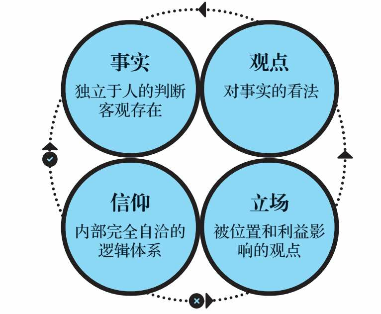

<!-- date: modify -->
### 底层逻辑:看清这个世界的底牌 2023/08/15

> 我们常说，一个人的表述大概可以分为两种：事实和观点。事实有真假，观点无对错。
> 但是细究起来，还可以再细分，至少可以分为四种：事实（Fact）、观点（Opinion）、立场（Stand）和信仰（Belief）（见图2-1）。

> 普通的人改变结果，优秀的人改变原因，顶级优秀的人改变模型。改变制度是改变结果，改变流程是改变原因，改变系统则是改变模型。

> 那么，如何才能挖掘自己的逻辑思维呢？有四句话可以帮助大家建立基本的逻辑素养：证有不证无，以偏不概全，证有靠举例，概全靠推理。

---

### 第一性原理 2023/09/01

> 在我看来，成年人学习的关键并不在于增加信息量，而在于提升自己的思维模型。在低水平的思维模型中，增加再多的内容也只是低水平的重复而已，只有提升思维模型的水平，才能让我们接纳更多高维的信息和知识。当然，想要实现这种目的，学习更多的思维模型和重要学科的重要内容是不可或缺的环节。

> 我们应该怎样判断一个信念是否暂时正确呢？在逻辑学领域，信念“正确”的判断标准是“逻辑三洽”，即自洽、他洽和续洽。

---

### 结构化思维 2023/10/25

1）5W2H思维

2）认知圈思维

3）流程思维

4）人事物思维

5）故事思维

6）客户思维

---

### 把思考作为习惯 2023/11/01

1、内容摘要

> 目标要合适。越追求完美，可能离完美越远。团队管理要有目标思维，学会目标拆解，递进完成大目标。

> 好决策不是想出来的，而是迭代出来的。决策之前可以停顿下，在间隙引入思考，避免决策失误。

> 创新不是无中生有，而是厚积薄发。创新三要点：创造闲余，思想流动，跨界思考。创新有渐进式和跃迁式，要兼顾按7:2:1投入。

> 习惯不能被消除，只能被替代。习惯行为设计也是情绪设计，动机、能力、提示。情绪有利于习惯养成，学会阶段庆祝。

> 互惠让你获得比单人更大的更久。先给与，后索取。这个《影响力》说的一致，人有回馈的社会学反射。互惠的更高一级是互相成就。

> “在很多时候，从众效应是一种本能反应，不需要经过理性的计算，大脑和身体就会自动做出反应。”学会逆势思考。

> 别想那只大象的作者告诉了我们语言框架的危机。所谓语言框架，也叫框架效应，它指的是通过语言来塑造我们看待世界的方式，它是一种无意识的思考方式，会在潜移默化中塑造人们对外部世界的看法。

> 理智战胜不了情绪，只有情绪只能战胜情绪。“从脑科学的角度来说，理智和情绪是不同类型大脑活动的产物，动用的是不同层次的大脑资源。理智能帮助你解决外界的问题，却不能决定你内心的底色。所以，即便你再努力，理智也战胜不了情绪。你要做的，是唤起积极情绪，让它去替代消极情绪。”

> 找到意义感，让自我发展进入良性循环。“在职场上追求自我实现，首先要找到自己所做工作的意义感，这不仅能让你提高工作效率，还能帮你成为更卓越的自己。”  “无论你做的是什么工作，也无论你已经从业多久，认知重塑都可以随时进行，你要让它成为自己的一种惯常的思维模式。”  “就像尼采说过的：“一个人知道自己为什么而活，就可以忍受任何一种生活。”

> 工作和商业一样都是无限游戏，以有限的精力，报以付之一役的心态，则会陷入无尽焦虑。

> 多模型思维。拥有更多的思维方式，选择对的模型。

> 行动并不会换来回报，只有正确的决策才能。

2、观点总结

* 元无知：不知道自己不知道。“有一样东西你没法上网搜索，那就是你脑海里并不存在的观点。”

* 知识分为：方法性知识和事实性知识。纸上得来终觉浅，绝知此事要躬行。方法性知识如果没有事实性知识佐证，那很难内化为人的价值观和行为准绳，也就无法实现知行合一，外显到行为决策上。

* 人们更注重方法性知识而忽略了事实性知识的积累。而搜索技术的发展也带来了负面影响，谷歌效应说的就是知识触手可以，人们的记忆能力也选择了少记忆，快忘记的机制。事实性知识很重要，例如小学生即使手握新华词典也很难写出好的文章。还有一句话：你的词汇量代表你思想的深度。

* 知识也有诅咒，你学会了一个知识就很难理解不了解这个知识的人是怎么想的。这给沟通带来了很大的挑战，所以对齐context很重要。

* 人是厌损的。“损失某样东西让我们难过的程度，要数倍于得到同一件东西让我们快乐的程度。”之所以这样是人性害怕改变和面对不确定性。解决办法：聚焦关键任务，时时回顾。

* 证实是天性，证伪是理性。人有自证倾向，代入立场而非观点，导致离事实越来越远。解决办法：互换观点讨论，查理芒格常说的要反过来想，为了避免观点因团队趋同，需要引入新人。警惕看起来完美的选项。面对他人的自证倾向，正确定位问题，避免他人被错误的问题导入自证陷阱。

* 光环效应是人类心理行为一致的结果。这减小了复杂世界做决策的成本，趋利避害的本能。解决办法和影响力类似，就是分离光环和要评估的事情。

* 多样性视角，不同的视角带来不同的人生观世界观。多以积极的视角看问题，乐观的心态面对问题，可以带来更高的成就。因为世界是乐观者创造的。

* “拥有开放式思维的人，能够在拥有积极心态的前提下，更高效地提升自己的行动力和复原力，获得更多成功的可能性”

* 校园学习是：知识获取，记忆塑造。职场学习是：技能提升，问题解决。提高学习效率的四中场景：营火，水源，洞穴，山顶。学习的时间管理：时间有权重，不要等分。遗忘式学习法应该参考《我们为什么睡觉》，好好睡觉，非快速眼动阶段把记忆由海马体移到大脑皮层，快速眼动阶段则进行新旧知识融合触发创新。

  

---

### 禅与摩托车维修艺术 2023/12/12

1）**如果你想着快点结束某件事情，那就说明你不喜欢这件事。** 但是结合《思考快与慢》，这往往是系统1的直觉，这时候需要启动系统2去思考，我为什么要快速完成这件事，我真的不喜欢他吗？

2）斐德罗认为当前社会存在危机的原因是理性缺失。人类物质和生活条件在短时间内快速丰富，但是人的追求还停留在物质需求上，反而在精神上是缺失的，这导致在物质的温床上失眠。二十一世纪同样如此，尤其在经济快速崛起的国家，人民的精神追求依然被物质需求所裹挟，终日碌碌，没有尽头，也没有真正满足过。

3）斐德罗最早从事生物化学方面的工作。这是科学范畴，需要通过科学的方法去验证真理，先假设，然后再证明，再假设。但是**斐德罗认为假设的数量增长速度超过了证明的速度，这会导致人们里真理越来越远。**

---

### 清晰思考:将平凡时刻转为非凡成果 2024/09/20

> 一位导师曾教导我，在时间允许的情况下，避免在工作中为错误的问题寻找完美解决方案的最佳办法是分别召开两次会议：一次用来界定问题，另一次用来提出解决方案。

> 你应该了解三种失败保险箱：设置绊线、授权他人做出决策，以及束缚自己的双手。

> 问问自己：“曾经最重要的事情，目前还是最重要的吗？我错了吗？现在我在时间上更进一步了，但在进度上却没有，要怎样才能实现我的目标呢？”

> 自利性偏差，即以提升自我形象的方式评价事物的倾向。当在某件事情上取得成功时，我们往往会把它归功于自己的能力或努力。相比之下，当在某件事情上失败时，我们往往会把失败归因于外部因素。如果你想提升自己，就必须改变在出错后把整件事情讲述给自己的方式。

> 美式橄榄球队西雅图海鹰队的皮特·卡罗尔（Pete Car roll）教练和其他人一样，深知好的决策和好的结果之间的区别。2015年2月，卡罗尔在第49届超级碗比赛的最后几分钟做出了一个历史性的决策，赛后立即遭到批评，说这个决策是一个巨大的错误。那时，西雅图海鹰队以24比28的比分落后，但他们已经站在了新英格兰队的一码线上，似乎有把握得分并取得领先。在西雅图海鹰队的后场站立的是马肖恩·林奇（Marshawn Lynch），这位体重约98公斤的猛将可以说是当时美国国家橄榄球联盟中最具威力的跑卫，当天他在对阵爱国者队时已经跑了一百多码。下面是美国哥伦比亚广播公司体育频道的一篇报道，简要回顾了接下来发生的事情——以及今天人们是如何看待卡罗尔的决策的。
>
> 赛后，一位采访者对卡罗尔说：“每个人都认为这是有史以来最严重的错误。”卡罗尔的回应是：这是“有史以来最糟糕的决策结果”。他的决策过程没有问题，只不过没有实现他的意图。有时候，这就是生活。

> 过程原则：当你评估一项决策时，请关注你做出决策的过程，而不是结果。

> 保障措施：记录下你做决策时的想法，不要依赖事后回忆。试图在事后回想清楚自己在做决策时的所知所想，简直是痴人说梦。

---

### 原则 2024/09/25

> 我的目标只是让自己正确——我并不关心正确的答案是不是来源于我。所以我学会了让自己保持极度开明的心态，允许其他人指出我可能疏忽的东西。我发现，我能够成功的唯一途径将是：
> 1.找到与我观点不同的最聪明的人，以便自己能够努力理解他们的推理。
> 2.知道自己在什么时候不能有明确的意见，不急于下结论。
> 3.逐步归纳永恒和普适的原则，对其进行测试，将其系统化。
> 4.通过平衡风险来保持较大的回报，并降低下行波动。

> 要明白，规划一个好方案不一定需要很多时间。草拟和完善一个方案，可以用短短几个小时，也可以用几天甚至几周，但这个过程是必不可少的，因为它确保你将做的事是有效的。太多人犯的错误是，一心想着执行，所以几乎不花时间来规划。谨记：规划先于行动！

> 谨记，你是在寻找最好的答案，而不是你自己能得出的最好答案。

> 教导并强化“吃一堑、长一智”的道理。为了鼓励员工将错误公开并进行客观分析，管理层需要打造相应文化，使得此举成为常态，对压制和掩盖错误的做法给予惩处。这样做是为了明确一点：一个人犯下的最严重的错误，就是不能直面自己的错误。这也是桥水强制采用问题日志的原因。

> 注意不要因集体决策而丧失个人责任。十分常见的是，集体做出了决定，却没有分派个人任务，因此不清楚接下来谁应当做什么。对个人职责的分派，要十分明确。

> 3—5人的效率高于20人。3—5个精明强干且善于思考的人以开放心态讨论，通常能找到问题的最佳答案。组建更多人的团队看起来挺好，但如果人太多，合作的效果可能适得其反，即便其中有很多聪明、有才华的人。给团队增加成员的共生效果是逐步递增的（2+1=4.25），直至到达一个顶点，过了顶点后将不再产生增效，反而带来效率递减。这是因为：（1）边际效益随团队人数增多而减少（两三个人可以贡献大部分重要的观点，增加更多人不会有更多的好点子）；（2）团队人数过多时，其互动效率低于小团队的互动效率。当然，实际中最好的结果取决于人员的素质和他们带来的不同观点，以及团队管理的好坏。

> 当心那些混淆目标和任务的人，因为如果他们分不清楚，你就不能信任他们并给他们委派职责。清楚目标的人通常能有大局观。一种测试方法是：问一个高层次的问题：“目标XYZ的进展如何？”好的回答是先指出关于XYZ整体进展的总体情况，如果需要，再分述各任务情况来支持论证。只见任务不见目标的人只会讲任务完成情况。

---

### 毛泽东选集 2024/10/14

湖南农民运动考察报告

《湖南农民运动考察报告》是一个很好的报告分析示例。从农民问题严重性（农民工会影响人数之广，运动之迅猛）来说明议题的重要性。然后从时间顺序分析：农民工会是如何发展的（细分到不同类别农民，如何在不同时间段，如何进入工会）、做了哪些事情（返回政权、族权、神权、夫权）、不同阶级的不同视角看法。其中，分析了革命者的积极看法和乡绅地主的消极看法的缘由。并对“不好的事情”进行认可，认为这是革命所必须的，“矫枉必须过正”。行为或有瞎呲，但从本质上是进步的，应该给与支持，不应该打压。最后，详细列举了农民工会所做的14件大事。举证来证实前面的观点。

反对本本主义

> 你对于那个问题不能解决吗？那末，你就去调查那个问题的现状和它的历史吧！你完完全全调查明白了，你对那个问题就有解决的办法了。一切结论产生于调查情况的末尾，而不是在它的先头。只有蠢人，才是他一个人，或者邀集一堆人，不作调查，而只是冥思苦索地“想办法”，“打主意”。须知这是一定不能想出什么好办法，打出什么好主意的。换一句话说，他一定要产生错办法和错主意。
> 许多巡视员，许多游击队的领导者，许多新接任的工作干部，喜欢一到就宣布政见，看到一点表面，一个枝节，就指手画脚地说这也不对，那也错误。这种纯主观地“瞎说一顿”，实在是最可恶没有的。他一定要弄坏事情，一定要失掉群众，一定不能解决问题。

> 不根据实际情况进行讨论和审察，一味盲目执行，这种单纯建立在“上级”观念上的形式主义的态度是很不对的。为什么党的策略路线总是不能深入群众，就是这种形式主义在那里作怪。盲目地表面上完全无异议地执行上级的指示，这不是真正在执行上级的指示，这是反对上级指示或者对上级指示怠工的最妙方法。

> 我们说马克思主义是对的，决不是因为马克思这个人是什么“先哲”，而是因为他的理论，在我们的实践中，在我们的斗争中，证明了是对的。我们的斗争需要马克思主义。

> 初次从事调查工作的人，要作一两回深入的调查工作，就是要了解一处地方（例如一个农村、一个城市），或者一个问题（例如粮食问题、货币问题）的底里。深切地了解一处地方或者一个问题了，往后调查别处地方、别个问题，便容易找到门路了。

实践论

> 常常听到一些同志在不能勇敢接受工作任务时说出来的一句话：没有把握。为什么没有把握呢？因为他对于这项工作的内容和环境没有规律性的了解，或者他从来就没有接触过这类工作，或者接触得不多，因而无从谈到这类工作的规律性。及至把工作的情况和环境给以详细分析之后，他就觉得比较地有了把握，愿意去做这项工作。

> 认识的过程，第一步，是开始接触外界事情，属于感觉的阶段。第二步，是综合感觉的材料加以整理和改造，属于概念、判断和推理的阶段。只有感觉的材料十分丰富（不是零碎不全）和合于实际（不是错觉），才能根据这样的材料造出正确的概念和论理来。

> 认识从实践始，经过实践得到了理论的认识，还须再回到实践去。认识的能动作用，不但表现于从感性的认识到理性的认识之能动的飞跃，更重要的还须表现于从理性的认识到革命的实践这一个飞跃。抓着了世界的规律性的认识，必须把它再回到改造世界的实践中去，再用到生产的实践、革命的阶级斗争和民族斗争的实践以及科学实验的实践中去。这就是检验理论和发展理论的过程，是整个认识过程的继续。

<农村调查>的序言和跋

> 第一是眼睛向下，不要只是昂首望天。没有眼睛向下的兴趣和决心，是一辈子也不会真正懂得中国的事情的。

> 第二是开调查会。东张西望，道听途说，决然得不到什么完全的知识。

> 到会的人，应是真正有经验的中级和下级的干部，或老百姓。我在湖南五县调查和井冈山两县调查，找的是各县中级负责干部；寻乌调查找的是一部分中级干部，一部分下级干部，一个穷秀才，一个破产了的商会会长，一个在知县衙门管钱粮的已经失了业的小官吏。他们都给了我很多闻所未闻的知识。

> 所以，一切实际工作者必须向下作调查。对于只懂得理论不懂得实际情况的人，这种调查工作尤有必要，否则他们就不能将理论和实际相联系。“没有调查就没有发言权”[3]，这句话，虽然曾经被人讥为“狭隘经验论”的，我却至今不悔；不但不悔，我仍然坚持没有调查是不可能有发言权的。

反对党八股

> 党八股的第一条罪状是：空话连篇，言之无物。我们有些同志欢喜写长文章，但是没有什么内容，真是“懒婆娘的裹脚，又长又臭”。
>
> 党八股的第二条罪状是：装腔作势，借以吓人。有些党八股，不只是空话连篇，而且装样子故意吓人，这里面包含着很坏的毒素。
>
> 党八股的第三条罪状是：无的放矢，不看对象。
>
> 党八股的第四条罪状是：语言无味，像个瘪三[8]。
>
> 党八股的第五条罪状是：甲乙丙丁，开中药铺。
>
> 党八股的第六条罪状是：不负责任，到处害人。
>
> 第七条罪状是：流毒全党，妨害革命。
>
> 第八条罪状是：传播出去，祸国殃民。

在延安文艺座谈会上的讲话

> 我们讨论问题，应当从实际出发，不是从定义出发。如果我们按照教科书，找到什么是文学、什么是艺术的定义，然后按照它们来规定今天文艺运动的方针，来评判今天所发生的各种见解和争论，这种方法是不正确的。我们是马克思主义者，马克思主义叫我们看问题不要从抽象的定义出发，而要从客观存在的事实出发，从分析这些事实中找出方针、政策、办法来。我们现在讨论文艺工作，也应该这样做。

党委会的工作方法

> 四、不懂得和不了解的东西要问下级，不要轻易表示赞成或反对。有些文件起草出来压下暂时不发，就是因为其中还有些问题没有弄清楚，需要先征求下级的意见。我们切不可强不知以为知，要“不耻下问”[2]，要善于倾听下面干部的意见。先做学生，然后再做先生；先向下面干部请教，然后再下命令。各中央局、各前委处理问题的时候，除军事情况紧急和事情已经弄清楚者外，都应该这样办。这不会影响自己的威信，而只会增加自己的威信。我们做出的决定包括了下面干部提出的正确意见，他们当然拥护。下面干部的话，有正确的，也有不正确的，听了以后要加以分析。对正确的意见，必须听，并且照它做。中央领导之所以正确，主要是由于综合了各地供给的材料、报告和正确的意见。如果各地不来材料，不提意见，中央就很难正确地发号施令。对下面来的错误意见也要听，根本不听是不对的；不过听了而不照它做，并且要给以批评。

> 六、要“抓紧”。就是说，党委对主要工作不但一定要“抓”，而且一定要“抓紧”。什么东西只有抓得很紧，毫不放松，才能抓住。抓而不紧，等于不抓。伸着巴掌，当然什么也抓不住。就是把手握起来，但是不握紧，样子像抓，还是抓不住东西。我们有些同志，也抓主要工作，但是抓而不紧，所以工作还是不能做好。不抓不行，抓而不紧也不行。

> 七、胸中有“数”。这是说，对情况和问题一定要注意到它们的数量方面，要有基本的数量的分析。任何质量都表现为一定的数量，没有数量也就没有质量。我们有许多同志至今不懂得注意事物的数量方面，不懂得注意基本的统计、主要的百分比，不懂得注意决定事物质量的数量界限，一切都是胸中无“数”，结果就不能不犯错误。例如，要进行土地改革，对于地主、富农、中农、贫农各占人口多少，各有多少土地，这些数字就必须了解，才能据以定出正确的政策。对于何谓富农，何谓富裕中农，有多少剥削收入才算富农，否则就算富裕中农，这也必须找出一个数量的界限。在任何群众运动中，群众积极拥护的有多少，反对的有多少，处于中间状态的有多少，这些都必须有个基本的调查，基本的分析，不可无根据地、主观地决定问题。

---

### 系统之美 2024/10/21

> 防止“公地悲剧”有以下三种方式：
> 方式一：教育、劝诫。帮助人们看到无节制地使用公共资源的后果，号召并激发人们的美德品行。劝说人们有所节制，以社会舆论谴责或严厉惩罚来威慑违规者。
> 方式二：将公共资源私有化。将公共资源分割给个人，每个人都要对自己行为的结果负责。如果某些人缺乏自控力，对资源的使用超出了其所拥有的资源的承载能力，他们也只能自食其果，伤害不到其他人。
> 方式三：对公共资源进行管制。哈丁将这种选择称为“达成共识，强制执行”。管制可以采取很多种形式，从对某些行为的严格禁止，到配额制、许可制、税收调控以及鼓励措施等。要想奏效，管制必须有强制性的监管和惩罚措施。

> 应对“政策阻力”最有效的方式是，设法将各个子系统的目标协调一致，通常是设立一个更大的总体目标，让所有参与者突破各自的有限理性。如果每个人都能为了同一个目标而和谐地相处，其结果将令人惊奇。

> **“在你看来，好像有一个精确的合理租金水平，在这个水平之上，房客就被剥削了，而在这个水平之下，你又被压榨了。但事实上，并不存在这样一条明确的线。在你和房客之间，是一个较大的灰色区域——在这个区域之内，你们都可以达成合理的交易。所以，别再自寻烦恼了，照常过你的日子去吧。”**

> 荷兰在住房开发过程中安装电表的故事，一些电表被安装在地下室，另外一些则被安装在前厅。在房间没有其他区别的情况下，后者家庭的电力消耗比前者低30%，差别仅仅在于电表是否被安装在更容易被人们看到的位置。

---

### 适时退出:以退为进的决策智慧 2024/10/22

> 坚持并不总是最好的决定，还要看实际情况。而实际情况随时都在发生变化。
> 毅力成就了阿里——伟大的拳击冠军，几乎无人能与之匹敌——但也毁掉了他，因为这种毅力让他对那些在外人看来明显预示着“退出”的征兆视而不见。
> 这就是毅力的有趣之处。它会让你坚持去做艰难而值得的事，也会让你坚持去做艰难但不值得的事。诀窍在于找出其中的区别。

> 成功不在于坚持。成功的关键在于选择正确的事情来坚持，并退出其他事情。

> “关门时间”就是指登山者停止攀登的时间，即使没有到达目的地也要返回营地。“关门时间”是为了保护登山者，避免他们在下山过程中遇到危险，因为下山比上山更需要技巧。

> 管理咨询业有一条著名的启示法则：第一次想到解雇某人的时候，是付诸行动的最佳时机。这条法则旨在让企业更快地做出决定，因为大多数管理者不愿意解雇员工，导致这些员工留下来的时间越来越久。

> 我们会把自己拥有的东西看得比同等物品更重。理查德·塞勒率先将这种认知错觉命名为“禀赋效应”。事实上，他正是在1980年那篇提出“沉没成本”的论文里引入了禀赋效应，并将其描述为“相比取得一件物品所愿意付出的代价，人们往往要求更高的补偿才会放弃它”。

> 更加严肃地说，这给那些想要更好做出退出决定的企业提供了一个好策略：尽可能分而治之。让一些人做出开始的决定，让另一些人做出结束的决定。
> 对于机构投资者客户，我建议将这种策略作为改善卖出决策的一种方式。让一个委员会批准购买什么，让另一个委员会批准何时卖出什么。当然，这只有在团队规模足够大的情况下才可行。

> 总结一下本书所讨论的内容，我们之所以很难退出，是因为我们害怕两件事：一是失败，二是浪费了时间、精力和金钱。
>
> 我们担心退出就意味着失败，但我们到底失败在哪里呢？退出一件不再值得坚持的事情，这不是失败。这是成功。
> 我们理所当然地认为，失败就是在没有达成目标的情况下退出，比如未能冲过终点线。但是，如果你继续追求一些失去价值的东西，难道就不是失败吗？我们何不重新定义失败，将之视为未能遵循一个好的决策过程？
> 成功意味着遵循一个好的决策过程，而不仅仅是冲过终点线，尤其是在终点线有误的情况下。也就是说，适当地遵循终止标准，听取退出教练的建议，并认识到我们在过程中取得的进步非常重要。
>
> 我们也要重新定义“浪费”。浪费时间、精力和金钱意味着什么？问题在于，我们往往会用一种后顾性思维来考虑这些事情。我们觉得如果放弃某件事，就意味着浪费了我们投入的一切。
> 但这些资源已经用掉了。你不可能再把它们要回来。
> 我们要用前瞻性思维来考虑浪费的问题。也就是说，在一些失去价值的事情上多花一分钟、一点精力或一美元，才是真正的浪费。

---

### 小数决策 2024/11/11

详见：[小数决策和审查数据](../../16.工作/7.小数决策和审查数据.md)

---

### 思考的技术 2024/12/12

> 大前研一

向麦肯锡学习逻辑思维

> 不要把假设和结论混为一谈。

> 分析数据后所整理出来的资料，只不过是假设。但是大部分企业经营者或工商业者，就把这个假设当结论了。

> 也就是自己感觉有十足的把握，确定这个结论绝对没错之前，一定要挪动双脚亲自走访现场。事实上，我从来没有一次是在企划室中研究数字之后就得出结论的。

科学思考

> 卡宁厄姆自英国有名的贵族学校伊顿公学（Eton School）毕业后，考进了剑桥大学，是位非常典型的优等生，他对逻辑构成、重点分析都执行得非常透彻而深入。就连在一般对话时，不论我说什么，他都会咄咄逼问：“有何证据？”“你是基于什么分析而这么说的？”“为什么会有这个结论？”当时我并不了解公司其他人的做法，所以下意识地认为这应该就是麦肯锡式的做法，后来才知道，事实上根本不是这么回事。

> 我是在一无所知的情况下进入麦肯锡的，所以我比别人加倍努力。**其中一项就是思维能力的训练。**
> 当时我是从横滨出发去公司上班的，所以每天早上就利用从横滨到东京车站的二十八分钟通勤时间，给自己一道题目，然后思考如何解决问题。例如，一眼看到垂吊式的车厢广告，就以这个广告为题目，思考：“如果这家广告公司的总裁要我协助他们公司提高业绩，我该怎么做？”当脑子习惯思考之后，思考速度自然会加快，于是我就从每天一道题目，进步到每隔一个车站都可以思考一道新的题目。看到一个不同的广告，马上就提出假设“如果这么做一定热卖”，然后思索该搜集什么资料、该怎么做分析，等等，也就是说，我在训练自己的脑子，可以立即将解决问题的所有过程组合起来。

> 这就是组织解决问题的思维训练。题目是无所不在的，如果你也能像我一样训练自己的脑力，就一定能够提升解决问题的能力。一天努力看不出差距，可是天天努力，很快就有明显的差别了。
> 最后，我给大家一道题目，既可以训练思维，又对工作非常有实际效用。这道题目就是：“如果你的职位比现在高两级，你会怎么做？”每一家公司、每一个企业，应该有各种不同的问题。如果你现在是员工，就以中层领导的立场来思考；如果你现在是中层领导，就以高层领导的立场来思考。请做深层思考，想一想如果你是领导，你会怎么解决公司的问题。

区分现象和原因

> 他们所罗列的问题只不过是现象，而逆转现象并不是解决方案。只看到现象，绝对无法找出问题的真正原因以及能够对症下药的解决方法。日本在研讨各种议题的时候，十之八九都无法区别现象和原因，因为参与议题研讨的人根本就不具备正确的思路。
> 不可仅凭现象做判断。
>
> 会发生某种现象，一定有其原因。但是懒得找原因，只以现象做判断，提出解决方法，这种解决方案绝不会是正确的。

思维训练

> 为什么要做这样的练习呢？在江户川堤防走上十公里，单凭这种行为就可以让你看到很多平常看不到的景致。
> 新景观使平常没有用到的脑部思维逻辑得以锻炼。住在附近的人，都是如此度过休闲时光，或是自己上了年纪之后，会不会也到这样的场所来打打棒球呢？像这样接触到与平常上班生活所看到的不同的景色，脑部就会跟着灵活起来。
> 接着，试着对自己提出问题。
> 首先，想想要不要搬到这附近来住呢？如此一来，开始在脑袋里思考一些正面和负面的情形，放眼望去，绿油油的一片，环境也不错、购物和学校不知道怎么样、夏天说不定很多蚊子，等等。如果又想到下次也带孩子们来走走，这时思维又会开始运转，想着到那时要做些什么、若是开车来不知有没有停车场、午餐是先去便利店买好，还是到这附近来烤肉呢，等等问题。
> 更进一步想到若这个堤防上可以盖房子的话，自己真想要拥有这样的房子，问题接二连三陆续出现。想着建设部门一定不会核准在这个地方盖房子，但万一真的可以，自己要盖一栋怎样的房子。或是想着对岸好像也不错，于是又开始想好的一面和坏的一面。然后想下次来的时候，走过桥去对面看看吧。
> 看到河川的对岸，堤防外的江户川区，是密密麻麻杂乱无章的住宅区，看到这番景象，突然心头涌上一股对国家的怒气，为什么我们得在这个狭小的地区比邻而居挤在一起，而不能在这一片广大的土地上盖房子呢？而且这边的景观远比对岸漂亮许多。
> 接着又想洪水泛滥而不需负责的前提之下，交通部门若是允许在这片土地上建造住宅区，成本一定很低廉，或是不知道要找哪个机构进行交涉才对，等等问题。
> 随后开始思考照今天所走十公里的距离来计算，可以盖上几栋房子。若简单地计算出四十万户，然后再对自己提问：那么对于这一片土地，是否还有更好的利用方法呢？诸如此类的问题不断在脑海中涌现，而这些问题一定是以前所没有思考过的。

> “思考”，就是对自己提出疑问
>
> 我的人生就是这样不断进行思考。走路的时候，绝对不会发呆，一定是边走边思考，因此，头脑运转的机会非常多。如此连续不断地思考，就能产生许多经验和构想。
> “思考”，就是常常提出疑问，然后自己努力寻求解答。在“当下若没有找到答案就会死”这样的强迫观念之下，将自己所拥有的数据从脑袋中调出来加以分析，然后找出可以说服自己的解答。其实，这种事情大家也都可以做到。

拆解法

> 能预知五年后的世界的思维逻辑
>
> 先分解功能再进行思考
>
> 具备预知性，也就是说，能够看清楚现在正发挥作用的力量，并知道它在未来是否依然可以持续发挥作用。不仅如此，还要能够辨别出这个倾向是否会越来越强，还是只能维持甚至转弱。能够预先知道目前在起作用的几个要素当中，哪个才是影响未来最重要的要素，有了这样的思维逻辑，才算是具备预知性的条件。

---

### 巨人的工具 2025/02/12

> 有一种简单的练习可以极大的提高你的思维能力，让你注意到小时的痛苦（无论是身体上的、心理上的还是感情上的），当然，这项练习并不仅仅与痛苦有关。

关注消失的事物有两个益处：

1）增加心理愉悦：心理愉悦含幸福的感觉来到和痛苦感觉的消失两种，关注到痛苦的消失，也会让人变得平静。

2）增加对消失的事物、看不见的事物提升敏感度。避免幸存者偏差。

---

