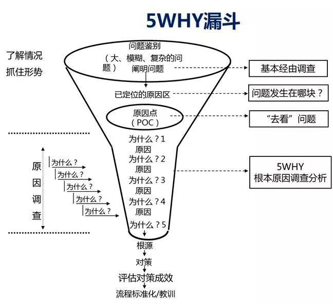

## 说明

古人有云“朝三省吾身”，告诫自己和后人要时常反思、自省。以及在工作中发现，类似的事情经常会反复出现，如果能习就每日反思的习惯，从每日的具体事件中思考其更朴实、临界的知识，这些知识连带着具体事件作为上下文，就会沉淀为有价值的经验，为今后遇到相同模式的事件时提供更好的直觉和决策支撑。

另外，很多人都说“知道很多道理但依旧过不好这一生”，或许可以这样解读，这有两个原因：1）懂得的道理不够普适，不知道其适用场景和边界，不知道什么时候用；该用的时候想不起用；2）只有概念性知识，没有事实性知识，无法把知识和实际的场景联系起来，无法激发使用知识的直觉。日常反思也就是把概念性知识和事实性知识组合的过程，读取名人传记有类似的作用。

当意识到反思的重要性后，今年上半年曾在电脑上增加定时提醒，每晚十分钟，反思下当日的工作。但是坚持了几个月后，就不了了之了。主要是因为发现没有太多的反思内容，然后就逐渐流于形式，慢慢停止了这个过程。这两天读了《好好学习：个人知识管理精进指南》后有了启发，作者强调了临界知识和反思的重要性。作者也曾遇到类似的情况，他的假设是“假如反思有用，那是不是我没有正确的反思导致坚持不下去呢？”。基于这个假设，作者提出了一些反思的内容、对标内容等具体的手段去落实反思的内容、路径和深度，从反思中得到正反馈，正向促进反思行为。

所以本文主要是基于“反思是有价值的，值得去做的”的假设，来思考如何在工作中执行反思这个行为。本文主要侧重于自己的工作实践，不做完整性讨论，可参考《好好学习：个人知识管理精进指南》进行补充学习。

## 临界知识

这个概念来自《好好学习：个人知识管理精进指南》，指通过由表及里的分析后，发现事情的根本原理或原因。可以通过5Why来发现根因。

## 复盘内容

此处只讨论工作范畴，建议工作日早上进行回顾和反思。这里主要想细化反思内容，达到能执行的程度。反思的内容不是一成不变的，会随项目周期，项目类型等因素而不同，所以要注意随时适时调整反思内容。反思的目标来说是相对确定的，即通过反思发现更普适的知识，然后联结事实性知识，沉淀为有价值的经验。

这也是一个习惯养成过程，天下难事必作于易，刚开始的反思内容可以少一点，慢慢通过正反馈，来正向促进习惯的养成。以下把反思的内容分为两个部分，固定的和变化的。

### 固定内容

对事物规律的反思肯定有一些通用的逻辑，把这些逻辑作为固定的内容写成TodoList，每日进行核验。列表如下，随时补充：

- [ ] 情绪是否平和
- [ ] 整体视角审视项目的进度、风险，结合具体数字
- [ ] 正在进行的任务的进度、风险，结合具体数字
- [ ] 当前有预期之外的事情发生吗
- [ ] 当前最重要的三件事是什么

### 变化内容

对每日接受到的随机信息，如工作相干的文章、项目信息、突发事件等，进行反思。以下列了几个有可能的思考内容。

- [ ] 这个信息的直接原因/根本原因是什么
- [ ] 有哪些改进方式
- [ ] 是否能发现临界知识
- [ ] 可以找一个相干问题进行思考