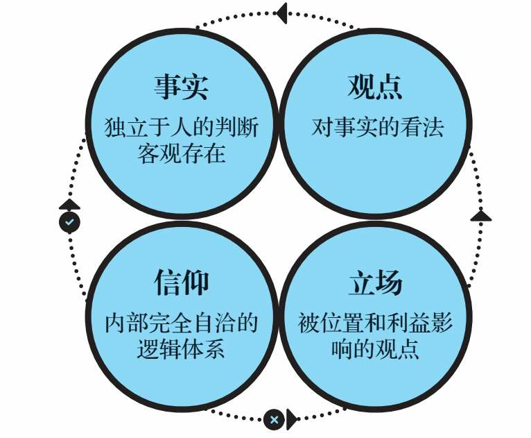
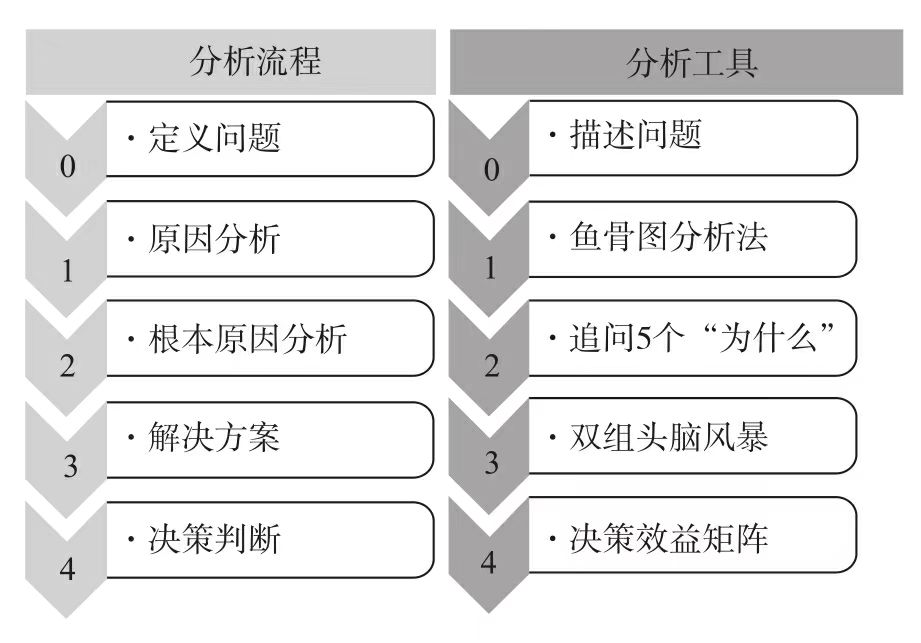

<!-- date: 2025.07.04 11:00 -->

## 一、思考

### 底层逻辑:看清这个世界的底牌 2023/08/15

> 我们常说，一个人的表述大概可以分为两种：事实和观点。事实有真假，观点无对错。
> 但是细究起来，还可以再细分，至少可以分为四种：事实（Fact）、观点（Opinion）、立场（Stand）和信仰（Belief）（见图2-1）。

> 普通的人改变结果，优秀的人改变原因，顶级优秀的人改变模型。改变制度是改变结果，改变流程是改变原因，改变系统则是改变模型。

> 那么，如何才能挖掘自己的逻辑思维呢？有四句话可以帮助大家建立基本的逻辑素养：证有不证无，以偏不概全，证有靠举例，概全靠推理。

---

### 第一性原理 2023/09/01

> 在我看来，成年人学习的关键并不在于增加信息量，而在于提升自己的思维模型。在低水平的思维模型中，增加再多的内容也只是低水平的重复而已，只有提升思维模型的水平，才能让我们接纳更多高维的信息和知识。当然，想要实现这种目的，学习更多的思维模型和重要学科的重要内容是不可或缺的环节。

> 我们应该怎样判断一个信念是否暂时正确呢？在逻辑学领域，信念“正确”的判断标准是“逻辑三洽”，即自洽、他洽和续洽。

---

### 结构化思维 2023/10/25

1）5W2H思维

2）认知圈思维

3）流程思维

4）人事物思维

5）故事思维

6）客户思维

---

### 把思考作为习惯 2023/11/01

1、内容摘要

> 目标要合适。越追求完美，可能离完美越远。团队管理要有目标思维，学会目标拆解，递进完成大目标。

> 好决策不是想出来的，而是迭代出来的。决策之前可以停顿下，在间隙引入思考，避免决策失误。

> 创新不是无中生有，而是厚积薄发。创新三要点：创造闲余，思想流动，跨界思考。创新有渐进式和跃迁式，要兼顾按7:2:1投入。

> 习惯不能被消除，只能被替代。习惯行为设计也是情绪设计，动机、能力、提示。情绪有利于习惯养成，学会阶段庆祝。

> 互惠让你获得比单人更大的更久。先给与，后索取。这个《影响力》说的一致，人有回馈的社会学反射。互惠的更高一级是互相成就。

> “在很多时候，从众效应是一种本能反应，不需要经过理性的计算，大脑和身体就会自动做出反应。”学会逆势思考。

> 别想那只大象的作者告诉了我们语言框架的危机。所谓语言框架，也叫框架效应，它指的是通过语言来塑造我们看待世界的方式，它是一种无意识的思考方式，会在潜移默化中塑造人们对外部世界的看法。

> 理智战胜不了情绪，只有情绪只能战胜情绪。“从脑科学的角度来说，理智和情绪是不同类型大脑活动的产物，动用的是不同层次的大脑资源。理智能帮助你解决外界的问题，却不能决定你内心的底色。所以，即便你再努力，理智也战胜不了情绪。你要做的，是唤起积极情绪，让它去替代消极情绪。”

> 找到意义感，让自我发展进入良性循环。“在职场上追求自我实现，首先要找到自己所做工作的意义感，这不仅能让你提高工作效率，还能帮你成为更卓越的自己。”  “无论你做的是什么工作，也无论你已经从业多久，认知重塑都可以随时进行，你要让它成为自己的一种惯常的思维模式。”  “就像尼采说过的：“一个人知道自己为什么而活，就可以忍受任何一种生活。”

> 工作和商业一样都是无限游戏，以有限的精力，报以付之一役的心态，则会陷入无尽焦虑。

> 多模型思维。拥有更多的思维方式，选择对的模型。

> 行动并不会换来回报，只有正确的决策才能。

2、观点总结

* 元无知：不知道自己不知道。“有一样东西你没法上网搜索，那就是你脑海里并不存在的观点。”

* 知识分为：方法性知识和事实性知识。纸上得来终觉浅，绝知此事要躬行。方法性知识如果没有事实性知识佐证，那很难内化为人的价值观和行为准绳，也就无法实现知行合一，外显到行为决策上。

* 人们更注重方法性知识而忽略了事实性知识的积累。而搜索技术的发展也带来了负面影响，谷歌效应说的就是知识触手可以，人们的记忆能力也选择了少记忆，快忘记的机制。事实性知识很重要，例如小学生即使手握新华词典也很难写出好的文章。还有一句话：你的词汇量代表你思想的深度。

* 知识也有诅咒，你学会了一个知识就很难理解不了解这个知识的人是怎么想的。这给沟通带来了很大的挑战，所以对齐context很重要。

* 人是厌损的。“损失某样东西让我们难过的程度，要数倍于得到同一件东西让我们快乐的程度。”之所以这样是人性害怕改变和面对不确定性。解决办法：聚焦关键任务，时时回顾。

* 证实是天性，证伪是理性。人有自证倾向，代入立场而非观点，导致离事实越来越远。解决办法：互换观点讨论，查理芒格常说的要反过来想，为了避免观点因团队趋同，需要引入新人。警惕看起来完美的选项。面对他人的自证倾向，正确定位问题，避免他人被错误的问题导入自证陷阱。

* 光环效应是人类心理行为一致的结果。这减小了复杂世界做决策的成本，趋利避害的本能。解决办法和影响力类似，就是分离光环和要评估的事情。

* 多样性视角，不同的视角带来不同的人生观世界观。多以积极的视角看问题，乐观的心态面对问题，可以带来更高的成就。因为世界是乐观者创造的。

* “拥有开放式思维的人，能够在拥有积极心态的前提下，更高效地提升自己的行动力和复原力，获得更多成功的可能性”

* 校园学习是：知识获取，记忆塑造。职场学习是：技能提升，问题解决。提高学习效率的四中场景：营火，水源，洞穴，山顶。学习的时间管理：时间有权重，不要等分。遗忘式学习法应该参考《我们为什么睡觉》，好好睡觉，非快速眼动阶段把记忆由海马体移到大脑皮层，快速眼动阶段则进行新旧知识融合触发创新。
  
  

---

### 禅与摩托车维修艺术 2023/12/12

1）**如果你想着快点结束某件事情，那就说明你不喜欢这件事。** 但是结合《思考快与慢》，这往往是系统1的直觉，这时候需要启动系统2去思考，我为什么要快速完成这件事，我真的不喜欢他吗？

2）斐德罗认为当前社会存在危机的原因是理性缺失。人类物质和生活条件在短时间内快速丰富，但是人的追求还停留在物质需求上，反而在精神上是缺失的，这导致在物质的温床上失眠。二十一世纪同样如此，尤其在经济快速崛起的国家，人民的精神追求依然被物质需求所裹挟，终日碌碌，没有尽头，也没有真正满足过。

3）斐德罗最早从事生物化学方面的工作。这是科学范畴，需要通过科学的方法去验证真理，先假设，然后再证明，再假设。但是**斐德罗认为假设的数量增长速度超过了证明的速度，这会导致人们里真理越来越远。**

---

### 清晰思考:将平凡时刻转为非凡成果 2024/09/20

> 一位导师曾教导我，在时间允许的情况下，避免在工作中为错误的问题寻找完美解决方案的最佳办法是分别召开两次会议：一次用来界定问题，另一次用来提出解决方案。

> 你应该了解三种失败保险箱：设置绊线、授权他人做出决策，以及束缚自己的双手。

> 问问自己：“曾经最重要的事情，目前还是最重要的吗？我错了吗？现在我在时间上更进一步了，但在进度上却没有，要怎样才能实现我的目标呢？”

> 自利性偏差，即以提升自我形象的方式评价事物的倾向。当在某件事情上取得成功时，我们往往会把它归功于自己的能力或努力。相比之下，当在某件事情上失败时，我们往往会把失败归因于外部因素。如果你想提升自己，就必须改变在出错后把整件事情讲述给自己的方式。

> 美式橄榄球队西雅图海鹰队的皮特·卡罗尔（Pete Car roll）教练和其他人一样，深知好的决策和好的结果之间的区别。2015年2月，卡罗尔在第49届超级碗比赛的最后几分钟做出了一个历史性的决策，赛后立即遭到批评，说这个决策是一个巨大的错误。那时，西雅图海鹰队以24比28的比分落后，但他们已经站在了新英格兰队的一码线上，似乎有把握得分并取得领先。在西雅图海鹰队的后场站立的是马肖恩·林奇（Marshawn Lynch），这位体重约98公斤的猛将可以说是当时美国国家橄榄球联盟中最具威力的跑卫，当天他在对阵爱国者队时已经跑了一百多码。下面是美国哥伦比亚广播公司体育频道的一篇报道，简要回顾了接下来发生的事情——以及今天人们是如何看待卡罗尔的决策的。
> 
> 赛后，一位采访者对卡罗尔说：“每个人都认为这是有史以来最严重的错误。”卡罗尔的回应是：这是“有史以来最糟糕的决策结果”。他的决策过程没有问题，只不过没有实现他的意图。有时候，这就是生活。

> 过程原则：当你评估一项决策时，请关注你做出决策的过程，而不是结果。

> 保障措施：记录下你做决策时的想法，不要依赖事后回忆。试图在事后回想清楚自己在做决策时的所知所想，简直是痴人说梦。

---

### 原则 2024/09/25

> 我的目标只是让自己正确——我并不关心正确的答案是不是来源于我。所以我学会了让自己保持极度开明的心态，允许其他人指出我可能疏忽的东西。我发现，我能够成功的唯一途径将是：
> 1.找到与我观点不同的最聪明的人，以便自己能够努力理解他们的推理。
> 2.知道自己在什么时候不能有明确的意见，不急于下结论。
> 3.逐步归纳永恒和普适的原则，对其进行测试，将其系统化。
> 4.通过平衡风险来保持较大的回报，并降低下行波动。

> 要明白，规划一个好方案不一定需要很多时间。草拟和完善一个方案，可以用短短几个小时，也可以用几天甚至几周，但这个过程是必不可少的，因为它确保你将做的事是有效的。太多人犯的错误是，一心想着执行，所以几乎不花时间来规划。谨记：规划先于行动！

> 谨记，你是在寻找最好的答案，而不是你自己能得出的最好答案。

> 教导并强化“吃一堑、长一智”的道理。为了鼓励员工将错误公开并进行客观分析，管理层需要打造相应文化，使得此举成为常态，对压制和掩盖错误的做法给予惩处。这样做是为了明确一点：一个人犯下的最严重的错误，就是不能直面自己的错误。这也是桥水强制采用问题日志的原因。

> 注意不要因集体决策而丧失个人责任。十分常见的是，集体做出了决定，却没有分派个人任务，因此不清楚接下来谁应当做什么。对个人职责的分派，要十分明确。

> 3—5人的效率高于20人。3—5个精明强干且善于思考的人以开放心态讨论，通常能找到问题的最佳答案。组建更多人的团队看起来挺好，但如果人太多，合作的效果可能适得其反，即便其中有很多聪明、有才华的人。给团队增加成员的共生效果是逐步递增的（2+1=4.25），直至到达一个顶点，过了顶点后将不再产生增效，反而带来效率递减。这是因为：（1）边际效益随团队人数增多而减少（两三个人可以贡献大部分重要的观点，增加更多人不会有更多的好点子）；（2）团队人数过多时，其互动效率低于小团队的互动效率。当然，实际中最好的结果取决于人员的素质和他们带来的不同观点，以及团队管理的好坏。

> 当心那些混淆目标和任务的人，因为如果他们分不清楚，你就不能信任他们并给他们委派职责。清楚目标的人通常能有大局观。一种测试方法是：问一个高层次的问题：“目标XYZ的进展如何？”好的回答是先指出关于XYZ整体进展的总体情况，如果需要，再分述各任务情况来支持论证。只见任务不见目标的人只会讲任务完成情况。

---

### 毛泽东选集 2024/10/14

湖南农民运动考察报告

《湖南农民运动考察报告》是一个很好的报告分析示例。从农民问题严重性（农民工会影响人数之广，运动之迅猛）来说明议题的重要性。然后从时间顺序分析：农民工会是如何发展的（细分到不同类别农民，如何在不同时间段，如何进入工会）、做了哪些事情（返回政权、族权、神权、夫权）、不同阶级的不同视角看法。其中，分析了革命者的积极看法和乡绅地主的消极看法的缘由。并对“不好的事情”进行认可，认为这是革命所必须的，“矫枉必须过正”。行为或有瞎呲，但从本质上是进步的，应该给与支持，不应该打压。最后，详细列举了农民工会所做的14件大事。举证来证实前面的观点。

反对本本主义

> 你对于那个问题不能解决吗？那末，你就去调查那个问题的现状和它的历史吧！你完完全全调查明白了，你对那个问题就有解决的办法了。一切结论产生于调查情况的末尾，而不是在它的先头。只有蠢人，才是他一个人，或者邀集一堆人，不作调查，而只是冥思苦索地“想办法”，“打主意”。须知这是一定不能想出什么好办法，打出什么好主意的。换一句话说，他一定要产生错办法和错主意。
> 许多巡视员，许多游击队的领导者，许多新接任的工作干部，喜欢一到就宣布政见，看到一点表面，一个枝节，就指手画脚地说这也不对，那也错误。这种纯主观地“瞎说一顿”，实在是最可恶没有的。他一定要弄坏事情，一定要失掉群众，一定不能解决问题。

> 不根据实际情况进行讨论和审察，一味盲目执行，这种单纯建立在“上级”观念上的形式主义的态度是很不对的。为什么党的策略路线总是不能深入群众，就是这种形式主义在那里作怪。盲目地表面上完全无异议地执行上级的指示，这不是真正在执行上级的指示，这是反对上级指示或者对上级指示怠工的最妙方法。

> 我们说马克思主义是对的，决不是因为马克思这个人是什么“先哲”，而是因为他的理论，在我们的实践中，在我们的斗争中，证明了是对的。我们的斗争需要马克思主义。

> 初次从事调查工作的人，要作一两回深入的调查工作，就是要了解一处地方（例如一个农村、一个城市），或者一个问题（例如粮食问题、货币问题）的底里。深切地了解一处地方或者一个问题了，往后调查别处地方、别个问题，便容易找到门路了。

实践论

> 常常听到一些同志在不能勇敢接受工作任务时说出来的一句话：没有把握。为什么没有把握呢？因为他对于这项工作的内容和环境没有规律性的了解，或者他从来就没有接触过这类工作，或者接触得不多，因而无从谈到这类工作的规律性。及至把工作的情况和环境给以详细分析之后，他就觉得比较地有了把握，愿意去做这项工作。

> 认识的过程，第一步，是开始接触外界事情，属于感觉的阶段。第二步，是综合感觉的材料加以整理和改造，属于概念、判断和推理的阶段。只有感觉的材料十分丰富（不是零碎不全）和合于实际（不是错觉），才能根据这样的材料造出正确的概念和论理来。

> 认识从实践始，经过实践得到了理论的认识，还须再回到实践去。认识的能动作用，不但表现于从感性的认识到理性的认识之能动的飞跃，更重要的还须表现于从理性的认识到革命的实践这一个飞跃。抓着了世界的规律性的认识，必须把它再回到改造世界的实践中去，再用到生产的实践、革命的阶级斗争和民族斗争的实践以及科学实验的实践中去。这就是检验理论和发展理论的过程，是整个认识过程的继续。

<农村调查>的序言和跋

> 第一是眼睛向下，不要只是昂首望天。没有眼睛向下的兴趣和决心，是一辈子也不会真正懂得中国的事情的。

> 第二是开调查会。东张西望，道听途说，决然得不到什么完全的知识。

> 到会的人，应是真正有经验的中级和下级的干部，或老百姓。我在湖南五县调查和井冈山两县调查，找的是各县中级负责干部；寻乌调查找的是一部分中级干部，一部分下级干部，一个穷秀才，一个破产了的商会会长，一个在知县衙门管钱粮的已经失了业的小官吏。他们都给了我很多闻所未闻的知识。

> 所以，一切实际工作者必须向下作调查。对于只懂得理论不懂得实际情况的人，这种调查工作尤有必要，否则他们就不能将理论和实际相联系。“没有调查就没有发言权”[3]，这句话，虽然曾经被人讥为“狭隘经验论”的，我却至今不悔；不但不悔，我仍然坚持没有调查是不可能有发言权的。

反对党八股

> 党八股的第一条罪状是：空话连篇，言之无物。我们有些同志欢喜写长文章，但是没有什么内容，真是“懒婆娘的裹脚，又长又臭”。
> 
> 党八股的第二条罪状是：装腔作势，借以吓人。有些党八股，不只是空话连篇，而且装样子故意吓人，这里面包含着很坏的毒素。
> 
> 党八股的第三条罪状是：无的放矢，不看对象。
> 
> 党八股的第四条罪状是：语言无味，像个瘪三[8]。
> 
> 党八股的第五条罪状是：甲乙丙丁，开中药铺。
> 
> 党八股的第六条罪状是：不负责任，到处害人。
> 
> 第七条罪状是：流毒全党，妨害革命。
> 
> 第八条罪状是：传播出去，祸国殃民。

在延安文艺座谈会上的讲话

> 我们讨论问题，应当从实际出发，不是从定义出发。如果我们按照教科书，找到什么是文学、什么是艺术的定义，然后按照它们来规定今天文艺运动的方针，来评判今天所发生的各种见解和争论，这种方法是不正确的。我们是马克思主义者，马克思主义叫我们看问题不要从抽象的定义出发，而要从客观存在的事实出发，从分析这些事实中找出方针、政策、办法来。我们现在讨论文艺工作，也应该这样做。

党委会的工作方法

> 四、不懂得和不了解的东西要问下级，不要轻易表示赞成或反对。有些文件起草出来压下暂时不发，就是因为其中还有些问题没有弄清楚，需要先征求下级的意见。我们切不可强不知以为知，要“不耻下问”[2]，要善于倾听下面干部的意见。先做学生，然后再做先生；先向下面干部请教，然后再下命令。各中央局、各前委处理问题的时候，除军事情况紧急和事情已经弄清楚者外，都应该这样办。这不会影响自己的威信，而只会增加自己的威信。我们做出的决定包括了下面干部提出的正确意见，他们当然拥护。下面干部的话，有正确的，也有不正确的，听了以后要加以分析。对正确的意见，必须听，并且照它做。中央领导之所以正确，主要是由于综合了各地供给的材料、报告和正确的意见。如果各地不来材料，不提意见，中央就很难正确地发号施令。对下面来的错误意见也要听，根本不听是不对的；不过听了而不照它做，并且要给以批评。

> 六、要“抓紧”。就是说，党委对主要工作不但一定要“抓”，而且一定要“抓紧”。什么东西只有抓得很紧，毫不放松，才能抓住。抓而不紧，等于不抓。伸着巴掌，当然什么也抓不住。就是把手握起来，但是不握紧，样子像抓，还是抓不住东西。我们有些同志，也抓主要工作，但是抓而不紧，所以工作还是不能做好。不抓不行，抓而不紧也不行。

> 七、胸中有“数”。这是说，对情况和问题一定要注意到它们的数量方面，要有基本的数量的分析。任何质量都表现为一定的数量，没有数量也就没有质量。我们有许多同志至今不懂得注意事物的数量方面，不懂得注意基本的统计、主要的百分比，不懂得注意决定事物质量的数量界限，一切都是胸中无“数”，结果就不能不犯错误。例如，要进行土地改革，对于地主、富农、中农、贫农各占人口多少，各有多少土地，这些数字就必须了解，才能据以定出正确的政策。对于何谓富农，何谓富裕中农，有多少剥削收入才算富农，否则就算富裕中农，这也必须找出一个数量的界限。在任何群众运动中，群众积极拥护的有多少，反对的有多少，处于中间状态的有多少，这些都必须有个基本的调查，基本的分析，不可无根据地、主观地决定问题。

---

### 系统之美 2024/10/21

> 防止“公地悲剧”有以下三种方式：
> 方式一：教育、劝诫。帮助人们看到无节制地使用公共资源的后果，号召并激发人们的美德品行。劝说人们有所节制，以社会舆论谴责或严厉惩罚来威慑违规者。
> 方式二：将公共资源私有化。将公共资源分割给个人，每个人都要对自己行为的结果负责。如果某些人缺乏自控力，对资源的使用超出了其所拥有的资源的承载能力，他们也只能自食其果，伤害不到其他人。
> 方式三：对公共资源进行管制。哈丁将这种选择称为“达成共识，强制执行”。管制可以采取很多种形式，从对某些行为的严格禁止，到配额制、许可制、税收调控以及鼓励措施等。要想奏效，管制必须有强制性的监管和惩罚措施。

> 应对“政策阻力”最有效的方式是，设法将各个子系统的目标协调一致，通常是设立一个更大的总体目标，让所有参与者突破各自的有限理性。如果每个人都能为了同一个目标而和谐地相处，其结果将令人惊奇。

> **“在你看来，好像有一个精确的合理租金水平，在这个水平之上，房客就被剥削了，而在这个水平之下，你又被压榨了。但事实上，并不存在这样一条明确的线。在你和房客之间，是一个较大的灰色区域——在这个区域之内，你们都可以达成合理的交易。所以，别再自寻烦恼了，照常过你的日子去吧。”**

> 荷兰在住房开发过程中安装电表的故事，一些电表被安装在地下室，另外一些则被安装在前厅。在房间没有其他区别的情况下，后者家庭的电力消耗比前者低30%，差别仅仅在于电表是否被安装在更容易被人们看到的位置。

---

### 适时退出:以退为进的决策智慧 2024/10/22

> 坚持并不总是最好的决定，还要看实际情况。而实际情况随时都在发生变化。
> 毅力成就了阿里——伟大的拳击冠军，几乎无人能与之匹敌——但也毁掉了他，因为这种毅力让他对那些在外人看来明显预示着“退出”的征兆视而不见。
> 这就是毅力的有趣之处。它会让你坚持去做艰难而值得的事，也会让你坚持去做艰难但不值得的事。诀窍在于找出其中的区别。

> 成功不在于坚持。成功的关键在于选择正确的事情来坚持，并退出其他事情。

> “关门时间”就是指登山者停止攀登的时间，即使没有到达目的地也要返回营地。“关门时间”是为了保护登山者，避免他们在下山过程中遇到危险，因为下山比上山更需要技巧。

> 管理咨询业有一条著名的启示法则：第一次想到解雇某人的时候，是付诸行动的最佳时机。这条法则旨在让企业更快地做出决定，因为大多数管理者不愿意解雇员工，导致这些员工留下来的时间越来越久。

> 我们会把自己拥有的东西看得比同等物品更重。理查德·塞勒率先将这种认知错觉命名为“禀赋效应”。事实上，他正是在1980年那篇提出“沉没成本”的论文里引入了禀赋效应，并将其描述为“相比取得一件物品所愿意付出的代价，人们往往要求更高的补偿才会放弃它”。

> 更加严肃地说，这给那些想要更好做出退出决定的企业提供了一个好策略：尽可能分而治之。让一些人做出开始的决定，让另一些人做出结束的决定。
> 对于机构投资者客户，我建议将这种策略作为改善卖出决策的一种方式。让一个委员会批准购买什么，让另一个委员会批准何时卖出什么。当然，这只有在团队规模足够大的情况下才可行。

> 总结一下本书所讨论的内容，我们之所以很难退出，是因为我们害怕两件事：一是失败，二是浪费了时间、精力和金钱。
> 
> 我们担心退出就意味着失败，但我们到底失败在哪里呢？退出一件不再值得坚持的事情，这不是失败。这是成功。
> 我们理所当然地认为，失败就是在没有达成目标的情况下退出，比如未能冲过终点线。但是，如果你继续追求一些失去价值的东西，难道就不是失败吗？我们何不重新定义失败，将之视为未能遵循一个好的决策过程？
> 成功意味着遵循一个好的决策过程，而不仅仅是冲过终点线，尤其是在终点线有误的情况下。也就是说，适当地遵循终止标准，听取退出教练的建议，并认识到我们在过程中取得的进步非常重要。
> 
> 我们也要重新定义“浪费”。浪费时间、精力和金钱意味着什么？问题在于，我们往往会用一种后顾性思维来考虑这些事情。我们觉得如果放弃某件事，就意味着浪费了我们投入的一切。
> 但这些资源已经用掉了。你不可能再把它们要回来。
> 我们要用前瞻性思维来考虑浪费的问题。也就是说，在一些失去价值的事情上多花一分钟、一点精力或一美元，才是真正的浪费。

---

### 小数决策 2024/11/11

详见：[小数决策和审查数据](../16.工作/7.小数决策和审查数据.md)

---

### 思考的技术 2024/12/12

> 大前研一

向麦肯锡学习逻辑思维

> 不要把假设和结论混为一谈。

> 分析数据后所整理出来的资料，只不过是假设。但是大部分企业经营者或工商业者，就把这个假设当结论了。

> 也就是自己感觉有十足的把握，确定这个结论绝对没错之前，一定要挪动双脚亲自走访现场。事实上，我从来没有一次是在企划室中研究数字之后就得出结论的。

科学思考

> 卡宁厄姆自英国有名的贵族学校伊顿公学（Eton School）毕业后，考进了剑桥大学，是位非常典型的优等生，他对逻辑构成、重点分析都执行得非常透彻而深入。就连在一般对话时，不论我说什么，他都会咄咄逼问：“有何证据？”“你是基于什么分析而这么说的？”“为什么会有这个结论？”当时我并不了解公司其他人的做法，所以下意识地认为这应该就是麦肯锡式的做法，后来才知道，事实上根本不是这么回事。

> 我是在一无所知的情况下进入麦肯锡的，所以我比别人加倍努力。**其中一项就是思维能力的训练。**
> 当时我是从横滨出发去公司上班的，所以每天早上就利用从横滨到东京车站的二十八分钟通勤时间，给自己一道题目，然后思考如何解决问题。例如，一眼看到垂吊式的车厢广告，就以这个广告为题目，思考：“如果这家广告公司的总裁要我协助他们公司提高业绩，我该怎么做？”当脑子习惯思考之后，思考速度自然会加快，于是我就从每天一道题目，进步到每隔一个车站都可以思考一道新的题目。看到一个不同的广告，马上就提出假设“如果这么做一定热卖”，然后思索该搜集什么资料、该怎么做分析，等等，也就是说，我在训练自己的脑子，可以立即将解决问题的所有过程组合起来。

> 这就是组织解决问题的思维训练。题目是无所不在的，如果你也能像我一样训练自己的脑力，就一定能够提升解决问题的能力。一天努力看不出差距，可是天天努力，很快就有明显的差别了。
> 最后，我给大家一道题目，既可以训练思维，又对工作非常有实际效用。这道题目就是：“如果你的职位比现在高两级，你会怎么做？”每一家公司、每一个企业，应该有各种不同的问题。如果你现在是员工，就以中层领导的立场来思考；如果你现在是中层领导，就以高层领导的立场来思考。请做深层思考，想一想如果你是领导，你会怎么解决公司的问题。

区分现象和原因

> 他们所罗列的问题只不过是现象，而逆转现象并不是解决方案。只看到现象，绝对无法找出问题的真正原因以及能够对症下药的解决方法。日本在研讨各种议题的时候，十之八九都无法区别现象和原因，因为参与议题研讨的人根本就不具备正确的思路。
> 不可仅凭现象做判断。
> 
> 会发生某种现象，一定有其原因。但是懒得找原因，只以现象做判断，提出解决方法，这种解决方案绝不会是正确的。

思维训练

> 为什么要做这样的练习呢？在江户川堤防走上十公里，单凭这种行为就可以让你看到很多平常看不到的景致。
> 新景观使平常没有用到的脑部思维逻辑得以锻炼。住在附近的人，都是如此度过休闲时光，或是自己上了年纪之后，会不会也到这样的场所来打打棒球呢？像这样接触到与平常上班生活所看到的不同的景色，脑部就会跟着灵活起来。
> 接着，试着对自己提出问题。
> 首先，想想要不要搬到这附近来住呢？如此一来，开始在脑袋里思考一些正面和负面的情形，放眼望去，绿油油的一片，环境也不错、购物和学校不知道怎么样、夏天说不定很多蚊子，等等。如果又想到下次也带孩子们来走走，这时思维又会开始运转，想着到那时要做些什么、若是开车来不知有没有停车场、午餐是先去便利店买好，还是到这附近来烤肉呢，等等问题。
> 更进一步想到若这个堤防上可以盖房子的话，自己真想要拥有这样的房子，问题接二连三陆续出现。想着建设部门一定不会核准在这个地方盖房子，但万一真的可以，自己要盖一栋怎样的房子。或是想着对岸好像也不错，于是又开始想好的一面和坏的一面。然后想下次来的时候，走过桥去对面看看吧。
> 看到河川的对岸，堤防外的江户川区，是密密麻麻杂乱无章的住宅区，看到这番景象，突然心头涌上一股对国家的怒气，为什么我们得在这个狭小的地区比邻而居挤在一起，而不能在这一片广大的土地上盖房子呢？而且这边的景观远比对岸漂亮许多。
> 接着又想洪水泛滥而不需负责的前提之下，交通部门若是允许在这片土地上建造住宅区，成本一定很低廉，或是不知道要找哪个机构进行交涉才对，等等问题。
> 随后开始思考照今天所走十公里的距离来计算，可以盖上几栋房子。若简单地计算出四十万户，然后再对自己提问：那么对于这一片土地，是否还有更好的利用方法呢？诸如此类的问题不断在脑海中涌现，而这些问题一定是以前所没有思考过的。

> “思考”，就是对自己提出疑问
> 
> 我的人生就是这样不断进行思考。走路的时候，绝对不会发呆，一定是边走边思考，因此，头脑运转的机会非常多。如此连续不断地思考，就能产生许多经验和构想。
> “思考”，就是常常提出疑问，然后自己努力寻求解答。在“当下若没有找到答案就会死”这样的强迫观念之下，将自己所拥有的数据从脑袋中调出来加以分析，然后找出可以说服自己的解答。其实，这种事情大家也都可以做到。

拆解法

> 能预知五年后的世界的思维逻辑
> 
> 先分解功能再进行思考
> 
> 具备预知性，也就是说，能够看清楚现在正发挥作用的力量，并知道它在未来是否依然可以持续发挥作用。不仅如此，还要能够辨别出这个倾向是否会越来越强，还是只能维持甚至转弱。能够预先知道目前在起作用的几个要素当中，哪个才是影响未来最重要的要素，有了这样的思维逻辑，才算是具备预知性的条件。

---

### 巨人的工具 2025/02/12

> 有一种简单的练习可以极大的提高你的思维能力，让你注意到小时的痛苦（无论是身体上的、心理上的还是感情上的），当然，这项练习并不仅仅与痛苦有关。

关注消失的事物有两个益处：

1）增加心理愉悦：心理愉悦含幸福的感觉来到和痛苦感觉的消失两种，关注到痛苦的消失，也会让人变得平静。

2）增加对消失的事物、看不见的事物提升敏感度。避免幸存者偏差。

---

## 二、沟通

### 沟通的本质 2023/12/01

> 第一层次是生理需求（physiological）：充足的空气、水、食物、休息和繁衍后代的能力。第二层次是安全需求（safety）：保护人身安全并远离威胁。第三层次是社交需求（social）：超越生理和安全层次，想要与人联结的需求。第四层次是自尊需求（selfesteem）：对自我价值和认可的渴望。最后一个层次是自我实现需求（selfactualization）：强调自我潜能开发，超越自我的期许，使自己成为最棒的人。

> 马克·吐温（Mark Twain）就曾开玩笑：“当我还是一个14岁的孩子时，我父亲的愚昧让我几乎无法忍受身边出现这么一个老头。但当我21岁时，我惊讶地发现父亲竟然在这7年的时间里学会了这么多东西。”

> “头脑风暴”成功的关键是追求数量而不是质量，不管这些点子看起来有多么荒唐，不要去批判它们。一个看似牵强的想法，有时可能会引发一个更加可行的想法。另一个“头脑风暴”的准则是想法并非个人财产。他人可以自由地在先前想法的基础上，建立或修改原来的方案。先前提出的方案和后来发展的新方案，都是之后潜在解决方案。一旦伴侣克服了他们对想法的占有欲，防卫水平就会下降，双方可以一起努力找到最佳解决方案，而不必在乎是谁的点子。

> 在工作中堂堂正正：在恶意下保持冷静。

---

### 胡思乱想消除指南 2024/12/31

> 大多数人都有特定的思维模式，不必要的痛苦因此产生。这些模式通常被称作“错误思维”或“错误推理”，包括：
> 
> * 灾难化思维
> * 非黑即白思维
> * 以偏概全
> * 对人错觉
> * 消极滤镜
> * 妄下消极结论
> * 主观臆断
> * 指责他人
> * 贴标签
> * 杞人忧天
> * 攀比
> * 公平错觉
> * 马后炮

---

## 三、工作

### 指标陷阱 2024/09/11

---

### 复盘思维：用经验提升能力的有效方法 2025/02/10

1、分析问题的工具

1）清晰描述和表达问题：TECCA - 泰卡原则。即时间原则（Time）、事件原则（Event）、清晰原则（Clear）、对比原则（Contrast）、避免歧义原则（Ambiguity）。

2）5W2H：用于描述问题，可与TECCA一起使用。

3）人机料法环：用于生产质量的分析。

4）人事时地物：用于管理问题的分析。

5）5Why：即上游思维，用于分析根因。

2、解决问题的工具

1）大胆假设，小心求证。（问卷、访谈、观测、专家）

2）象限法/波士顿矩阵法，对问题的优先级进行定义和筛选

3）用水平思考法想出更多的问题解决方案

3、水平思考法

> 通常，我们认为只有脑子灵活的人才能想出更多的主意，但实际上这可以通过后天培养，甚至我们只需要一些简单的工具就可以“思如泉涌”，想出很多的主意，而打开丰富创意大门的钥匙就是爱德华·德·波诺所创造的水平思考法了。
> 我们先来看一个例子。某饮料企业的设计团队挖空心思思考“如何改进产品包装”，一直找不到很好的方案。后来，在一位思维训练师的指导下，大家进行了水平思考，在很短时间内找到了多个可选方案。
> 这位思维训练师手里拿着一副像扑克牌一样的牌，叫团队中的成员随意抽出一张，这位成员抽出的是印有蜡烛的牌。随后，思维训练师让大家围绕蜡烛进行联想，大家只花了3分钟的时间，很自然地罗列了蜡烛的一系列特征：圆柱体、发光发热、多种颜色、浪漫等。
> 接着，思维训练师引导大家把以上想到的蜡烛的特征与思考的主体“如何改进饮料的产品包装”结合起来，让蜡烛来帮助大家产生创意。很快，大家便产生了很多的创意：浪漫让大家想到开发一种情侣包装，即带有双头吸管的饮料，进而从情侣包装想到家庭包装；由圆柱体的外形想到带托的咖啡杯、红酒杯的包装；由发热想到开发带有夹层的外包装，冬季有自发热夹层给产品加热，夏季有自降温夹层给产品降温，以此来增加产品口感；由多种颜色想到随存储温度而变化颜色的包装，以及保质期渐近色柱就会变短的包装，以此来提醒商家和消费者注意产品的温度和保质期。
> 这就是水平思考法所激发的立竿见影的效果。上述关于改进饮料包装的方法是水平思考法中一个最简单的随机输入法。
> **随机输入法的步骤很简单。第一，随便找一个物体，这个物体可以是一辆自行车、一根蜡烛、一束玫瑰、一支笔、一个手机等；第二，找出这个随机选取的物体的一些特征；第三，将随机选取的物体的特征和需要思考的问题进行比对，问自己，这个特征对我们需要思考的问题来说有什么借鉴意义？这时候，源源不断的好主意就会涌现出来。**
> 我们再来看一个很有意思的水平思考法——概念提取，即我们从最先想到的主意开始，提取出一些概念，然后沿着这些概念进一步扩展，从而产生更多的主意。例如，针对需要解决的焦点问题——“如何鼓励员工创新”，一开始有人提出了一个想法：“用员工的名字冠名，来鼓励创新。”
> 在这个想法的基础上，我们可以思考这个想法背后的真正目的是什么，那就是让个人有成就感。这时候我们发现，用员工的名字冠名只是让个人有成就感的方法中的一个。
> 那么接下来，我们以“个人成就感”为固定点进行思考，又想出了多个主意：对公司创新有特殊贡献的员工，在公司特定产品上面印上其肖像，以示奖励；创立“公司名人堂”；奖励其作为“终身员工”；以其名字命名基金；奖励其为产品命名；奖励其与CEO共进晚餐等。
> 我们还可以提取更多的概念，再以这些新的概念为固定点，想出更多的新办法。
> 所以，总结起来，**概念提取法的步骤是：
> （1）想出一个初始问题的解决办法；
> （2）当我们想出一个解决办法之后，我们要将这个办法重新定义，提取出一个核心概念；
> （3）以提取出来的概念作为出发点，衍生出其他更多的办法。**
> 通过两个非常容易操作的水平思考的工具，我们可以打开思路、想出多个解决问题的方案

---

### 复盘：对过去的事情做视为演练 2025/02/16

> 复盘得出的结论是否可靠，必须在复盘的当时作出判断，一般来说可以通过4条原则来评判：
> 
> 1）复盘结论的落脚点是否在偶发性的因素上？
> 
> 2）复盘结论是只想人还是指向事？
> 
> 3）复盘结论的提出，是否有过3次以上的连续的whey或者why not的追问？
> 
> 4）是否经过交叉验证得出的结论

---

### 复盘(沈磊) 2025/02/27

1、5大步骤

1）梳理过程；

2）回顾目标

3）评估结果：全面对比“结果”和“目标”

> 在本阶段，需要评估目标和目的，完成组织的双环学习

先评估目标，在评估举措，最后评估目的。因为目标和举措更具有衡量性，而目的则稍差。直接评估目的容易空对空，言之无物，陷入空谈和逻辑假设证明。

4）分析原因：聚焦解决而非问题本身

* 丰田“五步问题解决法”：第一步，确定最需要优先解决的问题；第二步，澄清问题，找出问题的原因所在；第三步，执行五个“为什么”，找出根本原因；第四步，制定并测试解决方案；第五步，确认结果并进行总结。

* 思路模式1：聚焦问题的流程和方法，类似丰田的五步分析解决法。
  
  > 虽然我们天天都在应用因果推理，日积月累，似乎早应该练就了很强的推理本领，但实际上，因果关系远非我们认为的那么简单。比如，在哲学领域，大卫·休谟认为，人们只是习惯于把前后相继的事件联系起来，但并不能严谨地证明因果关系的存在；在统计学领域，辨识相关关系与因果关系始终是需要谨慎处理的难题；在认知心理学领域，丹尼尔·卡尼曼指出人们惯用的“启发法”常常是错误的；在投资领域，查理·芒格将“重视理由的倾向”归为人类的误判心理之一；在管理领域，彼得·圣吉的应用系统动力学原理揭示了线性因果思维的局限性；而在复杂科学领域，复杂巨系统呈现出的非线性、混沌、自组织、涌现、分形等属性更是让自认为擅于因果推理的人类感到鞭长莫及。

* 思路模式2：聚焦解决的流程和方法，找最佳实践和做的好的。
  
  > “聚焦问题”的思路重在搞清楚究竟出了什么问题，进而探寻根本原因并设计解决方案。比如，在越南儿童营养不良的案例中，卫生状况差、农村生活贫困、清洁饮用水匮乏、居民不重视儿童营养状况等都是问题的根本原因。据此设计出的解决方案就属于“复杂度高且耗时漫长”的情况。别说执行了，只要想一想就觉得太过复杂，于是这类解决方案可以暂不考虑。没有行动，自然就不会有结果，因此就出现了一个奇怪的现象：分析鞭辟入里，对于解决问题却于事无补。
  > “聚焦解决”的思路则另辟蹊径，重在搞清楚“怎么做有用”，寻找亮点特例，从中发现行之有效的做法，并对这些做法进行研究，看看究竟是什么因素在起作用。在越南儿童营养不良的案例中，在孩子的食物中添加小蟹、小虾和甘薯叶就是有效的做法。在通过有组织的推广后，成千上万的越南儿童从中受益。由此可见，正向思考和行动导向是“聚焦解决”思维的典型特点。
  
    * 第一步，正向思考：别找问题，而是找亮点
    * 第二步，描述亮点：不是想法是做法
    * 第三步，推广方案：不要动作要效果
    * 第四步，持续点亮：不要运动要机制

* 综合运用
  
  > 在通过“评估结果”发现偏差之后，接下来的分析原因有两种应对的思维方式：看墙的“聚焦问题”和看路的“聚焦解决”。在实战中，我们建议有条件的情况下可以同时运用两种思维方式，也就是将一个团队分成两组，一组“聚焦问题”分析，一组“聚焦解决”探询。

5）总结经验：好的复盘在于生成新洞察

> 因此，“总结经验”重在提炼通过复盘“我们学到了什么”，而最深刻的学习来自对核心假设的重构、放弃和新增，也就是当复盘会结束时，我们最需要获得的是通过复盘获得的洞察力。
> 那么，具体该如何总结呢？“总结经验”的主要内容之一就是画一张呈两列的表格，注明主题——意想不到的转变，并分为两个方面：原先的核心假设是什么；现在的核心假设是什么。从形式上看，这很简单，但实际上并不容易，这是我们最深刻的体会。

---

### 结构化复盘:打造能拿结果的进化型团队 2025/03/06

1、回顾历程的小工具

决策质量问题适合使用“推理阶梯”工具复原决策历程；偏执行过程的问题适合使用“事实看板”或“时间轴”工具。

---

### 不上班咖啡馆 2025/04/25

> “在新行业里，鸡头比凤尾，离风头更近。”

> “到了三十多岁，年龄不是价值，专业不是壁垒，公司不是家。”

> 30+的六条新出路：
> 
> 1. 专业线：成为领域内专家
> 2. 管理线：在组织内成为管理者
> 3. 转型线：带着积累去新的行业、岗位，进体制（做公务员、考事业编）
> 4. 平衡线：先以家庭为重心，度过经济压力期再找机会
> 5. 自由职业线：以自己的热爱为抓手，创造自己的职业
> 6. 创业线：创办一家自己的公司

> “第一次工业革命的时候，因为技术进步，机器并不需要复杂的操作，工人经过简单培训就能上岗。结果在英国，童工竟然变成了就业的主力——他们听话、好管理，更不会像成年人一样聚众闹事，而且要价很低。最后，这些童工把自己父母的饭碗也抢走了。一个工人家庭往往不是靠父母，而是靠孩子养活，你能想象吗？最后，英国政府实在看不下去了，推行法律禁止了童工。”

> “在匈牙利有个医生叫汉斯·赛尔，一次他给小白鼠做实验，注射一种药剂，结果小白鼠纷纷死亡。他很奇怪，因为这种药剂并不会毒死小白鼠。后来他发现，杀死小白鼠的，不是药剂本身，而是注射的过程。如果太紧张，小白鼠会感受到巨大压力，因此是死于免疫力下降带来的疾病。
> “他第一次意识到，除了毒药，压力也会伤人，哦，是伤鼠。他继续这个研究，他让小白鼠在高压力状态下，持续地游泳，不间断地电击。几周后，他观察到，那些可怜的小家伙都患上类似的病，有一些是胃溃疡，有一些是心血管病。这些看不见的压力，竟然产生了致命的伤害。他提出一个观点：压力本身产生的伤害，和真正的疾病、毒素一样强大。”

> “当你在梦里的时候，捏一下自己不疼，就知道这是在梦里，因为感知绕过了思维，没法作假。当你陷入思维给你放的恐怖片，你可以数一下自己的呼吸、心跳，可以感知一下自己的右脚第二个脚趾的位置……这都是醒来的方式。你当下的感受，就是开灯的开关。”

---

### 明星员工的思维模型 2025/05/27

> 要素1：超越职责，关注需求
> 要素2：挺身而出，适时后退
> 要素3：预见问题，坚持到底
> 要素4：寻求反馈，做出调整
> 要素5：共同担责，轻松工作

**领导者的职责：**

> 怀斯曼认为领导者不应该单打独斗，而应该运用自己的智慧去激发周围人的最大潜能。这就像在球场上，教练的角色是在场边指挥，而非亲自下场。

**超越职责：**

> 普通员工总是将自己囿于固定职位。他们能完成公司分配给自己的工作，但同时也会变得目光短浅，以至于忽视公司的整体战略，从而偏离正轨。相反，明星员工将自己视为解决问题的人。他们不会囿于过时的组织结构，也不过分囿于自己的职位。他们不仅会完成自己的工作，而且会找到能发挥自己最大价值的工作。

> 明星员工不仅会完成自己的工作，同时也会关注复杂组织的罅隙和真空地带。

> 我们所调查的管理者表示，在98%的情况下，顶级贡献者往往会在无人提醒的情况下完成工作。相比之下，典型贡献者的比例为48%，贡献不足者的比例为12%。

> 当一个紧迫的问题变得棘手时，你会只顾着扮演自己的角色，把问题推给别人来处理，还是说，你会找到问题的源头？当你不再囿于固定职位而变成问题解决者时，影响力便会随之增加。

> 如何识别侵蚀组织生产力的背景问题：
> 
> 1. 无人认领。背景问题就像流浪狗，人人都知道它的存在，但没人知道它的主人是谁。
> 2. 随口抱怨。人们喜欢发牢骚，但并不真正着手解决背景问题。
> 3. 可以使用小伎俩和权宜之计规避。规避背景问题比解决它更容易。
> 4. 解决方法没有正式记录。可以解决背景问题的权宜之计虽然会得到传播，但不会被记录在任何培训手册中。
> 5. 具有隐性成本。在将所有权宜之计的成本累加之前，背景问题的代价看起来并不高昂。
> 6. 只被部分人看见。背景问题能被受其影响最大的人感知到，但有能力解决问题的人看不见。

**关注需求：**

> 善于总结不成文规则。经过研究，我们得出一个主要结论：明星员工比普通员工更加了解职场规则。他们能总结出不成文的规则手册，即一个人在特定的工作或组织中应该遵守的行为标准。他们关注组织的需求，并能洞察身边同事所重视的事情；他们清楚自己需要完成的工作，并能找到完成工作的正确方法。

> 大多数管理者和组织都有一个目标，即解决其关心的一系列问题。有的时候，这些目标是有形的，以任务说明、战略方案或某一特定时期的优先事项的形式呈现。然而在动态环境中，战术目标需要随着条件的变化和新信息的出现而调整，也就是说，官方陈述的目标往往不是真正的目标。真正的目标是当下最重要的事项，它定义了成功所需的相关和必要因素。但是，真正的目标很少会被写下来。

**挺身而出：**

> 美国副总统卡玛拉·哈里斯（Kamala Harris）写道：“永远不要征求任何人的许可，只管去领导就好。”

> 1976年8月10日，贝蒂·威廉姆斯做出的决定改变了历史的进程，推动了该地区暴力事件的终结。她带头的意愿让她在接下来的30年里走上了倡导权益的道路。2008年6月，威廉姆斯表示：“30年的经验让我树立了一个信念，那就是没有自上而下的答案。答案不在政府那里，不仅如此，恰恰截然相反，很多时候，政府没有答案，而是问题症结所在。如果想要致力于为全世界的儿童贡献一份力量，我们就必须着手自下而上创造解决方案。”她决定努力打造出理想中的世界，而不是满足于现状。

> 终止当前的报告、主动请缨处理更大的问题，这是一个大胆的举动。会议室里负责把控解决方案的高层管理者本可以对梭尼的大胆举动提出质疑，但梭尼已赢得了他们的信任，成为大家乐于支持的领导者。

**寻求反馈：**

> 寻求指导，而不仅仅是反馈。由于反馈重在评价而不是改善，因此，如果你能寻求建议或指导而不仅仅是反馈，便很可能得到更多且更有分量的回应。与其让别人对你的表现给出反馈，不如寻求一些能帮助你更好地完成任务的建议或指导。你可以提出这样的问题，“我想把这件事做好，你有什么建议吗？”“你有什么建议可以帮助我下次做这件事时表现得更好吗？”“我该多做什么？”“我该少做什么？”“如果我下次只做出一个改变，你有什么建议？”

> 关注工作而非个人。影响人们接受反馈的最大阻碍，就是将反馈视作对我们本人的评判，而不是对我们工作的评判。

> 相比之下，将自我价值视为内在固有特质，是指相信自己具备稳定的价值和能力，这是明星员工具备内在价值的体现。如果一个人认为自己本身具有价值，即使明知自己会表现得很糟糕，仍然乐意尝试新鲜事物。在这种思维模式下，自我价值是独立于工作表现而存在的。我们不需要成为别人眼中有价值的人，因为我们本来就有价值。我们明白，尽管我们热爱自己的工作并能从中获得满足感，但自我价值不等于工作价值，工作并不能决定我们作为一个人的价值。

**预见问题：**

> 管理者给出的回答中，最常见的是员工没有事先尝试找出解决方案，就把问题抛给管理者。比如，有的员工“不做尝试，而是像猫一样把死耗子扔在你的大门前”。管理者的第三大烦恼是他们必须跟在员工身后督促他们完成任务，这使管理者沦为“唠叨专业户”或微观管理者。除此之外，令人猝不及防的意外也令管理者颇为烦恼，比如员工在没有补救余地的最后关头才向管理者汇报某个坏消息。这就像举办了一场让管理者颜面扫地的聚会，客人刚来赴约，而你的猫咪却在大门前扔了一只死耗子。

> 这听来可能很奇怪，但我真的早就思考过这些问题。因为我对待急救工作的态度向来如此：提早准备，提出尖锐的问题，找出解决方案，在心中预演计划。如果已经制定了解决方案，你就不必等到挑战来临时再跨越心理障碍了。

**坚持到底：**

> 我从辅导领导者的经验中发现，大多数变革之所以失败，通常是由于领导者野心过大，而不是缺乏野心。我们总是试图一口气尝试太多新的做法。加里·凯勒（Gary Keller）在他的著作《最重要的事，只有一件》（The One Thing）中写道：“想要成功，无须做到想象中那么自律，原因很简单：成功是做对的事，而不是把每件事都做对。”

> 项目一旦开始就一定要坚持完成，这种做法可能导致精力的错误分配和资源的浪费。我的一位朋友曾经半开玩笑地说，当他意识到自己把所有时间都花在了别人未来的妻子身上时，他终于下定决心分手。同样，面对低效的项目，如果我们非要等到项目快完成才决定是否放弃，就会剥夺组织本应投入在更高价值机会中的时间和资源。另外，我们还有可能把自己搞得精疲力竭。与其不惜一切代价地完成工作，不如放弃一些项目，及时止损。想要避免皮洛士式的胜利，我们应深思熟虑，并以全面的视角制定决策，不要考虑之前的行动造成的沉没成本，而要专注于一味坚持所带来的损失和机会成本。

> 然而，即使是言之有物的报警者也会带来不良影响。这些人会提醒上级注意潜在危险，但次数太过频繁。如果有人拉响警报却没有提供相应的解决方案，管理者会立即采取措施，在原本无须亲自参与的领域进行微观管理。

**其他：**

> 有些人认为，站在大舞台的亮光下，会让人变得伟大起来。然而亮光所揭示的，只是你在黑暗中所做的工作。
> ——杰夫·巴耶纳鲁（Jeff Bajenaru）

> 为之命名：将一种行为与特定的词语或生动的意象联系起来，便于回忆和探讨。

---

## 四、学习

### 我们为什么要睡觉 2023/11/01

> 在睡觉之前，参与者从海马体的短期存储位置获取记忆——一个临时仓库，对于新的记忆来说，这个仓库是一个不易长期生存的地方。但是第二天早上，情况就大不一样了。记忆搬家了。经过整夜的睡眠之后，参与者此时会从位于大脑顶部的新皮层处获取同一信息——这是基于事实的记忆的长期存储位置，记忆可以在这里安全地生存，甚至可能是永久性地留存。

> 换句话说，在一夜的睡眠之后，你可以重新获得睡前想不起来的记忆。就像电脑硬盘一样，一些文件已经损坏，无法访问，而睡眠会在晚上提供恢复服务。它可以修复这些记忆项目，把它们从忘记的魔掌中拯救出来，第二天早上醒来后，就能够轻松而准确地找到那些一度不可用的记忆文件。这就是那种可能在经过了一夜安眠后，突然感到“啊，对，现在我想起来了”的感觉。

> 运动记忆被转移到了在意识层面以下运作的大脑回路中，而不是像保存事实信息所需的那样从短期储存处到长期储存处的记忆转移。结果，那些技能行为成了本能一般的习惯，很容易从身体里流露出来，而不会感到费力和刻意。也就是说，睡眠帮助大脑实现了动作序列的自动化，使其成为第二天性，这正是许多奥运会教练在提升精英运动员的技能时的目标。

> 快速眼动睡眠时的梦提供了一种夜间疗法。也就是说，快速眼动睡眠时的梦会从你白天经历的困难，甚至是创伤性的情绪事件中把令你痛苦的刺剔除，于是第二天早晨醒来时，你的情绪问题就能得到缓解。

---

### 刻意练习：如何从新手到大师 2024/04/12

1、练习路径

建立心理表征，也就是问题和解决方式建模 → 针对薄弱点或能力边界练习 → 获得反馈，调整模型

* 建立心理模型，可以寻找行业出色的人，网络等一切资源

* 生物基础是，大脑是可塑的，刻意练习可以成长

---

### 这样读书就够了 2024/11/17

知识不值钱，反思和反馈才是价值

> 经济学早有定论，任何市场要想健康发展，实现“良币驱逐劣币”，从来不是靠卖家的自律，而是靠买方的辨别力。

> 著名教育家克里提克斯（Criticos）曾说：“经验本身有价值吗？并非如此——真正有价值的是在对经验进行反思之后的智力发展。有效的学习来自有效的反思，而非积极的经验。”
> 同样，阅读本身也不能创造价值，理解和记忆知识都不能创造价值。改变行为才有可能创造价值。并且改变行为只发生在将读来或者听来的知识内化和反思之后。

> 问个问题：一个月之后，你还能记住书中这段内容吗？
> 再问个问题：无论是否看得懂，是否记得住，一个月之后，读过的这段内容会对你的生活和工作有一丁点儿影响吗？
> 不会有影响。如果不会，是否看懂、是否记住，就不是很重要的问题。
> 自我导向的阅读，不太关心看不懂和记不住的问题，只关心能不能通过阅读提升自己的能力，改变行为。
> 相信你已有所感悟，对致用类阅读来说，重要的不是看懂，而是能和自己的经验发生联系；重要的不是记住，而是能够将知识用到自己的工作和生活中。

> 在任何一个领域、任何一本书中（包括本书）都有很多你能学习的知识，但是其中也有相当多的知识是你不需要学习的。这是没有必要读完一本书的第一个原因。
> 第二个原因是，读得越多，不见得用得越多。不妨回忆一下，近年来你彻底读完的一本书是不是对你帮助最大的一本书？或者你读过的最厚的一本书是不是为你创造价值最多的一本书？恐怕未必。
> 第三个原因是，只要你能将读的书在工作中用上一丁点儿，图书给你创造的价值就已经远远超过书价。

> 知识就像水，本身很好、很重要，但在信息时代，额外得到一份知识太容易了：且不说网上书店和搜索引擎，仅仅是打开微信、微博，就有各类知识直接推送到我们眼前。然后，人们点赞、收藏、转发……然后，就没有然后了。总之，人们为一份新知识付出的边际成本可以忽略不计，一份新知识能带来的边际利益也可以忽略不计。于是，经济学原理验证了我们的结论：知识是好东西，但不值钱。

学会提问

> 汉迪把这个方法内化和应用到工作中，他说：“我们不提供建议，只是不停地问为什么。这有助于人们澄清自己的观点。这是我从苏格拉底那儿学到的。”

> 高级学习者在阅读中常常提问，可能是追问读到的信息，也可能是追问自己过去的理念。然后，高级学习者会思考这些信息与自己有什么关系，他会搜索和对照自己过去的经验，并且追问现象背后的本质。他还会思考和规划怎样用这些新知识解决自己的实际问题。

> 一种提问是为了得到正确答案；另一种提问是为了进行有效学习。前者常问“是什么”“为什么”，后者常问“如何”“你都考虑哪些方面”。

> 善于学习的人在反思和追问时，会尽量用“如何”来取代“为什么”。例如：把“为什么客户说我的产品不实用”的问题，换为“客户是如何对我的产品形成不实用的印象的”；把“你为什么在外面找小三”的问题，换为“你是如何变得有家不愿回的”；把“为什么我找不到喜欢的工作”的问题，换为“我是如何规划自己的工作和能力的”……

> 一种回答是能够给出正确答案，另一种回答是能够促进正确思考。

> 有时在上课中途，我会问大家记笔记了没有。很多学员都点头，有的还拿起自己的笔记翻给我看。大部分人记的都是我的原话。我赞赏这样的学习态度，而后我会告诉他们：“在成人学习中，最不值钱的就是你记的这些信息。这些都是知识，而你有无数的渠道得到这些知识。你主动创造的信息才是最有价值的。如果今明两天你最大的收获就是满满一本笔记，那就叫买椟还珠。”

> 熊十力要学生徐复观去读《读通鉴论》。徐很快读完，谈了许多对这本书的批评。熊十力斥之：你这个东西，怎么会读得进书！任何书的内容，都有好的地方，也有坏的地方。你为什么不先看出它好的地方，却专门去挑坏的；这样读书，就是读了百部千部，你会受到书的什么益处？读书是要先看出它的好处，再批评它的坏处，这就像吃东西一样，经过消化摄取了营养。多年后，徐复观回忆道：这对于我是起死回生的一骂。

> 要知道，任何对问题的描述都是在赋予经验和事实以意义，都暗含了因果推断。看似是对事实的描述，其实都可以灵活地进行诠释。所以，绝大多数情况下，未经反思的经验都是不可靠的，未经追问的问题都不是真正的问题。

拆书法学习方式

> “干货式学习”仍存两个方面的误区：首先，“得到书的精华就是学习”是成人学习的歧途；其次，干货也不是书的精华。学习能力的重要维度之一就是对照信息加工出上下文，加工成对自己有价值的知识。

> 知识管理这个概念于20世纪80年代提出，30年间已经完善了很多。总的来说，知识管理有两大分支：学院派的知识管理和实践派的知识管理。学院派的知识管理对应学院式学习，以知识学习为中心，用更多、更好、更清晰、更系统和更易提取的知识指导科研、梳理框架、撰写论文；实践派的知识管理对应成人学习，以促进应用、解决问题、创造价值为目标，企业、军队等大型组织对其更为关注。

---

### 好好学习：个人知识管理精进指南 2024/11/22

> 知识管理就是通过对外部信息进行加工，提高我们改变认知或行动的速度

> 于是，我读书不再追求速度；相反，我会刻意放慢速度，花时间记录读书笔记——不是仅仅摘记名言，而是描述读书后受到的启发，以及这些启发和我过去的哪些经验相关。

> 过去，如果我做一件事情没效果，我会认为这件事情没用。而这一次，我做出一个全新的假设：反思日记一定是有用的，只是我没有做对。
> 这个假设的重要改变在于：过去，我把责任归于外部——事情是不对的，我是没问题的；而这次，我把问题归因于自己——事情是没错的，是我的方法有问题。

> 有一次，我听到一个朋友说：“教育的根本定义是改变自己，改变自己对经验的解读方式。”

> 大前研一在《思考的技术》这本书中提到的一个方法：你在处于职员位置的时候，就要思考这样的问题——“如果我的职级比现在高两级，我会怎么做？”

> 日本的“经营之神”稻盛和夫认为：面对复杂的问题，要从简单的、基本的原则入手。而查理·芒格则明确提出：我们要真正认识这个世界，就必须理解并掌握重要学科的基本规律，并把它们当作基本的思维模型来处理问题。

> 索罗斯后来总结道：“我认识到，要存活下来就必须采取积极行动。我父亲的经验就是：如果你在那些规则已经不适用的地方遵守规则的话，你就死定了。”

---

### 穷查理宝典 2025/04/15

> 查理一般会先注意应该避免什么，也就是说，先弄清楚应该别做什么事情，然后才会考虑接下来要采取的行动。“我只想知道我将来会死在什么地方，这样我就可以永远不去那里啦。”这是查理很喜欢的一句妙语。

> 随大流只会让你往平均值靠近（只能获得中等的业绩）。

> 一件事情如果不值得做，就不值得把他做好。

> 这种现象造成的结果让我想起曾经有个乡下教师，为了便于教学，他试图将圆周率π简化成3。这违背了爱因斯坦的教导：“一切应该尽可能简单——但不能过于简单。”

> 富兰克林在《穷查理年鉴》中说过：“如果你想要说服别人，要诉诸利益，而非诉诸理性。

---

### 一个数学家的叹息 2025/07/04

> 现在，让我说清楚我到底在反对什么。不是公式，也不是背记一些有趣的事实。在某些情境下，这是可以的，就像学习词汇必须要记忆一样——这可以帮助我们创造更丰富、更微妙的艺术作品。但是，三角形面积是长方形面积的一半，这个“事实”并不重要。重要的是，以辅助线来切割的这个巧妙构思，以及这个构思可能激发出其他美妙的构思，进而引导出在其他问题上的创造性突破——光是事实的陈述绝不可能给你这些的。
> 拿掉了创造性的过程，只留下过程的结果，保证没有人能真正全身心投入这个科目。

> 我可以理解训练学生娴熟于特定技巧的想法——我也会这样做。但这绝不是训练的目的。数学上的技巧，就如同其他艺术里的技巧，应该是配合背景而为的。伟大的问题、问题的历史、创意的过程——这才是完整的背景。丢给学生一个好的问题，让他们花力气去解决并尝到挫折，看看他们能得到什么。直到他们亟须一个想法时，再给他们一些技巧，但是不要给太多。

> 萨尔维阿蒂：不是这样！学校里的数学课关心的许多事， 都和社会上的生存能力无关——例如代数和三角函数。这些学习和日常生活完全没有关联。我只是在建议，如果我们要将这类课题放入大部分学生的基本教育之中，我们就要用活生生的、符合自然天性的方式来做。同时，如同我先前说过的，一门学科碰巧具有一些世俗上实际的用途，不代表我们必须将这个用途当作教导和学习的焦点

> 我们全部的人，出生到这个世界，到一定时候都会死掉，这就是人生。在这段时间里，让我们好好享受我们的心智，享受我们的心智创造出来的奇妙又好玩的事物吧。我是不知道你的情况怎样，但我可是乐在其中呢。

---

## 五、心理

### 影响力 2023/12/18

影响力是指人会被某些行为触发自动的社会心理反射，做出可预测的行为。以下是作者总结的六种触发反馈机制：

1）**互惠，给与、索取、再索取。** 互惠是促进人类社会稳定发展的行为准则，人们被从小教育要进行互惠行为。互惠行为还包括“拒绝—撤退”的互让互惠。

2）**承诺和一致。** 社会鼓励言出必行的人，这样可以减少猜疑带来的信任成本。

3）**社会认同。** 也就是趋同，别人做什么我也做什么。这是趋利避害的生物本能。当然这可能会带来多元无知。

4）**喜好。** 爱屋及乌，人的喜欢情绪会衍射，扩散到其周边事物

5）**权威。** 知识细分，听专家的话可以减少认知成本。

6）**稀缺。** 物以稀为贵，稀缺会影响价值判断。

---

### 思考快与慢 2023/12/25

1、可得性启发

**可得性启发，是指大脑会根据想起某件事的容易程度来判断某事件出现的概率。** 暗示，就近事件会改变大脑的记忆热点，来影响对某类事件概率的判断。

片面信息和反馈增强的公众传播方式，会导致群众导致概率误判，民意和专家团判断不一致。因为媒体报道小概率的事件才会有人关注，而经过媒体报道后群众会误判该事件的概率，可能会导致不必要的恐慌和公共资源投入，人们越恐慌则会导致媒体越关注，从而形成反馈增强。

2、峰终定律

**指我们对一件事物的记忆仅限于高峰和结尾，事件过程对记忆几乎没有影响。** 高峰之后，终点出现得越迅速，这件事留给我们的印象越深刻。作者因这个认知获得诺贝尔奖。记忆自我保存的记忆是对代表性的时刻的感受，受到高峰和结束时刻的强烈影响。我们在看别人的一生或自己的一生时，也会陷入峰终定律，忽视过程，过度关注峰值和结果。峰终定律的出现是为了让生物能记住那些威胁，更好的生存。但是确忽略了过程的重要性，忽略了体验的幸福。

3、风险偏好

获得性决策时，人趋向求稳。损失性决策时，趋向冒险。

4、乐观偏差

决策者在决策的时候很容易忽视外部意见，只关注内部意见。这导致对计划预期偏乐观。

内部意见往往基于直觉，而非统计。乐观的预期可能来自领导的压力，客户的压力，因为好的预期计划会让他们对你有信心。我们在总结完成任务的时候经常会发现他们会超出预期时间，一些看起来的意外因素，如生病，突发事件等导致计划不符合预期。但是大量的延期事件说明，决策时是基于直觉的理想计划。

这里的启发是要总结历史的偏差因素，把突发视为一种普遍因素，再结合类似项目的完成时间来进行对比，最终定一个合理的时间。书中给出的方案是:

* 识别问题分类
* 找到同类问题的统计数据作为参考线
* 除非有明显的调整动机，不然以参考线为准，不要相信直觉。

在以往回顾代码重构时，就是因为忽视了业务方的相似项目时间和为了给领导以信心，从直觉上对计划进行乐观估计，而当时却毫不知情。

对乐观规划进行调整的一个方法是”事前验尸“。即在计划制定后，想象以下一年后（项目结束的时候）项目失败了，我们的失败的原因可能是什么。这种方法可以提前引入质疑，主动发现乐观直觉外的影响因素。

---

### 被讨厌的勇气 2024/01/26

1、核心观点

* 核心：人生是为自己而活，通过对共同体做贡献自证人生价值，追求幸福。

* 说明现状：不幸的人都深陷人际关系中的他人认可，导致自卑和不喜欢自己。

* 解释为什么会不幸。目的论是一种人生观，是自己选择了当下生活，而不是苦难等原因导致。不幸是因为选择了通过他人认可实现自我价值的为他人而活的目的，而不是为共同体做贡献的自证价值的为自己而活的目的。

2、总结

书名有歧义。书是以对话的形式阐释阿德勒的心理学理论。理论有以下核心要点：

* 阿德勒开创的是个体心理学。人要为自己而活，而不是为别人而活，这样才能人人为自己而活。这需要勇气，所以阿德勒心理学也称为勇气的心理学，其中就包括被讨厌的勇气。

* 不同于弗洛伊德的因果论，而是目的论。也就是说你当前的状态不是由过去导致，而是由自己选择导致的。也就是决定现在的不是过去的经历，而是对过去经历赋予的意义。所以也就否定了心理创伤。也可以视为一种人生观和世界观。

* 所有烦恼的根源来自人际关系，是依赖认可欲证明人生价值。解决方案就是不要在意别人的看法，要有自我感，为自己而活，拥有被别人讨厌的勇气。做到课题分离，分离别人的课题和自己的课题。

* 不健全的自卑就是太依赖人际关系，当和别人对比有差距时，就会陷入自卑。而自卑伴生的是自负，是一种心理代偿机制。人会通过抬高与自己相关的事物来借此抬高自己。自卑不一定是贬义，如果和别人比，会陷入无尽焦虑。只有和自己比较，才能正向激励。

* 人只有在感到有价值时才会有勇气，抛弃人际关系带来的幸福，重新定义幸福为：自我接纳，他者信赖，他者贡献。
  人生有三大课题，工作课题，交友课题，爱的课题。

* 行为方面的目标：自立，与社会和谐共处。支撑他的心理目标为：我有能力的意识，人人都是我的伙伴的意识。第一个就是自我接纳，第二个就是他者信赖，他者贡献。

* 人生最大的不幸是不喜欢自己。而幸福就是贡献感。通过对共同体的贡献，可以摆脱他人认可，通过自我认可的方式就可以实现。当然，丢失了的认可欲，改为甘于平凡，敢于平凡的心态代替。人生是连续的刹那，做好当下就可以。

* 引用“人们想要喜欢自己，想要感觉自己有价值，为此就想要拥有“我对他人有用”的贡献感，而获得贡献感的常见手段就是寻求他人认可。” “如果能够真正拥有贡献感，那就不再需要他人的认可。因为即使不特意去寻求他人的认可，也可以体会到“我对他人有用”。也就是说，受认可欲求束缚的人不具有共同体感觉，还不能做到自我接纳、他者信赖和他者贡献。”

* 人生不存在普遍性的意义，而是自己赋予了他意义。通过贡献者之星引导自己去找寻意义。

---

### 噪声 2024/08/24

序

> 噪声就像地下室漏水，它之所以能被容忍，不是因为人们认为它是可接受的，而是因为它一直未被发现。

人类判断的错误：偏差和噪声

> 当一组判断中的大部分错误都指向同一个方向时，我们就认为这组判断出现了偏差，偏差即平均误差。例如，整队射击手连续命中靶子的左下方；公司高管年复一年地对销售额做出过高的估计；公司对本该撤销的失败项目持续进行投资。这些都是偏差。
> 消除一系列判断中的偏差并不能消除所有误差，消除偏差后仍然残留的误差缺少共性。它们是我们在做判断的过程中不希望存在的分歧，体现了我们将测量工具应用于实际时的不稳定性。这种变异就是噪声。噪声是本该相同的判断中出现的变异。我们用“系统噪声”这一术语来描述组织中具有同质性的专业人士，如急诊医生、量刑法官以及保险公司核保员在做决策时出现的噪声。本书的大部分内容都在讨论系统噪声的问题。

噪声类型

> 水平、模式、情境，噪声的3种类型
> 
> 系统噪声可分为水平噪声和模式噪声。有些法官通常很严厉，而另一些法官则更宽容；一些股票预测者总是预测牛市，另一些则总是预测熊市；有些医生开的抗生素比其他医生多。水平噪声是不同个体平均判断上的变异性，判断量表的模糊性是水平噪声的来源之一。像“可能”这样的词或“0～6分量表中的4分”这样的数字对不同的人来说含义是不同的。水平噪声是判断系统中的误差的重要来源，也是减少噪声过程中的一个重要干预对象。
> 系统噪声还包含另一种成分，这种成分通常占比更大。无论判决的平均水平如何，不同的法官对于哪种罪行应受更严厉的刑罚的看法可能有所不同。法官们的不同判决会导致对不同案件的排序不同。我们称这种变异为模式噪声［统计术语为“统计交互作用”（statistical interaction）］。
> 模式噪声的主要来源是稳定的，如不同法官对同一案件所做出的个体化、特异性的反应。其中一些差异反映了个体（有意识或无意识）遵循的原则或价值观。例如，一位法官对偷盗者可能特别严厉，而对违反交通法规的人则较宽容；另一位法官可能刚好相反。某些潜在的原则或价值观可能非常复杂，而判断者可能对此毫无意识。例如，某位法官可能对年龄较大的偷盗者比较宽容，他自己却完全没有意识到这一点。同时，对特定案例高度个体化的反应也可能是稳定的，比如，某位法官由于觉得被告长得像自己的孩子，从而对被告产生了怜悯之情，并对被告予以宽大处理。这位法官在不同时间里遇到这种情况，他都会如此。
> 这种稳定的模式噪声反映了法官的独特性：他们对案件的反应与他们独一无二的人格特征一样。人与人之间的细微差异通常很微妙也很有趣，但是，在需要一致性判断的系统中，这种由专业人员做出的判断间的差异是有问题的。在我们所考察的研究中，这种因个体差异而产生的稳定的模式噪声通常是系统噪声的最大来源。
> 尽管如此，法官对特定案件的不同态度也不完全是稳定的，也就是说模式噪声也包含一个可变成分，我们称之为情境噪声。如果放射科医生在不同的日子里对同一张影像片子做出了不同的诊断，或是指纹鉴定师有时认为两个指纹是匹配的，有时则认为是不匹配的，我们就能在其中检测到情境噪声。正如上述例子所示，如果判断者没能识别出某个案例是他以前处理过的案例，我们很容易在他做判断的过程中测量出情境噪声。另一种证明存在情境噪声的方式是发现与判断无关的背景因素对判断产生了影响。例如，当法官最喜欢的足球队获胜后，他们变得较宽容；医生在下午通常会开出更多的阿片类药物。

情景噪声

> 你可以采用两种方式：要么隔一段时间再做出第二次判断，要么质疑自己的第一次判断，从另一个角度来看待问题。此外，不管是哪一种类型的“群体”，除非你有充足的证据表明需要对其中一次评估赋予更高的权重，否则对两次判断进行平均后的判断就是最佳判断。

> 你并非在所有时刻都一样。随着情绪的变化（有时候你会意识到），你的认知机制也会改变（你可能根本意识不到）。如果你面临一个复杂的判断问题，当前的情绪会影响你对这个问题的思考以及得出的结论，即便你认为你的判断没有受到情绪的影响，并且能很自信地阐明自己给出最终答案的理由。简而言之，你的判断充满噪声。

> 在不应该影响但实际上影响了专业判断的诸多外在因素中，压力和疲劳是两个主要因素。

群体会放大噪声

> 微小的差别可能导致一个群体坚定地说“是”，而本质上相同的另一个群体却坚定地说“否”。

> 独立做出判断是发挥群体智慧的前提条件，如果人们不是自己做出判断，而是依赖于其他人，那么群体并不会更明智。

> 信息级联，极易放大群体判断的噪声。

> 内部讨论常常会导致群体更自信、更团结、更极端，三者通常以更大的热情展现出来。

> 水平噪声和模式噪声会使得群体成员的观点产生不应有的差异，而且该差异比我们预期的更大。我们已经看到疲劳、情绪、可以比较等情境噪声会影响率先发言的那个人的判断，群体互动则会放大这种噪声。结果，经过商议的群体会比仅仅对个体判断进行平均的统计群体产生更大的噪声。

决策卫生

> 原则1：判断的目的在于准确性，而不在于个性化表达
> 
> 原则2：使用统计思维，采用外部视角审视个案
> 
> 原则3：对判断进行结构化，将其分解成几个独立的任务。
> 
> 原则4：抵制不成熟的直觉。
> 
> 原则5：获取多位判断者的独立判断，再考虑汇总这些判断。
> 
> 原则6：用相对判断和相对量表会更好。

---

### 沉思录 2025/04/18

> 一日之始就对自己说：我将遇见好管闲事的人、忘恩负义的人、傲慢的人、欺诈的人、嫉妒的人和孤僻的人。他们染有这些品性是因为他们不知道什么是善，什么是恶。

> 不要让将来的事困扰你，因为如果那是必然要发生的话，你将带着你现在对待当前事物的同样理性走向它们。

> 只有一件事苦恼我，就是惟恐自己做出人的结构不允许的事情，或者是以它不允许的方式做出，或者是在它不允许做的时候做出。

> 总是观察那些你希望得到他们嘉许的人，看看他们拥有什么样的支配原则。因为那样你将不会谴责那些不由自主地冒犯你的人，你也不会想要得到他们的嘉许，只要你看清了他们的意见和口味的根源。

> 考虑人们在吃饭、睡觉、生产、娱乐等时候是什么样的人，然后考虑他们在不敬或傲慢，或者据其高位发怒和叱责时是什么样的人。而在不久之前他们是多少人的奴隶，是为了什么事情受人奴役，考虑过一会儿他们又将进入什么状态。

> 我常常觉得这是多么奇怪啊：每个人爱自己都超过爱所有其他人，但他重视别人关于他自己的意见，却更甚于重视自己关于自己的意见

---

## 六、传记

### 别逗了，费曼先生！2025/06/19

> 或许你觉得费曼这个人太过散漫，有时荒唐——但这是一种错觉。他实际上是一束激光；我们在书里看到的许多故事，不过是这束激光在燃烧钢板时飞溅出的火花。他在评审课本的时候，必得一本一本亲自看。他在参加一个会议的时候，如此不肯通融地与俗见作对。他对科学的正直品格提出的要求，使人肃然起敬。

---

### 人生得遇苏东坡 2025/07/03

> 点绛唇
> 
> 闲倚胡床，庾公楼外峰千朵。与谁同坐。明月清风我。
> 别乘一来，有唱应须和。还知么。自从添个。风月平分破。

> 苏子曰：“客亦知夫水与月乎？逝者如斯，而未尝往也；盈虚者如彼，而卒莫消长也。盖将自其变者而观之，则天地曾不能以一瞬；自其不变者而观之，则物与我皆无尽也，而又何羡乎！且夫天地之间，物各有主，苟非吾之所有，虽一毫而莫取。惟江上之清风，与山间之明月，耳得之而为声，目遇之而成色，取之无禁，用之不竭，是造物者之无尽藏也，而吾与子之所共适。
> 
> 他说的是，你不要因为吾生须臾而羡长江无穷，你应该要把无穷的天地万物拿来为吾生所享受！

> 岂惟无鹤无道士，并无鱼，并无酒，并无客，并无赤壁，只有一片光明空阔。

> 一受其成，而不可更。或主于德，或全于形。均是二者，顾予安取。仰唇俯足，世固多有。

> 余尝寓居惠州嘉祐寺，纵步松风亭下，足力疲乏，思欲就床止息。仰望亭宇，尚在木末，意谓如何得到。良久忽曰：“此间有甚么歇不得处？”

> 禅宗有一个公案，记载在《五灯会元》中。
> 小和尚问禅师：“师父，如何才能解脱啊？”
> 禅师问：“谁缚汝？”
> 谁束缚了你呢？
> 小和尚醒悟过来：“对啊，没人束缚我啊！”
> 禅师说：“没人束缚，那你求什么解脱呢？”
> 根本就不用求啊。
> 这个故事还有一个延展的版本，我更喜欢，是三连问。
> 徒弟问：“如何是解脱？”师父反问：“谁缚汝？”
> 徒弟问：“如何是净土？”师父反问：“谁垢汝？”
> 徒弟问：“如何是涅槃？”师父反问：“谁将生死与汝？”

---

## 七、经济

1. 中国财政体制改革与变迁
2. 宏观经济通识课
3. 货币金字塔：从黄金、美元到比特币和央行数字货币
4. 治大国若烹小鲜：基层治理与世道人心
5. 牛奶可乐经济学

---

## 八、文学

1. 1984
2. 潜规则：中国历史中的真实游戏
3. 人类简史：从动物到上帝
4. 知行合一王阳明：1472-1529
5. 万历十五年
6. 太白金星有点烦

---

## 九、杂项

1. 茶经
2. 基本穿搭：适用一生的穿衣法则
3. 衣品修炼手册
4. 有限与无限的游戏：一个哲学家眼中的竞技世界
5. 影响力原则
6. 费曼学习法
7. 非暴力沟通