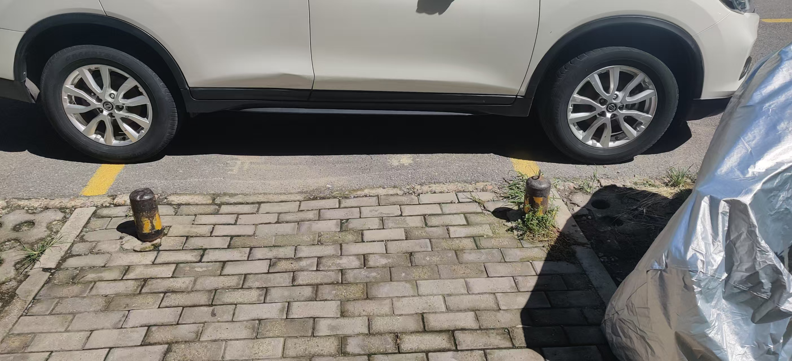

<!-- date: modify -->

### 宽带的边际成本

> 2025/05/28

本月宽带到期，计划趁机换个便宜的套餐。原来的资费是手机低消129¥/Month，包含1000M宽带，手机300分钟通话，30GB流量。然而移动APP和10086人工服务中查询的套餐价格都性价比不高，通过直接联系营业厅的人才发现一个合适的套餐59¥/Month，包含300M宽带，手机100分钟通话，20GB流量。

有两个道理：1）当网络的基础设施搭建好后，新增一个用户的边际成本为零，这必然导致价格的下降；2）如果一个边际成本为零的公示价格性价比不高，那么可能是因为垄断、信息不透明导致的。视频网站的会员也是一样的道理。

### 秦官方统一文字到小篆的失败

> 2025/09/24

秦官方想要统一文字到小篆，虽然小篆书写优美，但是其书写效率较低，后被隶书在实际上统一。这里有几点值得寻思：1）官方的人和民间的文人都会写字，但是文字的使用和推广上却不相同。官方推崇美的文字，民间推崇高效的文字。这两者无疑都是文字的重要属性，但是从大范围推广来说书写效率决定了推广的难易程度。简化、易用的文字比美的文字更能被广泛使用，是传播的底层规律。即，需要把握客观事实的规律，哪怕规律不符合人类对“好”的定义。2）认知的局限、位置的不同，可能会导致忽视客观规律。需要保持open的心态，接受新信息和新思想。3）代码和系统设计领域，好的架构或理想架构是可欲的，但是应用时要考虑客观规律，以符合当下业务、有限成本投入等客观条件，从务实的角度利用规律，不要违背它。

### 网信办开展2个月的“清朗 整治恶意挑动负面情绪问题”专项行动

> 2025/09/25

治理出发点是治理极端言论导致的对立。但是具体执行时可能面临以下问题：
1）一个观点必然有支持者和否定者，造成一定程度的不同群体的对立。即观点会导致群体对立是客观事实，观点和对立是一体双生的。
2）极端言论的判断标准并不明确，可能受意识形态、法治程度、人民开化程度、流弊影响等因素导致标准不统一。
3）执行过程中是否稳定性高于判断的准确性，扩大治理范围，从而导致正常的观点被遏制。
4）扼制语言表达，必然会扼制思想的传播和进化。文明的社会需要不同的观点和声音。如何在专项治理的同时不损害言论自由，具有很大的挑战性。
5）提高国民经济水平、受教育水平、逻辑思维能力，才是解决极端观点大行其道的根本方法。

### 区分好的决策和好的结果

> 2025/10/10

《清晰思考：将平凡时刻转为非凡成果》中关于好的决策和好的结果的案例论述。今天想到一个比较贴切的例子：

| 天气预报 | 是否带伞 | 是否好决策 | 是否有雨 | 是否好结果 |
| ---- | ---- | ----- | ---- | ----- |
| 有雨   | 带伞   | 好决策   | 有雨   | 好结果   |
|      |      |       | 无雨   | 坏结果   |
| 有雨   | 不带伞  | 坏决策   | 有雨   | 坏结果   |
|      |      |       | 无雨   | 好结果   |
| 无雨   | 不带伞  | 好决策   | 有雨   | 坏结果   |
|      |      |       | 无雨   | 好结果   |

事情的发展及结果，除受决策外，还受一些随机因素、外部因素等影响。好的决策可以增加好结果的概率，但无法保证好结果。反过来来说，好的结果不一定是由于好的决策导致的。如果把好结果错误的归因为是因为有好的决策，因此把这个错误决策思路和经验沉淀下来，就会对后面的同类事件产生负面影响。

### 近日爆火的个人动画与AI赋能

> 2025/10/13

最近有个B站up主依靠AI创作了一个爆火的动画《欺天道君》，很多人质疑都是AI味。我认为这可能正是AI赋予的技术平权，导致更多的创意以更低的成本和更小的周期得以涌现。让人从低水平的劳动中解脱，给创意和思考以更多的时间。科技不是完全较少劳动时间，而是提高有创意劳动时间的占比，改变个人时间的构成，放大想法的价值。

### 导盲犬被禁止进入

> 2025/10/27

昨天晚上听了一期关于盲人做客的讲述导盲犬相关的播客。其中提到某博物馆不允许导盲犬进入博物馆，但是工作人员会配同游览。在“明眼人”看来这已经提供了很大的便利，盲人应该会欣然接受。但是节目中盲人朋友却说这是不可接受的，是底线问题，往大了说涉及人权，往小了说这是区别对待。另外导盲犬也可能因分离焦虑出现应激。这种方式一旦被认可就会被效仿，成为事实上的规则，导盲犬到处被限行，也就失去了意义。

事实不是想当然，站在对方角度去看待问题和思考问题。例如，提到的科技界的导盲杖，遇到障碍时会大声量提示，导致使用者在公共场合极为尴尬，这种产品就没有考虑使用者的心理感受，那么也很难有市场。

另外，导盲犬实际的作用是避障，叫避障犬更合适。

### 如何看待陌生人的冒犯行为

> 2025/11/04

近日电车在小区充电时，被人中途拔掉了，导致没有充满。类似这样的事情小区的其他业主也遇到过，并在群里讨论过。我在想应该怎么样看待这种陌生人的非犯法的冒犯行为。之前看过的一本讲情绪管理的书里提到过，你不开心是因为你潜意识里认为所有人都应该按照你所想一样去行动，所以遇到开车加塞、闯红灯、拔别人插头的行为会感到愤怒。所以该书里提到，在每天出门前告诉自己，今天会遇到无礼的人，遇到坏人。

针对此类事情可以从另一个角度来看，陌生人是一个熟人之外的更大的群体，这个群体的素质参差不齐，有道德标准高的、有文化素质低的做些损人利己的事、有纯坏的会做些损人也不利己的事、有潜在的犯罪分子、甚至还有已经犯罪的人。这些人被我们统一认定为陌生人，是模糊的，有时也是危险的。如果对一个潜在的犯罪分子较真，其后果不堪设想。法律虽在，但无法阻止被伤害。

认识陌生人的多样性，可以更好的理解周边发生的事情，以更理性的心态看待。

### 单元门口的挡车立柱

> 2025/12/31

在今年7月底我晚上被单元门口的矮的的挡车柱绊倒，然后和管家和物业沟通让他换成高的立柱并且外移，来防止绊倒和禁止车停在单元门口。但是物业不作为，在大群里发声后，物业把矮柱子给锯了，算是达成了其中一个目的。

最近新的挡车柱达成了我当时的目的。看到这个柱子我想到之前看到的一个视频，一个业主被附近健身的大爷玩弄健身器材的噪声困扰，该业主自己买了点润滑油把器材润滑了下，解决了困扰的问题。

发散下思维，面对很难驱动第三方去改善来提升自己体验时，我们能做的其实有很多。比如，门前的立柱，其实可以自己买个立柱找个师傅装一下，100块钱的事。但是分明的权责思维导致并未想到或行动，从而长久忍受、习惯。
意识到“I can do something”，无法驱动环境他人改变时，多思考下我能做什么来改变，会有新的问题解决方法。
