### 央行的基础货币是怎么流入市场的
>本文主要摘录一个论坛的回复（[原贴地址](https://bbs.pinggu.org/thread-138208-1-1.html)），该贴说明了央行的基础货币是如何流入市场的，以及派生货币、货币乘数、央行资产负债表、分层货币的相关知识。可以阅读《货币金字塔：从黄金、美元到比特币和央行数字货币》了解货币历史、分层货币概念、比特币的影响。

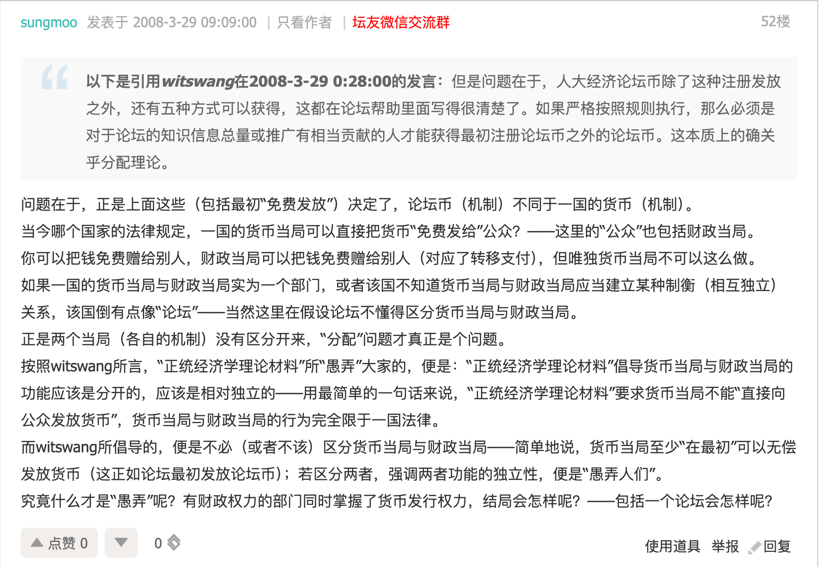

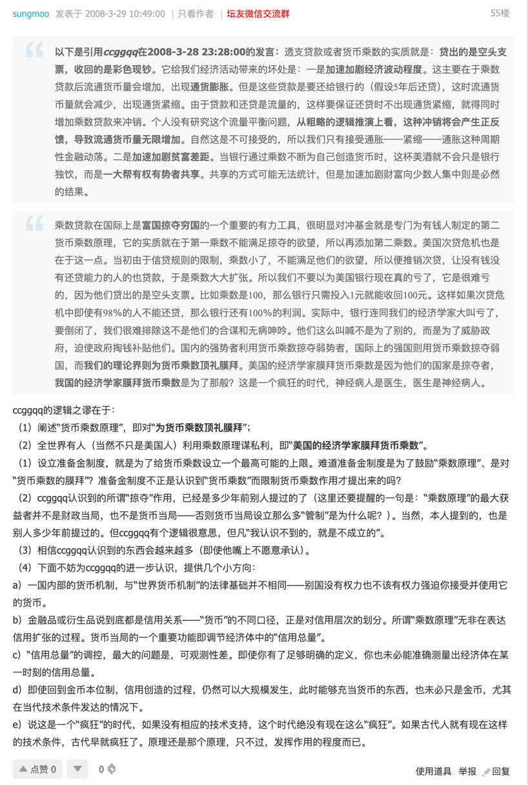

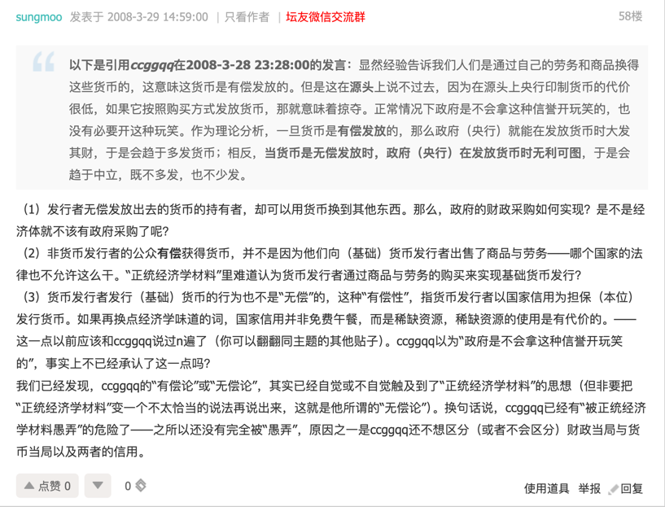

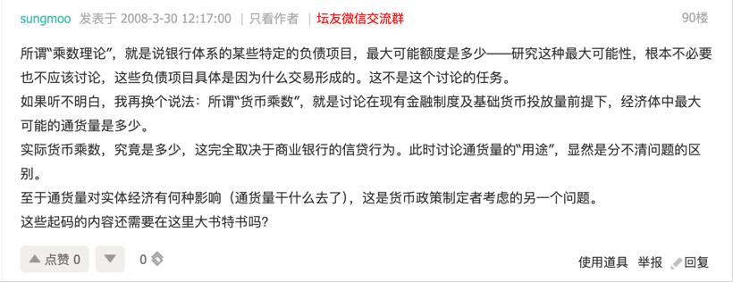

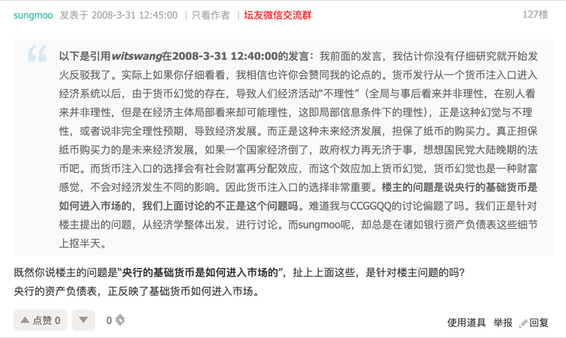
 

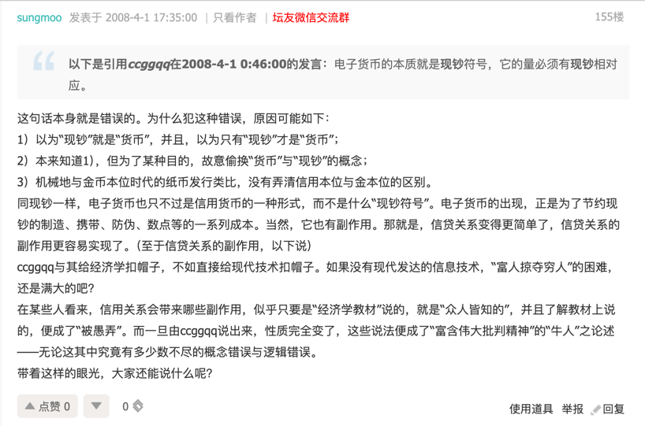

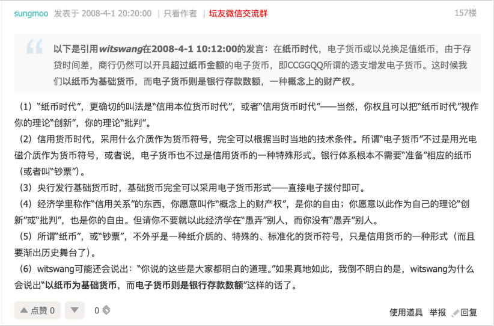

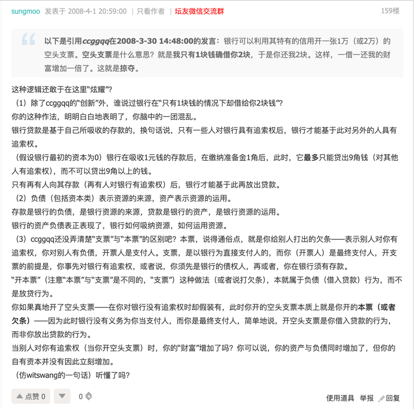

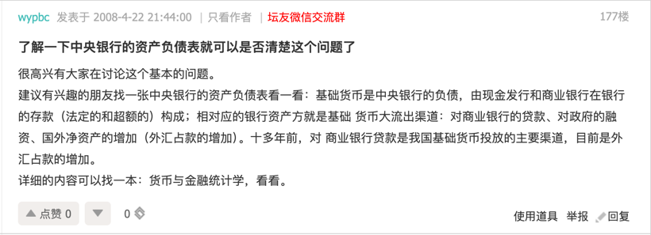

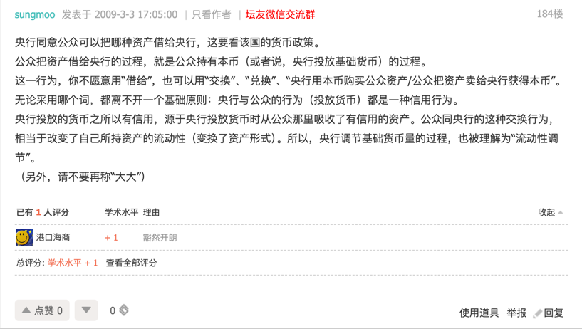

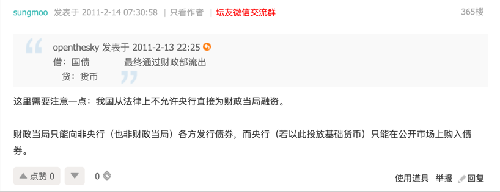

