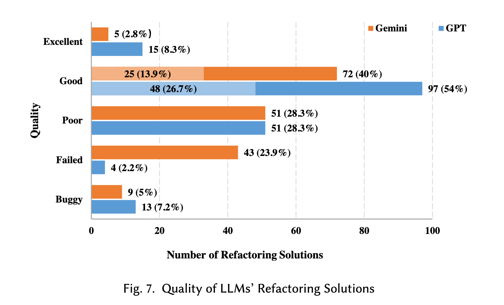
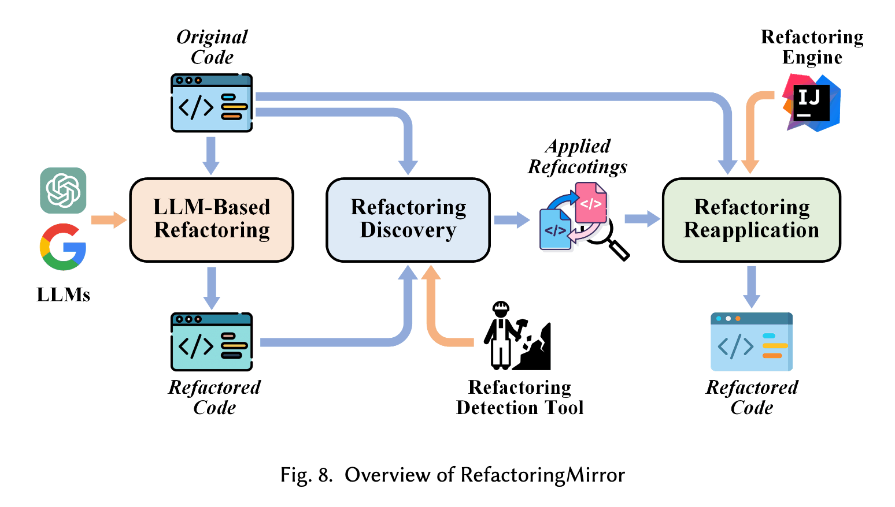
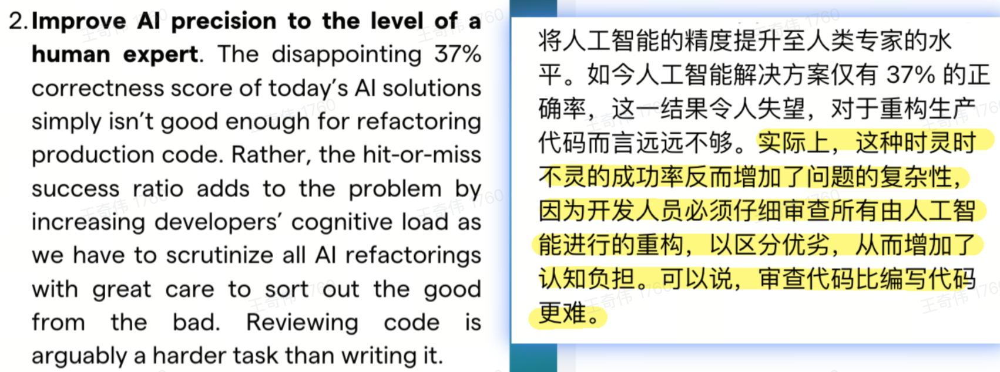
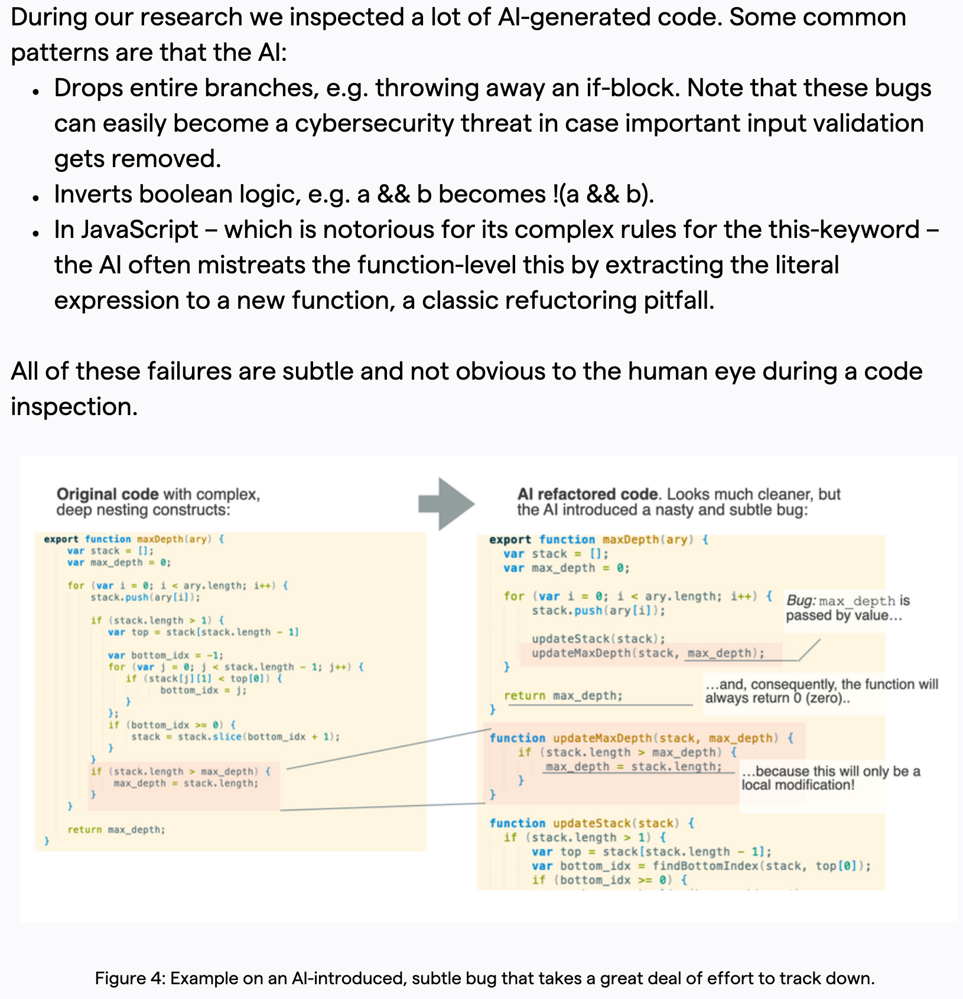

# 一、LLM重塑架构治理项的权重

随着cursor、trae等LLM IDE被程序员广泛使用，LLM承担了程序员的编程成本，而架构治理中目标为降低研发成本的治理项可能变得不再重要和必要。例如函数的认知复杂度，LLM能理解远超人类的上下文，可以快速理解函数的含义，甚至可以完成简单的需求开发。这时如果忽略LLM带来的变化，不调整治理项权重，那么必然会导致资源错位，沉没更多的机会成本。

除了对已有的治理项需要调低治理权重。LLM的应用可能会带来新的问题，这类问题可抽象的定义为基于模式生成代码的可用性问题。例如在使用LLM进行已有代码重构时出现的一些列badcase，见下表。这些问题随着LLM的应用，问题出现频次会在数量规模上放大，变成一个棘手的大问题。

| LLM重构复杂函数的BadCase | 详情                                                       | 严重等级  |
|:----------------- | -------------------------------------------------------- | ----- |
| 语法错误              | - 子方法入参类型推断错误<br/> - 删除已有函数，致其他go文件语法异常<br/> - 重复定义已有函数  | Fatal |
| 语义不一致             | - 控制逻辑不一致<br/>  - 丢失打点/日志代码<br/>  - 线程组使用有差异，致使并行度有差异    | Fatal |
| 引入异常代码            | - 新定义map，使用时未初始化<br/>  - 新增并发修改变量bug<br/>  - 修改/清空其他函数   | Fatal |
| 子函数风格             | - 重构不简约<br/>  - 过度抽象<br/>  - 常量替换为字符串<br/>  - 返回值存在冗余err | Warn  |

那么，架构治理项必然要随着LLM的应用而调整权重。其中一个调整思路为：由降低研发负担转目标变为提高LLM准确性和可用性的目标。

# 二、LLM重塑架构治理的思路

借助LLM强大的模式规律洞察能力可以节省研发一定的认知和操作成本，再辅以相关的tool建设、流程建设则可以进一步提高其在研发活动和生产活动中的使用效能。下面列举几个应用LLM进行架构治理的案例，供参考和发散。

## 2.1 复杂函数治理

### 2.1.1 相关研究

#### An Empirical Study on the Potential of LLMs in Automated Software Refactoring

> https://arxiv.org/pdf/2411.04444

原文提到：“在重构解决方案推荐方面，ChatGPT 为 180 个重构案例推荐了 176 个解决方案，其中 63.6% 的推荐方案与人类专家构建的方案相当，甚至更优。然而，ChatGPT 推荐的 176 个方案中有 13 个，Gemini 推荐的 137 个方案中有 9 个是不安全的，这些方案要么改变了源代码的功能，要么引入了语法错误，这表明基于 LLM 的重构存在风险。”具体见下图。



所以该团队提出了“RefactoringMirror”的检测与重新应用策略，来减少不安全的重构。该方案的流程如下，1）先让LLM对函数进行重构；2）通过重构检测工具检测出重构操作；3）使用Jetbrain IDEA工具的refactor tool对原函数相同类型的重构。



#### Refactoring vs Refuctoring: Advancing the state of AI- automated code improvements

> https://codescene.com/hubfs/whitepapers/Refactoring-vs-Refuctoring-Advancing-the-state-of-AI-automated-code-improvements.pdf

1）LLM重构函数的正确率较低



2）LLM重构函数的Badcase



3）fact-checking model

提出fact-checking model，验证重构的代码语义一致。（通过坏味道规则来检测）

#### refactoring-tools

> https://docs.vibe-coding-framework.com/refactoring-tools

提出建设重构工具集来应对重构场景，提高代码的可维护性。

### 2.1.2 治理思路：LLM plan + LSP action

1. 重构既有函数是研发非预期的工作，需要从研发的日常研发活动中抽取注意力成本。那么减小研发的确认成本和承担风险是驱动大范围重构的必要条件。

2. 基于LLM原理和已有的重构CASE发现如下问题，直接使用LLM重构和校验带来的确认成本和风险太高，难以大范围内推进。
   
     1. LLM在重构复杂函数时有较大概率会导致语义不一致，准确性不及预期；
   
     2. LLM验证重构结果时，仅有一定概率能发现问题，自我纠错能力较弱；
   
     3. LLM重构结果的badcase种类较多，通过准确规则 or TestCase 覆盖异常情况难度较大；

3. 可行思路：LLM重构 + LLM验证/规则验证 → plan by LLM + action by refactor tools

4. 验证思路：
   
     1. 修复gopls extract tools：[kivihub/tools](https://github.com/kivihub/tools/discussions/1)
   
     2. 使用user prompt指定extract tool
        
        ```text
        xxx/path/demo.go#demoFunction认知复杂度很高，通过extract function的方式去重构函数。按如下步骤进行重构：
        Step1：分析该函数，给出一个最优的需要被抽取为子函数的区间范围，格式为startline-endline。需要保证该范围是完整的ast block。注意，优先选择最大的区间范围。
        Step2：使用命令抽取子方法。gopls codeaction -w -exec -kind refactor.extract.function flow_control_1.go:{startline}-{endline+1}。注意结束行是endline+1。因为行范围是左闭右开。命令执行结束后，通过git diff查看新增的函数。新增函数应该为newFunction。如果失败请重试命令，重试时不改动参数。因为该操作开销较大，可能被kill，所以失败时需要重试。
        Step3：对抽取的新方法进行重命名，使其有意义。
        ```

## 2.2 服务耦合治理/强弱依赖/重复调用治理

此类治理可以使用LLM定位和下钻分析具体代码，并给出详尽的分析报告。

TODO：待后续有实践时，丰富案例。

# 三、LLM驱动架构治理的关注点

1. 驱动点
   
     - 成本要小：架构治理对研发而言是需求之外的任务，是附加给研发的任务。那么治理项减小研发修改成本、修改风险是根本要求。
   
     - 收益要多：性能、稳定性、合规。

2. 突破点：把一个有驱动力的治理项能力优化到极致，提高平台的认知度。聚焦把一个点做好，做到极致，然后再开放给用户。
   
     - 治理项不要太泛化，架构治理方面泛化意味不精，很难击中用户痛点。建设有明确目标的，痛点驱动的，极致好用的功能。
   
     - 尤其是，架构治理属于偏离线性任务，不在研发活动的动线上。只有高价值功能才能吸引用户。

3. 发挥LLM长处：处理大数据分析和洞察的难点
   
     - 认识到Agent的擅长点，有目的性的节省相应方面的人力
   
     - AI与准确性的博弈：使用AI进行治理不能停留在可用阶段，有些治理项需要极高的准确性，否则，就会将确认成本转嫁到研发，从而降低研发的使用意愿。
   
     - AI as Architect，AI即架构师。帮助去洞察问题，修复问题。
