| 日期         | 修订内容       |
|:---------- |:---------- |
| 2024/11/19 | 初稿         |
| 2025/01/16 | 更新“审查数据”章节 |
| 2025/02/11 | 更新“数据分析”章节 |

## 一、小数决策

进入移动互联网时代后，信息爆炸和知识膨胀，导致人们获取讯息和数据的途径变多、成本变低，更多种类、更多数量的数据被认为是一种数据资产。很多大公司都希望能从数据资产中发现某些规律，去发掘更多的企业增长信息。例如，大数据课程必提及的啤酒和纸尿裤的故事。很多企业高管反应企业的困境并不是缺少可靠的数据，而是难以从数据中发现问题，以及将分析转化为洞察和行动。

> ***成功的决策者绝非拥有卓越的分析能力，却能在数据、经验和直觉之间取得平衡，迅速整理信息、做出判断、深入审视数据、形成敏锐的洞察力。他们知道决策不仅仅需要数据，因此不会沉迷于数据分析。他们运用一阶原理来理解一个决策是什么，为什么必须做出这个决策，以及这个决策想达到什么目的。然后他们寻找相关数据来帮助自己做出这个决策。简而言之，他们能利用不完整的信息做出明智的决策。***

小数决策的核心方法有两个：逆向工作法和IWIK。

### 1.1 逆向工作法

> ***逆向工作法的核心思想是决策驱动流程，而非数据驱动流程。***

在工作中经常会见到有些人、有些部门强调要“通过数据驱动某某某”。初衷是期望通过客观的数据来帮助决策，但有时却并不能很好的平衡直觉、经验和数据。

他们有时会过分相信经验和直觉，主观性的带着结论去分析、解释客观的数据，这导致很难去发现正确的结论。<u>**这种把数据当做证实“预设结论”的工具，得出错误结论的过程也被称为证实性偏差**</u>；他们有时会过分相信数据，沉迷于数据分析中。例如，通过不严谨的数据采样和数据分析方法得出不符合直觉的结论。他们期望的流程是：搜集数据→分析数据→产出分析结论→驱动决策流程。这可能会导致：

1）追求更多的数据：由于收集数据前没有明确问题边界，所以对需要的数据也很模糊。为了避免遗漏大概率会追求更多的数据，不可避免的收集到与决策无关的噪声数据，导致浪费成本且带来分析的噪声。2）追求更精细的数据：在不同的项目阶段，对数据的精细度要求是不同的，少量的数据加上猜估法在某些时候也可以帮助决策。3）分析数据时由于没有目标，可能会陷入各种相干性的分析过程中，导致进行太多无关的分析和决策。

这种期望从数据为起始点去发现未知的问题的流程，不高效也不科学。作者推荐使用逆向工作法来平衡决策过程中的直觉、经验和数据。<u>**这个概念来自逆向市场研究方法，从待定的决策入手逆向回推，以便收集和分析市场研究数据。它强调先基于要解决的问题和要达到的目标构建一个决策树，其中某些节点需要去搜集数据，并通过数据的分析结果导向不同的分支**</u>。

逆向工作法强调先有决策思路，然后按需的去搜集相干的数据，避免漫无目的的搜集数据、分析数据带来的成本。针对结论先行可能会导致的证实性偏差，则通过完备决策树，丰满概率枝来解决，这会让自我意识到结论的多样性，避免先入为主。决策树见下图：
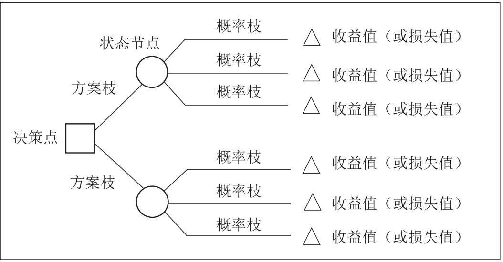

#### 费米问题/猜估法

> 一个经典的费米问题“在芝加哥有多少钢琴调琴师”正是由费米本人提出的。它的估计流程如下：
> 
> 1. 大约有9,000,000 人生活在芝加哥。
> 2. 在芝加哥平均每个家庭有2个人。
> 3. 大约在20个家庭中有1个家庭需要定期钢琴调音。
> 4. 定期调琴的钢琴每年需要调整一次。
> 5. 每个调琴师大约需要2小时调琴，包括路上时间。
> 6. 每个调琴师每天工作8小时，一周5天，一年50周。

**每年在芝加哥需要调整的钢琴数量是：**

(9,000,000 人在芝加哥) / (2 人/家) × (1 架钢琴/20 家) × (1 架钢琴调整/1年) = 225,000 架钢琴在芝加哥每年被调整。

**每个调琴师每年可以调整的钢琴数量是：**

(50 周/年)×(5 天/周)×(8 小时/天)/(1 架钢琴/2小时) = 1000 架钢琴每年/1名调琴师。

**芝加哥调琴师数量：**

(225,000 架钢琴在芝加哥每年被调整) / ( 1000 架钢琴每年/1名调琴师) = 225名调琴师在芝加哥。

而实际上，一共有大约290名调琴师在芝加哥，与估计的225名调琴师相差不大。

如上所述，对于一个典型的费米问题，它的估计流程包括一系列估算，并将估算的结果相乘。之所以能得到如上准确的答案，并不是因为每一步都能准确的估计，而是因为高估的数值与低估的数值在相乘时，影响会被彼此抵销。

### 1.2 IWIK

> ***IWIK is short for 'I Wish I Knew'.***

IWIK是指在分析问题和收集数据之前，提前问自己：“如果要解决这个问题，我需要知道哪些信息？”。这有点像之前提到过的“事前验尸法”。在数据收集前，通过该提问来界定问题的范围，圈定要获取的信息范围。

## 二、审查数据

### 2.1 数据可视化与直觉

利用数据可视化工具，把数据进行图表化，可以更好地利用直觉去发现规律，如识别异常点、变化趋势等信息。

#### Julia

1. [Julia中文社区](https://cn.julialang.org/)：Julia是一个高性能语言，广泛用于科学计算，有各种数学库、数据处理工具和用于通用计算的包。
2. [Gadfly.jl](https://github.com/GiovineItalia/Gadfly.jl)：使用Julia写的图形库。
     * 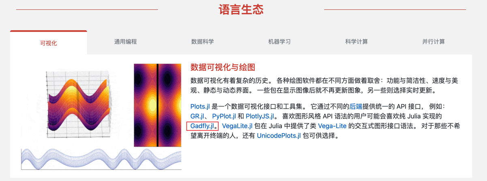
3. [plutojl](https://plutojl.org/)：Julia编程环境-IDE。

### 2.2 评估数据有效性

当收集到数据后，在分析数据之前要评估数据的有效性和合理性。以下是几个价值的提问，这些提问涉及到信息有时候不会进行显示声明，可能被有意或无意的被隐藏，所以可能需要一定的成本才能获取准确的答案。

#### 提问1：数据可信度 | 数据的来源是什么？

数据来源决定了数据的可信度、完整度和有效性。例如，有利益冲突的数据提供方所提供的数据，就可能存在欺瞒、粉饰的可能，可信度就较低。

#### 提问2：数据采样方式 | 数据是何时何地收集的？

我们可以通过数据的采集方式来评估数据的有效性。如数据的样本大小、采集时间、采集成本、采集对象。

国家统计局根据全国城乡居民家庭消费支出的抽样调查资料统一确定商品和服务项目的类别，设置包括：食品烟酒、衣着、居住、生活用品及服务、交通通信、教育文化娱乐、医疗保健、其他用品及服务八大类268个基本分类，基本涵盖了城乡居民的全部消费内容。全国抽选约500个市县，确定采集价格的调查网点，包括食杂店、百货店、超市、便利店、专业市场、专卖店、购物中心、农贸市场、服务消费单位等共6.3万个。其次，按照“定人、定点、定时”的方式，统计部门派调查员到调查网点现场采集价格。目前，分布在全国31个省（区、市）500个调查市县的价格调查员共4000人左右。价格采集频率因商品而异，对于CPI中的粮食、猪牛羊肉、蔬菜等与居民生活密切相关、价格变动相对比较频繁的食品，每5天调查一次价格；对于服装鞋帽、耐用消费、交通通信工具等大部分工业产品，每月调查2-3次价格；对水、电等政府定价项目，每月调查核实一次价格。最后，根据审核后的原始价格资料，计算单个商品或服务项目以及268个基本分类的价格指数。然后根据各类别相应的权数，再计算类别价格指数以及CPI。

#### 提问3：数据完整性 | 缺少了什么？还有其他的相关数据吗？我没有看到的数据和我看到的数据相似吗？

> ***一叶不一定知秋。***

数据的样本大小和分布决定了数据的质量，错误的采样可能导致“伯克森悖论”，也就是幸存者偏差。下图来自《隐藏的潜能》有异曲同工之妙，局部的数据是减小的，全局的数据是增长的，如果只采样到局部的数据，而忽略了全局的数据就会导致得出错误的结论。

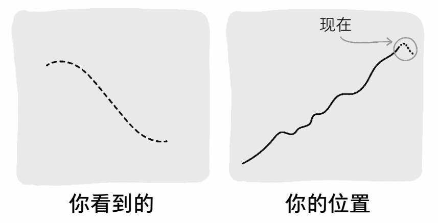

二战期间，为了加强对战机的防护，英美军方调查了作战后幸存飞机上弹痕的分布，决定哪里弹痕多就加强哪里。然而统计学家沃德力排众议，指出更应该注意弹痕少的部位，因为这些部位受到重创的战机，很难有机会返航，而这部分数据被忽略了。

沃德（Abraham Wald）是哥伦比亚大学统计学教授，是统计决策理论和序贯分析的创始人之一。沃德针对联军的轰炸机遭受攻击后的数据，进行研究后发现：机翼是最容易被击中的位置，机尾则是最少被击中的位置。沃德的结论是“我们应该强化机尾的防护”，而军方指挥官认为“应该加强机翼的防护，因为这是最容易被击中的位置”。沃德坚持认为：（1）统计的样本，只涵盖平安返回的轰炸机；（2）被多次击中机翼的轰炸机，似乎还是能够安全返航；（3）而在机尾的位置，很少发现弹孔的原因并非真的不会中弹，而是一旦中弹，其安全返航的概率就微乎其微。

军方采用了沃德的建议，并且后来证实该决策是正确的，看不见的弹痕却最致命。它说明了统计分析中的“幸存者偏差”（survival bias）问题，那就是我们只看到了那些能够飞回来的飞机，而看不到那些被击落而没能飞回来的飞机。所以，只是根据“幸存者”的数据做出的判断很有可能是不正确的。

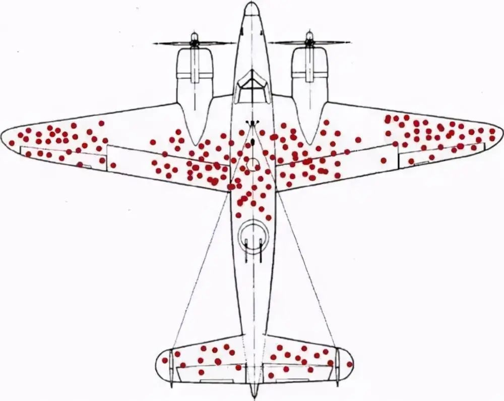

一个餐馆经常收到菜过咸的反馈，当厨师调整过后发现饭店的人数更少了。其原因是：反馈的是少数人，大部分人觉得口味刚好并不会反馈。餐馆没有意识到这些无回应者，最终做了错误决策。**<u>建议：在拿到数据后，先检查是否包含了无回应者。</u>**

在工作中我们经常会因为聚焦问题而容易忽略这一点。2024年的废弃静态代码治理项目中，为了提高废弃代码下线的比例，对工单未覆盖的服务、失败工单和取消工单进行了数据采集和分析。有个取消工单的原因是“自动合入工单可能会给核心服务带来风险，故取消工单”。这时如果没有意识到自己看到的只是取消工单的数据，就很可能会支持“自动合入工单类型转为手动合入”。在决策前自问下：“有没有缺少了什么？有哪些数据我没看到”，就会发现成功工单的数量远大于取消工单数量，并且把自动工单切换为手动合入后必然会导致合入率下降（自动工单合入率为80%，手动工单的只有50%）。

#### 提问4：数据分布 | 数据线性均匀分布，还是幂律、正态分布

观测采样数据的分布是否符合整体数据的分布规律，有两个考量：1）评估采样数据是否合理；如错误采样导致的伯克森悖论。2）评估指标定义是否合理；如果数据呈现幂律分布那么就要警惕使用均值计算。

#### 提问5：计算口径 | 数据/指标是如何计算的？

了解数据计算口径，评估公式合理性、计算复杂度、理解复杂度。数据是否有约束条件或前置条件，这些条件是否合理、是否显式。

例如，架构度量指标“重复MR占比”的计算口径为：MR涉及的变更函数中如果存在重复函数，就定义为重复MR。统计一段时间范围内的重复MR的数量占比作为“重复MR占比”。指标计算比较清晰，且很容易公式化，但是其隐含了一些条件，如：a.重复函数的判定范围（是判断MR修改的函数在仓库范围内有重复，还是判断MR修改的函数中是否有重复的）；b.重复函数的检查规则（文本相似度、AST相似等）；c.相似度阈值（忽略行数较少重复的阈值，认定为重复的阈值等）；d.计算频次(每个MR Commit计算一次，还是时间窗口的结束点计算一次)等。这些隐含条件会包含在计算程序中，但不一定会包含在指标的定义说明中，在理解计算口径时务必对描述中的每个名词有准确的理解。

#### 提问6：异常值 | 数据和指标是否存在异常值？

数据/指标的异常值是发现数据采集、计算偏差的一个很好的方式。这些异常值可能体现为空值、零值、非预期的负值（如年龄）、非预期的数据范围（如年龄超过200）。观测时可以重点关注最小值、最大值、平均值、中位数、维度下钻、数据分布等。

#### 提问7：对比 | 与相关性和可比性的替代物进行比较

相关性和可比性的替代物有：竞争对手的数据、不同时间的数据/历史数据、不同采样大小/范围的数据等。通过横向或纵向的比较，可以观测出数据是否准确，甚至可以对未来进行预测。

### 2.3 数据压测

如果数据对应一个表格或者程序，可以进行设置和调试。尝试设置一些边界值（如0，1，无穷大），来验证数据的合理性。

## 三、数据分析

> *《小数决策》并未讨论以下内容，此处为了论述的系统性特而增加此节补充。*

### 3.1 警惕伯克森悖论

**伯克森悖论：两个通常独立的事物会在特定场合下关联起来，由此产生的相关性容易带来认知上的偏差。**

> **百度百科**
> 
> 伯克森悖论是美国医生和统计学家约瑟夫·伯克森在1946 年提出的一个问题。他研究了一个医院中患有糖尿病的病人和患有胆囊炎的病人，结果发现患有糖尿病的人群中，同时患胆囊炎人数较少；而没有糖尿病的人群中，患胆囊炎的人数比例较高。这似乎说明患有糖尿病可以保护病人不受到胆囊炎的折磨，但是从医学上讲无法证明糖尿病能对胆囊炎起到任何保护作用。他将这个研究写成了论文《用四格表分析医院数据的局限性》 ，并发表在杂志《生物学公报》上，这个问题就称为伯克森悖论。

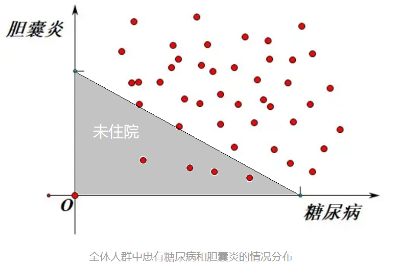

> 引自：[Berkson‘s Paradox|BrilliantMath&ScienceWiki](https://brilliant.org/wiki/berksons-paradox/)
> 
> 大学根据许多属性挑选学生。在美国，两个常考虑的属性是高中GPA和SAT分数。这两者呈正相关，因此人们会期望在同一所学校内它们也会呈正相关。然而，并非一定如此。
> 招生委员会接受那些有足够高GPA、足够高SAT分数或两者结合的学生。然而，那些既有高GPA又有高SAT分数的申请者可能会进入更高级别的学校，即使被录取也可能不会选择去那里。实际上参加学校的学生范围由引言中的蓝点表示。这些点显示了一个向下的趋势，尽管整体人口（红点和蓝点）显示了一个向上的趋势。这种趋势逆转就是“悖论”，尽管实际上并没有什么真正悖论的地方。这是在审查的人群中GPA和SAT分数之间的权衡结果。
> 在示例图中，两条线是明确的分界线：低于下线的人没有被录取，高于上线的人决定不参加。然而，如果它们是概率性的，那些整体GPA + SAT分数更高的人更有可能参加，那么效果就不会那么激烈。这两条线也相对靠近。如果它们足够远，以至于只有那些分数非常低的学生被拒绝，只有那些分数非常高的学生被录取，那么在学校的学生之间仍然会存在正相关性；只是这种相关性不会像所有学生那样大。

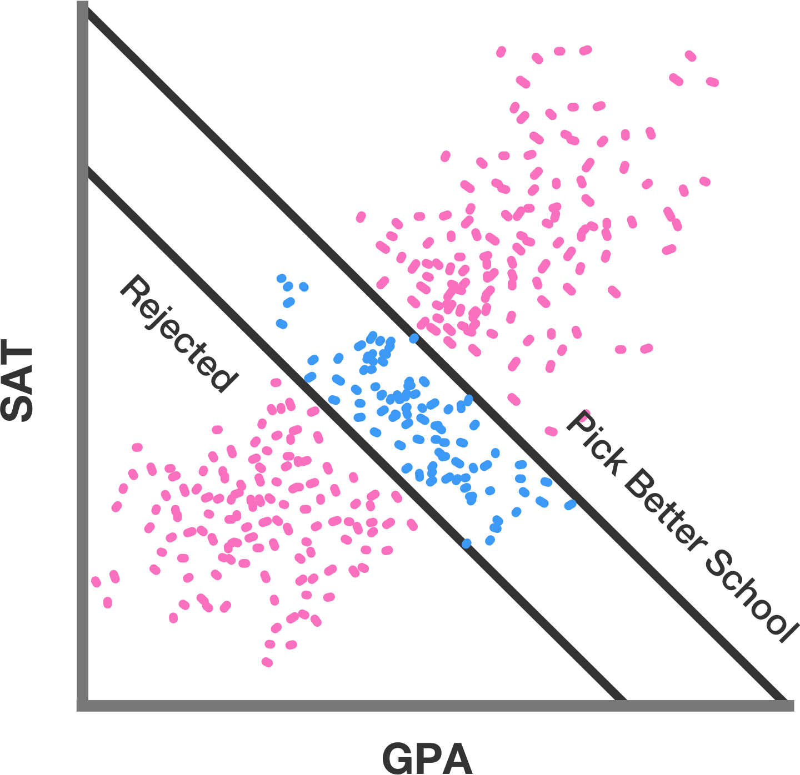

### 3.2 警惕辛普森悖论

> 引自：[知乎 - 统计因果推理入门](https://zhuanlan.zhihu.com/p/571180079)

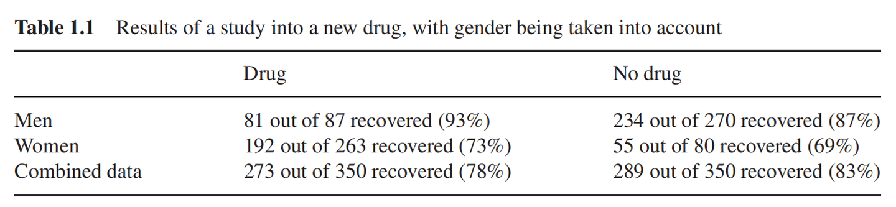

> 总体表现来看，服用药物的患者，痊愈率低于未服药的患者，但是按照男性女性划分数据后，又得出了相反的结论。这个统计结果似乎告诉我们，知道患者性别可以开出药物，否则就不能，这显然是荒谬的。那么药物是否有效，我们是应该采信总体的统计结果还是每个性别单独的统计结果呢？要了解背后的原因，我们唯有借助于因果这一工具。
> 
> 例如，假设我们知道：雌激素对于患者痊愈有负面效应，那么不论服药与否，女性患者都比男性患者更难痊愈。另外，从样本数据来看，女性患者更倾向于被选中服用药物，所以随机选择一名服药者，这个人更可能是女性，与不服药比，服药者更偏向于未痊愈。因此为了评估有效性，我们应该比较同一性别的受试者，以控制雌激素的影响。

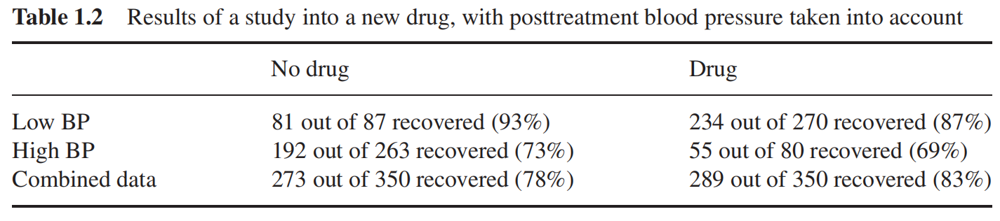

> 我们在这个表中，把分类标准从性别改为了血压的高低。同样的，整体看来，服用药物痊愈率更高，但是在高血压和低血压群体内部，我们却发现，不服用药物痊愈率更高，此时我们应该信任哪组统计结果呢？
> 
> 在这个案例中，假设我们知道药物会通过降低患者的血压来影响痊愈率，但是同样会产生副作用。那么在这个例子中，由于降低血压是药物影响痊愈率的结果之一，那么基于血压分类便没有意义了。（如果再治疗前便记录血压，且假定只有血压对治疗有影响，那么情况又将不同了）。

第一张表，应该基于分组数据；第二张表，应该基于汇总数据；

### 3.3 警惕相干性

> *睡醒后人会感到饥饿，不能得出睡眠会导致饥饿。*

知乎：[百度指数诗歌这个词为什么在每年十一月二十多号的时候出现急速增加的趋势，这几天有什么重要的日子嘛？](https://www.zhihu.com/question/48611508/answer/117529088)

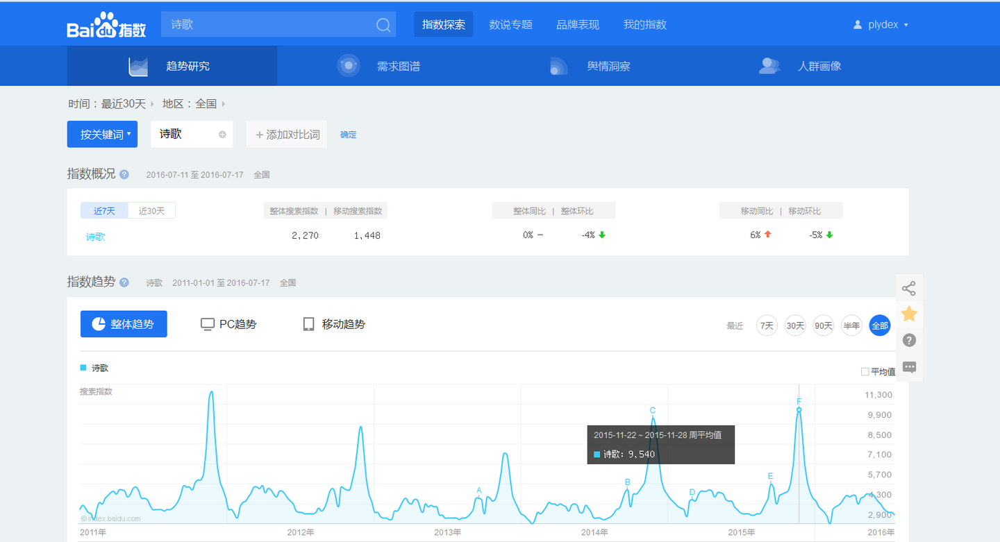

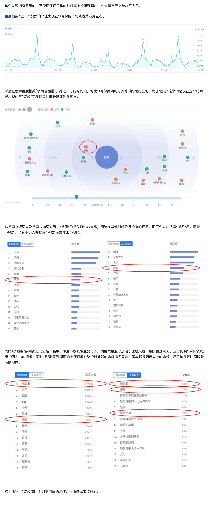

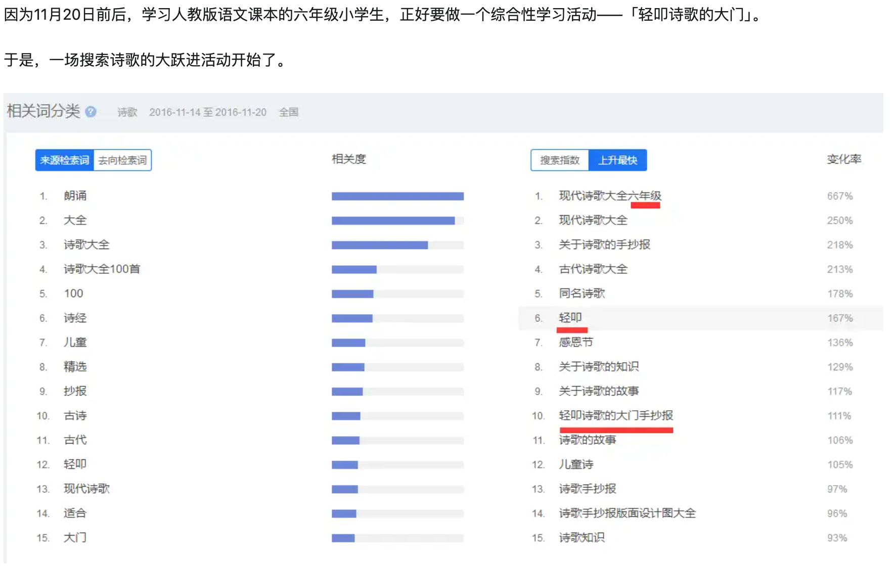

### 3.4 数据归因

> 不要用数据去解释数据，数据的变化需要归因到具体的业务变化。

推荐使用拆解的方式去分析和归因，拆解法同样可用于指标制定、数据预测。