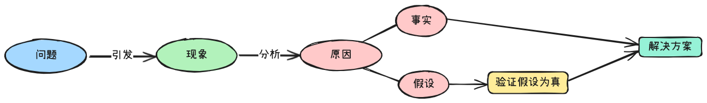

> Created At: 2025/06/27

### 旧的假设

这个文档也算是2025Q2针对问题函数治理的CI卡点方案的复盘。CI卡点方案开发了近一个季度，目前在3个试点业务线进行了启用，但是卡点数据不符合预期。具体而言是卡点的跳过率高达90%，且有业务线因业务迭代压力大把卡点又禁用了。

该方案基于两个假设：

* 业务侧有诉求和意愿：存量治理时有3个业务POC反馈，希望能增加CI卡点来增量的去治理问题函数。因为存量治理负担太大，研发没有整块的时间去治理。

* MR卡点拦截率不高，研发对这种低频的、有明确年度目标的优化项有改造的意愿。

指标的结果证明这两个假设为假。通过对跳过的MR进行分析，发现这些MR涉及的问题函数有以下特征：

* 高复杂函数：用户修改行数少，表现为修改某个if条件、修改某个if块、修改某个case when、增加日志等。

* 重复函数组：框架类代码较多，工具误报率高。

需要补充的是高复杂函数往往是多人修改，函数复杂度是随时间逐渐劣化的，属于典型的公地悲剧。研发都希望优化该函数，但不希望自己去优化。

### 新的假设

问题函数的治理本质是工程师文化的规则化落地，研发修改意愿不高的本质是这件事情不足够重要/收益不明朗。当然，我们可以采取自上而下的强制推改，结合红黑榜给研发压力，但是这种牺牲credit的行为无法长久，不适合做常态化的治理机制。

基于废弃代码治理过程我们验证了一个假设：下线废弃代码即使对研发开发体验提升不明显，但是工具侧自动下线代码和研发只负责确认，是可以达到公司范围推改的。

基于这个假设，针对问题函数的治理可以延伸出两个新的假设：

* LLM工具自动进行函数修复，研发只负责确认。可以提高治理率。

* LLM工具的重构结果准确度高，研发确认成本低。

### 验证假设

旧的假设没有做快速验证，出现了结果不符合预期的情况出现。针对新的假设，我们需要进行小成本验证。验证思路为挑选合作业务线的问题函数通过LLM进行重构，然后发起MR，和研发一起CR。从中验证新的假设：工具的准确度、研发的合入意愿。

验证通过后，再考虑自动化、流程化、平台化。

### 总结

对项目立项的原因/充分条件进行分析，区分哪些是假设，哪些是事实。对其中的假设进行显示声明和有步骤的验证。假设验证通过后，再进行详细的方案设计、自动化、流程化、平台化。大前研一在《思考的技术》中有几段话与本文相契，见下面引用。

**区分假设和结论**

> 不要把假设和结论混为一谈。
> 
> 分析数据后所整理出来的资料，只不过是假设。但是大部分企业经营者或工商业者，就把这个假设当结论了。

**区分现象和原因**

> 他们所罗列的问题只不过是现象，而逆转现象并不是解决方案。只看到现象，绝对无法找出问题的真正原因以及能够对症下药的解决方法。日本在研讨各种议题的时候，十之八九都无法区别现象和原因，因为参与议题研讨的人根本就不具备正确的思路。 
> 
> 不可仅凭现象做判断。会发生某种现象，一定有其原因。但是懒得找原因，只以现象做判断，提出解决方法，这种解决方案绝不会是正确的。

**思考习惯**

> 卡宁厄姆自英国有名的贵族学校伊顿公学（Eton School）毕业后，考进了剑桥大学，是位非常典型的优等生，他对逻辑构成、重点分析都执行得非常透彻而深入。就连在一般对话时，不论我说什么，他都会咄咄逼问：“有何证据？”“你是基于什么分析而这么说的？”“为什么会有这个结论？”当时我并不了解公司其他人的做法，所以下意识地认为这应该就是麦肯锡式的做法，后来才知道，事实上根本不是这么回事。
