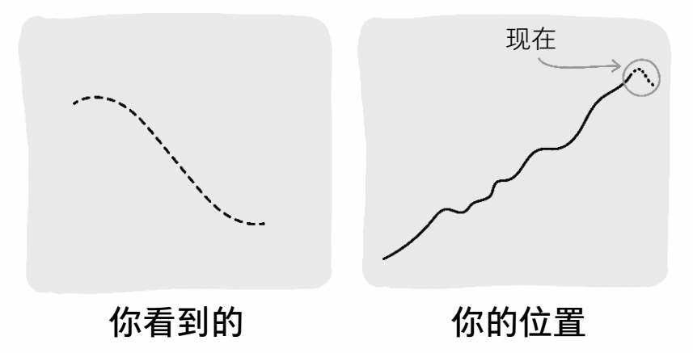
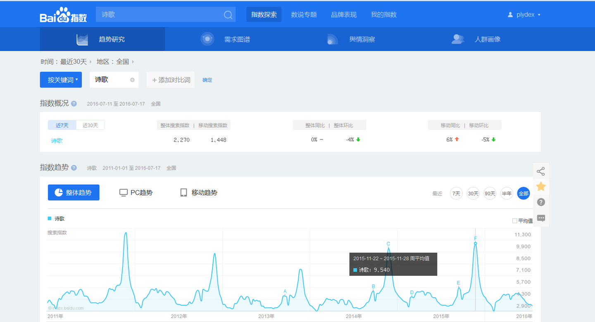
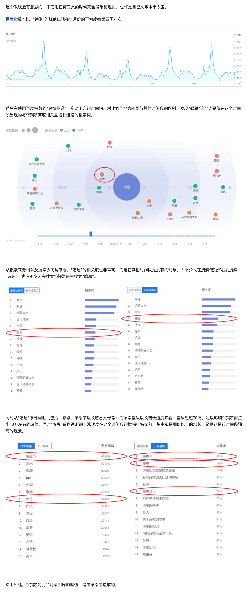

| 日期         | 修订内容       | 备注  |
|:---------- |:---------- | --- |
| 2024/11/19 | 初稿         |     |
| 2025/01/16 | 更新“审查数据”章节 |     |

## 说明

本文是在阅读《小数决策》后，发现书中的决策思路和数据审查有很高地参考价值，故结合平时的案例对相关原则进行阐释，促成此文。这个过程很像《这样读书就够了》提到的拆书法，以及《好好学习：个人知识管理精进指南》提到的对临界知识的反思过程。

## 一、小数决策

进入移动互联网时代后，信息爆炸和知识膨胀，导致人们获取讯息和数据的途径变多、成本变低，更多种类、更多数量的数据被认为是一种数据资产。很多大公司都希望能从数据资产中发现某些规律，去发掘更多的企业增长信息。例如，大数据课程必提及的啤酒和纸尿裤的故事。目前相较于缺乏可靠的数据，企业高管反应企业常见的不足之处是难以发现问题以及将分析转化为洞察和行动。

> ***成功的决策者绝非拥有卓越的分析能力，却能在数据、经验和直觉之间取得平衡，迅速整理信息、做出判断、深入审视数据、形成敏锐的洞察力。他们知道决策不仅仅需要数据，因此不会沉迷于数据分析。他们运用一阶原理来理解一个决策是什么，为什么必须做出这个决策，以及这个决策想达到什么目的。然后他们寻找相关数据来帮助自己做出这个决策。简而言之，他们能利用不完整的信息做出明智的决策。***

小数决策的核心方法有两个：逆向工作法和IWIK。

### 1.1 逆向工作法

> ***逆向工作法的核心思想是决策驱动流程，而非数据驱动流程。***

在工作中经常会见到有些人、有些部门强调要通过数据驱动XXX，期望通过客观的数据来帮助决策，但他们有时并不能很好的平衡直觉、经验、数据的平衡。这种把数据当做证实预设结论的工具从而得出错误结论的过程也被称为证实性偏差。

他们有时会过分相信经验和直觉，主观性的带着结论去分析、解释客观的数据，这导致很难去发现新的结论；有时会过分相信数据，沉迷于数据分析中。例如，通过不严谨的数据采样和数据分析方法得出不符合直觉的结论。他们期望的流程是：搜集数据→分析数据→产出分析结论→驱动决策流程。这会导致：1）收集到了决策用不到的噪声数据，会浪费成本且带来分析的噪声；2）在不同的项目阶段，对数据的精细度要求是不同的，少量的数据加上猜估法在某些时候也可以帮助决策。3）分析数据时由于没有目标，可能会陷入分析各种相干性的过程中，进行太多无关关键决策的分析。这种期望通过数据去发现未知的问题的流程，不高效也不科学。例如，在业务架构度量项目中就期望通过定义度量指标去发现潜在的未知问题，由于因果导致，由于不清楚到底要解决什么问题，所以导致指标数量膨胀，最后的有效率也较低（约13%）。

为了能平衡决策过程中的直觉、经验和数据，可以使用逆向工作法。这个概念来自逆向市场研究方法，从待定的决策入手逆向回推，以便收集和分析市场研究数据。**它强调先基于要解决的问题和要达到的目标构建一个决策树，其中某些节点需要去搜集数据，并通过数据的分析结果导向不同的分支**。也就是：先有决策思路，然后按需的去搜集相干的数据，这避免了漫无目的的搜集数据、分析数据带来的成本。

针对结论先行可能会导致的证实性偏差，逆向工作法可以通过完备决策树，丰满概率枝来解决，这会让自我意识到结论的多样性，避免先入为主。决策树见下图：

### 1.2 IWIK

> ***IWIK is short for 'I Wish I Knew'.***

IWIK是指在分析问题和收集数据之前，提前问自己：如果要解决这个问题，我需要知道哪些信息。这有点像之前提到过的“事前验尸法”。在数据收集前，通过该提问来界定问题的范围，圈定要获取的信息范围。

## 二、审查数据

### 2.1 数据可视化与直觉

可以通过一些可视化工具，把数据进行图表化，可以更好地利用直觉去发现规律，如识别异常点、变化趋势等信息。

### 2.2 评估数据有效性

当收集到数据后，在分析数据之前要评估数据的有效性和合理性。以下是几个价值的提问，这些提问涉及到信息有时候不会进行显示声明，可能被有意或无意的被隐藏，所以可能需要一定的成本才能获取准确的答案。

#### 提问1：数据可信度|数据的来源是什么？

数据来源决定了数据的可信度、完整度和有效性。例如，有利益冲突的数据提供方所提供的数据，就可能存在欺瞒、粉饰的可能，可信度就较低；国家统计局和地方统计局所提供数据因不同的样本数量，在使用时就会具备不同的可信度。

#### 提问2：数据采样方式|数据是何时何地收集的？

我们可以通过数据的采集、校准、维护的难度，结合提供方的人力投入来评估数据的可信度等级。另外需要注意两点：数据样本是否足够得到有效的结论、采集样本是否均匀（即是否能反应整体的情况）。国家统计局就需要4千人来采集CPI相关的数据。

> 国家统计局根据全国城乡居民家庭消费支出的抽样调查资料统一确定商品和服务项目的类别，设置包括：食品烟酒、衣着、居住、生活用品及服务、交通通信、教育文化娱乐、医疗保健、其他用品及服务八大类268个基本分类，基本涵盖了城乡居民的全部消费内容。全国抽选约500个市县，确定采集价格的调查网点，包括食杂店、百货店、超市、便利店、专业市场、专卖店、购物中心、农贸市场、服务消费单位等共6.3万个。
> 
> 其次，按照“定人、定点、定时”的方式，统计部门派调查员到调查网点现场采集价格。目前，分布在全国31个省（区、市）500个调查市县的价格调查员共4000人左右。价格采集频率因商品而异，对于CPI中的粮食、猪牛羊肉、蔬菜等与居民生活密切相关、价格变动相对比较频繁的食品，每5天调查一次价格；对于服装鞋帽、耐用消费品、交通通信工具等大部分工业产品，每月调查2-3次价格；对水、电等政府定价项目，每月调查核实一次价格。
> 
> 最后，根据审核后的原始价格资料，计算单个商品或服务项目以及268个基本分类的价格指数。然后根据各类别相应的权数，再计算类别价格指数以及CPI。

数据何时采集及数据采集周期也至关重要，因为历史数据可能有时效性/区域性等限制的。例如在服务治理时，不能基于1小时前的数据来做限流，也不能基于年度更新的服务数量对服务增长进行归因。

#### 提问3：数据完整性|缺少了什么？还有其他的相关数据吗？我没有看到的数据和我看到的数据相似吗？

> ***一叶不一定知秋。***

数据的样本大小决定了数据的质量，错误的采样可能导致“伯克森悖论”，也就是幸存者偏差。下图来自《隐藏的潜能》有异曲同工之妙，局部的数据是减小的，全局的数据是增长的，如果只采样到局部的数据，而忽略了全局的数据就会导致得出错误的结论。

> **幸存者偏差**
> 
> 二战期间，为了加强对战机的防护，英美军方调查了作战后幸存飞机上弹痕的分布，决定哪里弹痕多就加强哪里。然而统计学家沃德力排众议，指出更应该注意弹痕少的部位，因为这些部位受到重创的战机，很难有机会返航，而这部分数据被忽略了。事实证明沃德是正确的。
> 这是一个真实的故事。沃德（Abraham Wald）是哥伦比亚大学统计学教授，是统计决策理论和序贯分析的创始人之一，上面的故事是他在二战期间帮助美军分析的一个例子。沃德针对联军的轰炸机遭受攻击后的数据，进行研究后发现：机翼是最容易被击中的位置，机尾则是最少被击中的位置。沃德的结论是“我们应该强化机尾的防护”，而军方指挥官认为“应该加强机翼的防护，因为这是最容易被击中的位置”。沃德坚持认为：（1）统计的样本，只涵盖平安返回的轰炸机；（2）被多次击中机翼的轰炸机，似乎还是能够安全返航；（3）而在机尾的位置，很少发现弹孔的原因并非真的不会中弹，而是一旦中弹，其安全返航的概率就微乎其微。军方采用了沃德的建议，并且后来证实该决策是正确的，看不见的弹痕却最致命。它说明了统计分析中的“幸存者偏差”（survival bias）问题，那就是我们只看到了那些能够飞回来的飞机，而看不到那些被击落而没能飞回来的飞机。所以，只是根据“幸存者”的数据做出的判断很有可能是不正确的。

例子1：一个餐馆经常收到菜过咸的反馈，当厨师调整过后发现饭店的人数更少了。其原因是，反馈的人数是少数，而大部分人觉得口味刚好并不会反馈，餐馆在做决策的时候没有考虑这些无回应者而做了错误的决策。在拿到数据后，先了解下数据中是否包含了无回应着的看法。

例子2：是近期在分析废弃代码合码率低的原因时，发现有些用户会因为废弃下线MR删除了测试用例而取消工单，如果单看这个用户反馈和分析结论，那么必然会推导出要避免删除测试用例。但是如果考虑到那些没有看到的数据，即那些成功合码的工单占有更大的比例——这些同样删除了测试用例。当意识到有另外一个更大的数据没有被发现，且和当前数据性质不同时，则可能推导出另一个不同的决策。

例子3：在工作中我们经常会因为聚焦问题而忽略这一点。例如在2024年的废弃静态代码治理项目中，为了提高废弃代码下线的比例，对工单未覆盖的服务、失败工单和取消工单进行了数据采集和分析。取消工单的原因中有一个是“自动合入工单可能会给核心服务带来风险，故取消工单”。这个问题点的其中一个优化思路为“支持把自动合入工单转为手动合入”，这时如果只聚焦取消工单的数据那么可能会进行错误的决策，进而支持修改合入方式。这时如果能问下“缺少了什么？有哪些数据我没看到”，就会发现成功工单的数量远大于取消工单数量。另外把自动工单切换为手动合入后必然会导致合入率下降（自动工单合入率为80%，手动工单的只有50%）。结合这些信息我们发现保持现状的收益会更大。

#### 提问4：数据分布|数据线性均匀分布，还是幂律、正态分布

观测采样数据的分布是否符合整体数据的分布规律。有两个考量：1）评估采样数据是否合理；如错误采样导致的伯克森悖论。2）评估指标定义是否合理；如果数据呈现幂律分布那么就要警惕使用均值计算。

#### 提问5：计算口径|数据/指标是如何计算的？

了解其计算口径，评估其公式合理性、计算复杂度、理解复杂度，以及是否有约束条件或前置条件，这些条件设置的是否合理、是否显式。

例如，架构度量指标“重复MR占比”的计算口径为：如果一个MR包含重复函数，那么就视为重复MR，统计一段时间范围内的重复MR的数量占比作为“重复MR占比”。指标计算比较清晰，且很容易公式化，但是其隐含了一些条件，如：a.重复函数的判定范围（是判断MR修改的函数在仓库范围内有重复，还是判断MR修改的函数中是否有重复的）；b.重复函数的检查规则（文本相似度、AST相似等）；c.相似度阈值（忽略行数较少重复的阈值，认定为重复的阈值等）；d.计算频次(每个MR Commit计算一次，还是时间窗口的结束点计算一次)等。这些隐含条件会包含在计算程序中，但不一定会包含在指标的定义说明中，在理解计算口径时务必对描述中的每个名词有准确的理解。

#### 提问6：异常值|数据和指标是否存在异常值？

数据/指标的异常值是发现数据采集、计算偏差的一个很好的方式。这些异常值可能体现为空值、零值、非预期的负值（如年龄）、非预期的数据范围（如年龄超过200）。观测时可以重点关注最小值、最大值、平均值、中位数、维度下钻、数据分布等。

#### 提问7：对比|与相关性和可比性的替代物进行比较

相关性和可比性的替代物有：竞争对手的数据、不同时间的数据/历史数据、不同采样大小/范围的数据等。通过横向或纵向的比较，可以观测出数据是否准确，甚至可以对未来进行预测。

### 2.3 数据压测

如果数据对应一个表格或者程序，可以进行设置和调试。那么尝试设置一些边界值（如0，1，无穷大），来验证关键数据的合理性。

## 三、数据分析

> *《小数决策》并未讨论以下内容，此处为了论述的系统性特而增加此节补充。*

### 警惕伯克森悖论

整体正相关，样本负相关，与幸存者偏差类似。

### 警惕辛普森悖论

指标下降，但是细分维护可能是上升的，需要做正确的维度拆分。

### 警惕相干性

> *睡醒后人会感到饥饿，不能得出睡眠会导致饥饿。*

知乎：[百度指数诗歌这个词为什么在每年十一月二十多号的时候出现急速增加的趋势，这几天有什么重要的日子嘛？](https://www.zhihu.com/question/48611508/answer/117529088)

### 数据归因

> 不要用数据去解释数据，数据的变化需要归因到具体的业务变化。

推荐使用拆解的方式去分析和归因，拆解法同样可用于指标制定、数据预测。