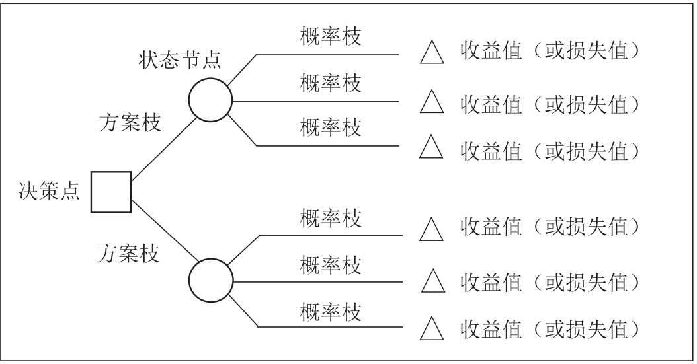

> Created At: 2024/11/19 Last Updated: 2024/11/20

## 说明
本文是在阅读《小数决策》后，发现书中的决策思路和数据审查有很高地参考价值，故结合平时的案例对相关原则进行阐释，促成此文。这个过程很像《这样读书就够了》提到的拆书法，以及《好好学习：个人知识管理精进指南》提到的对临界知识的反思过程。
## 小数决策
进入移动互联网时代后，信息爆炸和知识膨胀，导致人们获取讯息和数据的途径变多、成本变低，更多种类、更多数量的数据往往被认为是一种数据资产。很多大公司都希望能从数据资产中发现某些规律，去发掘更多的企业增长信息。例如，那个学大数据必提及的啤酒和纸尿裤的故事。目前相较于缺乏可靠的数据，企业高管反应企业常见的不足之处是难以发现问题以及将分析转化为洞察和行动。
>  成功的决策者绝非拥有卓越的分析能力，却能在数据、经验和直觉之间取得平衡，迅速整理信息、做出判断、深入审视数据、形成敏锐的洞察力。他们知道决策不仅仅需要数据，因此不会沉迷于数据分析。他们运用一阶原理来理解一个决策是什么，为什么必须做出这个决策，以及这个决策想达到什么目的。然后他们寻找相关数据来帮助自己做出这个决策。简而言之，他们能利用不完整的信息做出明智的决策。

小数决策的核心方法有两个：逆向工作法和IWIK。
### 逆向工作法
这个概念来自来自逆向市场研究方法，从待定的决策入手逆向回推，以便收集和分析市场研究数据。他强调先基于要解决的问题和要达到的目标构建一个决策树，其中某些节点需要去搜集数据，并通过数据的分析结果导向不同的分支。也就是，先有决策思路，然后按需的去搜集相干的数据。作者称之为决策驱动流程，而不是数据驱动流程。 
它的反例是，先搜集数据，然后去分析数据，产出分析结论，驱动决策流程。作者认为这有几个缺点：1）收集到了决策用不到的噪声数据，会浪费成本且带来分析的噪声；2）在不同的项目阶段，对数据的精细度要求是不同的，少量的数据加上猜估法在某些时候也可以帮助决策。针对逆向工作法可能会带来证实性偏差的问题，作者回答我们需要一个完整的决策树来避免。 

### IWIK(I Wish I Knew)
IWIK是指在分析问题和收集数据之前，提前问自己：如果要解决这个问题，我需要知道哪些信息。这有点像之前提到过的“事前验尸法”。在陷入数据分析前，通过该问题来界定问题的范围，圈定要获取的信息范围。
## 审查数据
### 数据可视化与直觉
可以通过一些可视化工具，把数据进行图表化，可以更好地利用直觉去发现规律，如识别异常点、变化趋势等信息。
### 评估数据有效性
当收集到数据后，在分析数据之前要评估数据的有效性和合理性。作者提到可以问几个问题： 
1）数据的来源是什么？ 
与数据提供人是否有利益冲突？数据是否存在瞒报、修改的可能。
 
2）指标是否符合你的期望？如果不符，是何原因所致？ 
3）指标是如何计算的？ 
4）数据是何时何地收集的？ 
5）是否与具有相关性和可比性的替代物进行了比较？ 
6）缺少了什么？还有其他的相关数据吗？ 
数据中是否包含了无回应着的看法。例如，一个餐馆经常收到菜过咸的反馈，当厨师调整过后发现饭店的人数更少了。其原因是，反馈的人数是少数，而大部分人觉得口味刚好并不会反馈。餐馆在做决策的时候没有考虑这些无回应者而做了错误的决策。
 
7）我没有看到的数据和我看到的数据相似吗？ 
这点和第六点是一样的，只是强调了从相似度方面进行评估。这里可以补充另外两个例子：

> 二战期间，为了加强对战机的防护，英美军方调查了作战后幸存飞机上弹痕的分布，决定哪里弹痕多就加强哪里。然而统计学家沃德力排众议，指出更应该注意弹痕少的部位，因为这些部位受到重创的战机，很难有机会返航，而这部分数据被忽略了。事实证明沃德是正确的。 
> 这是一个真实的故事。沃德（Abraham Wald）是哥伦比亚大学统计学教授，是统计决策理论和序贯分析的创始人之一，上面的故事是他在二战期间帮助美军分析的一个例子。沃德针对联军的轰炸机遭受攻击后的数据，进行研究后发现：机翼是最容易被击中的位置，机尾则是最少被击中的位置。沃德的结论是“我们应该强化机尾的防护”，而军方指挥官认为“应该加强机翼的防护，因为这是最容易被击中的位置”。沃德坚持认为：（1）统计的样本，只涵盖平安返回的轰炸机；（2）被多次击中机翼的轰炸机，似乎还是能够安全返航；（3）而在机尾的位置，很少发现弹孔的原因并非真的不会中弹，而是一旦中弹，其安全返航的概率就微乎其微。军方采用了沃德的建议，并且后来证实该决策是正确的，看不见的弹痕却最致命。它说明了统计分析中的“幸存者偏差”（survival bias）问题，那就是我们只看到了那些能够飞回来的飞机，而看不到那些被击落而没能飞回来的飞机。所以，只是根据“幸存者”的数据做出的判断很有可能是不正确的。

另一个例子，是近期在分析废弃代码合码率低的原因时，发现有些用户会因为废弃下线MR删除了测试用例而取消工单，如果单看这个用户反馈和分析结论，那么必然会推导出要避免删除测试用例。但是如果考虑到那些没有看到的数据，即那些成功合码的工单占有更大的比例——这些同样删除了测试用例。当意识到有另外一个更大的数据没有被发现，且和当前数据性质不同时，则可能推导出另一个不同的决策。
 
8）是否存在异常值？ 
 
以上，可简化为 a. 我收集了哪些数据？ b. 我没有看到哪些数据？ c. 我能信任这些数据和分析吗？。
### 将数据置于背景中
1）数据在这里意味着什么？ 
2）数据与历史数据相比如何？ 
3）数据与竞争对手相比如何？ 
### 数据压测
如果数据对应一个表格，可以进行设置。那么可以设置一些边界值（如0，1，无穷大），来验证关键数据的合理性。