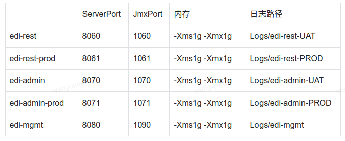

#### 一、背景

公司最近开源节流，为了提高硬件资源使用率，组内决定多个应用混合部署到一台容器上。

#### 二、混合部署注意事项

1. 评估混合部署是否面临CPU，内存，网络，磁盘等资源瓶颈
2. 修改各应用的JVM内存配置（-Xms -Xmx），总和不超过2/3物理内存
3. 修改各应用的监听端口，避免冲突
4. 修改各应用的停止脚本，避免无差别停止进程
5. 修改各应用的日志路径，避免冲突
6. 修改相关域名的解析IP或VIP后的分流IP
7. 更新维护监控平台下各应用的IP

#### # 最后

1. 暂时停止旧应用，待新应用观察一段时间无误后，再缩容容器
2. 把混合部署的应用信息整理一个文档，方便运维。如下所示：

