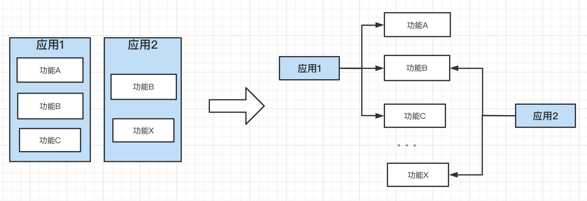

# 版本管理

#### 一、应用与其依赖

随着软件工程的发展，为了减小工程复杂度，分层和解耦越来越成为共识。应用也由庞大的单体应用进行了服务化拆分，单独拆分的微服务具备低复杂度、易升级、高伸缩性等优点。微服务间通过网络和其他微服务进行连接，组成了更大的逻辑应用。

为了减少代码重复和减小复杂度，在工程实践时应用代码往往也需要拆分（我们称之为功能模块），进行单独的版本控制和版本管理，原应用以依赖的形式的引入拆分的功能。这样的好处很多，如方便模块复用减少代码重复、功能模块仓库可以使用更简单的分支模型管理、功能模块的版本管理更容易。另外在面对应用定制部署时，只需要灵活组合功能模块即可，减小了复杂度。

复杂度一直是软件工程的大敌，随着软件的迭代，运维的成本也会随之升高。控制住复杂度，能更好的响应需求，延长应用的腐化时间。把应用解构为多模块以依赖的形式引入，拆分前后应用在功能逻辑上仍是同构的，但大大削减了开发，管理，运维的复杂度。

**此处我们可以把拆分后的功能模块称为模块工程，依赖模块仓库的应用称为聚合工程。**

#### 二、版本管理目标

版本管理的目标是保证应用稳定，通过版本划分应用功能代际，使其能平稳升级及安全回退。工程实践时：借助版本号对应用版本和应用模块（也就是应用依赖）进行管理，使应用提供的功能集与模块的版本号绑定。

**版本号约定**

[major version]：主版本号，重大版本升级时修改

[minor version]：次版本号，小版本升级时修改

[batch version]：修订版本号，FixBug时修改，一般只用于稳定版本。

快照版本：

**[major version].[minor version].0-SNAPSHOT**，如1.1.0-SNAPSHOT

稳定版本：

**[major version].[minor version].[batch version]**，如1.1.1

#### 三、版本管理原则

版本管理原则是为了实现版本管理目标，给予工程实践的一些操作指导原则，非绝对。

**1）单体应用仓库拆分为按功能内聚的功能模块仓库**

**2）功能模块仓库建议使用TBD工作流**

**3）应用（即聚合工程）通过依赖方式引入和关联功能模块**

**4）应用（即聚合工程）通过BOM统一约束第三方依赖**

**5）不同环境或定制部署的应用通过不同聚合工程对模块功能不同版本的依赖实现**

**6）线上应用依赖稳定（RELEASE）的功能模块版本，而非快照版本**

**7）应用（即聚合工程）全量引入功能模块依赖及声明版本，也就是做到declared used dependency**

**8）使用版本而不是分支进行版本管理**

**9）模块功能版本变更时，仓库级整体变更**

