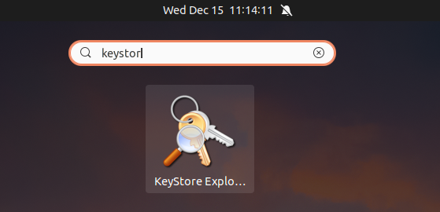
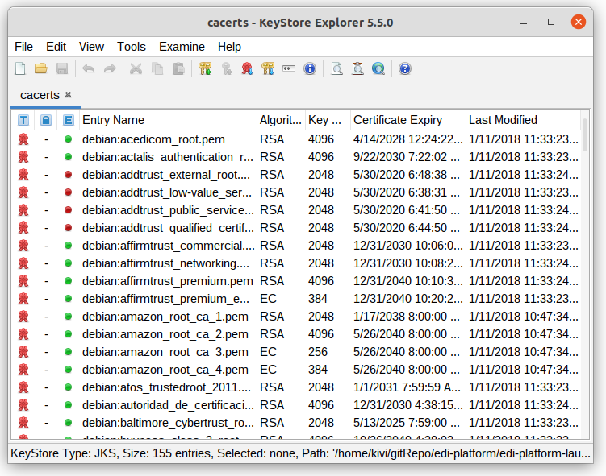

### 一、使用keytool命令

#### KeyTool命令一览

##### 1）KeyTool命令

```bash
$ keytool -help
Key and Certificate Management Tool

Commands:

 -certreq            Generates a certificate request
 -changealias        Changes an entry's alias
 -delete             Deletes an entry
 -exportcert         Exports certificate
 -genkeypair         Generates a key pair
 -genseckey          Generates a secret key
 -gencert            Generates certificate from a certificate request
 -importcert         Imports a certificate or a certificate chain
 -importpass         Imports a password
 -importkeystore     Imports one or all entries from another keystore
 -keypasswd          Changes the key password of an entry
 -list               Lists entries in a keystore
 -printcert          Prints the content of a certificate
 -printcertreq       Prints the content of a certificate request
 -printcrl           Prints the content of a CRL file
 -storepasswd        Changes the store password of a keystore

Use "keytool -command_name -help" for usage of command_name
```

##### 2）证书查看命令

```bash
$ keytool -list -help
keytool -list [OPTION]...

Lists entries in a keystore

Options:

 -rfc                            output in RFC style
 -alias <alias>                  alias name of the entry to process
 -keystore <keystore>            keystore name
 -storepass <arg>                keystore password
 -storetype <storetype>          keystore type
 -providername <providername>    provider name
 -providerclass <providerclass>  provider class name
 -providerarg <arg>              provider argument
 -providerpath <pathlist>        provider classpath
 -v                              verbose output
 -protected                      password through protected mechanism

Use "keytool -help" for all available commands
```

##### 3）证书导入命令

```bash
$ keytool -importcert -help
keytool -importcert [OPTION]...

Imports a certificate or a certificate chain

Options:

 -noprompt                       do not prompt
 -trustcacerts                   trust certificates from cacerts
 -protected                      password through protected mechanism
 -alias <alias>                  alias name of the entry to process
 -file <filename>                input file name
 -keypass <arg>                  key password
 -keystore <keystore>            keystore name
 -storepass <arg>                keystore password
 -storetype <storetype>          keystore type
 -providername <providername>    provider name
 -providerclass <providerclass>  provider class name
 -providerarg <arg>              provider argument
 -providerpath <pathlist>        provider classpath
 -v                              verbose output

Use "keytool -help" for all available commands
```

#### 证书查看

##### 1）查看所有证书

```bash
$ keytool -list -keystore cacerts -storepass changeit -v

Keystore type: jks
Keystore provider: SUN

Your keystore contains 154 entries

Alias name: debian:go_daddy_class_2_ca.pem
Creation date: Jan 11, 2018
Entry type: trustedCertEntry

Owner: OU=Go Daddy Class 2 Certification Authority, O="The Go Daddy Group, Inc.", C=US
Issuer: OU=Go Daddy Class 2 Certification Authority, O="The Go Daddy Group, Inc.", C=US
Serial number: 0
Valid from: Wed Jun 30 01:06:20 CST 2004 until: Fri Jun 30 01:06:20 CST 2034
Certificate fingerprints:
	 SHA1: 27:96:BA:E6:3F:18:01:E2:77:26:1B:A0:D7:77:70:02:8F:20:EE:E4
	 SHA256: C3:84:6B:F2:4B:9E:93:CA:64:27:4C:0E:C6:7C:1E:CC:5E:02:4F:FC:AC:D2:D7:40:19:35:0E:81:FE:54:6A:E4
Signature algorithm name: SHA1withRSA
Subject Public Key Algorithm: 2048-bit RSA key (3)
Version: {10}

Extensions: 
...
*******************************************
*******************************************

其他153个证书
```

##### 2）查看指定证书

```bash
$ keytool -list -keystore cacerts -storepass changeit -v -alias debian:go_daddy_class_2_ca.pem

Alias name: debian:go_daddy_class_2_ca.pem
Creation date: Jan 11, 2018
Entry type: trustedCertEntry

Owner: OU=Go Daddy Class 2 Certification Authority, O="The Go Daddy Group, Inc.", C=US
Issuer: OU=Go Daddy Class 2 Certification Authority, O="The Go Daddy Group, Inc.", C=US
Serial number: 0
Valid from: Wed Jun 30 01:06:20 CST 2004 until: Fri Jun 30 01:06:20 CST 2034
Certificate fingerprints:
	 SHA1: 27:96:BA:E6:3F:18:01:E2:77:26:1B:A0:D7:77:70:02:8F:20:EE:E4
	 SHA256: C3:84:6B:F2:4B:9E:93:CA:64:27:4C:0E:C6:7C:1E:CC:5E:02:4F:FC:AC:D2:D7:40:19:35:0E:81:FE:54:6A:E4
Signature algorithm name: SHA1withRSA
Subject Public Key Algorithm: 2048-bit RSA key (3)
Version: {10}

Extensions: 
...
```

##### 3）查看证书RFC格式

```bash
$ keytool -list -keystore cacerts -storepass changeit -rfc -alias debian:go_daddy_class_2_ca.pem

Alias name: debian:go_daddy_class_2_ca.pem
Creation date: Jan 11, 2018
Entry type: trustedCertEntry

-----BEGIN CERTIFICATE-----
MIIEADCCAuigAwIBAgIBADANBgkqhkiG9w0BAQUFADBjMQswCQYDVQQGEwJVUzEh
MB8GA1UEChMYVGhlIEdvIERhZGR5IEdyb3VwLCBJbmMuMTEwLwYDVQQLEyhHbyBE
YWRkeSBDbGFzcyAyIENlcnRpZmljYXRpb24gQXV0aG9yaXR5MB4XDTA0MDYyOTE3
MDYyMFoXDTM0MDYyOTE3MDYyMFowYzELMAkGA1UEBhMCVVMxITAfBgNVBAoTGFRo
ZSBHbyBEYWRkeSBHcm91cCwgSW5jLjExMC8GA1UECxMoR28gRGFkZHkgQ2xhc3Mg
MiBDZXJ0aWZpY2F0aW9uIEF1dGhvcml0eTCCASAwDQYJKoZIhvcNAQEBBQADggEN
ADCCAQgCggEBAN6d1+pXGEmhW+vXX0iG6r7d/+TvZxz0ZWizV3GgXne77ZtJ6XCA
PVYYYwhv2vLM0D9/AlQiVBDYsoHUwHU9S3/Hd8M+eKsaA7Ugay9qK7HFiH7Eux6w
wdhFJ2+qN1j3hybX2C32qRe3H3I2TqYXP2WYktsqbl2i/ojgC95/5Y0V4evLOtXi
EqITLdiOr18SPaAIBQi2XKVlOARFmR6jYGB0xUGlcmIbYsUfb18aQr4CUWWoriMY
avx4A6lNf4DD+qta/KFApMoZFv6yyO9ecw3ud72a9nmYvLEHZ6IVDd2gWMZEewo+
YihfukEHU1jPEX44dMX4/7VpkI+EdOqXG68CAQOjgcAwgb0wHQYDVR0OBBYEFNLE
sNKR1EwRcbNhyz2h/t2oatTjMIGNBgNVHSMEgYUwgYKAFNLEsNKR1EwRcbNhyz2h
/t2oatTjoWekZTBjMQswCQYDVQQGEwJVUzEhMB8GA1UEChMYVGhlIEdvIERhZGR5
IEdyb3VwLCBJbmMuMTEwLwYDVQQLEyhHbyBEYWRkeSBDbGFzcyAyIENlcnRpZmlj
YXRpb24gQXV0aG9yaXR5ggEAMAwGA1UdEwQFMAMBAf8wDQYJKoZIhvcNAQEFBQAD
ggEBADJL87LKPpH8EsahB4yOd6AzBhRckB4Y9wimPQoZ+YeAEW5p5JYXMP80kWNy
OO7MHAGjHZQopDH2esRU1/blMVgDoszOYtuURXO1v0XJJLXVggKtI3lpjbi2Tc7P
TMozI+gciKqdi0FuFskg5YmezTvacPd+mSYgFFQlq25zheabIZ0KbIIOqPjCDPoQ
HmyW74cNxA9hi63ugyuV+I6ShHI56yDqg+2DzZduCLzrTia2cyvk0/ZM/iZx4mER
dEr/VxqHD3VILs9RaRegAhJhldXRQLIQTO7ErBBDpqWeCtWVYpoNz4iCxTIM5Cuf
ReYNnyicsbkqWletNw+vHX/bvZ8=
-----END CERTIFICATE-----
```

#### 证书导入

```bash
$ keytool -importcert -keystore cacerts -storepass changeit \
	-file jianshu.com.cert -alias jianshu -trustcacerts -v

Owner: CN=*.jianshu.com, O="Shanghai Bai Ji Information Technology Co,. Ltd", L=Shanghai, ST=Shanghai, C=CN
Issuer: CN=DigiCert TLS RSA SHA256 2020 CA1, O=DigiCert Inc, C=US
Serial number: 50396147162fd8a9d02f112b1c9df1c
Valid from: Fri Oct 08 08:00:00 CST 2021 until: Wed Nov 09 07:59:59 CST 2022
Certificate fingerprints:
         SHA1: 96:99:E0:31:22:25:FA:E5:DD:72:E9:E5:C4:1D:1E:AF:BE:E9:DB:4D
         SHA256: DE:E0:96:F1:6A:3E:ED:7C:8C:4E:60:A6:63:37:80:50:AE:63:EA:57:C0:20:2C:1A:B3:FD:49:31:1D:37:89:69
Signature algorithm name: SHA256withRSA
Subject Public Key Algorithm: 2048-bit RSA key (3)
Version: {10}
...

Trust this certificate? [no]:  y
Certificate was added to keystore
[Storing cacerts]
```

### 二、GUI工具-KeyStore Explorer

> 开源，简洁，跨平台。

地址：https://keystore-explorer.org/index.html


1）安装后启动应用：



2）软件界面：



### # 参考

1. https://keystore-explorer.org/index.html


