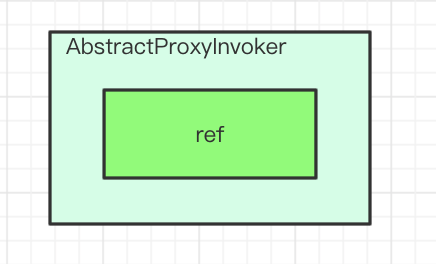
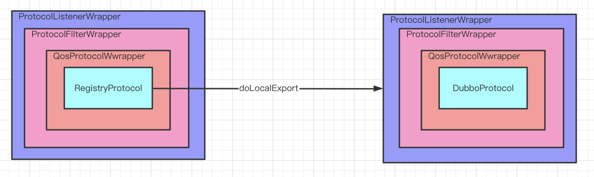
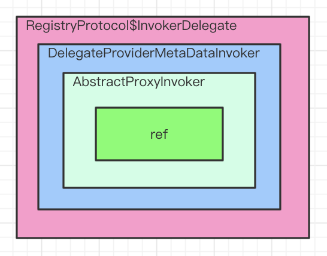
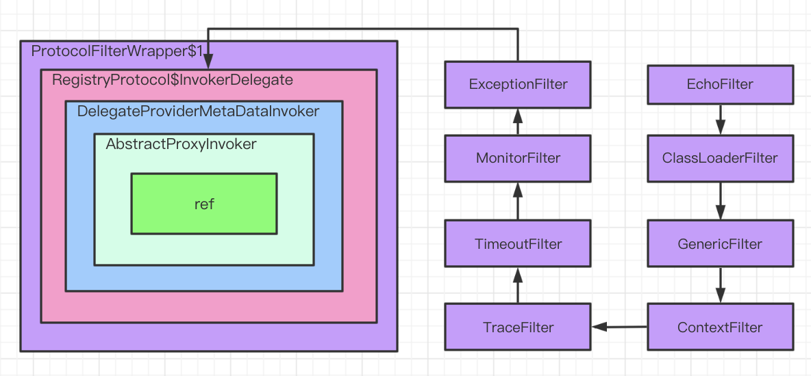

### 一、服务导出整体流程


### 二、ServiceConfig.export()

```java
public class ServiceConfig<T> extends ServiceConfigBase<T> {
    private static final ProxyFactory PROXY_FACTORY = ExtensionLoader.getExtensionLoader(ProxyFactory.class).getAdaptiveExtension();
  
    private void doExportUrlsFor1Protocol(ProtocolConfig protocolConfig, List<URL> registryURLs) {
        // 以下为关键代码 
      
        // 通过ProxyFactory扩展点，对ref生成Invoker代理对象
        Invoker<?> invoker = PROXY_FACTORY.getInvoker(ref, (Class) interfaceClass, registryURL.addParameterAndEncoded(EXPORT_KEY, url.toFullString()));
      
        // 对上一步生成的Invoker对象进行包装，生成DelegateProviderMetaDataInvoker
        DelegateProviderMetaDataInvoker wrapperInvoker = new DelegateProviderMetaDataInvoker(invoker, this);
        // 通过Protocol扩展点，执行导出逻辑
        Exporter<?> exporter = protocol.export(wrapperInvoker);
      
        exporters.add(exporter);
    }
}
```


### 三、ProxyFactory.getInvoker()对ref进行封装

#### 1. ProxyFactory接口

```java
@SPI("javassist")
public interface ProxyFactory {
    // PROXY_KEY为“proxy”
    @Adaptive({PROXY_KEY})
    <T> T getProxy(Invoker<T> invoker) throws RpcException;

    @Adaptive({PROXY_KEY})
    <T> T getProxy(Invoker<T> invoker, boolean generic) throws RpcException;

    @Adaptive({PROXY_KEY})
    <T> Invoker<T> getInvoker(T proxy, Class<T> type, URL url) throws RpcException;
}
```

由接口定义可知，其根据URL中的PROXY_KEY属性，即“proxy”属性作为扩点点类型获取扩展点实例。且默认扩展点类型为'javassist'。

#### 2. ProxyFactory的自适应类

通过打断点获取ProxyFactory自适应类源码如下：

```java
package org.apache.dubbo.rpc;

import org.apache.dubbo.common.extension.ExtensionLoader;

public class ProxyFactory$Adaptive implements org.apache.dubbo.rpc.ProxyFactory {
    public java.lang.Object getProxy(org.apache.dubbo.rpc.Invoker arg0) throws org.apache.dubbo.rpc.RpcException {
        if (arg0 == null) throw new IllegalArgumentException("org.apache.dubbo.rpc.Invoker argument == null");
        if (arg0.getUrl() == null)
            throw new IllegalArgumentException("org.apache.dubbo.rpc.Invoker argument getUrl() == null");
        org.apache.dubbo.common.URL url = arg0.getUrl();
        String extName = url.getParameter("proxy", "javassist");
        if (extName == null)
            throw new IllegalStateException("Failed to get extension (org.apache.dubbo.rpc.ProxyFactory) name from url (" + url.toString() + ") use keys([proxy])");
        org.apache.dubbo.rpc.ProxyFactory extension =
                (org.apache.dubbo.rpc.ProxyFactory) ExtensionLoader.getExtensionLoader(org.apache.dubbo.rpc.ProxyFactory.class).getExtension(extName);
        return extension.getProxy(arg0);
    }

    public java.lang.Object getProxy(org.apache.dubbo.rpc.Invoker arg0, boolean arg1) throws org.apache.dubbo.rpc.RpcException {
        if (arg0 == null) throw new IllegalArgumentException("org.apache.dubbo.rpc.Invoker argument == null");
        if (arg0.getUrl() == null)
            throw new IllegalArgumentException("org.apache.dubbo.rpc.Invoker argument getUrl() == null");
        org.apache.dubbo.common.URL url = arg0.getUrl();
        String extName = url.getParameter("proxy", "javassist");
        if (extName == null)
            throw new IllegalStateException("Failed to get extension (org.apache.dubbo.rpc.ProxyFactory) name from url (" + url.toString() + ") use keys([proxy])");
        org.apache.dubbo.rpc.ProxyFactory extension =
                (org.apache.dubbo.rpc.ProxyFactory) ExtensionLoader.getExtensionLoader(org.apache.dubbo.rpc.ProxyFactory.class).getExtension(extName);
        return extension.getProxy(arg0, arg1);
    }

    public org.apache.dubbo.rpc.Invoker getInvoker(java.lang.Object arg0, java.lang.Class arg1,
                                                   org.apache.dubbo.common.URL arg2) throws org.apache.dubbo.rpc.RpcException {
        if (arg2 == null) throw new IllegalArgumentException("url == null");
        org.apache.dubbo.common.URL url = arg2;
        String extName = url.getParameter("proxy", "javassist");
        if (extName == null)
            throw new IllegalStateException("Failed to get extension (org.apache.dubbo.rpc.ProxyFactory) name from url (" + url.toString() + ") use keys([proxy])");
        org.apache.dubbo.rpc.ProxyFactory extension =
                (org.apache.dubbo.rpc.ProxyFactory) ExtensionLoader.getExtensionLoader(org.apache.dubbo.rpc.ProxyFactory.class).getExtension(extName);
        return extension.getInvoker(arg0, arg1, arg2);
    }

```

默认情况下调用链如下：

`ProxyFactory$Adaptive.getInvoker() -> JavassistProxyFactory.getInvoker()`

通过JavassistProxyFactory把ref封装为AbstractProxyInvoker对象。  



### 四、ServiceConfig对ProxyFactory结果再次封装

`DelegateProviderMetaDataInvoker wrapperInvoker = new DelegateProviderMetaDataInvoker(invoker, this);`


### 五、protocol.export(wrapperInvoker)

protocol是自适应Protocol类，会根据URL属性找到对应类型的扩展点执行export。

#### 1. RegistryProtocol.export()

protocol根据URL"registry://127.0.0.1:2181/org.apache.dubbo.registry.RegistryService?..."找到RegistryProtocol类型扩展点。

NOTE：外面的ProtocolListenerWrapper,ProtocolFilterWrapper,QosProtocolWwrapper为包装类。



RegistryProtocol中会复写URL为“dubbo://ip:port/接口名?...”，然后再次调用protocol自适应类找到DubboProtocol扩展点执行export。

```java
package org.apache.dubbo.registry.integration;

public class RegistryProtocol implements Protocol {
    // 此时providerUrl格式为“dubbo://ip:port/接口名?...”
    private <T> ExporterChangeableWrapper<T> doLocalExport(final Invoker<T> originInvoker, URL providerUrl) {
        String key = getCacheKey(originInvoker);

        return (ExporterChangeableWrapper<T>) bounds.computeIfAbsent(key, s -> {
            Invoker<?> invokerDelegate = new InvokerDelegate<>(originInvoker, providerUrl);
            return new ExporterChangeableWrapper<>((Exporter<T>) protocol.export(invokerDelegate), originInvoker);
        });
    }
}
```

由上面源码可知，执行DubboProtocol#export前，RegistryProtocol会对invoker再次包装。



#### 2. DubboProtocol.export()

调用DubboProtocol#export前，需经过ProtocolListenerWrapper,ProtocolFilterWrapper,QosProtocolWwrapper包装类的处理逻辑。

1）ProtocolFilterWrapper

该包装类会为Invoker进行Filter包装，生成Filter链。



2）DubboProtocol#export

Ø DubboProtocol#export方法会生成DubboExporter，并调用`openServer()`方法，然后返回；

Ø 然后会经过包装类ProtocolListenerWrapper#export再次包装为ListenerExporterWrapper。

Ø 然后会在RegistryProtocol#doLocalExport里再次包装为ExporterChangeableWrapper。

Ø 然后会在RegistryProtocol#export里再次包装为DestroyableExporter。


### 六、DubboProtocol.openServer

# todo

### # 参考

1. [Dubbo框架设计](https://dubbo.apache.org/zh/docs/v2.7/dev/design/)

