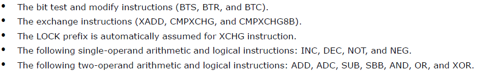

> 本文主要内容是对Intel CPU手册的第八章内容的简要翻译，旨在了解汇编指令Lock在CPU级别的实现机制。
> **大纲**
> 一、数据一致性
> 1.缓存一致性
> 2.主存一致性
> 二、原子操作保证数据一致性
> 1.保证的原子操作
> 2.总线锁
> 3.缓存一致性协议
> 三、原子性依赖内存有序模型

# 一、 数据一致性
## 1. 缓存一致性

> 两个基本概念：
> 1）**Cache**：缓存，又称快取，是弥补CPU和内存之间的速度差异而产生的中间存储，CPU内部有L1,L2,L3三级缓存，速度递减。
> 2）**Cache Line**：为提高效率，每次从内存取出放到Cache的数据单位被称为缓存行，一般为64Byte；

缓存一致性是指当处理器去访问缓存在其他处理器中的数据时，不能得到错误的数据。如果数据被修改，那么其他处理器也必须得到修改后的数据。
## 2. 主存一致性
系统内存一致性是指多个处理器同时去访问系统内存的相同地址时，cpu需要提供通讯机制或内存访问协议来保证数据的一致性，某些场景下会允许其中的一个处理器临时的锁定这个内存地址（或更大一点的内存区域）。

# 二、 原子操作保证数据一致性

> IA-32的32位处理器在系统内存的位置上支持**受锁定的原子操作**（最近的IA-32,64处理器提供了更细粒度的锁定机制）。这些操作常会用于管理共享的数据结构（例如信号量，段描述，系统段，页表），多个处理器可能会同时去修改共享数据结构的某个相同的字段或标识。
> 处理器通过三种机制来共同实现**受锁定的原子操作**：
> 1）cpu保证的原子操作
> 2）总线锁，使用LOCK#信号和LOCK指令前缀；
> 3）缓存一致性协议，使共享的数据结构在被缓存的情况下同样保证原子性；
## 1）保证的原子操作
cpu保证读写一个byte，word, doubleword的原子性（P6系列的处理器还会保证从缓存行中读写四个字节的原子性，且不要求内存对齐）

## 2）总线锁

> Inter 64和IA-32架构的处理器访问临界区内存时会**自动声明LOCK#**信号，通过锁定系统总线或等效连接。当该信号被发出后，来自其他处理器或总线Agnet的请求都会被阻塞。
> 软件可以通过在指令前**手动增加LOCK前缀**来声明其他遵循锁定语义的场景。Intel386, Intel486, 和Pentium处理器遇到被锁定修饰的指令（locked instruction）会发出LOCK#信号。多个处理器在系统硬件的控制下对内存的访问，此硬件的设计者需要保证LOCK#信号的作用。
> 对于P6或更新的处理器系列，**如果被访问的内存区域已经被缓存到处理器，那么处理器就不再发出LOCK#信号，而是只锁定处理器的缓存（通过缓存一致性协议）。**

##### 总线锁的两种使用方法

* *自动锁定*：处理器会自动对一些指令增加LOCK前缀来保证原子性，例如XCHG
* *声明锁定*：在某些特定的指令前增加LOCK前缀来保证原子性。

##### 总线锁定无需内存对齐

> 总线锁的完整性不会受内存字段的对齐影响.锁定语义在必要时会持续多个总线周期来实现完整的操作。建议锁定访问在它们的自然边界上对齐，以获得更好的系统性能。
> • 任意8bit的访问（不用锁定）
> • 被锁定的16bit访问
> • 被锁定的32bit访问
> • 被锁定的64bit访问
# 三、内存有序模型保证原子性
在多处理器系统下，实现同步机制需要依赖一个强内存有序模型。
“**内存有序**”指的是CPU处理器通过系统总线向系统内存发出读写操作的顺序。Intel IA-32，x64架构的cpu根据具体的架构实现会支持多种**内存有序模型**。
1）Intel 386处理器采用**程序级别有序**（一般被认为是强有序），即在所有场景下发到总线上的读写顺序与指令流的顺序一致。
2）PentiumI4，Intel Xeon，P6系列的IA-32架构CPU，为了优化指令执行的性能，提出了不同于强一致性的memory ordering，称为**处理器级别有序**。该模型的不同之处在于允许执行强化性能的一些乱序操作，例如，允许写缓冲之前执行读操作。这些差异都旨在保持内存一致性的前提下，加快指令的执行速度，即使是多处理器的系统。

##### 强化或弱化的内存模型
> Intel 64和IA-32架构的提供了多种机制来强化或弱化内存排序模型来应对特殊的编程情景，这些机制包括：
> 1）IO指令，Lock指令，Lock前缀修饰的指令，串行指令在处理器上强制增强有序性
> 2）栅栏指令：SFENCE,LFENCE,MFENCE指令为特定类型的内存操作提供内存排序和序列化功能。
> 3）MTRRs常被用于为指定的物理内存提供强化或弱化内存排序；
> 4）PAT常被用于为指定的内存页提供强化排序；

其中串行指令包括：INVD, INVEPT, INVLPG, INVVPID, LGDT, LIDT, LLDT, LTR, MOV (to control register, with the exception of MOV CR83), MOV (to debug register), WBINVD, and WRMSR4，CPUID, IRET, and RSM。