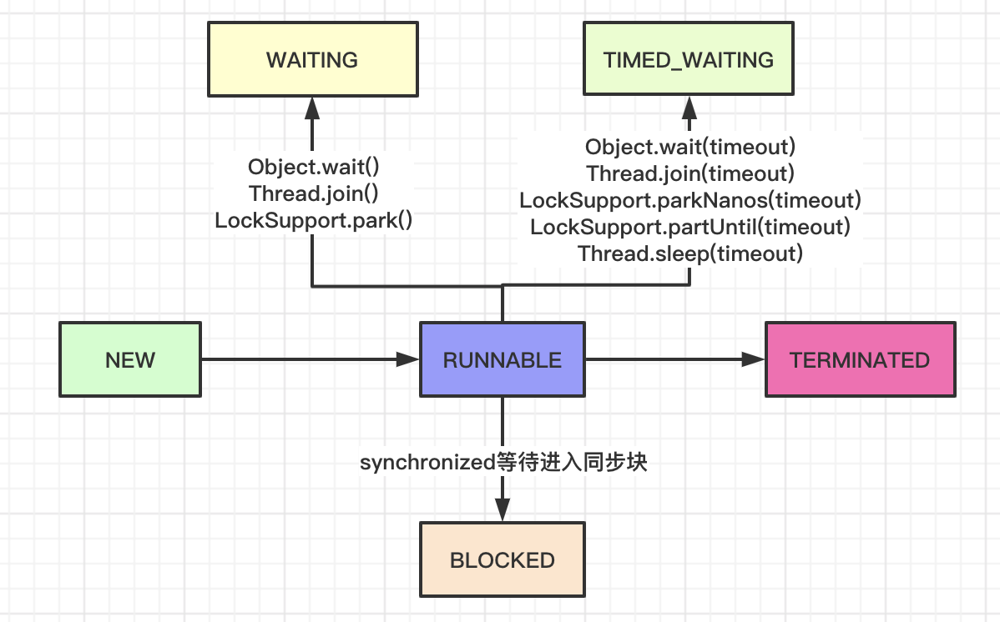
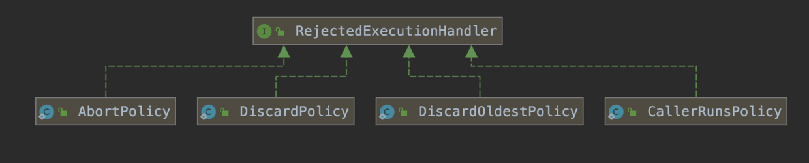
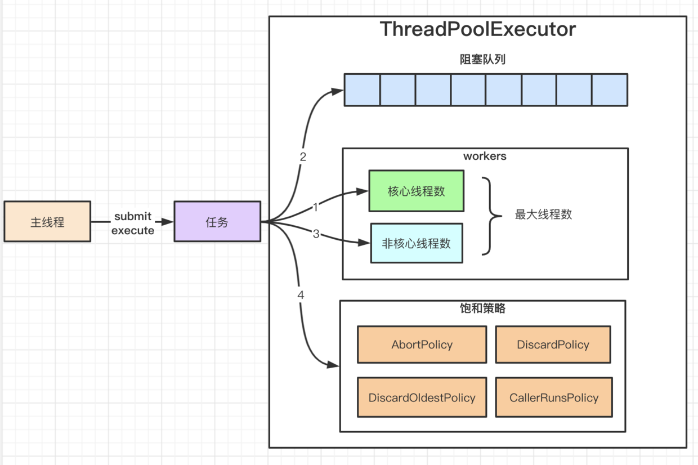
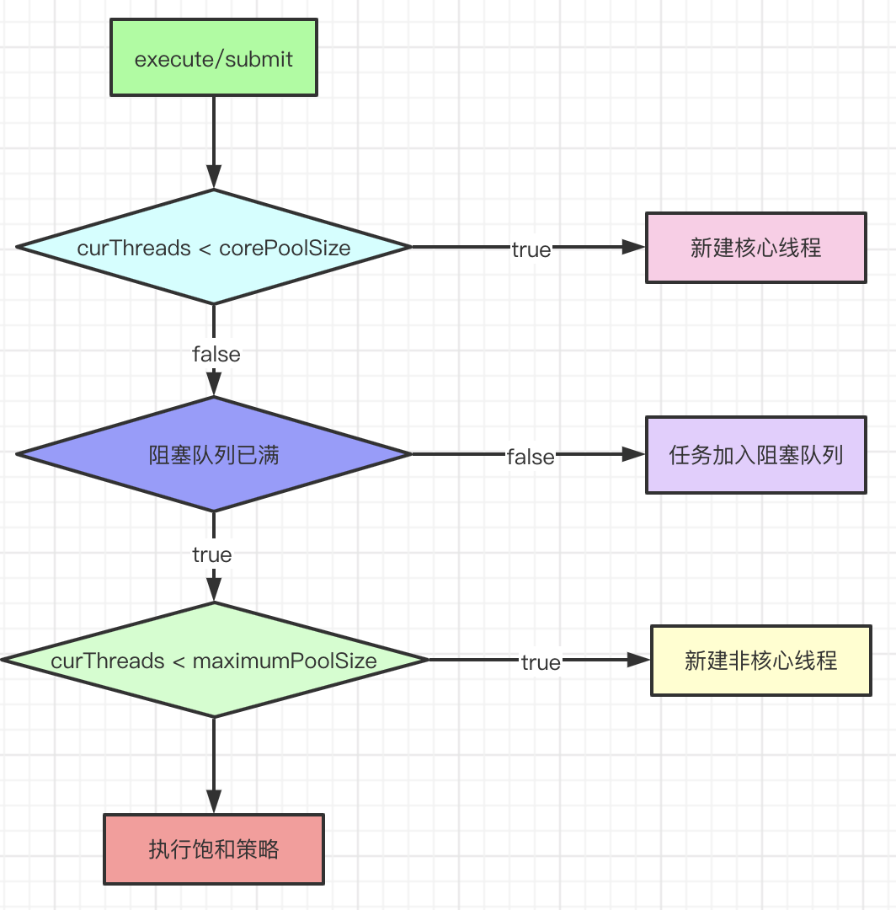

## 一、前置问题

1. 线程的状态转换
1. 为什么要使用线程池
1. 线程池的继承体系
1. 线程池使用的场景
1. 线程数的设置规则
1. 线程池的状态转换
1. 线程池的关键参数
1. 线程池的接收任务后的执行流程
1. 线程池的异常处理
1. submit和exec的区别
11. 线程池的拒绝策略
## 二、进程和线程

* 进程是分配资源的最小单位，进程间资源隔离
* 线程是CPU调度的最小单位
* 一个进程往往包含多个线程，多个线程在进程内可共享进程的资源
* 多线程可简化编程，把涉及并发和多步的问题域映射为多线程；
## 三、线程的状态

通过`java.lang.Thread#getState`方法可以获取当前线程状态，其用枚举标识。

```java
  /**
     * A thread can be in only one state at a given point in time.
     * These states are virtual machine states which do not reflect
     * any operating system thread states.
     *
     * @since   1.5
     * @see #getState
     */
    public enum State {
        /**
         * Thread state for a thread which has not yet started.
         */
        NEW,

        /**
         * Thread state for a runnable thread.  A thread in the runnable
         * state is executing in the Java virtual machine but it may
         * be waiting for other resources from the operating system
         * such as processor.
         */
        RUNNABLE,

        /**
         * Thread state for a thread blocked waiting for a monitor lock.
         * A thread in the blocked state is waiting for a monitor lock
         * to enter a synchronized block/method or
         * reenter a synchronized block/method after calling
         * {@link Object#wait() Object.wait}.
         */
        BLOCKED,

        /**
         * Thread state for a waiting thread.
         * A thread is in the waiting state due to calling one of the
         * following methods:
         * <ul>
         *   <li>{@link Object#wait() Object.wait} with no timeout</li>
         *   <li>{@link #join() Thread.join} with no timeout</li>
         *   <li>{@link LockSupport#park() LockSupport.park}</li>
         * </ul>
         *
         * <p>A thread in the waiting state is waiting for another thread to
         * perform a particular action.
         *
         * For example, a thread that has called <tt>Object.wait()</tt>
         * on an object is waiting for another thread to call
         * <tt>Object.notify()</tt> or <tt>Object.notifyAll()</tt> on
         * that object. A thread that has called <tt>Thread.join()</tt>
         * is waiting for a specified thread to terminate.
         */
        WAITING,

        /**
         * Thread state for a waiting thread with a specified waiting time.
         * A thread is in the timed waiting state due to calling one of
         * the following methods with a specified positive waiting time:
         * <ul>
         *   <li>{@link #sleep Thread.sleep}</li>
         *   <li>{@link Object#wait(long) Object.wait} with timeout</li>
         *   <li>{@link #join(long) Thread.join} with timeout</li>
         *   <li>{@link LockSupport#parkNanos LockSupport.parkNanos}</li>
         *   <li>{@link LockSupport#parkUntil LockSupport.parkUntil}</li>
         * </ul>
         */
        TIMED_WAITING,

        /**
         * Thread state for a terminated thread.
         * The thread has completed execution.
         */
        TERMINATED;
    }
```



## 四、线程池

### 1、为什么使用线程池

* 减少线程创建和销毁的开销
* 提高响应速度，因为去掉了线程创建的时间
* 更好的管控线程，例如控制线程创建数，避免线程创建过多导致资源耗尽
### 2、使用场景

* 使用线程池处理的任务不能有依赖关系，否则会导致并发度下降，甚至会有死锁发生；
* 常用于处理执行时间较短，但又数量大的任务；
### 3、继承体系


### 4、线程池的状态

```java
/**
*   RUNNING:  Accept new tasks and process queued tasks
*   SHUTDOWN: Don't accept new tasks, but process queued tasks
*   STOP:     Don't accept new tasks, don't process queued tasks,
*             and interrupt in-progress tasks
*   TIDYING:  All tasks have terminated, workerCount is zero,
*             the thread transitioning to state TIDYING
*             will run the terminated() hook method
*   TERMINATED: terminated() has completed
*/
 // runState is stored in the high-order bits
private static final int RUNNING    = -1 << COUNT_BITS;
private static final int SHUTDOWN   =  0 << COUNT_BITS;
private static final int STOP       =  1 << COUNT_BITS;
private static final int TIDYING    =  2 << COUNT_BITS;
private static final int TERMINATED =  3 << COUNT_BITS;
```


### 5、线程池数量

**线程数量 = ((线程等待时间 + 线程CPU时间) / 线程CPU时间)   * CPU个数**

## 五、ThreadPoolExecutor

### 1、初始化参数

```java
 /**
     * Creates a new {@code ThreadPoolExecutor} with the given initial
     * parameters.
     *
     * @param corePoolSize the number of threads to keep in the pool, even
     *        if they are idle, unless {@code allowCoreThreadTimeOut} is set
     * @param maximumPoolSize the maximum number of threads to allow in the
     *        pool
     * @param keepAliveTime when the number of threads is greater than
     *        the core, this is the maximum time that excess idle threads
     *        will wait for new tasks before terminating.
     * @param unit the time unit for the {@code keepAliveTime} argument
     * @param workQueue the queue to use for holding tasks before they are
     *        executed.  This queue will hold only the {@code Runnable}
     *        tasks submitted by the {@code execute} method.
     * @param threadFactory the factory to use when the executor
     *        creates a new thread
     * @param handler the handler to use when execution is blocked
     *        because the thread bounds and queue capacities are reached
     * @throws IllegalArgumentException if one of the following holds:<br>
     *         {@code corePoolSize < 0}<br>
     *         {@code keepAliveTime < 0}<br>
     *         {@code maximumPoolSize <= 0}<br>
     *         {@code maximumPoolSize < corePoolSize}
     * @throws NullPointerException if {@code workQueue}
     *         or {@code threadFactory} or {@code handler} is null
     */
    public ThreadPoolExecutor(int corePoolSize,
                              int maximumPoolSize,
                              long keepAliveTime,
                              TimeUnit unit,
                              BlockingQueue<Runnable> workQueue,
                              ThreadFactory threadFactory,
                              RejectedExecutionHandler handler) {
     ……
    }
```
1）corePoolSize：线程池核心线程数，即使空闲也不会结束；

2）maximumPoolSize：线程池可创建的最大线程数

3）keepAliveTime：非核心线程等待任务的最大时间，超过该时间线程会终止

4）unit：时间单位

5）workQueue：存放任务的阻塞队列

6）threadFactory：线程工厂，可用于定制线程的名称和异常处理等；

7）handler：线程池的饱和策略，当阻塞队列放满且线程达到最大值时，新提交的任务会通过具体的饱和策略进行处理。

* AbortPolicy：默认策略，抛出RejectedExecutionException异常；
* DiscardPolicy:  忽略，不执行任何逻辑；
* DiscardOldestPolicy: 抛弃旧的任务，然后再次提交任务
* CallerRunsPolicy: 提交任务的线程执行任务



### 2、提交任务：submit和execute区别

1）submit会调用newTaskFor方法封装任务为FutureTask，然后调用execute，返回FutureTask。

```java
 public class FutureTask<V> implements RunnableFuture<V> {
        public void run() {
            if (state != NEW || !UNSAFE.compareAndSwapObject(this, runnerOffset, null, Thread.currentThread()))
                return;
            try {
                Callable<V> c = callable;
                if (c != null && state == NEW) {
                    V result;
                    boolean ran;
                    try {
                        result = c.call();
                        ran = true;
                    } catch (Throwable ex) {
                        result = null;
                        ran = false;
                        setException(ex);
                    }
                    if (ran)
                        set(result);
                }
            } finally {
                // runner must be non-null until state is settled to
                // prevent concurrent calls to run()
                runner = null;
                // state must be re-read after nulling runner to prevent
                // leaked interrupts
                int s = state;
                if (s >= INTERRUPTING)
                    handlePossibleCancellationInterrupt(s);
            }
        }
    }
```
FutureTask执行时会catch任务执行的异常，调用Future.get方法时会抛出异常；

2）execute没有返回值，不会包装runnable为FutureTask，Woker执行异常时会导致Worker线程结束。

### 3、原理

当通过sumite或execute提交一个任务时，有以下3个场景：

1）如果线程池的线程数小于corePoolSize

新建核心线程，并把提交的任务作为该线程处理的第一个任务；

2）如果线程池的线程数不小于corePoolSize

把任务加入阻塞队列；

3）如果加入阻塞队列失败

新建非核心线程，并把提交的任务作为该线程处理的第一个任务；

4）如果核心线程池已到达最大值

执行跑和策略




### 4、线程池关闭

1）shutdown：调用后会设置线程池状态为SHUTDOWN，不再接受新任务，新任务会执行拒绝策略，阻塞队列里已有任务仍会处理。

2）shutdownNow：调用后会设置线程中断标志，设置线程池状态为STOP。然后会移除阻塞队列里的任务。getTask时发现处于STOP时，会减少worker数，然后返回null。

### 5、异常处理

1）线程中断异常：woker会退出，但是退出前在runworker方法中finally块会执行worker-1操作。

2）任务执行异常：提交的任务被封装为FutureTask，里面捕获了所有异常，不会导致woker退出。

所以即使设置了setUncaughtExceptionHandler，也会感知不到任务失败。所以还是在任务中增加try-catch最好。

## 六、ScheduledThreadPoolExecutor

### 1、前置问题

I、类继承层级

II、使用场景

III、执行原理

IV、任务执行时间超出period或delay后的处理逻辑

V、DelayedWorkQueue实现原理

VI、ScheduledThreadPoolExecutor和Timer的区别

VII、scheduleAtFixedRate和scheduleWithFixedDelay的区别

### 2、类继承层级


### 3、使用场景

I、服务注册发送心跳

II、定时拉取FTP文件

III、EDI里定时执行git pull，同步git仓库

IV、分布式锁

### 4、初始化参数

```java
public ScheduledThreadPoolExecutor(int corePoolSize, ThreadFactory threadFactory, RejectedExecutionHandler handler) {
    super(corePoolSize, Integer.MAX_VALUE, 0, NANOSECONDS, new DelayedWorkQueue(), threadFactory, handler);
}
```

1）corePoolSize：线程池核心线程数；

2）threadFactory：线程工厂，可用于定制线程的名称和异常处理等；

3）handler：线程池的饱和策略，当阻塞队列放满且线程达到最大值时，新提交的任务会通过具体的饱和策略进行处理。

* AbortPolicy：默认策略，抛出RejectedExecutionException异常；
* DiscardPolicy:  忽略，不执行任何逻辑；
* DiscardOldestPolicy: 抛弃旧的任务，然后再次提交任务
* CallerRunsPolicy: 提交任务的线程执行任务

### 5、整体执行流程

I、把任务封装为ScheduledFutureTask

II、把任务加入优先级队列，任务会在队列内排序

III、若线程数小于核心线程，则增加线程


### 6、提交任务过程

#### 1）4个提交任务方法

```java
// 添加延迟任务
public ScheduledFuture<?> schedule(Runnable command, long delay, TimeUnit unit)

// 添加延迟任务
public <V> ScheduledFuture<V> schedule(Callable<V> callable, long delay, TimeUnit unit)

// 添加固定速率的周期任务
public ScheduledFuture<?> scheduleAtFixedRate(Runnable command, long initialDelay, long period, TimeUnit unit)

// 添加固定延迟的周期任务
public ScheduledFuture<?> scheduleWithFixedDelay(Runnable command, long initialDelay, long delay, TimeUnit unit)
```

#### 2）提交过程

I、把任务封装为：ScheduledFutureTask，包含任务的执行时间、序列号、执行间隔，用于优先级队列排序。

ScheduledFutureTask会捕获所有异常并设置失败标志位，防止Worker线程退出。

II、添加任务到DelayedWorkQueue，一个阻塞的优先级队列。队列使用ReentrantLock的条件队列，防止竞争。

III、调用ensurePrestart，若当前woker小于core，则新增一个worker。

### 7、队列取任务过程

*java.util.concurrent.ScheduledThreadPoolExecutor.DelayedWorkQueue#take*

1）通过reentrantLock加锁，进入以下循环逻辑

**==循环体开始==**

2）队列为空时，`available.await()`  进入lock的条件队列等待，让出锁。

3）队列非空时

* 首个任务到执行时间：取出任务
* 首个任务不到执行时间：
    * leader不为空，`available.await()`进入lock的条件队列等待，让出锁。
    * leader为空，设置自身为leader，`available.awaitNanos(delay)`进入lock的条件队列等待超时，等待结束后，设置leader为null。

**==循环体结束==**

4）leader为空时，且队列非空时，唤醒条件队列

5）unlock

NOTE：queue中的leader超时等待（TIMED_WATING）阻塞队列中的第一个任务，其他woker则等待（WATING）被leader唤醒。

### 8、任务取消和异常处理

```java
ScheduledThreadPoolExecutor$ScheduledFutureTask
         /**
         * Overrides FutureTask version so as to reset/requeue if periodic.
         */
        public void run() {
            boolean periodic = isPeriodic();
            if (!canRunInCurrentRunState(periodic))
                cancel(false);
            else if (!periodic)
                ScheduledFutureTask.super.run();
            else if (ScheduledFutureTask.super.runAndReset()) {
                setNextRunTime();
                reExecutePeriodic(outerTask);
            }
        }
```

1）调用FutureTask#cancel方法，会把任务标示为取消态；然后在ScheduledFutureTask#run中调用runAndReset时会判断状态，如果不是NEW则直接返回false；于是会`忽略执行逻辑和再次把任务添加到任务队列的逻辑`；

>NOTE：可以设置setRemoveOnCancelPolicy为true，直接在cancel时把任务从队列中移除，而不用等到任务执行，这可以避免有的任务的延迟很长，短时间内执行不到，占用队列的空间；

2）任务异常时，runAndRest会返回false，于是会`忽略把任务添加到任务队列的逻辑`；

### 9、下次执行时间计算

1）schedule方法：非间隔任务

2）scheduleAtFixedRate方法：本次执行时间 + 间隔

3）scheduleWithFixedDelay方法：本次结束时间 + 间隔

NOTE：period的符号区分fixRate（正）和FixDelay（负）。

### 10、Timer对比

1）线程

* timer为单线程，某任务执行时间长会影响其他任务。
* ScheduledThreadPoolExecutor为线程池任务不会相互影响。

2）执行时间

* timer使用操作系统时间，一旦操作系统时间改变，影响调度
* ScheduledThreadPoolExecutor使用相对时间，不受操作系统时间影响

3）异常处理

* timer不会捕获异常，一旦任务跑出异常，则调度线程也会终止，其他任务不会再执行
* ScheduledThreadPoolExecutor，捕获异常，会保证线程数

4）任务优先级

* timer按系统时间执行，系统时间重置时会有影响
* ScheduledThreadPoolExecutor基于相对时间，且支持排序，DelayedWorkQueue内有优先级队列

### 11、源码

#### 1）ScheduledFutureTask


I、关键属性

* time：任务触发的时间
* period：任务执行的间隔，如果是fixRate，则是正数；如果是fixDelay，则是负数；
* sequenceNumber：序列号，为任务的提交顺序

II、实现比较接口，为任务插入优先级队列排序提供支持

* 先按time排序；
* 若time相同，再按Sequence排序；

```java
public int compareTo(Delayed other) {
            if (other == this) // compare zero if same object
                return 0;
            if (other instanceof ScheduledFutureTask) {
                ScheduledFutureTask<?> x = (ScheduledFutureTask<?>)other;
                long diff = time - x.time;
                if (diff < 0)
                    return -1;
                else if (diff > 0)
                    return 1;
                else if (sequenceNumber < x.sequenceNumber)
                    return -1;
                else
                    return 1;
            }
            long diff = getDelay(NANOSECONDS) - other.getDelay(NANOSECONDS);
            return (diff < 0) ? -1 : (diff > 0) ? 1 : 0;
        }
```

III、任务执行后，重置下次的执行时间；并发任务再次插入优先级队列；

* 如果是fixRate，则下次执行时间是`本次执行时间  + 时间间隔`
* 如果是fixDelay，则下次执行时间是`当前时间 + 时间间隔`

```java
private void setNextRunTime() {
            long p = period;
            if (p > 0)
                time += p;
            else
                time = triggerTime(-p);
        }
```

#### 2）DelayedWorkQueue


I、内含一个无界的PriorityQueue - 小顶堆实现

II、为减少不必要的定时等待，其实现了一个主从模式变体的等待模型。

```java
static class DelayedWorkQueue extends AbstractQueue<Runnable>
        implements BlockingQueue<Runnable> {
/**
* 指定在队列的最前面等待任务的线程。
* 这种主从模式的变体减少不必要的定时等待。当一个线程成为leader线程时，它只等待下一个延迟过去，而其他线程则无限期地等待。
* 在从take（）或poll（…）返回之前，leader线程必须向其他线程发出信号，除非其他线程在此期间成为leader。
* 每当队列的头被替换为具有较早到期时间的任务时，leader字段将通过重置为null而失效，并向某些等待线程（但不一定是当前的leader）发出信号。
* 因此，等待线程必须做好准备，以便在等待期间获得和失去领导权。
**/
Thread leader = null;
private final ReentrantLock lock = new ReentrantLock();
/**
* 条件队列，唤醒条件：1）队首的任务到达执行时间；2）需要启用新的线程成为leader。
**/
private final Condition available = lock.newCondition();

}
```
