> 以下流程图是通过阅读JDK8源码得出。

#### 一、ReentrantLock
> ReentrantLock中state表示锁定次数，为0时表示未被锁定。默认使用非公平锁。

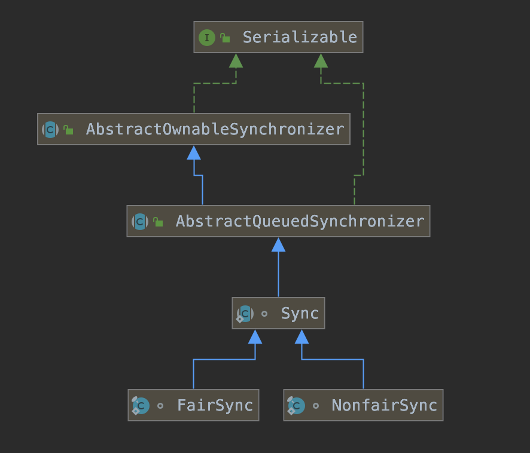

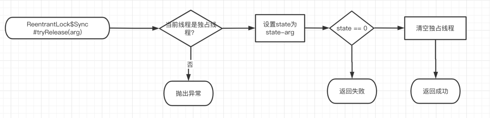

#### 二、ReentrantReadWriteLock
> state为int类型，高16位用于读锁，低16位用于写锁。默认非公平锁。

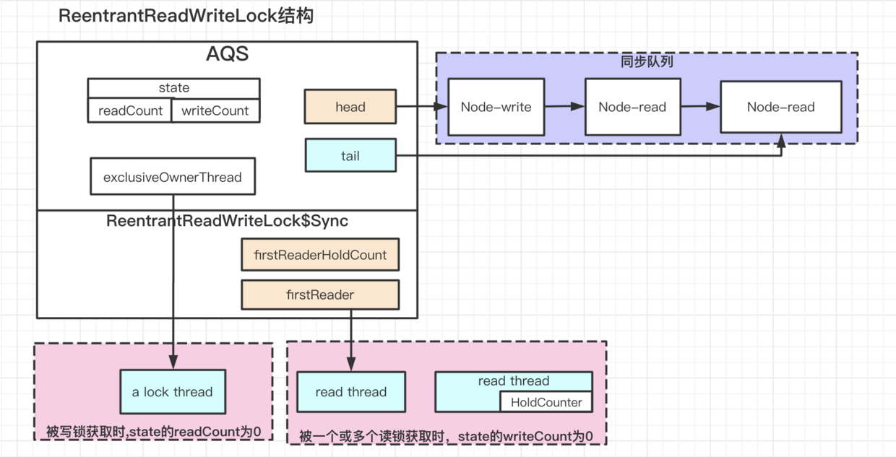

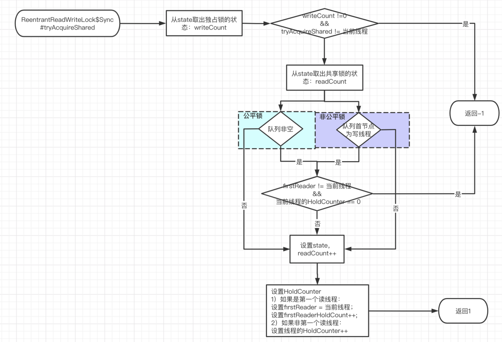

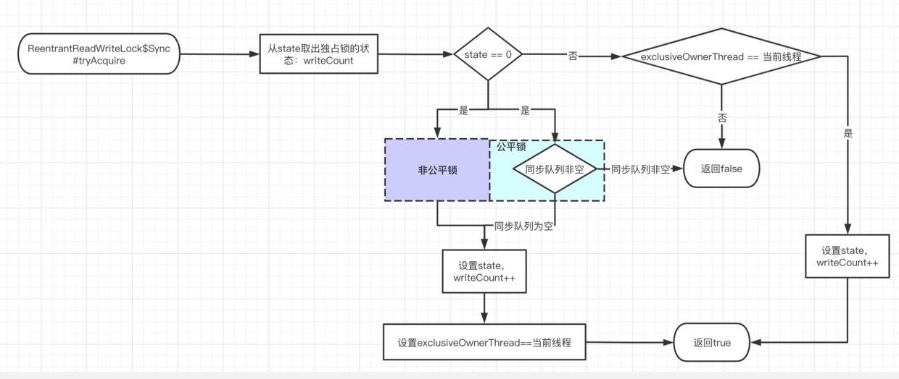

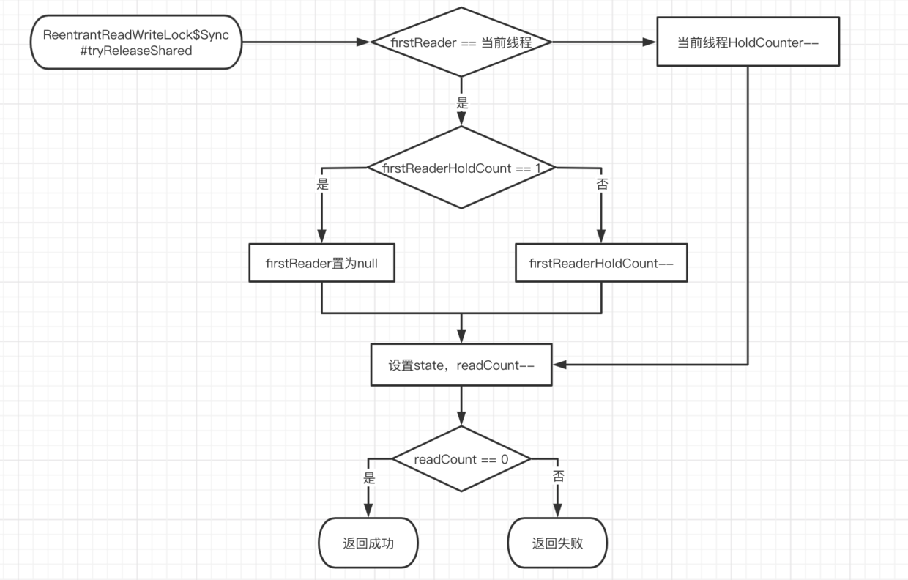

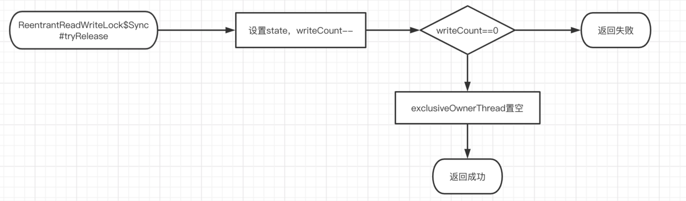

#### 三、Semaphore

> state表示许可数量。默认非公平锁。

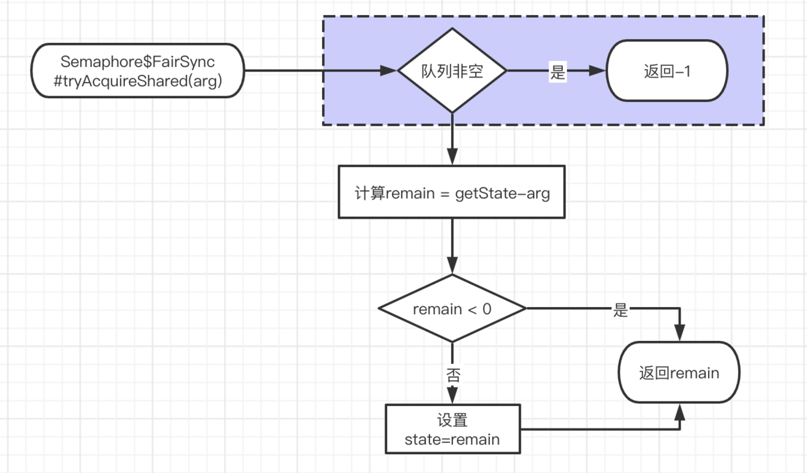

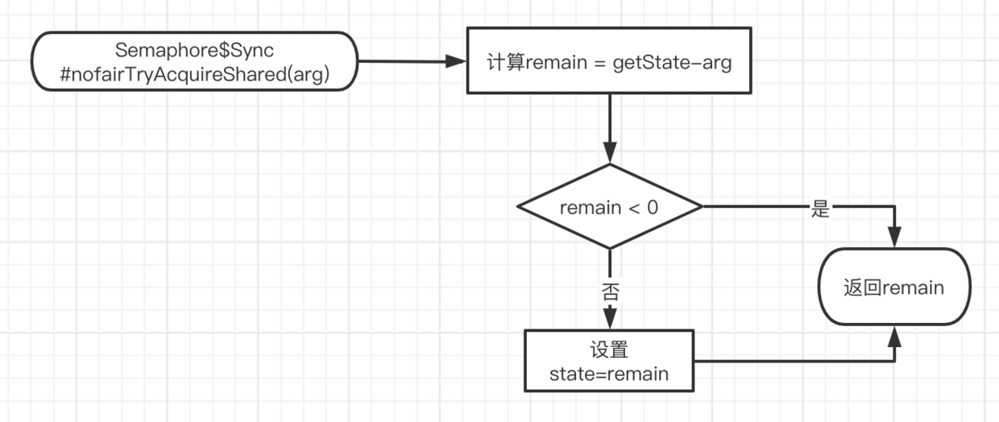

#### 四、CountDownLatch
> state是初始化时传入的参数。

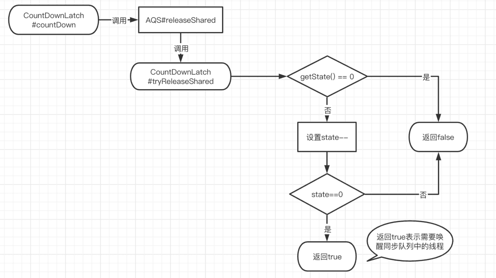

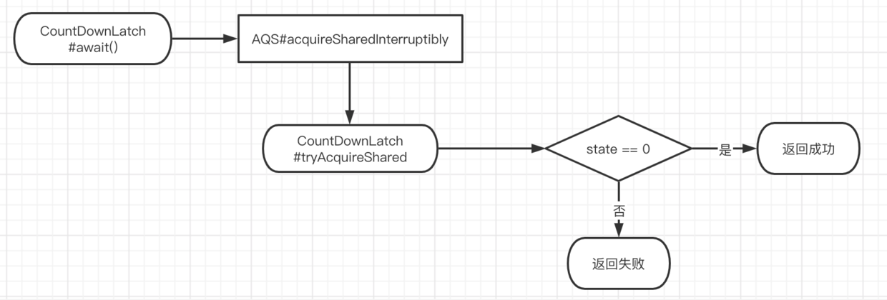