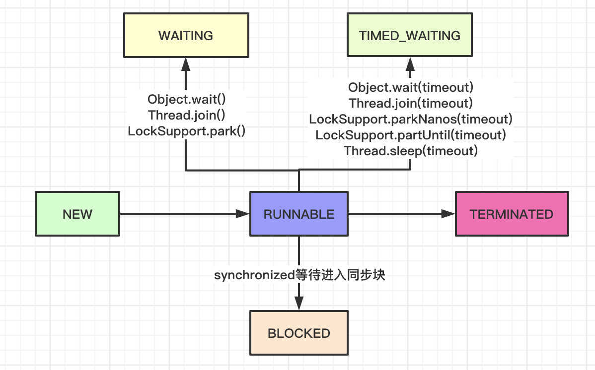
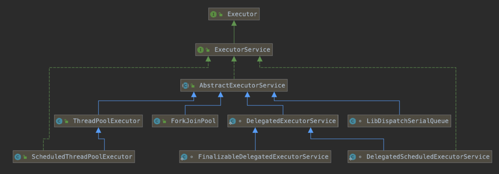
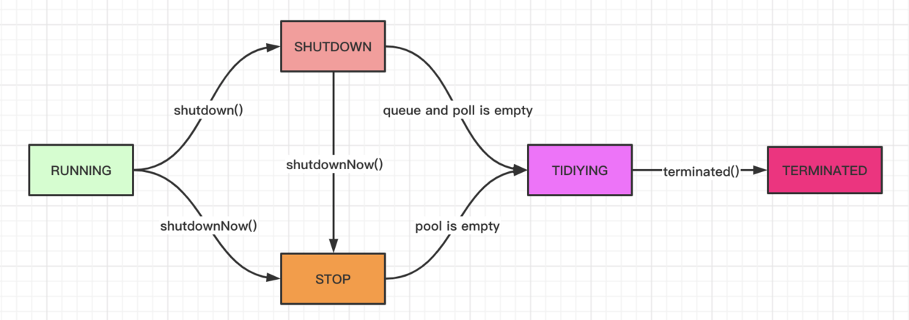
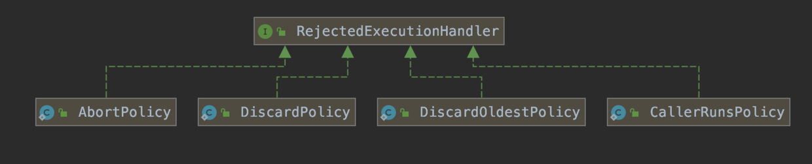
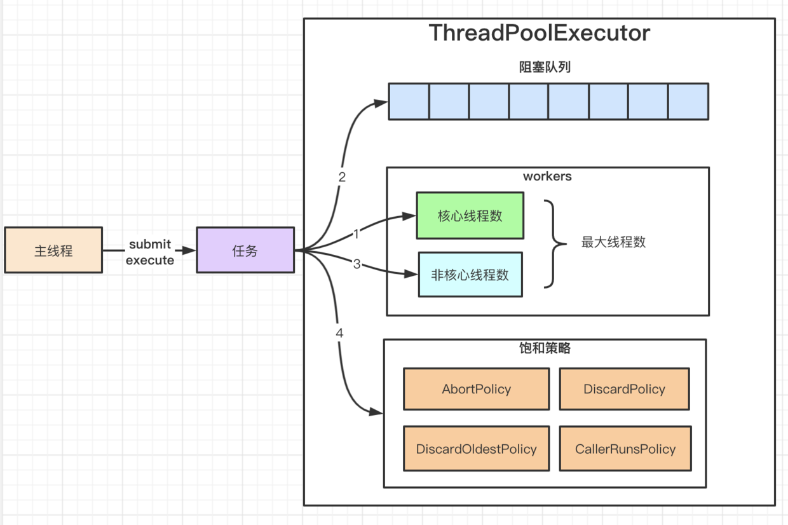
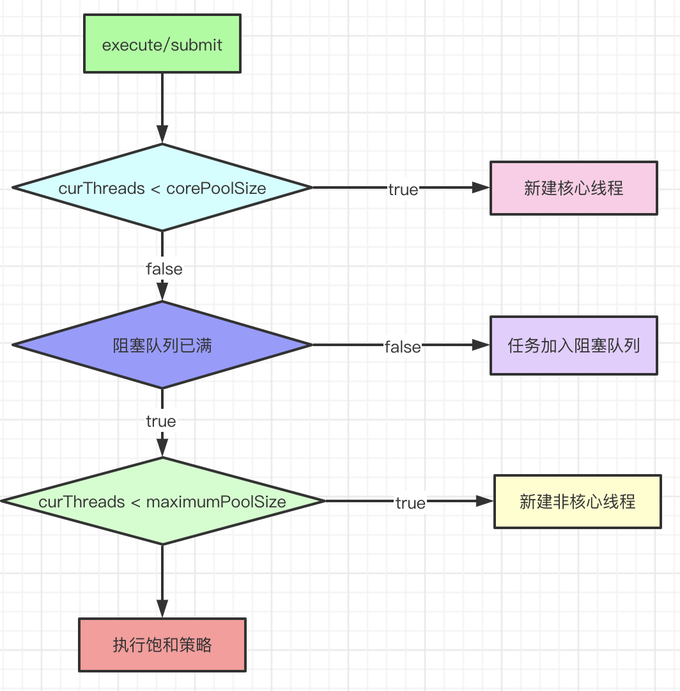

#### 一、前置问题

1. 线程的状态转换
1. 为什么要使用线程池
1. 线程池的继承体系
1. 线程池使用的场景
1. 线程数的设置规则
1. 线程池的状态转换
1. 线程池的关键参数
1. 线程池的接收任务后的执行流程
1. 线程池的异常处理
1. submit和exec的区别
11. 线程池的拒绝策略
#### 二、进程和线程

* 进程是分配资源的最小单位，进程间资源隔离
* 线程是CPU调度的最小单位
* 一个进程往往包含多个线程，多个线程在进程内可共享进程的资源
* 多线程可简化编程，把涉及并发和多步的问题域映射为多线程；
#### 三、线程的状态
通过`java.lang.Thread#getState`方法可以获取当前线程状态，其用枚举标识。

```java
  /**
     * A thread can be in only one state at a given point in time.
     * These states are virtual machine states which do not reflect
     * any operating system thread states.
     *
     * @since   1.5
     * @see #getState
     */
    public enum State {
        /**
         * Thread state for a thread which has not yet started.
         */
        NEW,

        /**
         * Thread state for a runnable thread.  A thread in the runnable
         * state is executing in the Java virtual machine but it may
         * be waiting for other resources from the operating system
         * such as processor.
         */
        RUNNABLE,

        /**
         * Thread state for a thread blocked waiting for a monitor lock.
         * A thread in the blocked state is waiting for a monitor lock
         * to enter a synchronized block/method or
         * reenter a synchronized block/method after calling
         * {@link Object#wait() Object.wait}.
         */
        BLOCKED,

        /**
         * Thread state for a waiting thread.
         * A thread is in the waiting state due to calling one of the
         * following methods:
         * <ul>
         *   <li>{@link Object#wait() Object.wait} with no timeout</li>
         *   <li>{@link #join() Thread.join} with no timeout</li>
         *   <li>{@link LockSupport#park() LockSupport.park}</li>
         * </ul>
         *
         * <p>A thread in the waiting state is waiting for another thread to
         * perform a particular action.
         *
         * For example, a thread that has called <tt>Object.wait()</tt>
         * on an object is waiting for another thread to call
         * <tt>Object.notify()</tt> or <tt>Object.notifyAll()</tt> on
         * that object. A thread that has called <tt>Thread.join()</tt>
         * is waiting for a specified thread to terminate.
         */
        WAITING,

        /**
         * Thread state for a waiting thread with a specified waiting time.
         * A thread is in the timed waiting state due to calling one of
         * the following methods with a specified positive waiting time:
         * <ul>
         *   <li>{@link #sleep Thread.sleep}</li>
         *   <li>{@link Object#wait(long) Object.wait} with timeout</li>
         *   <li>{@link #join(long) Thread.join} with timeout</li>
         *   <li>{@link LockSupport#parkNanos LockSupport.parkNanos}</li>
         *   <li>{@link LockSupport#parkUntil LockSupport.parkUntil}</li>
         * </ul>
         */
        TIMED_WAITING,

        /**
         * Thread state for a terminated thread.
         * The thread has completed execution.
         */
        TERMINATED;
    }
```



#### 四、线程池

##### 1. 为什么使用线程池
* 减少线程创建和销毁的开销
* 提高响应速度，因为去掉了线程创建的时间
* 更好的管控线程，例如控制线程创建数，避免线程创建过多导致资源耗尽
##### 2. 使用场景

* 使用线程池处理的任务不能有依赖关系，否则会导致并发度下降，甚至会有死锁发生；
* 常用于处理执行时间较短，但又数量大的任务；
##### 3. 继承体系


##### 4. 线程池的状态

```java
/**
*   RUNNING:  Accept new tasks and process queued tasks
*   SHUTDOWN: Don't accept new tasks, but process queued tasks
*   STOP:     Don't accept new tasks, don't process queued tasks,
*             and interrupt in-progress tasks
*   TIDYING:  All tasks have terminated, workerCount is zero,
*             the thread transitioning to state TIDYING
*             will run the terminated() hook method
*   TERMINATED: terminated() has completed
*/
 // runState is stored in the high-order bits
private static final int RUNNING    = -1 << COUNT_BITS;
private static final int SHUTDOWN   =  0 << COUNT_BITS;
private static final int STOP       =  1 << COUNT_BITS;
private static final int TIDYING    =  2 << COUNT_BITS;
private static final int TERMINATED =  3 << COUNT_BITS;
```


#### 五、ThreadPoolExecutor

##### 1. 初始化参数
```java
 /**
     * Creates a new {@code ThreadPoolExecutor} with the given initial
     * parameters.
     *
     * @param corePoolSize the number of threads to keep in the pool, even
     *        if they are idle, unless {@code allowCoreThreadTimeOut} is set
     * @param maximumPoolSize the maximum number of threads to allow in the
     *        pool
     * @param keepAliveTime when the number of threads is greater than
     *        the core, this is the maximum time that excess idle threads
     *        will wait for new tasks before terminating.
     * @param unit the time unit for the {@code keepAliveTime} argument
     * @param workQueue the queue to use for holding tasks before they are
     *        executed.  This queue will hold only the {@code Runnable}
     *        tasks submitted by the {@code execute} method.
     * @param threadFactory the factory to use when the executor
     *        creates a new thread
     * @param handler the handler to use when execution is blocked
     *        because the thread bounds and queue capacities are reached
     * @throws IllegalArgumentException if one of the following holds:<br>
     *         {@code corePoolSize < 0}<br>
     *         {@code keepAliveTime < 0}<br>
     *         {@code maximumPoolSize <= 0}<br>
     *         {@code maximumPoolSize < corePoolSize}
     * @throws NullPointerException if {@code workQueue}
     *         or {@code threadFactory} or {@code handler} is null
     */
    public ThreadPoolExecutor(int corePoolSize,
                              int maximumPoolSize,
                              long keepAliveTime,
                              TimeUnit unit,
                              BlockingQueue<Runnable> workQueue,
                              ThreadFactory threadFactory,
                              RejectedExecutionHandler handler) {
     ……
    }
```
1）corePoolSize：线程池核心线程数，即使空闲也不会结束；
2）maximumPoolSize：线程池可创建的最大线程数
3）keepAliveTime：非核心线程等待任务的最大时间，超过该时间线程会终止
4）unit：时间单位
5）workQueue：存放任务的阻塞队列
6）threadFactory：线程工厂，可用于定制线程的名称和异常处理等；
7）handler：线程池的饱和策略，当阻塞队列放满且线程达到最大值时，新提交的任务会通过具体的饱和策略进行处理。

* AbortPolicy：默认策略，抛出RejectedExecutionException异常；
* DiscardPolicy:  忽略，不执行任何逻辑；
* DiscardOldestPolicy: 抛弃旧的任务，然后再次提交任务
* CallerRunsPolicy: 提交任务的线程执行任务



##### 2. 提交任务：submit和execute区别
1）submit会调用newTaskFor方法封装任务为FutureTask，然后调用execute，返回FutureTask。

```java
 public class FutureTask<V> implements RunnableFuture<V> {
        public void run() {
            if (state != NEW || !UNSAFE.compareAndSwapObject(this, runnerOffset, null, Thread.currentThread()))
                return;
            try {
                Callable<V> c = callable;
                if (c != null && state == NEW) {
                    V result;
                    boolean ran;
                    try {
                        result = c.call();
                        ran = true;
                    } catch (Throwable ex) {
                        result = null;
                        ran = false;
                        setException(ex);
                    }
                    if (ran)
                        set(result);
                }
            } finally {
                // runner must be non-null until state is settled to
                // prevent concurrent calls to run()
                runner = null;
                // state must be re-read after nulling runner to prevent
                // leaked interrupts
                int s = state;
                if (s >= INTERRUPTING)
                    handlePossibleCancellationInterrupt(s);
            }
        }
    }
```
FutureTask执行时会catch任务执行的异常，调用Future.get方法时会抛出异常；
2）execute没有返回值，异常会直接抛出；
##### 3. 原理
当通过sumite或execute提交一个任务时，有以下3个场景：
1）如果线程池的线程数小于corePoolSize
新建核心线程，并把提交的任务作为该线程处理的第一个任务；

2）如果线程池的线程数不小于corePoolSize
把任务加入阻塞队列；

3）如果加入阻塞队列失败
新建非核心线程，并把提交的任务作为该线程处理的第一个任务；

4）如果核心线程池已到达最大值
执行跑和策略



##### 4. 异常处理
// TODO

