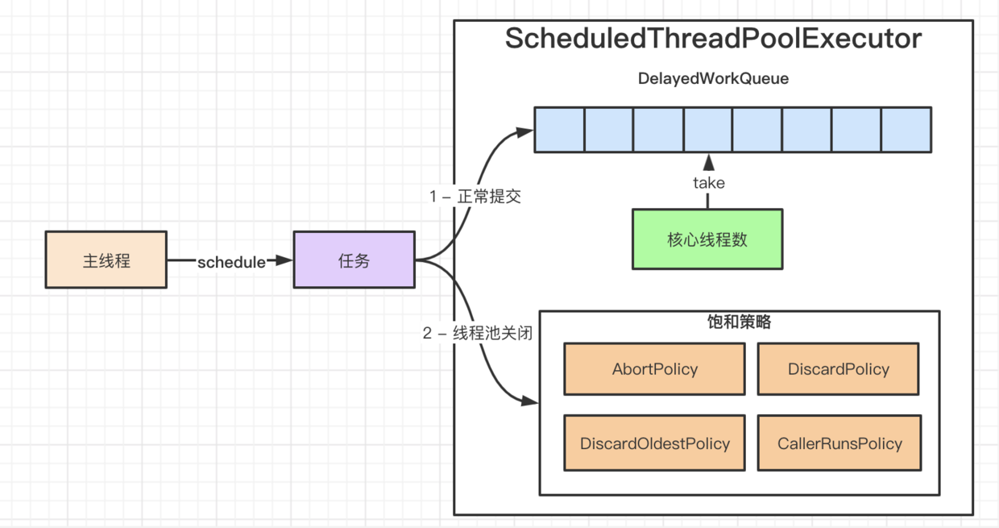

#### 一、前置问题

1. 类继承层级
1. 使用场景
1. 执行原理
1. 任务执行时间超出period或delay后的处理逻辑
1. DelayedWorkQueue实现原理
1. ScheduledThreadPoolExecutor和Timer的区别
7. scheduleAtFixedRate和scheduleWithFixedDelay的区别

#### 二、类继承层级


#### 三、使用场景

1. 服务注册发送心跳
2. 定时拉取FTP文件
3. EDI里定时执行git pull，同步git仓库
4. 分布式锁
#### 四、执行原理

##### 1. ScheduledThreadPoolExecutor的4个提交任务的方法
1）public ScheduledFuture<?> schedule(Runnable command, long delay, TimeUnit unit)

添加延迟任务

2）public <V> ScheduledFuture<V> schedule(Callable<V> callable, long delay, TimeUnit unit)

添加延迟任务

3）public ScheduledFuture<?> scheduleAtFixedRate(Runnable command, long initialDelay, long period, TimeUnit unit)

添加固定速率的周期任务

4）public ScheduledFuture<?> scheduleWithFixedDelay(Runnable command, long initialDelay, long delay, TimeUnit unit)

添加固定延迟的周期任务

##### 2.执行流程

1. 把任务封装为ScheduledFutureTask
1. 把任务加入优先级队列，任务会在队列内排序
1. 若线程数小于核心线程，则增加线程


#### 3. ScheduledFutureTask

1）关键属性

* time：任务触发的时间
* period：任务执行的间隔，如果是fixRate，则是正数；如果是fixDelay，则是负数；
* sequenceNumber：序列号，为任务的提交顺序

2）实现比较接口，为任务插入优先级队列排序提供支持
* 先按time排序；
* 若time相同，再按Sequence排序；
```java
public int compareTo(Delayed other) {
            if (other == this) // compare zero if same object
                return 0;
            if (other instanceof ScheduledFutureTask) {
                ScheduledFutureTask<?> x = (ScheduledFutureTask<?>)other;
                long diff = time - x.time;
                if (diff < 0)
                    return -1;
                else if (diff > 0)
                    return 1;
                else if (sequenceNumber < x.sequenceNumber)
                    return -1;
                else
                    return 1;
            }
            long diff = getDelay(NANOSECONDS) - other.getDelay(NANOSECONDS);
            return (diff < 0) ? -1 : (diff > 0) ? 1 : 0;
        }
```
3）任务执行后，重置下次的执行时间；并发任务再次插入优先级队列；
* 如果是fixRate，则下次执行时间是`本次执行时间  + 时间间隔`
* 如果是fixDelay，则下次执行时间是`当前时间 + 时间间隔`
```java
private void setNextRunTime() {
            long p = period;
            if (p > 0)
                time += p;
            else
                time = triggerTime(-p);
        }
```
#### 4. DelayedWorkQueue


1. 内含一个无界的PriorityQueue - 小顶堆实现
1. 为减少不必要的定时等待，其实现了一个主从模式变体的等待模型。
```java
static class DelayedWorkQueue extends AbstractQueue<Runnable>
        implements BlockingQueue<Runnable> {
/**
* 指定在队列的最前面等待任务的线程。
* 这种主从模式的变体减少不必要的定时等待。当一个线程成为leader线程时，它只等待下一个延迟过去，而其他线程则无限期地等待。
* 在从take（）或poll（…）返回之前，leader线程必须向其他线程发出信号，除非其他线程在此期间成为leader。
* 每当队列的头被替换为具有较早到期时间的任务时，leader字段将通过重置为null而失效，并向某些等待线程（但不一定是当前的leader）发出信号。
* 因此，等待线程必须做好准备，以便在等待期间获得和失去领导权。
**/
Thread leader = null;
private final ReentrantLock lock = new ReentrantLock();
/**
* 条件队列，唤醒条件：1）队首的任务到达执行时间；2）需要启用新的线程成为leader。
**/
private final Condition available = lock.newCondition();

}
```
#### 五、 ScheduledThreadPoolExecutor和Timer的区别
1）Timer是单线程，ScheduledThreadPoolExecutor基于线程池

2）Timer不捕获异常，异常会导致线程挂掉；ScheduledThreadPoolExecutor捕获异常，会保证线程数；

3）Timer基于绝对时间；ScheduledThreadPoolExecutor基于相对时间，任务执行结束后重新计算；

#### 六、任务取消和任务异常的处理逻辑

```java
ScheduledThreadPoolExecutor$ScheduledFutureTask
         /**
         * Overrides FutureTask version so as to reset/requeue if periodic.
         */
        public void run() {
            boolean periodic = isPeriodic();
            if (!canRunInCurrentRunState(periodic))
                cancel(false);
            else if (!periodic)
                ScheduledFutureTask.super.run();
            else if (ScheduledFutureTask.super.runAndReset()) {
                setNextRunTime();
                reExecutePeriodic(outerTask);
            }
        }
```
1）调用FutureTask#cancel方法，会把任务标示为取消态；然后在ScheduledFutureTask#run中调用runAndReset时会判断状态，如果不是NEW则直接返回false；于是会`忽略执行逻辑和再次把任务添加到任务队列的逻辑`；

>NOTE：可以设置setRemoveOnCancelPolicy为true，直接在cancel时把任务从队列中移除，而不用等到任务执行，这可以避免有的任务的延迟很长，短时间内执行不到，占用队列的空间；

2）任务异常时，runAndRest会返回false，于是会`忽略把任务添加到任务队列的逻辑`；