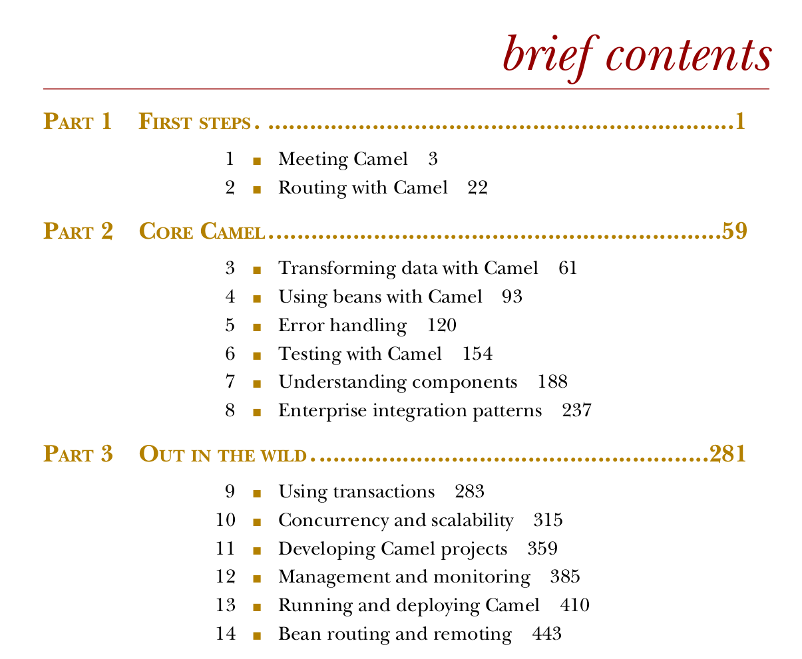
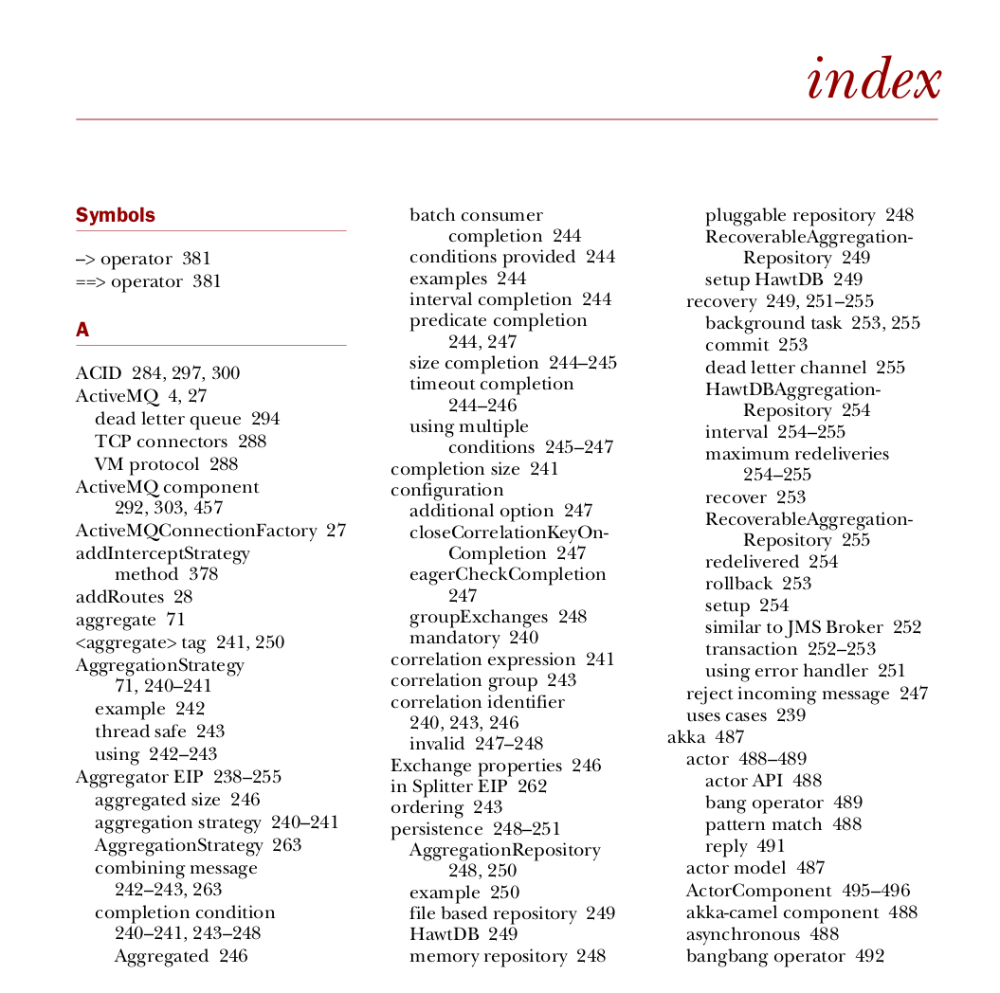
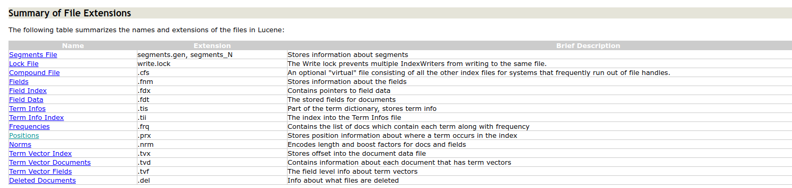
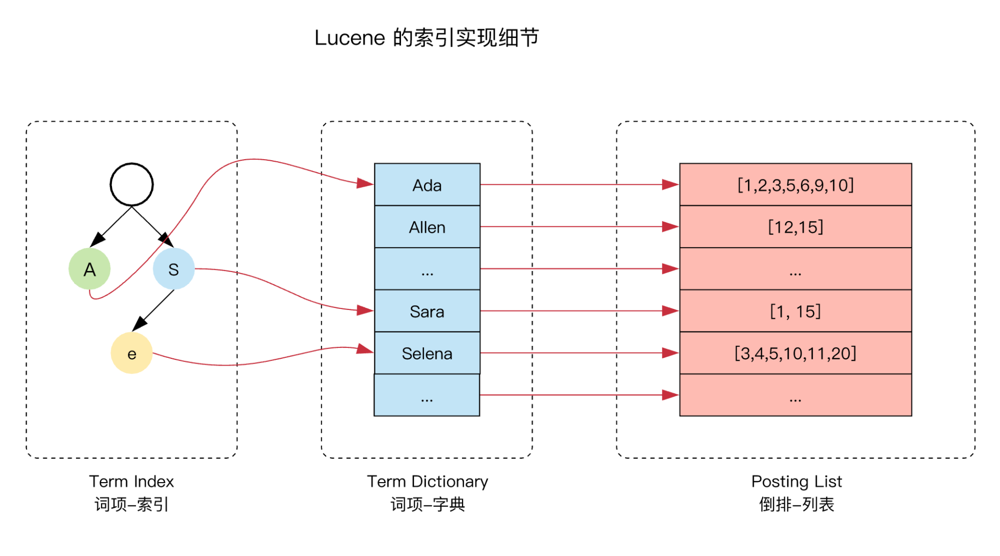

#### 一、倒排索引

#### 倒排索引概念

倒排索引是适用于全文检索的一种索引结构，ES使用的正是这种结构。把一段需要建立倒排索引的文本（document）进行分词，然后建立词（term）到文本（document）的一对多的映射关系。这种由document内容反向索引documentId的映射结构，称为反向索引。

与反向索引相对的是正向索引，其会根据docuemntId去索引文本内容。

#### 书籍类比

> 书籍每页的内容可看作document，页码可看作documentId，关键字可看作term。

正排索引相当于书籍的目录，我们可以根据页码索引到文章：

倒排索引则相当于书籍后面的关键字索引，我们可以根据关键字索引到包含其的文档的页码。

#### 二、ES倒排索引结构

> ES的倒排索引是Index内document的field级别的([参考](https://codingexplained.com/coding/elasticsearch/understanding-the-inverted-index-in-elasticsearch))。即，每个Index下document中需要建立索引的field，都会建立一个单独的倒排索引结构。

ES是Lucene的封装，底层用的是lucene存储结构，[lucene存储结构链接](https://lucene.apache.org/core/3_0_3/fileformats.html#Positions)，其所有文件类型如下：

从其文档可看出，Lucene把term位置，出现频率，term字典单独存储，然后在term字典里隐式的指向了频率文件，位置文件的位置。

下面图片（[图片来源](https://ningg.top/elastic-series-03-elastic-lucene-data-structure/)）与Lucene文件的对应关系：

1）Posting List对应`.prx`文件；

2）Term Dictionary对应`.tis`文件

3）Term Index对应`.tii`文件

#### 参考

1. [ES官方文档 —— 倒排索引](https://www.elastic.co/guide/cn/elasticsearch/guide/current/inverted-index.html)
2. [Lucene官方文档——倒排索引文件格式](https://lucene.apache.org/core/3_0_3/fileformats.html)
3. [stackoverflow - whats-the-difference-between-an-inverted-index-and-a-plain-old-index](https://stackoverflow.com/questions/7727686/whats-the-difference-between-an-inverted-index-and-a-plain-old-index)
4. https://codingexplained.com/coding/elasticsearch/understanding-the-inverted-index-in-elasticsearch