> 本文来源：[安全VPN封装大法之万法归宗](http://www.h3c.com/cn/d_201411/845971_97665_0.htm)

**一、何方神圣**

VPN是Virtual Private Network虚拟私有网(或者虚拟专用网)的简称，是一种在公共数据网络上安全的传输用户私有信息的网络技术，简单来说，就是“以公谋私”。通过VPN技术，可以实现私有网络的延伸。

* 说明：文中的 “公网”、“私网”只是个相对概念，非泛指通常的Internet和企业网络。“私网”指需要通过VPN处理数据的网络，“公网”指承载VPN报文的网络。

**二、以公谋私**

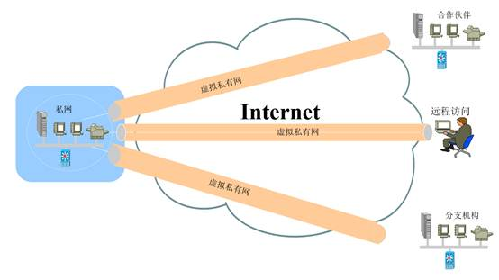

VPN的实现要依靠隧道机制(Tunneling Mechanism)。所谓隧道机制，简单来讲就是“夹带私货”。它类似于将走私物品用集装箱封装起来，然后通过正常的海关手续蒙混过关。走私的物品就可以看做是私网的数据，而正常的入关通道就是公共网络，集装箱就可以看做一种封装。从隧道的实现可以发现，VPN中的私网数据和公网数据，原则上没有任何关系(走私的货物和真正货物)。正是由于这种独立性，保证了公网和私网数据的完全隔离，实现了公网和私网的无关性，一定程度上也实现了安全性。

上图1中，列出了三种应用类型的VPN接入方式(Access VPN、Intranet VPN和Extranet VPN)，对应了三条隧道(Tunnel)。每条Tunnel将VPN的两端连接在一起，这些Tunnel是承载在IP网络上，通过Tunnel传输的数据和承载Tunnel的网络，是彼此透明的。

现实世界中的隧道，既可以上天入地，也可以穿山越岭。IP网络中的VPN隧道也类似，既可以搭建在数据链路层，也可以搭建在网络层，还可以搭建在传输层，甚至是应用层。如果是搭建在数据链路层，我们把它叫做二层隧道VPN，如果是搭建在网络层VPN我们把它叫做三层隧道VPN。实现隧道机制需要具体的隧道协议(Tunnel Protocol)，比如常见的PPTP(Point-to-Point Tunneling Protocol)、L2TP(Layer 2 Tunnel Protocol)、GRE(Generic Routing Encapsulation)、IPSec(IP Security)协议等。由于PPP协议工作在数据链路层，因此通过PPTP、L2TP(或L2F)协议实现的VPN属于二层隧道VPN；而GRE、IPSec协议封装的主要是IP报文，因此依靠他们实现的VPN就是三层隧道VPN。

我们再来捋一捋刚才讲的几个概念：VPN、隧道机制、隧道协议。简单来讲，VPN是一种在公网上传输私网数据的技术；而VPN之所以能“以公谋私”，必须依靠隧道机制，隧道就是VPN的实现方式；而隧道的建立又要依赖于具体的隧道协议。因此，所谓的*XXX* VPN，就是利用*XXX*协议来构建隧道的VPN技术。

**三、万法归宗**

隧道协议在对数据包的处理上，使用的是封装(Encapsulation)技术。下图2是封装技术的通用表示。承载(Overlay)私网数据的协议可以叫做乘客协议，封装私网数据的协议就是隧道协议，而承载封装后的私网数据的协议叫做运输协议。对应到现实生活中，以银行的运钞车为例，乘客协议可以看做银行的货物(钞票、贵金属等)，而封装协议可以看做运钞车本身，运输协议可以看做是公路(说是车轮也未尝不可，但是公路更合适)。货物被车厢所封装，然后车厢在公路上进行传输。我们站在路旁，对外看到的只是黑乎乎的运钞车，里面的钞票看不到。

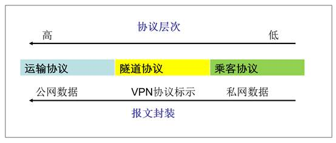

将上面的通用封装方式对应到数据包的处理上，VPN协议的报文封装可以概括成下面的形式：

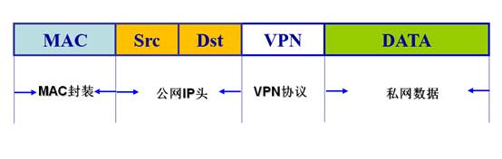

(1) 私网数据，代表真正的私网业务数据，也就是 “货物”。

(2) VPN协议，代表隧道协议，用于将私网数据封装起来，完成“装车”工作；

(3) 公网IP头，代表运输协议为IP协议，属于承载运送车的的“公路”；

(4) MAC封装代表以太网头部，完成对公网IP报文的以太封装；

接下来，我们可以看到，GRE、L2TP和IPSec的封装方式都是上图的形式，几乎所有的IP VPN也都采用的上述的封装方式，这也就是我们说VPN封装大法万法归宗的道理。

**四、封装大法**

下面我们来选取三种常见的VPN协议GRE、L2TP、IPSec，来看具体的报文封装是怎么样的。

**1**、**GRE**的封装方式

GRE（Generic Routing Encapsulation，通用路由封装）实际上是一种封装方法的名称，而不是指VPN。GRE封装并不要求任何一种对应的VPN协议或实现。所谓GRE VPN，只是使用了GRE来实现封装的一种VPN技术而已。

首先我们通过GRE协议来理解下封装是如何实现的。GRE的封装属于IP over IP的方式，第一个IP代表私网IP报文，属于VPN里面的运输协议；第二个IP代表外部封装的公网IP头，属于乘客协议；而两个IP中间通过VPN协议GRE来连接起来。

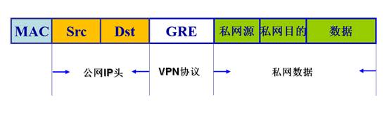

下面是一个简要的示例组网，路由器R1和R2之间通过公共网络连接彼此的物理接口，并依赖物理接口进行实际的通信。两个路由器上分别建立一个虚拟接口——Tunnel接口，两个Tunnel接口之间建立点对点的虚拟连接，就形成了一条跨越公共网络的隧道，私网1和2之间的IP数据包通过这条隧道来进行传输，这就是GRE VPN的实现。

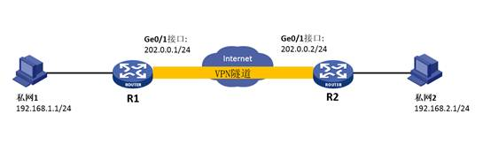

我们从私网1的地址192.168.1.1向私网2的地址192.168.2.1发起一个ping操作，然后在路由器R1和R2之间的线路上进行抓包，通过Wireshark的解析我们可以清楚的看到GRE的封装过程（图7）。

(1) ICMP的控制报文被封装在最里面，属于真正的数据载荷；

(2) 封装数据载荷的是私网IP协议， IP数据包的源地址为私网1的地址192.168.1.1，目的地址为私网2的地址192.168.2.1；

(3) 接下来是中间的VPN协议进行连接，此处为GRE；

(4) 最外层封装的是公网IP头，源地址是路由器R1的外网地址202.0.0.1，目的地址是路由器R2的外网地址202.0.0.2 。

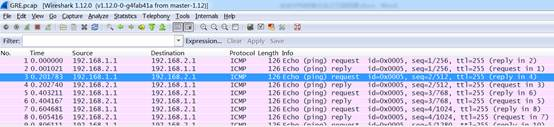

**2**、**L2TP**的封装方式

PPP（Point-to-Point Protocol）协议定义了一种封装技术，可以在二层的点到点链路上传输多种协议数据包。 L2TP提供了对PPP链路层数据包的隧道传输支持，从而扩展了PPP模型。

L2TP报文的封装格式如下：可以看到L2TP之下封装的是PPP报文，而PPP属于二层协议，因此我们说L2TP是二层隧道协议。而PPP里面封装的才是真正的私网IP报文。

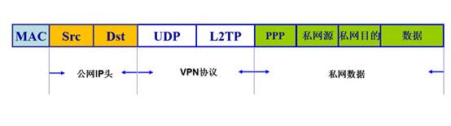

可以看到L2TP之下封装的是PPP报文，而PPP属于二层协议，因此我们说L2TP是二层隧道协议，而PPP里面封装的才是真正的私网IP报文。

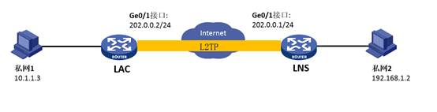

如上图的示例组网，LAC和LNS之间建立L2TP隧道，我们从私网1地址10.1.1.3向私网2地址192.168.1.2发起ping操作，此时在LAC和LNS之间的公网链路上进行抓包，我们来看一下L2TP的封装过程(图11)：

(1) ICMP的控制报文被封装在最里面，属于真正的数据载荷；

(2) 数据载荷被私网IP协议封装，IP数据包的源地址为私网1的地址10.1.1.3，目的地址为私网2的地址192.168.1.2；

(3) 接下来是PPP协议的封装，L2TP正是通过PPP协议来实现了认证、授权和计费(AAA)的功能，可以简单的将PPP看做L2TP VPN中的控制协议；

(4) 再然后是中间的VPN协议L2TP；

(5) 整个的L2TP报文，包括L2TP头及其载荷，都封装在UDP数据报中发送；

(6) UDP报文被继续封装到IP报文中，最外层的IP头就是公网IP头，IP数据包的源地址为LAC的公网地址202.0.0.2，目的地址为LNS的公网地址202.0.0.1 。

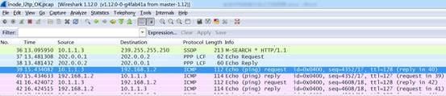

**3**、**IPSec**的封装方式

IPSec是IETF制定的保证在IP网络上传送数据的安全保密性的三层安全协议，它本身并不是一个单独的协议，而是一个协议族，IPSec的封装协议包括报文验证头协议AH（协议号51） 和封装安全载荷协议ESP（协议号50），这两个协议都是用于处理私网IP数据包的。

IPSec有隧道（Tunnel）和传输（Transport）两种工作方式。在隧道模式中，私网整个IP数据包被被AH或ESP封装，封装后的数据再被封装到公网IP中传输；在传输模式中，只有真正的数据载荷部分被AH或ESP封装，然后外层再封装新的公网IP头。从报文封装上来看，传输模式和隧道模式的区别就是“加不加私网IP头的问题”。

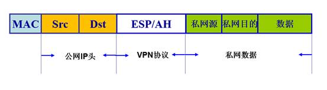

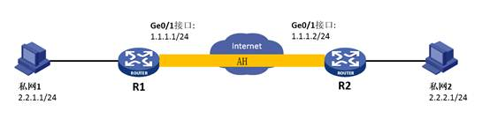

由于被ESP封装的报文是加密处理的，无法再查看具体的报文内容，我们选择AH协议来讲解封装过程。同时，为了能够看到私网IP报文处理的完整过程，我们选择了IPSec的隧道模式。

在上面的示例组网中，R1和R2建立AH封装方式的IPSec隧道，私网1地址2.2.1.1/24向私网2地址2.2.2.1/24发起ping操作，此报文被中间的IPSec封装处理，我们来看一下具体的封装过程(图14)：

(1) ICMP的控制报文被封装在最里面，属于真正的数据载荷。

(2) 数据载荷被私网IP协议封装，IP数据包的源地址为私网1地址2.2.1.1，目的地址为私网2地址2.2.2.1

(3) 由于是隧道模式，AH协议对整个IP报文进行处理，新增加的AH头封装到私网IP头外层。其实本质上来讲，AH并不是一个VPN协议，而是一个对私网报文头进行验证的报文处理协议。但由于它契合了VPN的隧道封装精髓，所以也能作为一个VPN实现。

(4) 接下来被AH处理的报文被封装到公网IP报文中，封装后的公网IP报文源地址是R1的公网地址1.1.1.1，目的地址是R2的公网地址1.1.1.2

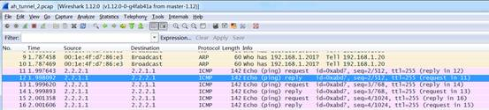

**五、醍醐灌顶**

上面便是我们介绍的三种VPN的报文封装方式，本文并没有讲解VPN的协商和处理流程，而是聚焦在报文的封装处理细节上，相应的解封装过程可以看做封装过程的逆过程，本文不赘述。

从上面三种VPN的数据封装方式大家可以看到，隧道的实现本质上就是数据报文封装。所谓的封装，基本上就是如下的路数：原始的载荷被私网IP封装à中间VPN协议连接起公网和私网à公网IP报文作为运输协议传输VPN数据。不同之处无非就在于具体的封装实现上，不同的封装方式也就有了不同的VPN技术。