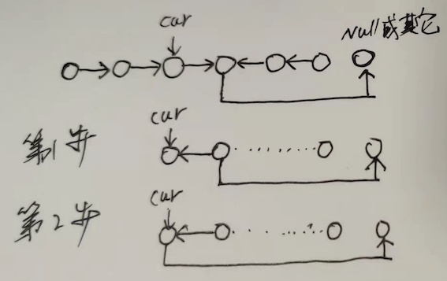

## 一、链表常见题

### 1、链表翻转

**方法**

递归后序遍历进行处理

**图示**



**题目**

- [奇升偶降链表排序](https://mp.weixin.qq.com/s/0WVa2wIAeG0nYnVndZiEXQ)
- [206. 反转链表](https://leetcode-cn.com/problems/reverse-linked-list/)
- [25. K 个一组翻转链表](https://leetcode-cn.com/problems/reverse-nodes-in-k-group/)

### 2、链表合并

**方法**

空头节点、双指针、优先级队列

**题目**

- [奇升偶降链表排序](https://mp.weixin.qq.com/s/0WVa2wIAeG0nYnVndZiEXQ)

### 3、链表遍历

**方法**

空头节点、快慢指针

**题目**

* [138. 复制带随机指针的链表](https://leetcode-cn.com/problems/copy-list-with-random-pointer/)
* [141. 环形链表](https://leetcode-cn.com/problems/linked-list-cycle/)
* [142. 环形链表 II](https://leetcode-cn.com/problems/linked-list-cycle-ii/)
* [143. 重排链表](https://leetcode-cn.com/problems/reorder-list/)

## 二、字符串常见题

### 1、字符匹配

**方法**

动态规划+备忘录

KMP

```java
public class KMP {
    private int[][] dp;
    private String pat;
  
    public KMP(String pat) {
        this.pat = pat;
        int M = pat.length();
        // dp[状态][字符] = 下个状态
        dp = new int[M][256];
        // base case
        dp[0][pat.charAt(0)] = 1;
        // 影子状态 X 初始为 0
        int X = 0;
        // 当前状态 j 从 1 开始
        for (int j = 1; j < M; j++) {
            for (int c = 0; c < 256; c++) {
                if (pat.charAt(j) == c) 
                    dp[j][c] = j + 1;
                else 
                    dp[j][c] = dp[X][c];
            }
            // 更新影子状态
            X = dp[X][pat.charAt(j)];
        }
    }

    public int search(String txt) {...}
}
```


**题目**

- [10.正则表达式匹配](https://leetcode-cn.com/problems/regular-expression-matching/)
- [28. 实现 strStr() - KMP](https://leetcode-cn.com/problems/implement-strstr/)

### 2、公共子序列

**方法**

动态规划，二分法

**题目**

- [1143.最长公共子序列](https://leetcode-cn.com/problems/longest-common-subsequence/)
- [392. 判断子序列](https://leetcode-cn.com/problems/is-subsequence/)
- 最长递增子序列
    - [354. 俄罗斯套娃信封问题 - 首升尾降 转为求尾单调递增子序列](https://leetcode-cn.com/problems/russian-doll-envelopes/)


### 3、括号问题

**方法**

借助栈

```java
Stack<Integer> stk = new Stack<>();
for (int i = 0; i < s.length(); i++) {
    if (s.charAt(i) == '(') {
        // 遇到左括号，记录索引
        stk.push(i);
    } else {
        // 遇到右括号
        if (!stk.isEmpty()) {
            // 配对的左括号对应索引，[leftIndex, i] 是一个合法括号子串
            int leftIndex = stk.pop();
            // 这个合法括号子串的长度
            int len = 1 + i - leftIndex;
        } else {
            // 没有配对的左括号
        }
    }
}
```

**题目**

* [20. 有效的括号](https://leetcode-cn.com/problems/valid-parentheses/)
* [1541. 平衡括号字符串的最少插入次数](https://leetcode-cn.com/problems/minimum-insertions-to-balance-a-parentheses-string/)
* [32. 最长有效括号 - 使用dp数组](https://leetcode-cn.com/problems/longest-valid-parentheses/)
* [921. 使括号有效的最少添加](https://leetcode-cn.com/problems/minimum-add-to-make-parentheses-valid/)

### 4、回文

**方法**

递推，从中间向两侧扩展

**题目**

* [5. 最长回文子串 - 递推 or 从中间向两边扩展](https://leetcode-cn.com/problems/longest-palindromic-substring/)
* [516. 最长回文子序列](https://leetcode-cn.com/problems/longest-palindromic-subsequence/)

## 三、数组/字符串通用解法

### 1、单调函数二分查找

二分查找法

```java
// 单调递减函数上，搜索左侧值
while (left <= right) {
    int mid = left + (right - left) / 2;
    int midVal = func(mid);
    if (midVal > target) {
      left = mid + 1;
    } else {
      right = mid - 1;
    }
}
return left;
```

**题目**

- [1011.D天内运送包裹能力-隐式二分查找](https://leetcode-cn.com/problems/capacity-to-ship-packages-within-d-days/)
- [162. 寻找峰值](https://leetcode-cn.com/problems/find-peak-element/)
- [33. 搜索旋转排序数组-判断在哪个递增区间](https://leetcode-cn.com/problems/search-in-rotated-sorted-array/)
- [4. 寻找两个正序数组的中位数 - 两个数组](https://leetcode-cn.com/problems/median-of-two-sorted-arrays/)
- [410. 分割数组的最大值 - 难于发现隐示二分查找](https://leetcode-cn.com/problems/split-array-largest-sum/)
- [875. 爱吃香蕉的珂珂 - 隐示二分查找](https://leetcode-cn.com/problems/koko-eating-bananas/)

### 2、二维数组排序

首尾两个元素进行排序，第一个元素排序基于问题解决方案，第二个排序用于简化编程（只处理当前元素，不会处理之前扫描过的元素）

**题目**

- [1024.视频拼接 - 首升尾降](https://leetcode-cn.com/problems/video-stitching/)
- [1288. 删除被覆盖区间 - 首升尾降](https://leetcode-cn.com/problems/remove-covered-intervals/)
- [435. 无重叠区间 - 尾升首降](https://leetcode-cn.com/problems/non-overlapping-intervals/)
- [452. 用最少数量的箭引爆气球 - 尾升即可](https://leetcode-cn.com/problems/minimum-number-of-arrows-to-burst-balloons/)
- [56. 合并区间 - 首升尾降](https://leetcode-cn.com/problems/merge-intervals/)
- [354. 俄罗斯套娃信封问题 - 首升尾降 转为求尾单调递增子序列](https://leetcode-cn.com/problems/russian-doll-envelopes/)
    - 普通解法容易超时

### 3、二维数组求交集

```java
// 986. 区间列表的交集
public int[][] intervalIntersection(int[][] firstList, int[][] secondList) {
    int firstIndex = 0;
    int secondIndex = 0;
    List<int[]> ret = new ArrayList<>();
    while (firstIndex < firstList.length && secondIndex < secondList.length) {
        int[] first = firstList[firstIndex];
        int[] second = secondList[secondIndex];
        int[] intersect;
        if (first[1] < second[1]) {
            intersect = getIntersect(first, second);
            firstIndex++;
        } else {
            intersect = getIntersect(second, first);
            secondIndex++;
        }
        if (intersect != null) {
            ret.add(intersect);
        }
    }
    return ret.toArray(new int[][]{});
}

int[] getIntersect(int[] left, int[] right) {
    if (right[0] > left[1]) {
        return null;
    }
    int[] ret = new int[2];
    ret[1] = left[1];
    ret[0] = Math.max(left[0], right[0]);
    return ret;
}
```

**题目**

* [986. 区间列表的交集](https://leetcode-cn.com/problems/interval-list-intersections/)

### 4、差分数组

转为相对落差图

**题目**

- [1109.航班预定统计](https://leetcode-cn.com/problems/corporate-flight-bookings/)
- [134. 加油站](https://leetcode-cn.com/problems/gas-station/)
- [253. 会议室 II - 计算重叠](https://leetcode-cn.com/problems/meeting-rooms-ii/)

### 5、前缀和

* [560. 和为 K 的连续子数组](https://leetcode-cn.com/problems/subarray-sum-equals-k/)

### 6、用Map降低时间复杂度

[经典题目：切分子数组](https://labuladong.gitee.io/algo/4/33/132/)

```java
bool isPossible(vector<int>& nums) {
    unordered_map<int, int> freq;
    unordered_map<int, vector<vector<int>>> need;
    for (int v : nums) freq[v]++;
    for (int v : nums) {
        if (freq[v] == 0) {
            continue;
        }

        if (need.count(v) && need[v].size() > 0) {
            // v 可以接到之前的某个序列后面
            freq[v]--;
            // 随便取一个需要 v 的子序列
            vector<int> seq = need[v].back();
            need[v].pop_back();
            // 把 v 接到这个子序列后面
            seq.push_back(v);
            // 这个子序列的需求变成了 v + 1
            need[v + 1].push_back(seq);
        } else if (freq[v] > 0 && freq[v + 1] > 0 && freq[v + 2] > 0) {
            // 可以将 v 作为开头
            freq[v]--;
            freq[v + 1]--;
            freq[v + 2]--;
            // 新建一个长度为 3 的子序列 [v,v + 1,v + 2]
            vector<int> seq{v, v + 1, v + 2};
            // 对 v + 3 的需求加一
            need[v + 3].push_back(seq);
        } else {
            return false;
        }
    }
    
    // 打印切分出的所有子序列
    for (auto it : need) {
        for (vector<int>& seq : it.second) {
            for (int v : seq) {
                cout << v << " ";
            }
            cout << endl;
        }
    }
    
    return true;
}
```

**题目**

* [28. 最长连续序列](https://leetcode-cn.com/problems/longest-consecutive-sequence/)
* [659. 分割数组为连续子序列](https://leetcode-cn.com/problems/split-array-into-consecutive-subsequences/)

### 7、DFS/回溯/深度遍历/暴力破解

```java
// 695. 岛屿最大面积
public int maxAreaOfIsland(int[][] grid) {
    int max = 0;
    for (int i = 0; i < grid.length; i++) {
        for (int j = 0; j < grid[0].length; j++) {
            if (grid[i][j] != 0) {
                max = Math.max(max, dfs(grid, i, j));
            }
        }
    }
    return max;
}

int[] direction = new int[]{-1, 0, 1, 0, -1};
private int dfs(int[][] grid, int row, int col) {
    if (row < 0 || col < 0 || row >= grid.length || col >= grid[0].length || grid[row][col] == 0) {
        return 0;
    }

    int ret = 1;
    grid[row][col] = 0;
    for (int i = 0; i < 4; i++) {
        ret += dfs(grid, row + direction[i], col + direction[i + 1]);
    }
    return ret;
}
```

**题目**

* [130. 被围绕的区域](https://leetcode-cn.com/problems/surrounded-regions/)
* [37. 解数独](https://leetcode-cn.com/problems/sudoku-solver/)
* [51. N 皇后](https://leetcode-cn.com/problems/n-queens/)
* [695. 岛屿的最大面积](https://leetcode-cn.com/problems/max-area-of-island/)
* [698. 划分为k个相等的子集 - 需要多次合适剪枝，很容易超时](https://leetcode-cn.com/problems/partition-to-k-equal-sum-subsets/)
* [79. 单词搜索](https://leetcode-cn.com/problems/word-search/)
* [797. 所有可能的路径](https://leetcode-cn.com/problems/all-paths-from-source-to-target/)
* [931. 下降路径最小和](https://leetcode-cn.com/problems/minimum-falling-path-sum/)

### 8、数组排列

```java
// 78.子集
public List<List<Integer>> subsets(int[] nums) {
    dfs(nums, 0, new LinkedList());
    return ret;
}

List<List<Integer>> ret = new ArrayList<>();

private void dfs(int[] nums, int i, LinkedList<Integer> route) {
    if (i == nums.length) {
        ret.add(new ArrayList(route));
        return;
    }

    dfs(nums, i + 1, route);
    route.add(nums[i]);
    dfs(nums, i + 1, route);
    route.removeLast();
}
```

**题目**

* [39. 组合总和](https://leetcode-cn.com/problems/combination-sum/)
* [46. 全排列](https://leetcode-cn.com/problems/permutations/)
* [77. 组合 - 排列](https://leetcode-cn.com/problems/combinations/)
* [78. 子集 - 排列](https://leetcode-cn.com/problems/subsets/)

### 9、二维数组对角线遍历

通过row+col的和判断是处于向上/向下，来计算下个坐标。

**题目**

* [498. 对角线遍历](https://leetcode-cn.com/problems/diagonal-traverse/)

### 10、双指针

```java
// 82. 删除排序链表中重复元素
public ListNode deleteDuplicates(ListNode head) {
    ListNode dummy = new ListNode();
    dummy.next = head;
    ListNode slow = dummy;
    ListNode fast = head;
    while (fast != null) {
        if (fast.next != null && fast.val == fast.next.val) {
            int skipVal = fast.val;
            while (fast != null && fast.val == skipVal) {
                fast = fast.next;
            }
        } else {
            slow.next = fast;
            slow = slow.next;
            fast = fast.next;
        }
    }
    slow.next = null;
    return dummy.next;
}
```

**题目**

* [18. 四数之和](https://leetcode-cn.com/problems/4sum/)
* [209. 长度最小的子数组](https://leetcode-cn.com/problems/minimum-size-subarray-sum/)
* [26. 删除有序数组中的重复项](https://leetcode-cn.com/problems/remove-duplicates-from-sorted-array/)
* [27. 移除元素](https://leetcode-cn.com/problems/remove-element/)
* [283. 移动零 — 可看作删除零 + 补零](https://leetcode-cn.com/problems/move-zeroes/)
* [43. 字符串相乘](https://leetcode-cn.com/problems/multiply-strings/)
* [83. 删除排序链表中的重复元素](https://leetcode-cn.com/problems/remove-duplicates-from-sorted-list/)
* [82. 删除排序链表中的重复元素 II](https://leetcode-cn.com/problems/remove-duplicates-from-sorted-list-ii/)

### 11、双指针+窗口

```java
public boolean checkInclusion(String s1, String s2) {
    Map<Character, Integer> need = new HashMap<>();
    for (char c : s1.toCharArray()) {
        need.put(c, need.getOrDefault(c, 0) + 1);
    }
    Map<Character, Integer> window = new HashMap<>();
    // 需要满足的字符数
    int target = need.keySet().size();
    int count = 0;
    int left = 0;
    int right = 0;
    while (right < s2.length()) {
        char c = s2.charAt(right++);
        if (need.containsKey(c)) {
            window.put(c, window.getOrDefault(c, 0) + 1);
            if (window.get(c).equals(need.get(c))) {
                count++;
            }
        }
        while (right - left > s1.length()) {
            char toDel = s2.charAt(left++);
            // 逻辑与上面对称
            if (need.containsKey(toDel)) {
                if (window.get(toDel).equals(need.get(toDel))) {
                    count--;
                }
                window.put(toDel, window.get(toDel) - 1);
            }
        }
        if (count == target && right - left == s1.length()) {
            return true;
        }
    }
    return false;
}
```

**题目**

* [438. 找到字符串中所有字母异位词](https://leetcode-cn.com/problems/find-all-anagrams-in-a-string/)
* [567. 字符串的排列](https://leetcode-cn.com/problems/permutation-in-string/)
* [3. 无重复字符的最长子串](https://leetcode-cn.com/problems/longest-substring-without-repeating-characters/)
* [340. 至多包含 K 个不同字符的最长子串](https://leetcode-cn.com/problems/longest-substring-with-at-most-k-distinct-characters/)
* [76. 最小覆盖子串](https://leetcode-cn.com/problems/minimum-window-substring/)

### 12、单调队列

**题目**

* [239. 滑动窗口最大值 - 也可用优先级队列+RemoveMap](https://leetcode-cn.com/problems/sliding-window-maximum/)

### 13、单调栈

**题目**

* [42. 接雨水 - 也可以直接找出最大，分两侧计算](https://leetcode-cn.com/problems/trapping-rain-water/)
* [496. 下一个更大元素 I - 从后往前构建单调栈](https://leetcode-cn.com/problems/next-greater-element-i/)
* [503. 下一个更大元素 II - 循环查找时，把数组扩为2倍](https://leetcode-cn.com/problems/next-greater-element-ii/)
* [739. 每日温度 - 从后往前构造单调栈](https://leetcode-cn.com/problems/daily-temperatures/)

### 14、负数代表下标存在

用元素的正负，替代Map来标识元素是否存在

**题目**

* [41. 缺失的第一个正数](https://leetcode-cn.com/problems/first-missing-positive/)
* [448. 找到所有数组中消失的数字](https://leetcode-cn.com/problems/find-all-numbers-disappeared-in-an-array/)
* [645. 错误的集合 - 找到重复和丢失的数字](https://leetcode-cn.com/problems/set-mismatch/)

### 15、二维数组螺旋遍历

```java
/**
* from https://labuladong.gitee.io/algo/2/21/57/
**/
List<Integer> spiralOrder(int[][] matrix) {
    int m = matrix.length, n = matrix[0].length;
    int upper_bound = 0, lower_bound = m - 1;
    int left_bound = 0, right_bound = n - 1;
    List<Integer> res = new LinkedList<>();
    // res.size() == m * n 则遍历完整个数组
    while (res.size() < m * n) {
        if (upper_bound <= lower_bound) {
            // 在顶部从左向右遍历
            for (int j = left_bound; j <= right_bound; j++) {
                res.add(matrix[upper_bound][j]);
            }
            // 上边界下移
            upper_bound++;
        }
        
        if (left_bound <= right_bound) {
            // 在右侧从上向下遍历
            for (int i = upper_bound; i <= lower_bound; i++) {
                res.add(matrix[i][right_bound]);
            }
            // 右边界左移
            right_bound--;
        }
        
        if (upper_bound <= lower_bound) {
            // 在底部从右向左遍历
            for (int j = right_bound; j >= left_bound; j--) {
                res.add(matrix[lower_bound][j]);
            }
            // 下边界上移
            lower_bound--;
        }
        
        if (left_bound <= right_bound) {
            // 在左侧从下向上遍历
            for (int i = lower_bound; i >= upper_bound; i--) {
                res.add(matrix[i][left_bound]);
            }
            // 左边界右移
            left_bound++;
        }
    }
    return res;
}
```

**题目**

* [54. 螺旋矩阵](https://leetcode-cn.com/problems/spiral-matrix/)

## 四、二叉树

### 1、层级遍历/广度遍历

**方法**

借助双端队列

```java
public List<List<Integer>> levelOrder(TreeNode root) {
    if (root == null) {
      return new ArrayList<>();
    }
    Deque<TreeNode> queue = new ArrayDeque<>();
    queue.offer(root);
  
    List<List<Integer>> ret = new ArrayList<>();
    while (!queue.isEmpty()) {
      int size = queue.size();
      List<Integer> item = new ArrayList<>();
      ret.add(item);
      for (int i = 0; i < size; i++) {
        TreeNode node = queue.removeFirst();
        item.add(node.val);
        if (node.left != null) {
          queue.add(node.left);
        }
        if (node.right != null) {
          queue.add(node.right);
        }
      }
    }
    return  ret;
}
```

**题目**

- [102.二叉树层级遍历](https://leetcode-cn.com/problems/binary-tree-level-order-traversal/)
- [103. 二叉树的锯齿形层序遍历](https://leetcode-cn.com/problems/binary-tree-zigzag-level-order-traversal/)
- [199. 二叉树的右视图](https://leetcode-cn.com/problems/binary-tree-right-side-view/)
- [752. 打开转盘锁](https://leetcode-cn.com/problems/open-the-lock/)
- [773. 滑动谜题 - 简化操作：可利用一维数组保存可交换的坐标](https://leetcode-cn.com/problems/sliding-puzzle/)

### 2、先序/中序/后序遍历

**题目**

- [112.路径总和](https://leetcode-cn.com/problems/path-sum/)
- [113.路径总和 II](https://leetcode-cn.com/problems/path-sum-ii/)
- [124.二叉树中的最大路径和](https://leetcode-cn.com/problems/binary-tree-maximum-path-sum/)
- [129. 求根节点到叶节点数字之和](https://leetcode-cn.com/problems/sum-root-to-leaf-numbers/)
- [1373. 二叉搜索子树的最大键值和](https://leetcode-cn.com/problems/maximum-sum-bst-in-binary-tree/)
- [236. 二叉树的最近公共祖先](https://leetcode-cn.com/problems/lowest-common-ancestor-of-a-binary-tree/)
- [297. 二叉树的序列化与反序列化](https://leetcode-cn.com/problems/serialize-and-deserialize-binary-tree/)
- [538. 把二叉搜索树转换为累加树 - 中序遍历](https://leetcode-cn.com/problems/convert-bst-to-greater-tree/)
- [543. 二叉树的直径 - 后序遍历](https://leetcode-cn.com/problems/diameter-of-binary-tree/)
- [652. 寻找重复的子树 - 后序遍历](https://leetcode-cn.com/problems/find-duplicate-subtrees/)

### 3、完全二叉树/利用节点位置

```java
// 662.二叉树最大宽度
public int widthOfBinaryTree(TreeNode root) {
    if (root == null) {
        return 0;
    }
    dfs(root, 1, 1);
    return max;
}

// 记录每层的最左节点位置
List<Integer> depthFirst = new ArrayList<>();
int max = 1;

private void dfs(TreeNode node, int depth, int id) {
    if (node == null) {
        return;
    }
    if (depthFirst.size() == depth - 1) {
        depthFirst.add(id);
    } else {
        max = Math.max(max, id - depthFirst.get(depth - 1) + 1);
    }
    dfs(node.left, depth + 1, id * 2);
    dfs(node.right, depth + 1, id * 2 + 1);
}
```

**题目**

- [662. 二叉树最大宽度 - 先序遍历，通过记录位置计算](https://leetcode-cn.com/problems/maximum-width-of-binary-tree/)
- [958. 二叉树的完全性检验 - 层级遍历](https://leetcode-cn.com/problems/check-completeness-of-a-binary-tree/)

### 4、二叉搜索树

```java
// 96. 不同的二叉搜索树
public int numTrees(int n) {
    mentor = new int[n+1][n+1];
    return count(1, n);
}

int[][] mentor;
int count(int left, int right) {
    if (left >= right) {
        return 1;
    }

    if (mentor[left][right] != 0) {
        return mentor[left][right];
    }
    int ret = 0;
    for (int mid = left; mid <= right; mid++) {
        int leftNum = count(left, mid - 1);
        int rightNum = count(mid + 1, right);
        ret += leftNum * rightNum;
    }
    mentor[left][right] = ret;
    return ret;
}

// 95. 不同的二叉搜索树II，https://mp.weixin.qq.com/s/kcwz2lyRxxOsC3n11qdVSw
public List<TreeNode> generateTrees(int n) {
    if (n == 0) return new LinkedList<>();
    // 构造闭区间 [1, n] 组成的 BST
    return build(1, n);
}

/* 构造闭区间 [lo, hi] 组成的 BST */
List<TreeNode> build(int lo, int hi) {
    List<TreeNode> res = new LinkedList<>();
    // base case
    if (lo > hi) {
        res.add(null);
        return res;
    }

    // 1、穷举 root 节点的所有可能。
    for (int i = lo; i <= hi; i++) {
        // 2、递归构造出左右子树的所有合法 BST。
        List<TreeNode> leftTree = build(lo, i - 1);
        List<TreeNode> rightTree = build(i + 1, hi);
        // 3、给 root 节点穷举所有左右子树的组合。
        for (TreeNode left : leftTree) {
            for (TreeNode right : rightTree) {
                // i 作为根节点 root 的值
                TreeNode root = new TreeNode(i);
                root.left = left;
                root.right = right;
                res.add(root);
            }
        }
    }
    return res;
}

// 98. 验证二叉搜索树 - 后序遍历
boolean isValid = true;
public boolean isValidBST(TreeNode root) {
    dp(root);
    return isValid;
}
// 最小值和最大值
private int[] dp(TreeNode node) {
    int[] left = node.left == null ? new int[]{node.val, node.val} : dp(node.left);
    int[] right = node.right == null ? new int[]{node.val, node.val} : dp(node.right);
    if (!isValid) {
        return null;
    }
    if ((node.left != null && left[1] >= node.val) || (node.right != null && node.val >= right[0])) {
        isValid = false;
        return null;
    } else {
        return new int[]{left[0], right[1]};
    }
}

// 98. 验证二叉搜索树 - 先序遍历
public boolean isValidBST(TreeNode root) {
    return isValidBST(root, null, null);
}

/* 限定以 root 为根的子树节点必须满足 max.val > root.val > min.val */
boolean isValidBST(TreeNode root, TreeNode min, TreeNode max) {
    // base case
    if (root == null) return true;
    // 若 root.val 不符合 max 和 min 的限制，说明不是合法 BST
    if (min != null && root.val <= min.val) return false;
    if (max != null && root.val >= max.val) return false;
    // 限定左子树的最大值是 root.val，右子树的最小值是 root.val
    return isValidBST(root.left, min, root) && isValidBST(root.right, root, max);
}
```

**题目**

* [240. 搜索二维矩阵 II - 右上角为根的二叉搜索树](https://leetcode-cn.com/problems/search-a-2d-matrix-ii/)
* [701. 二叉搜索树中的插入操作](https://leetcode-cn.com/problems/insert-into-a-binary-search-tree/)
* [95. 不同的二叉搜索树 II - 构造二叉搜索树 + 二叉树序列化 + 全排列](https://leetcode-cn.com/problems/unique-binary-search-trees-ii/)
* [96. 不同的二叉搜索树](https://leetcode-cn.com/problems/unique-binary-search-trees/)
* [98. 验证二叉搜索树 - 先序和后序都可以](https://leetcode-cn.com/problems/validate-binary-search-tree/)

### 5、构造二叉树

**题目**

* [654. 最大二叉树](https://leetcode-cn.com/problems/maximum-binary-tree/)
* [105.从先序和中序遍历序列构造二叉序](https://leetcode-cn.com/problems/construct-binary-tree-from-preorder-and-inorder-traversal/)
* [106. 从中序与后序遍历序列构造二叉树](https://leetcode-cn.com/problems/construct-binary-tree-from-inorder-and-postorder-traversal/)

## 五、动态规划

**方法**

状态转移方程 + 状态压缩（可选）+ 正确遍历方向。

当有明显的一维/二维坐标规律移动，不是跳动的情况时，可以通过正向方式递推。否则使用自顶而下的递归更容易。如[514. 自由之路](https://leetcode-cn.com/problems/freedom-trail/)不适合用正向。

### 1、01背包

**题目**

* [416. 分割等和子集](https://leetcode-cn.com/problems/partition-equal-subset-sum/)
* [518. 零钱兑换 II - 完全背包问题](https://leetcode-cn.com/problems/coin-change-2/)

### 2、其他

**题目**

* [121.买卖股票的最佳时机](https://leetcode-cn.com/problems/best-time-to-buy-and-sell-stock/)
* [122.买卖股票的最佳时机 II](https://leetcode-cn.com/problems/best-time-to-buy-and-sell-stock-ii/)
* [123.买卖股票的最佳时机 III](https://leetcode-cn.com/problems/best-time-to-buy-and-sell-stock-iii/)
* [188. 买卖股票的最佳时机 IV](https://leetcode-cn.com/problems/best-time-to-buy-and-sell-stock-iv/)
* [714. 买卖股票的最佳时机含手续费](https://leetcode-cn.com/problems/best-time-to-buy-and-sell-stock-with-transaction-fee/)
* [309. 最佳买卖股票时机含冷冻期](https://leetcode-cn.com/problems/best-time-to-buy-and-sell-stock-with-cooldown/)
* [1312. 让字符串成为回文串的最少插入次数](https://leetcode-cn.com/problems/minimum-insertion-steps-to-make-a-string-palindrome/)
* [152. 乘积最大子数组 - 难点转移方程](https://leetcode-cn.com/problems/maximum-product-subarray/)
* [53. 最大子数组和](https://leetcode-cn.com/problems/maximum-subarray/)
* [213. 打家劫舍 II - 环形](https://leetcode-cn.com/problems/house-robber-ii/)
* [337. 打家劫舍 III - 树形](https://leetcode-cn.com/problems/house-robber-iii/)
* [300. 最长递增子序列](https://leetcode-cn.com/problems/longest-increasing-subsequence/)
* [312. 戳气球 - 转移方程 + 遍历方向](https://leetcode-cn.com/problems/burst-balloons/)
* [322. 零钱兑换](https://leetcode-cn.com/problems/coin-change/)
* [329. 矩阵中的最长递增路径](https://leetcode-cn.com/problems/longest-increasing-path-in-a-matrix/)
* [354. 俄罗斯套娃信封问题 - 也可转为最长递增子序列和二分法](https://leetcode-cn.com/problems/russian-doll-envelopes/)
* [514. 自由之路](https://leetcode-cn.com/problems/freedom-trail/)
* [583. 两个字符串的删除操作 - 编辑距离](https://leetcode-cn.com/problems/delete-operation-for-two-strings/)
* [712. 两个字符串的最小ASCII删除和 - 编辑距离](https://leetcode-cn.com/problems/minimum-ascii-delete-sum-for-two-strings/)
* [72. 编辑距离](https://leetcode-cn.com/problems/edit-distance/)
* [62. 不同路径](https://leetcode-cn.com/problems/unique-paths/)
* [651. 4键键盘 - 需要合适剪枝](https://leetcode-cn.com/problems/4-keys-keyboard/)
* [887. 鸡蛋掉落 - 需要二分减小复杂度](https://leetcode-cn.com/problems/super-egg-drop/)

## 六、数据结构设计

```java
// 855. 考场就坐
class ExamRoom {
    Queue<int[]> queue = new PriorityQueue<>((i1, i2) -> {
        int sub = distance(i2) - distance(i1);
        if (sub == 0) {
            return i1[0] - i2[0];
        } else {
            return sub;
        }
    });

    int n;
    Map<Integer, int[]> start = new HashMap<>();
    Map<Integer, int[]> end = new HashMap<>();

    public ExamRoom(int n) {
        this.n = n;
        // 开区间好运算
        queue.offer(new int[]{-1, n});
    }

    int distance(int[] interval) {
        int x = interval[0];
        int y = interval[1];
        if (x == -1) {
            return y;
        }
        if (y == n) {
            return n - 1 - x;
        }
        return (y - x) / 2;
    }

    void addInterval(int[] interval) {
        queue.offer(interval);
        start.put(interval[0], interval);
        end.put(interval[1], interval);
    }

    void delInterval(int[] interval) {
        queue.remove(interval);
        start.remove(interval[0]);
        end.remove(interval[1]);
    }

    public int seat() {
        int[] interval = queue.peek();
        int seat;
        if (interval[0] == -1) {
            seat = 0;
        } else if (interval[1] == n) {
            seat = n - 1;
        } else {
            seat = (interval[0] + interval[1]) / 2;
        }
        delInterval(interval);
        addInterval(new int[]{interval[0], seat});
        addInterval(new int[]{seat, interval[1]});
        return seat;
    }

    public void leave(int p) {
        int[] fromInterval = start.get(p);
        int[] toInterval = end.get(p);
        int[] merge = new int[]{toInterval[0], fromInterval[1]};
        delInterval(fromInterval);
        delInterval(toInterval);
        addInterval(merge);
    }
}
```


**题目**

* [146. LRU 缓存](https://leetcode-cn.com/problems/lru-cache/)
* [155. 最小栈](https://leetcode-cn.com/problems/min-stack/)
* [170. 两数之和 III - 数据结构设计](https://leetcode-cn.com/problems/two-sum-iii-data-structure-design/)
* [225. 用队列实现栈](https://leetcode-cn.com/problems/implement-stack-using-queues/)
* [232. 用栈实现队列](https://leetcode-cn.com/problems/implement-queue-using-stacks/)
* [295. 数据流的中位数](https://leetcode-cn.com/problems/find-median-from-data-stream/)
* [341. 扁平化嵌套列表迭代器 - 惰性展开](https://leetcode-cn.com/problems/flatten-nested-list-iterator/)
* [355. 设计推特](https://leetcode-cn.com/problems/design-twitter/)
* [460. LFU 缓存](https://leetcode-cn.com/problems/lfu-cache/)
* [855. 考场就座](https://leetcode-cn.com/problems/exam-room/)
* [895. 最大频率栈](https://leetcode-cn.com/problems/maximum-frequency-stack/)

## 七、算法

### 1、DIJKSTRA

**题目**

* [1514. 概率最大的路径](https://leetcode-cn.com/problems/path-with-maximum-probability/)
* [1631. 最小体力消耗路径 - DFS可以AC](https://leetcode-cn.com/problems/path-with-minimum-effort/)
* [743. 网络延迟时间](https://leetcode-cn.com/problems/network-delay-time/)
* [787. K 站中转内最便宜的航班](https://leetcode-cn.com/problems/cheapest-flights-within-k-stops/)

### 2、拓扑排序

```java
class Solution {
    public int[] findOrder(int numCourses, int[][] prerequisites) {
        int[] inbouds = new int[numCourses];
        List<Integer>[] srcTargetList = new List[numCourses];
        for (int i = 0; i < numCourses; i++) {
            srcTargetList[i] = new ArrayList<>();
        }
        for (int[] pre : prerequisites) {
            inbouds[pre[0]]++;
            srcTargetList[pre[1]].add(pre[0]);
        }

        Queue<Integer> zeroInbounds = new ArrayDeque<>();
        for (int i = 0; i < numCourses; i++) {
            if (inbouds[i] == 0) {
                zeroInbounds.offer(i);
            }
        }

        int[] ret = new int[numCourses];
        int count = 0;
        while (!zeroInbounds.isEmpty()) {
            int cur = zeroInbounds.poll();
            ret[count++] = cur;
            for (int target : srcTargetList[cur]) {
                inbouds[target]--;
                if (inbouds[target] == 0) {
                    zeroInbounds.offer(target);
                }
            }
        }
        if (count == numCourses) {
            return ret;
        } else {
            return new int[]{};
        }
    }
}
```

**题目**

* [207. 课程表 - 拓扑 or DFS](https://leetcode-cn.com/problems/course-schedule/)
* [210. 课程表 II](https://leetcode-cn.com/problems/course-schedule-ii/)
* [23. 拓扑](https://mp.weixin.qq.com/s/pCRscwKqQdYYN7M1Sia7xA)

### 3、分治

**题目**

* [241. 为运算表达式设计优先级](https://leetcode-cn.com/problems/different-ways-to-add-parentheses/)

### 4、并查集

计算连通性-[参考](https://labuladong.gitee.io/algo/2/19/38/)

```java
class UF {
    // 记录连通分量
    private int count;
    // 节点 x 的节点是 parent[x]
    private int[] parent;

    /* 构造函数，n 为图的节点总数 */
    public UF(int n) {
        // 一开始互不连通
        this.count = n;
        // 父节点指针初始指向自己
        parent = new int[n];
        for (int i = 0; i < n; i++)
            parent[i] = i;
    }
    
    public void union(int p, int q) {
        int rootP = find(p);
        int rootQ = find(q);
        if (rootP == rootQ)
            return;
        // 将两棵树合并为一棵
        parent[rootP] = rootQ;
        // parent[rootQ] = rootP 也一样
        count--; // 两个分量合二为一
    }

    /* 返回某个节点 x 的根节点 */
    private int find(int x) {
        // 根节点的 parent[x] == x
        while (parent[x] != x)
            x = parent[x];
        return x;
    }

    /* 返回当前的连通分量个数 */
    public int count() { 
        return count;
    }
}
```

优化版：

```java
class UF {
    // 连通分量个数
    private int count;
    // 存储一棵树
    private int[] parent;
    // 记录树的「重量」
    private int[] size;

    // n 为图中节点的个数
    public UF(int n) {
        this.count = n;
        parent = new int[n];
        size = new int[n];
        for (int i = 0; i < n; i++) {
            parent[i] = i;
            size[i] = 1;
        }
    }
    
    // 将节点 p 和节点 q 连通
    public void union(int p, int q) {
        int rootP = find(p);
        int rootQ = find(q);
        if (rootP == rootQ)
            return;
        
        // 小树接到大树下面，较平衡
        if (size[rootP] > size[rootQ]) {
            parent[rootQ] = rootP;
            size[rootP] += size[rootQ];
        } else {
            parent[rootP] = rootQ;
            size[rootQ] += size[rootP];
        }
        // 两个连通分量合并成一个连通分量
        count--;
    }

    // 判断节点 p 和节点 q 是否连通
    public boolean connected(int p, int q) {
        int rootP = find(p);
        int rootQ = find(q);
        return rootP == rootQ;
    }

    // 返回节点 x 的连通分量根节点
    private int find(int x) {
        while (parent[x] != x) {
            // 进行路径压缩
            parent[x] = parent[parent[x]];
            x = parent[x];
        }
        return x;
    }

    // 返回图中的连通分量个数
    public int count() {
        return count;
    }
}
```

**题目**

* [323. 无向图中连通分量的数目](https://leetcode-cn.com/problems/number-of-connected-components-in-an-undirected-graph/)
* [990. 等式方程的可满足性](https://leetcode-cn.com/problems/satisfiability-of-equality-equations/)

### 5、贪心

**题目**

* [11.盛最多水的容器](https://leetcode-cn.com/problems/container-with-most-water/)
* [55. 跳跃游戏 - 45的简化，只求是否能到终点](https://leetcode-cn.com/problems/jump-game/)
* [45. 跳跃游戏 II - 更新每一跳最远位置](https://leetcode-cn.com/problems/jump-game-ii/)

## 八、数学

### 1、计算器

```java
// 772.计算器III
public int calculate(String s) {
    LinkedList<Character> list = new LinkedList<>();
    for (char c : s.toCharArray()) {
        list.add(c);
    }
    return dp(list);
}

private int dp(LinkedList<Character> list) {
    LinkedList<Integer> valueStack = new LinkedList<>();
    LinkedList<Character> signStack = new LinkedList<>();
    while (list.size() != 0) {
        char c = list.removeFirst();
        Integer val = null;
        if (c == '(') {
            val = dp(list);
        } else if (c == '+' || c == '-' || c == '*' || c == '/') {
            signStack.add(c);
        } else if (c == ')') {
            break;
        } else {
            val = 0;
            while (true) {
                val = val * 10 + (c - '0');
                if (list.size() != 0 && Character.isDigit(list.get(0))) {
                    c = list.removeFirst();
                } else {
                    break;
                }
            }
        }
        if (val == null) {
            continue;
        }

        valueStack.add(val);
        while (!signStack.isEmpty() && (signStack.getLast() == '*' || signStack.getLast() == '/')) {
            int num2 = valueStack.removeLast();
            int num1 = valueStack.removeLast();
            char signChar = signStack.removeLast();
            if (signChar == '*') {
                valueStack.add(num1 * num2);
            } else {
                valueStack.add(num1 / num2);
            }
        }
    }

    while (signStack.size() != 0) {
        char signChar = signStack.removeFirst();
        int num1 = valueStack.removeFirst();
        int num2 = valueStack.removeFirst();
        if (signChar == '+') {
            valueStack.push(num1 + num2);
        } else {
            valueStack.push(num1 - num2);
        }
    }
    return valueStack.get(0);
}
```

**题目**

* [224. 基本计算器](https://leetcode-cn.com/problems/basic-calculator/)
* [227. 基本计算器 II](https://leetcode-cn.com/problems/basic-calculator-ii/)
* [772. 基本计算器 III](https://leetcode-cn.com/problems/basic-calculator-iii/)
* [8. 字符串转换整数 (atoi)](https://leetcode-cn.com/problems/string-to-integer-atoi/)

### 2、随机数

**题目**

* [380. O(1) 时间插入、删除和获取随机元素 - 数组 + Map + Rand函数](https://leetcode-cn.com/problems/insert-delete-getrandom-o1/)
* [382. 链表随机节点 - 遍历链表，每个元素选中概率为1/n](https://leetcode-cn.com/problems/linked-list-random-node/)
* [398. 随机数索引 - 同382](https://leetcode-cn.com/problems/random-pick-index/)
* [470. 用 Rand7() 实现 Rand10() - 可通过1/2和1/5凑](https://leetcode-cn.com/problems/implement-rand10-using-rand7/)
* [710. 黑名单中的随机数 - 利用黑明单元素到正常元素的映射](https://leetcode-cn.com/problems/random-pick-with-blacklist/)

### 3、字典序

力求局部递增/递减 or 多叉树计算前缀根的节点数

**题目**

* [31. 下一个排列—尾部降序子序列，找到大于之前的元素进行交换，然后降序序列两两交换变为升序](https://leetcode-cn.com/problems/next-permutation/)
* [316. 去除重复字母](https://leetcode-cn.com/problems/remove-duplicate-letters/)
* [402. 移掉 K 位数字](https://leetcode-cn.com/problems/remove-k-digits/)
* [440. 字典序的第K小数字 - 10叉树，难点求前缀根的节点数](https://leetcode-cn.com/problems/k-th-smallest-in-lexicographical-order/)

### 4、数学规律

```java
// 870.优势洗牌-田忌赛马  https://labuladong.gitee.io/algo/2/22/64/
public int[] advantageCount(int[] nums1, int[] nums2) {
    int n = nums1.length;
    // 给 nums2 降序排序
    PriorityQueue<int[]> maxpq = new PriorityQueue<>(
            (int[] pair1, int[] pair2) -> {
                return pair2[1] - pair1[1];
            }
    );
    for (int i = 0; i < n; i++) {
        maxpq.offer(new int[]{i, nums2[i]});
    }
    // 给 nums1 升序排序
    Arrays.sort(nums1);

    // nums1[left] 是最小值，nums1[right] 是最大值
    int left = 0, right = n - 1;
    int[] res = new int[n];

    while (!maxpq.isEmpty()) {
        int[] pair = maxpq.poll();
        // maxval 是 nums2 中的最大值，i 是对应索引
        int i = pair[0], maxval = pair[1];
        if (maxval < nums1[right]) {
            // 如果 nums1[right] 能胜过 maxval，那就自己上
            res[i] = nums1[right];
            right--;
        } else {
            // 否则用最小值混一下，养精蓄锐
            res[i] = nums1[left];
            left++;
        }
    }
    return res;
}
```

**题目**

* [172. 阶乘后的零](https://leetcode-cn.com/problems/factorial-trailing-zeroes/)
* [793. 阶乘函数后 K 个零](https://leetcode-cn.com/problems/preimage-size-of-factorial-zeroes-function/)
* [191. 位1的个数](https://leetcode-cn.com/problems/number-of-1-bits/)
* [204. 计数质数](https://leetcode-cn.com/problems/count-primes/)
* [221. 最大正方形](https://leetcode-cn.com/problems/maximal-square/)
* [372. 超级次方 - 平方的递推方程a^123 = a^3 * (a^12)^10](https://leetcode-cn.com/problems/super-pow/)
* [48. 旋转图像 - 用两次翻转代替旋转](https://leetcode-cn.com/problems/rotate-image/)
* [870. 优势洗牌 - 田忌赛马](https://leetcode-cn.com/problems/advantage-shuffle/)
* [969. 煎饼排序 - 选当前范围最大的翻转到底部](https://leetcode-cn.com/problems/pancake-sorting/)

### 5、脑筋急转弯

**题目**

* [292. Nim 游戏](https://leetcode-cn.com/problems/nim-game/)
* [877. 石子游戏](https://leetcode-cn.com/problems/stone-game/)
* [319. 灯泡开关 - 平方根](https://leetcode-cn.com/problems/bulb-switcher/)
* [391. 完美矩形 - 三重判断：面积 + 顶点数 + 奇数点为最终顶点](https://leetcode-cn.com/problems/perfect-rectangle/)

## 九、编程细节

1、Integer类型用equals进行判断相等

2、链表操作时，可增加一个空头节点，易处理第一个节点的删除情况。
