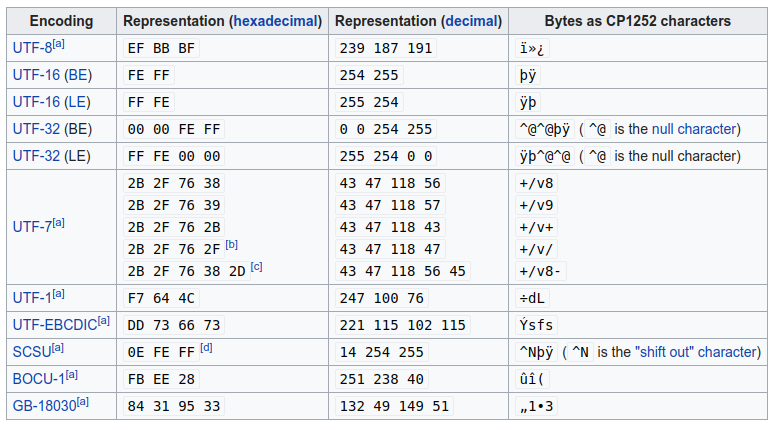

<!-- date: 2019.12.26 20:23 -->
#### 0. 什么是BOM(`byte order mark`, 字节序标记)？

bom可认为是unicode编码格式的一个标识。bom的字符为`\uFEFF`，不同编码格式下会encoding为不同的字节序，如下图：


#### 1. BOM作用

* 确定字节序，大端序 or 小端序（用于16-bit,32bit编码）
* 确定文本流为Unicode编码格式
* 确定当前使用的哪种Unicode编码格式

#### 2. 细说UTF-8下的字节序

* *String.valueOf('\ufeff').getBytes("utf-8")*，得到bom在utf-8下的字节序：`0xef,0xbb,0xbf`
* 若某字符串起始字符为`\ufeff`，则通过*String#getBytes("utf-8")*产生含bom的utf-8字节数组

#### 3. Java写入Bom示例：

1）使用PrintStream#write(int i)，`该方法写入的是字节，即最低位字节`

* 源码：
  
  ```java
  /**
     * Writes the specified byte to this stream.  If the byte is a newline and
     * automatic flushing is enabled then the <code>flush</code> method will be
     * invoked.
     *
     * <p> Note that the byte is written as given; to write a character that
     * will be translated according to the platform's default character
     * encoding, use the <code>print(char)</code> or <code>println(char)</code>
     * methods.
     *
     * @param  b  The byte to be written
     * @see #print(char)
     * @see #println(char)
     */
    public void write(int b) {
        try {
            synchronized (this) {
                ensureOpen();
                out.write(b);
                if ((b == '\n') && autoFlush)
                    out.flush();
            }
        }
        catch (InterruptedIOException x) {
            Thread.currentThread().interrupt();
        }
        catch (IOException x) {
            trouble = true;
        }
    }
  ```

* Demo:
  
  ```java
  PrintStream out = System.out;
  out.write('\ufeef'); // emits 0xef
  out.write('\ufebb'); // emits 0xbb
  out.write('\ufebf'); // emits 0xbf
  ```
  
  ```java
  PrintStream out = System.out;
  out.write(0xef); // emits 0xef
  out.write(0xbb); // emits 0xbb
  out.write(0xbf); // emits 0xbf
  ```
  
  2）PrintStream#print(char c)，`该方法写入的char`。

* 源码
  
  ```java
  /**
     * Prints a character.  The character is translated into one or more bytes
     * according to the platform's default character encoding, and these bytes
     * are written in exactly the manner of the
     * <code>{@link #write(int)}</code> method.
     *
     * @param      c   The <code>char</code> to be printed
     */
    public void print(char c) {
        write(String.valueOf(c));
    }
  ```

* Demo
  
  ```java
  PrintStream out = System.out;
  out.print('\ufeff');
  ```
  
  3）StringWriter.write(int c), `写入的是char`，同PrintStream#print。

* 源码
  
  ```java
  /**
     * Write a single character.
     */
    public void write(int c) {
        buf.append((char) c);
    }
  ```

#### 参考

1. [Byte order mark - wikipedia](https://en.wikipedia.org/wiki/Byte_order_mark)
2. [how-to-add-a-utf-8-bom-in-java - stackoverflow](https://stackoverflow.com/questions/4389005/how-to-add-a-utf-8-bom-in-java)