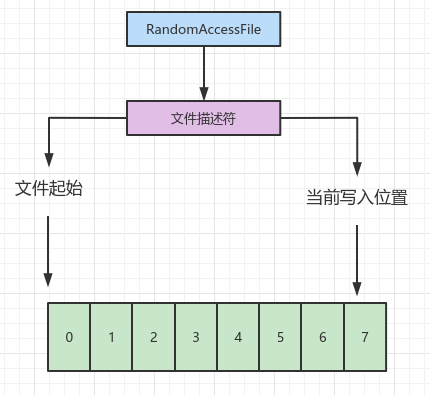
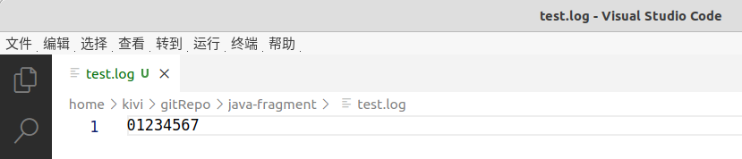
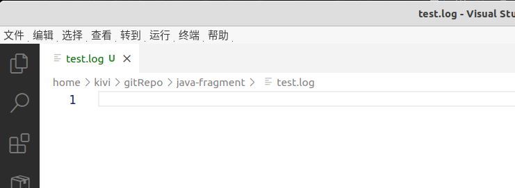
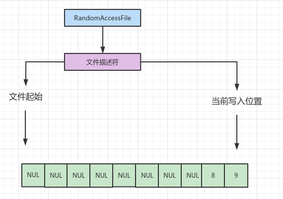
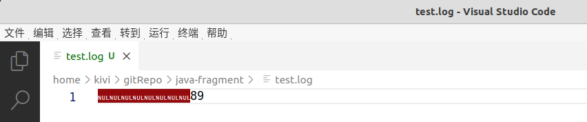

#### 一、问题描述

前段时间webmethod应用所在物理机磁盘满了，于是清理其日志。但是有个通过Log4j2记录的日志文件在执行`cat /dev/null | tee *.log`后大小又瞬间恢复到原来尺寸。当时感觉应该应该是使用Appender导致的，但时苦于没有找到log4j2.xml配置也就搁置了。

#### 二、问题探究

近期因为log4j2漏洞问题，需要梳理log4j2的配置。在webmethod研发的帮助下，返回查找最终在一个jar包内发现了log4j2.xml，如下所示。

```xml
<?xml version="1.0" encoding="UTF-8"?>
<Configuration status="error" monitorInterval="3600">
    <properties>
        <property name="patternLayout">%X%-5p - %d{yyyy-MM-dd HH:mm:ss} [%t] %l -- %m%n</property>
    </properties>
    <Appenders>
        <Console name="Console" follow="true">
            <PatternLayout pattern="${patternLayout}"/>
        </Console>
        <RollingRandomAccessFile name="rollingFile"
                                 fileName="xxxxx.log"
                                 filePattern="xxxx.%d{yyyy-MM-dd}.log.gz">
            <PatternLayout charset="UTF-8" pattern="${patternLayout}"/>
            <Policies>
                <TimeBasedTriggeringPolicy modulate="true" interval="1"/>
            </Policies>
        </RollingRandomAccessFile>
        <Async name="async">
            <AppenderRef ref="rollingFile"/>
            <AppenderRef ref="Console"/>
        </Async>
    </Appenders>
    <Loggers>
        <Root level="info" includeLocation="true">
            <AppenderRef ref="async"/>
        </Root>
    </Loggers>
</Configuration>
```

#### 三、文档和源码

1）文档

> https://logging.apache.org/log4j/log4j-2.2/manual/appenders.html#RollingRandomAccessFileAppender
> 
> The RollingRandomAccessFileAppender is similar to the standard [RollingFileAppender](https://logging.apache.org/log4j/log4j-2.2/manual/appenders.html#RollingFileAppender) except it is always buffered (this cannot be switched off) and internally it uses a `ByteBuffer + RandomAccessFile` instead of a `BufferedOutputStream`. 

2）源码

a）*org.apache.logging.log4j.core.appender.RollingRandomAccessFileAppender.Builder*构造函数声明*org.apache.logging.log4j.core.appender.rolling.RollingRandomAccessFileManager*作为文件管理器

b）*RollingRandomAccessFileManager*使用*java.io.RandomAccessFile*进行文件访问，如下：

```java
 private void createFileAfterRollover(final String fileName) throws IOException {
     this.randomAccessFile = new RandomAccessFile(fileName, "rw");
     if (this.isAttributeViewEnabled()) {
         this.defineAttributeView(Paths.get(fileName));
     }

     if (this.isAppend()) {
         this.randomAccessFile.seek(this.randomAccessFile.length());
     }

     this.writeHeader();
 }
```

#### 四、测试

1）运行测试用例

```java
public class RandomAccessFileTest {
    @Test
    public void testWrite() throws IOException, InterruptedException {
        RandomAccessFile randomAccessFile = new RandomAccessFile("./test.log", "rw");
        for (int i = 0; i < Integer.MAX_VALUE; i++) {
            randomAccessFile.writeBytes(String.valueOf(i));
            Thread.sleep(1000);
        }
    }
}
```

2）bash中执行

```bash
$ cat /dev/null > test.log
```

3）可观察到文件大小归零后又重新恢复

4）查看文件内容，文件确实被清空了

#### 五、RandomAccessFile

> https://docs.oracle.com/javase/8/docs/api/java/io/RandomAccessFile.html
> 
> Instances of this class support both reading and writing to a random access file. A random access file behaves like a large array of bytes stored in the file system. There is a kind of cursor, or index into the implied array, called the *file pointer*; input operations read bytes starting at the file pointer and advance the file pointer past the bytes read. If the random access file is created in read/write mode, then output operations are also available; output operations write bytes starting at the file pointer and advance the file pointer past the bytes written. Output operations that write past the current end of the implied array cause the array to be extended. The file pointer can be read by the `getFilePointer` method and set by the `seek` method.

也就是说RandomAccessFile持有文件描述符，并记录了文件起始位置和读写位置。写入的时候会记录上次读写的位置。

上面测试用例的图解过程如下：

1）RandomAccessFile持有指向文件test.log的文件描述符号，持有文件起始位置和当前写入位置，写入位置随写入递增，指向文件末尾。





2）当RandomAccessFile写完内容"7"后，此时执行`cat /dev/null > test.log`后，文件内容为空。



3）之后RandomAccessFile接着其之前持有的写入位置进行写入，写入后如下：



