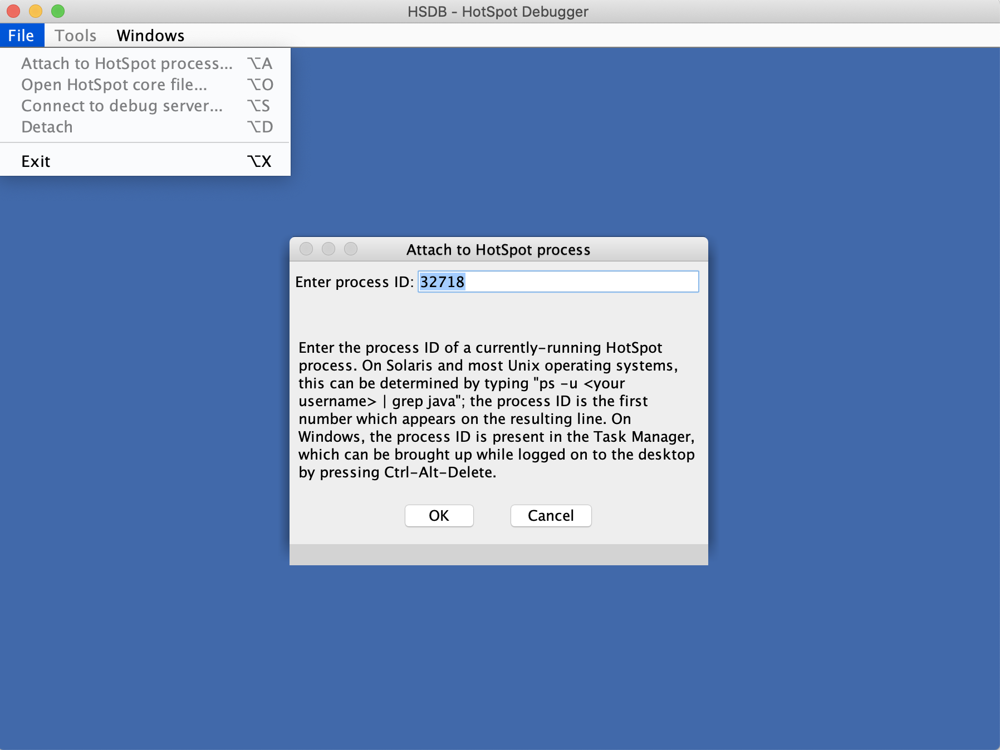
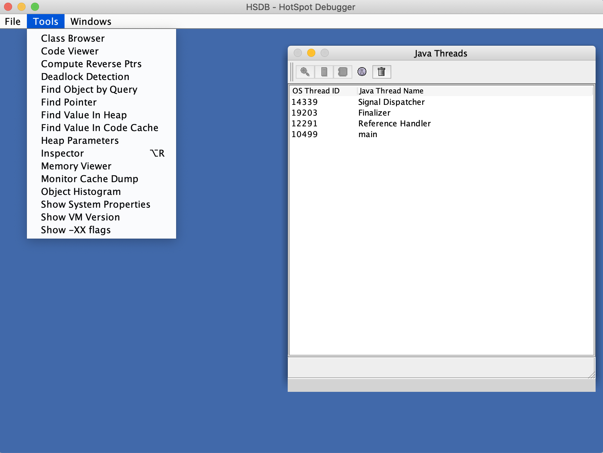
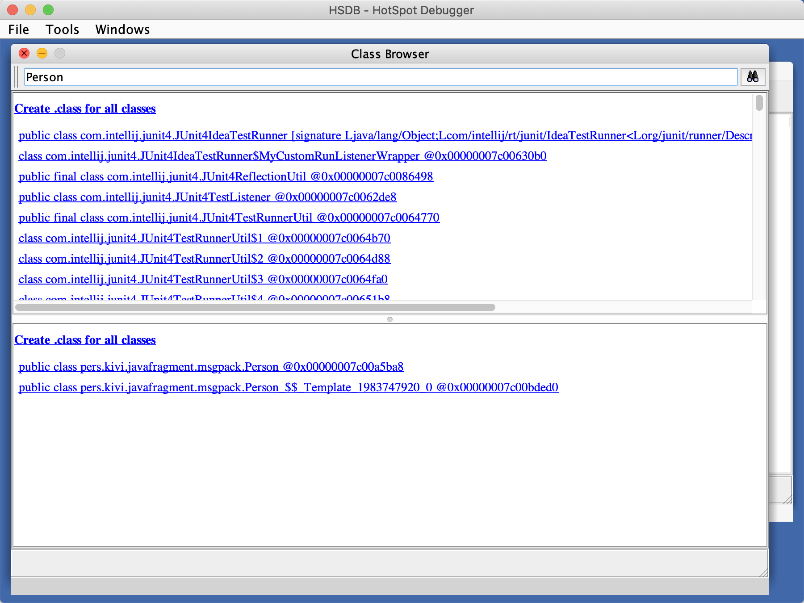
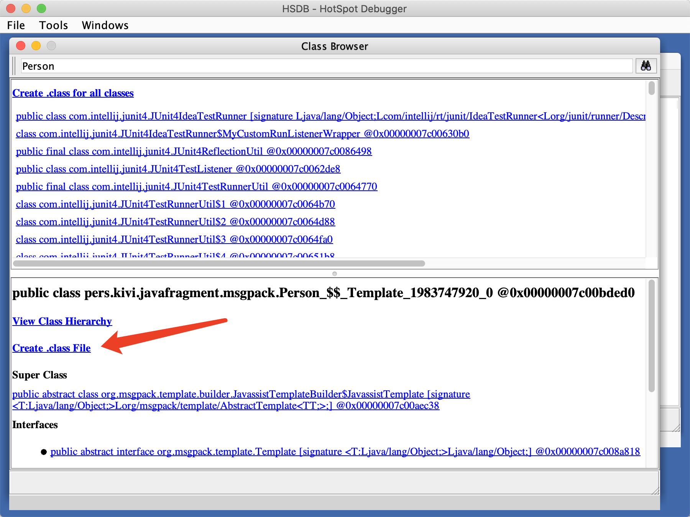
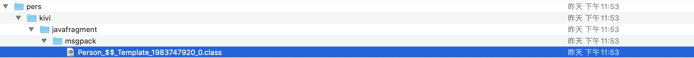

1）可选，为方便起见先创建一个JAVA_HOME的软连接

`ln -s /Library/Java/JavaVirtualMachines/adoptopenjdk-8.jdk/Contents/Home jdk8`

2）启动hsdb

`sudo java -cp jdk8/lib/sa-jdi.jar sun.jvm.hotspot.HSDB`

注意，最好加上sudo，否则可能会在创建Class文件时出现`No such file or directory`异常。

3）连接到Java进程

​    `File | Attach to HotSpot process ...`，输入Java进程号。

4）查看类

`Tools | Class Browser`

5）输入类包含的字符，过滤出代理类

6）点击代理类，然后点击“Create .class File”

其会在`运行hsdb命令的当前目录`生成class类。

7）找到class文件就可以反编译查看类

