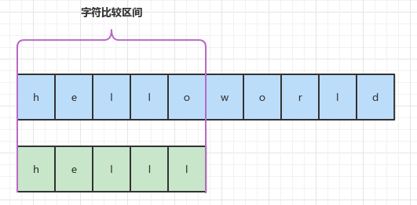
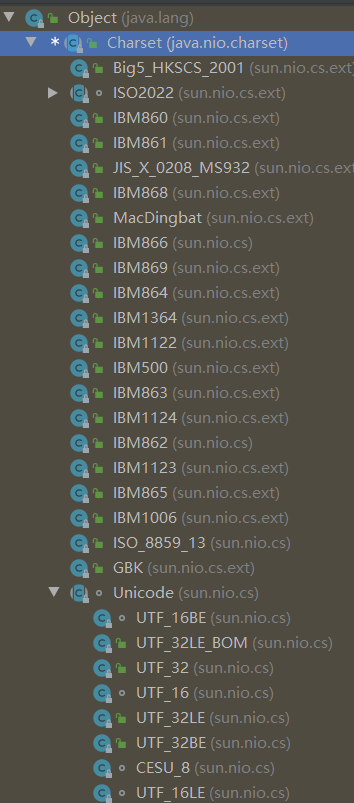
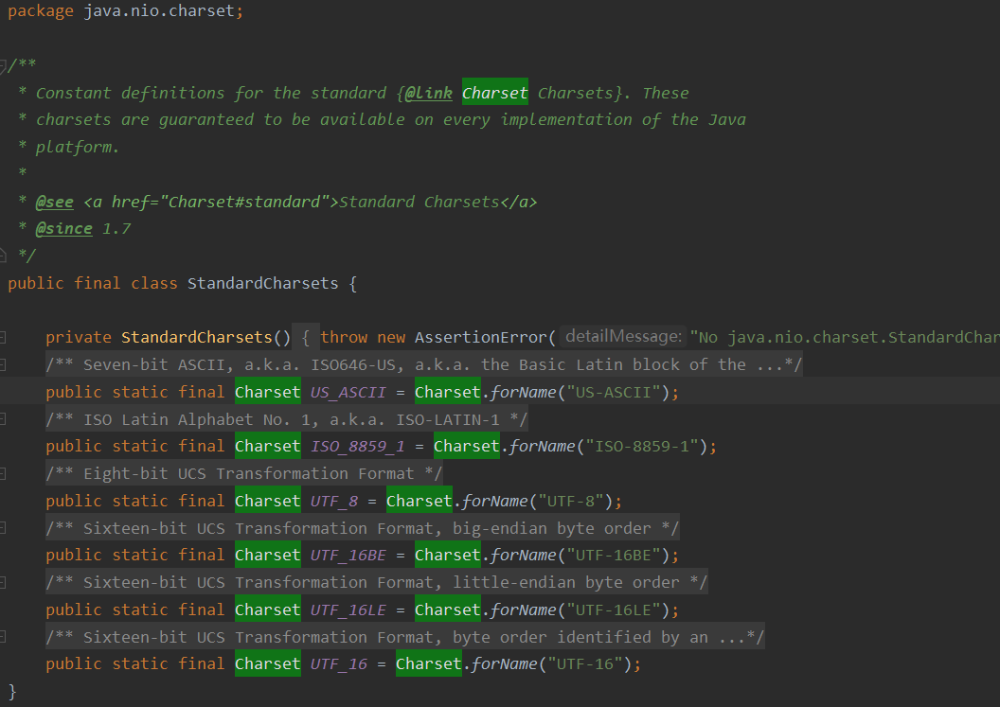

<!-- date: 2020.04.19 14:11 -->
## 一、String.compareTo

### 1、源码

```java
public final class String implements java.io.Serializable, Comparable<String>, CharSequence {
    public int compareTo(String anotherString) {
        int len1 = value.length;
        int len2 = anotherString.value.length;
        int lim = Math.min(len1, len2);
        char v1[] = value;
        char v2[] = anotherString.value;

        int k = 0;
        while (k < lim) {
            char c1 = v1[k];
            char c2 = v2[k];
            if (c1 != c2) {
                return c1 - c2;
            }
            k++;
        }
        return len1 - len2;
    }
}
```

### 2、流程解析



1）从0到minLength比较字符大小。如果存在字符不相等，返回字符差。

2）返回两者length差。

## 二、String.getBytes的编码

### 1、字节数组和字符串间转换时指定编码

1）第一种方式，通过字符串指定编码，需要catch或throw检查异常UnsupportedEncodingException。

```java
byte[] bytes = "你好，世界".getBytes("utf-8");

String str = new String(bytes, "utf-8");
```

2）第二种方式，使用StandardCharsets的编码常量

```java
byte[] bytes = "你好，世界".getBytes(StandardCharsets.UTF_8);

String str = new String(bytes, StandardCharsets.UTF_8);
```

### 2、编码类




