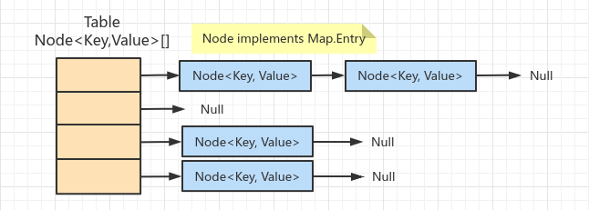
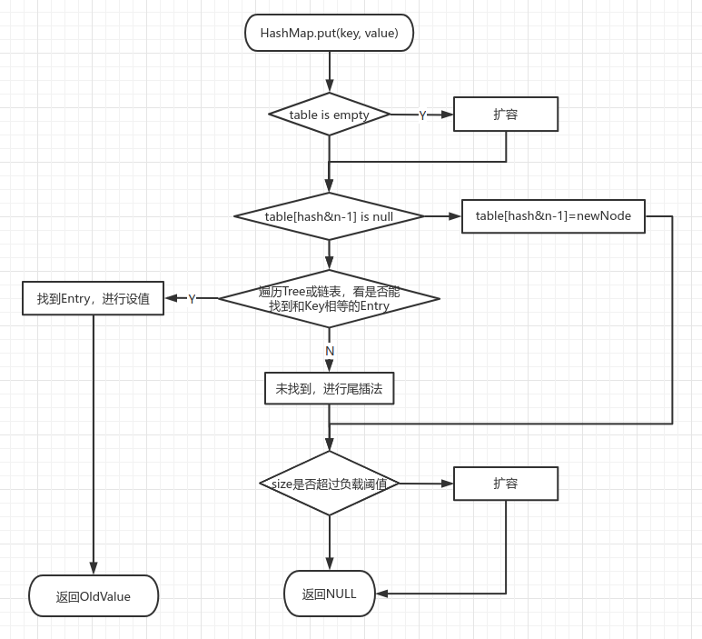

<!-- date: 2019.10.30 11:50 -->

## 一、存储结构



## 二、HashMap.put流程



1）遍历Tree时根据Hash值进行查询。Tree是根据Hash构建的红黑树。

2）new HashMap不设置初始容量时table为null，put第一个元素时会创建长度为16的table。

3）放入元素后，判定size超过负载后会扩容，负载 = tablesize * 负载因子默认0.75。

  I、不扩容条件：预期元素数量 < tableSize * 0.75，那么tableSize > 预期元素数量 / 0.75 = 预期元素个数 * 4 / 3。

  II、如预期放一个元素，那么初始容量设置最小为2。

4）初始size会经过计算转换为大于它的最小2的幂值。便于计算下标：keyHash & (table.size - 1)

5）扩容：JDK7并发时可能出现环线链表，导致死循环。JDK8通过高低位扩容方式避免了死锁发生。

## 三、ConcurrentHashMap

1）JDK8通过syncronized锁定bucket，也就是bucket的第一个Node。

2）JDK7通过分段锁来锁定，分段锁依赖ReentrantLock。内置多个分段锁，访问时通过key模除获取要使用的分段锁。

## 四、Table长度为什么是2的幂

### 1、HashMap中table的size

1）table的size为**power of two**,即2^n。

2）若不指定大小，table的默认size为2^4

3）若通过构造函数传入**initialCapacity**，则根据**tableSizeFor(int cap)**计算table的size。

### 2、HashMap的table的初始化时机

 table在初次使用时才会初始化。

### 3、为什么table的大小是2的幂？

HashMap根据**(table.length-1) & hash**来把对象值映射到table的某个坐标。此处，**table.length-1**起到了一个mask的作用。此处的hash是经过spread后的，参见**static final int hash(Object key)**。

```java
    /**
     * The table, initialized on first use, and resized as
     * necessary. When allocated, length is always a power of two.
     * (We also tolerate length zero in some operations to allow
     * bootstrapping mechanics that are currently not needed.)
     */
    transient Node<K,V>[] table;

    public HashMap(int initialCapacity) {
        this(initialCapacity, DEFAULT_LOAD_FACTOR);
    }

    /**
     * Returns a power of two size for the given target capacity.
     */
    static final int tableSizeFor(int cap) {
        int n = cap - 1;
        n |= n >>> 1;
        n |= n >>> 2;
        n |= n >>> 4;
        n |= n >>> 8;
        n |= n >>> 16;
        return (n < 0) ? 1 : (n >= MAXIMUM_CAPACITY) ? MAXIMUM_CAPACITY : n + 1;
    }

   /**
     * Implements Map.get and related methods.
     *
     * @param hash hash for key
     * @param key the key
     * @return the node, or null if none
     */
    final Node<K,V> getNode(int hash, Object key) {
        Node<K,V>[] tab; Node<K,V> first, e; int n; K k;
        if ((tab = table) != null && (n = tab.length) > 0 &&
            (first = tab[(n - 1) & hash]) != null) {
            if (first.hash == hash && // always check first node
                ((k = first.key) == key || (key != null && key.equals(k))))
                return first;
            if ((e = first.next) != null) {
                if (first instanceof TreeNode)
                    return ((TreeNode<K,V>)first).getTreeNode(hash, key);
                do {
                    if (e.hash == hash &&
                        ((k = e.key) == key || (key != null && key.equals(k))))
                        return e;
                } while ((e = e.next) != null);
            }
        }
        return null;
    }

   /**
     * Computes key.hashCode() and spreads (XORs) higher bits of hash
     * to lower.  Because the table uses power-of-two masking, sets of
     * hashes that vary only in bits above the current mask will
     * always collide. (Among known examples are sets of Float keys
     * holding consecutive whole numbers in small tables.)  So we
     * apply a transform that spreads the impact of higher bits
     * downward. There is a tradeoff between speed, utility, and
     * quality of bit-spreading. Because many common sets of hashes
     * are already reasonably distributed (so don't benefit from
     * spreading), and because we use trees to handle large sets of
     * collisions in bins, we just XOR some shifted bits in the
     * cheapest possible way to reduce systematic lossage, as well as
     * to incorporate impact of the highest bits that would otherwise
     * never be used in index calculations because of table bounds.
     */
    static final int hash(Object key) {
        int h;
        return (key == null) ? 0 : (h = key.hashCode()) ^ (h >>> 16);
    }
```