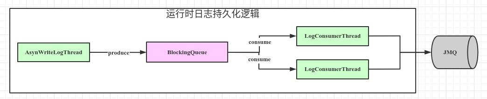

#### 一、背景

最近研发反映线上EDI的日志有丢失现象，经过审查代码发现，本机使用的BlockingQueue方法有误，使用的`BlockingQueue#add`方法，此时当队列满时会插入失败，返回false。


#### 二、修改方案

###### 方案一、修改`BlockingQueue#add`为`BlockingQueue#put`；

###### 方案二、判断`BlockingQueue#add`返回值为false时，增加重试或写本地方案；

#### 三、BlockingQueue注释

```java
public interface BlockingQueue<E> extends Queue<E> {
    /**
     * Inserts the specified element into this queue if it is possible to do
     * so immediately without violating capacity restrictions, returning
     * {@code true} upon success and throwing an
     * {@code IllegalStateException} if no space is currently available.
     * When using a capacity-restricted queue, it is generally preferable to
     * use {@link #offer(Object) offer}.
     *
     * @param e the element to add
     * @return {@code true} (as specified by {@link Collection#add})
     * @throws IllegalStateException if the element cannot be added at this
     *         time due to capacity restrictions
     * @throws ClassCastException if the class of the specified element
     *         prevents it from being added to this queue
     * @throws NullPointerException if the specified element is null
     * @throws IllegalArgumentException if some property of the specified
     *         element prevents it from being added to this queue
     */
    boolean add(E e);

    /**
     * Inserts the specified element into this queue if it is possible to do
     * so immediately without violating capacity restrictions, returning
     * {@code true} upon success and {@code false} if no space is currently
     * available.  When using a capacity-restricted queue, this method is
     * generally preferable to {@link #add}, which can fail to insert an
     * element only by throwing an exception.
     *
     * @param e the element to add
     * @return {@code true} if the element was added to this queue, else
     *         {@code false}
     * @throws ClassCastException if the class of the specified element
     *         prevents it from being added to this queue
     * @throws NullPointerException if the specified element is null
     * @throws IllegalArgumentException if some property of the specified
     *         element prevents it from being added to this queue
     */
    boolean offer(E e);

    /**
     * Inserts the specified element into this queue, waiting if necessary
     * for space to become available.
     *
     * @param e the element to add
     * @throws InterruptedException if interrupted while waiting
     * @throws ClassCastException if the class of the specified element
     *         prevents it from being added to this queue
     * @throws NullPointerException if the specified element is null
     * @throws IllegalArgumentException if some property of the specified
     *         element prevents it from being added to this queue
     */
    void put(E e) throws InterruptedException;

    /**
     * Retrieves and removes the head of this queue, waiting if necessary
     * until an element becomes available.
     *
     * @return the head of this queue
     * @throws InterruptedException if interrupted while waiting
     */
    E take() throws InterruptedException;
}
```