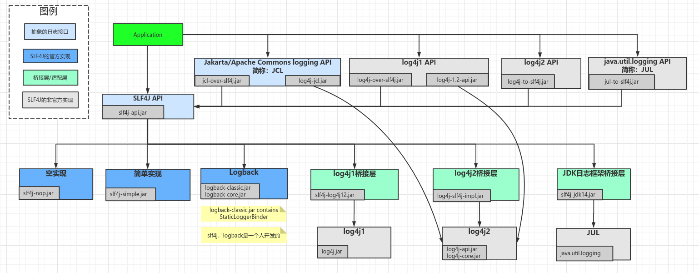
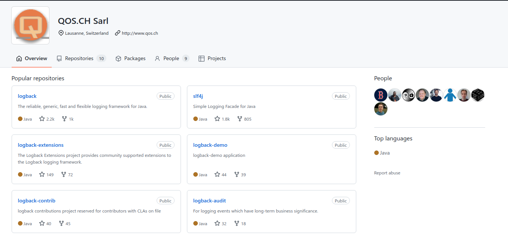
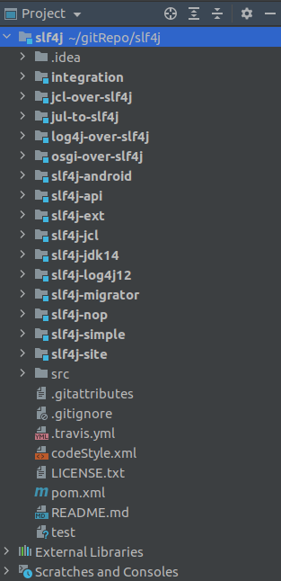
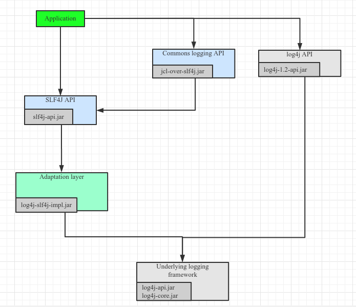
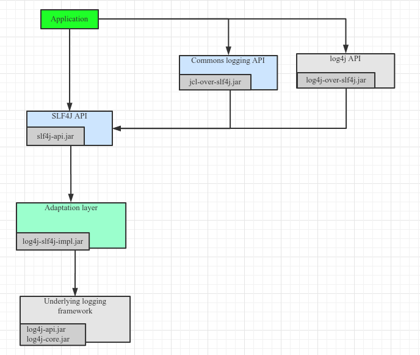

## 一、SLF4j和其他框架适配

### 1、日志框架图



**Note1: 重点理解SLF4J可以和其他框架双向桥接就可以了。**

**NOTE2：slf4j-simple可以在测试用例里作为实现使用，不用配置任何实现的配置文件，简单方便。**

### 2、slf4j和logback由相同的人开发

> https://github.com/qos-ch



### 3、slf4j工程结构



### 4、实战操作

> 以下是我们项目中pom.xml的一段日志配置。

```xml
        <!--=========== log相关配置 begin ============-->
        <!-- slf4j api-->
        <dependency>
            <groupId>org.slf4j</groupId>
            <artifactId>slf4j-api</artifactId>
            <version>${slf4j.version}</version>
        </dependency>

        <!-- jcl桥接至slf4j -->
        <dependency>
            <groupId>org.slf4j</groupId>
            <artifactId>jcl-over-slf4j</artifactId>
            <version>${slf4j.version}</version>
        </dependency>

        <!-- slf4j桥接至Log4j2 -->
        <dependency>
            <groupId>org.apache.logging.log4j</groupId>
            <artifactId>log4j-slf4j-impl</artifactId>
            <version>2.2</version>
        </dependency>

        <!-- log4j桥接至Log4j2 -->
        <dependency>
            <groupId>org.apache.logging.log4j</groupId>
            <artifactId>log4j-1.2-api</artifactId>
            <version>${log4j2.version}</version>
        </dependency>

        <!-- log4j2 -->
        <dependency>
            <groupId>org.apache.logging.log4j</groupId>
            <artifactId>log4j-api</artifactId>
            <version>${log4j2.version}</version>
        </dependency>
        <dependency>
            <groupId>org.apache.logging.log4j</groupId>
            <artifactId>log4j-core</artifactId>
            <version>${log4j2.version}</version>
        </dependency>
        <!-- web工程需要包含log4j-web，非web工程不需要 -->
        <dependency>
            <groupId>org.apache.logging.log4j</groupId>
            <artifactId>log4j-web</artifactId>
            <version>${log4j2.version}</version>
        </dependency>
        <!-- 使用log4j2的AsyncLogger需要包含disruptor -->
        <dependency>
            <groupId>com.lmax</groupId>
            <artifactId>disruptor</artifactId>
            <version>${disruptor.version}</version>
        </dependency>
        <!--============ log相关配置 end ==============-->
```

解析图：


**本项目中也可以将lo4j API桥接至SFL4J API，如下图所示：**



## 二、Slf4j占位符

### 1、SLF4j打印日志方法

#### 1）静态分派

```java
/**
* 静态分派至：void warn(String var1, Throwable var2);
*/
logger.warn("error msg: ", ex)
logger.warn("error msg: {}", ex)

/**
* 静态分派至：void warn(String var1, Object var2, Object var3);
*/
logger.warn("error msg: {} {}", "anything", ex);

/**
* 静态分派至：void warn(String var1, Object... var2);
*/
logger.warn("error msg: {} {}", "anything", "anything", ex);
logger.warn("error msg: {} {} {}", "anything", "anything", ex);
```

#### 2）结论

I、logger的占位参数小于等于1时，会打印异常堆栈；

II、logger的占位参数大于等于2时：

* 如果参数和占位符相等，每个参数调用toString方法输出；

* 如果参数=占位符+1， 且最后一个为异常，则打印异常堆栈；

Note：异常类的toString方法输出内容是“类名+errorMessage”。如果是NPE，那么errorMessage为null；

```java
public class Throwable implements Serializable {
   public String toString() {
        String s = getClass().getName();
        String message = getLocalizedMessage();
        return (message != null) ? (s + ": " + message) : s;
    }
}
```

### 2、Demo类

```java
public class NPETest {
    static Logger logger = LoggerFactory.getLogger(NPETest.class);

    public static void main(String[] args) {
        try {
            try {
                long l = (Long) null;
            } catch (Throwable e) {
                // NPE的getMessage返回null
                throw new MyException("内部异常信息" + e.getMessage(), e);
            }
        } catch (Throwable throwable) {
            logger.warn("外部异常信息", throwable);   // print error stack
            logger.warn("外部异常信息{}", throwable);  // print error stack
            logger.warn("外部异常信息{}{}", "占位", throwable, throwable); // print error stack
            logger.warn("外部异常信息{}{}", "占位", throwable); // Not print error stack
            logger.warn("外部异常信息{}{}{}", "占位", "占位", throwable, throwable);  // print error stack
            logger.warn("外部异常信息{}{}{}", "占位", "占位", throwable);  // Not print error stack

        }
    }
}
```

### 3、最后

重要的事情说三遍
**使用SLF4j打印日志时一定保证“参数个数 = 占位符个数 + 1（异常）”，确保打印日志堆栈**
**使用SLF4j打印日志时一定保证“参数个数 = 占位符个数 + 1（异常）”，确保打印日志堆栈**
**使用SLF4j打印日志时一定保证“参数个数 = 占位符个数 + 1（异常）”，确保打印日志堆栈**

## 三、System.err重定向到slf4j

### 1、背景

第三方源码质量参差不齐，许多异常并没有正确输出。代码会出现如下：

```java
try {
    doSomething();
} catch(Throwable throwable) {
    throwable.printStackTrace();
}
```

异常信息没有通过日志框架输出。

### 2、重定向System.err/out到slf4j

```java
import org.slf4j.Logger;
import org.slf4j.LoggerFactory;
import java.io.PrintStream;

/**
* 工具类
*/
public class SystemOutErrToSlf4j {
    private static Logger logger = LoggerFactory.getLogger(SystemOutErrToSlf4j.class);

    /**
     * 可重定向{@link java.lang.System#err}，{@link java.lang.Throwable#printStackTrace()}输出至SLF4J
     */
    public static void redirectSysErrToSlf4j() {
        PrintStream stderrStream = System.err;
        PrintStream newStderrStream = new PrintStream(stderrStream) {
            @Override
            public void println(Object x) {
                super.println(x);
                if (x instanceof Throwable) {
                    logger.error("", (Throwable) x);
                }
            }
        };
        System.setErr(newStderrStream);
    }

    /**
     * 可重定向{@link java.lang.System#out}输出至SLF4J
     */
    public static void redirectSysOutToSlf4j() {
        PrintStream stderrStream = System.out;
        PrintStream newStderrStream = new PrintStream(stderrStream) {
            @Override
            public void print(boolean b) {
                super.print(b);
                logger.info(String.valueOf(b));
            }

            @Override
            public void print(char c) {
                super.print(c);
                logger.info(String.valueOf(c));
            }

            @Override
            public void print(int i) {
                super.print(i);
                logger.info(String.valueOf(i));
            }

            @Override
            public void print(long l) {
                super.print(l);
                logger.info(String.valueOf(l));
            }

            @Override
            public void print(float f) {
                super.print(f);
                logger.info(String.valueOf(f));
            }

            @Override
            public void print(double d) {
                super.print(d);
                logger.info(String.valueOf(d));
            }

            @Override
            public void print(String s) {
                super.print(s);
                logger.info(s);
            }

            @Override
            public void print(Object obj) {
                super.print(obj);
                logger.info(obj.toString());
            }
        };
        System.setOut(newStderrStream);
    }
}
```

```java
/**
* 测试类
*/
public class TestSystemOutErrorToSlf4j {
    public static void main(String[] args) {
        try {
            int a = 1 / 0;
        } catch (Throwable throwable) {
            throwable.printStackTrace();
        }
        SystemOutErrToSlf4j.redirectSysErrToSlf4j();
        try {
            int a = 1 / 0;
        } catch (Throwable throwable) {
            throwable.printStackTrace();
        }
    }
}
```

## # 参考

1. http://www.slf4j.org/manual.html
2. http://www.slf4j.org/legacy.html
3. https://edivad.wordpress.com/2007/02/26/systemout-and-systemerr-over-log4j/
4. https://stackoverflow.com/questions/2559095/configuration-log4j-consoleappender-to-system-err