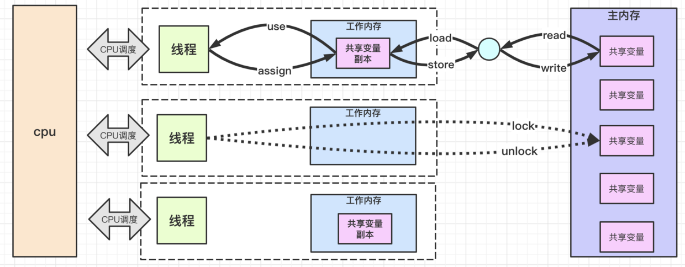

## 一、什么是JMM

### 1、jsr-133-faq

[http://www.cs.umd.edu/~pugh/java/memoryModel/jsr-133-faq.html](http://www.cs.umd.edu/~pugh/java/memoryModel/jsr-133-faq.html)

#### 1）处理器内存模型

在多处理器系统中，处理器通常会有一层或多层缓存用来提高性能，这加快了数据访问速度，减小共享内存总线上的流量。缓存提高性能同时带来了新的挑战，例如两个处理器同时去读取相同内存位置的值时可能会看到不同的值。 

**在处理器级别，内存模型定义了共享变量被某处理器修改后对其他处理器可见的充要条件。**

有些处理器表现出强大的内存模型，所有处理器在任何时候看到的指定共享变量的值都是相同的。有些处理器表现出较弱的内存模型，通常需要通过内存屏障来实现可见性，例如：1）通过刷新操作使当前处理器读取其他处理器修改的值；2）通过使其他处理器的缓存失效而使其他处理器看到当前处理器修改的值。内存屏障通常在执行lock和unlock时使用，它们对高级语言是不可见的。

有时为强内存模型编写程序更加容易，因为减少了内存屏障的使用。但是即使在强内存模型下，内存屏障也是不可或缺的。处理器的最新趋势鼓励较弱的内存模型，因为他们对缓存一致性的放宽使得跨处理器和大内存有更大的伸缩性。

**当一个写操作要对另一个线程可见时，编译器的重排序使问题变得更加复杂**。例如，编译器为了优化性能在不改变程序语义的前提下可能把写操作在程序中后移。如果编译器延迟了某个操作，那么另一个线程也会延后看到操作的执行结果。缓存同样有此副作用。反之，如果把写入操作前移，其他线程则可能提前感知操作结果。**在内存模型的约束下，允许编译器，运行时和硬件优化执行顺序，我们可以获得更高的性能。**

#### 2）Java内存模型

java内存模型描述了多线程编程中哪些行为是合法的和线程如何通过内存进行交互。它描述了程序中变量间的关系，及在实际计算机系统中从内存或寄存器中读写变量的低级细节。它通过各种硬件和编译器优化来正确实现。

**Java内存模型是一项野心勃勃的事业；这是编程语言首次尝试合并内存模型，该模型为跨多种体系结构的并发提供了一致的语义。**
大多数其他编程语言，如c,c++都不是直接支持多线程设计的。这些语言针对编译器和体系结构中发生的重排序的保护在很大程度上依赖于其使用的线程库，编译器和代码运行平台。 

### 2、JSR133

**给定一个程序和该程序的一串执行轨迹，内存模型描述了该执行轨迹是否是该程序的一次合法执行。**对于 Java，内存模型检查执行轨迹中的每次读操作，然后根据特定规则，检验该读操作观察到的写是否合法。

内存模型描述了某个程序的可能行为。JVM 实现可以自由地生成想要的代码，只 要该程序所有最终执行产生的结果能通过内存模型进行预测。这为大量的代码转换 提供了充分的自由，包括动作(action)的重排序以及非必要的同步移除。

**内存模型的一个高级、非正式的概述显示其是一组规则，规定了一个线程的写操作何时会对另一个线程可见**。通俗地说，读操作 r 通常能看到任何写操作 w 写入的 值，意味着 w 不是在 r 之后发生，且 w 看起来没有被另一个写操作 w'覆盖掉(从 r 的角度看)。

### 3、java-memory-model

http://tutorials.jenkov.com/java-concurrency/java-memory-model.html

Java内存模型规定了如何和何时可以看到由其他线程修改过后的共享变量的值，以及在必须时如何同步的访问共享变量。

### 4、总结

多处理器场景下，同一个变量可能存在多个缓存备份，编译器、解释器、JIT、处理器都可重排指令顺序。并发编程时，程序执行结果预测变得困难。

在此背景下，**JMM则是Java在语言层面抽象出多处理器下内存架构和操作，并基于此约定一组顺序规则，使得读操作可预测，从而达到多处理器场景下程序结果可预测的目的。**

## 二、Java对多处理器内存架构的抽象

[From JSE6 Threads and Locks](https://docs.oracle.com/javase/specs/jvms/se6/html/Threads.doc.html)

主内存和工作内存

八大内存操作：read、load、store、write、use、assign、lock、unlock

## 三、JSR133中JMM的规则

给定一段程序和一段执行轨迹，可以根据JMM判断该执行轨迹是否合法。JMM的存在，约束了JVM在实现时要保证程序的执行轨迹合法，从而使程序员可以推断程序的执行结果。

JVM为保证符合JMM的约束，一般需要考虑以下方面：

1）编译器，JIT和解释器在指令重排时，需要符合JMM；

2）适当的增加内存栅栏，防止CPU级别的指令重排；

### 1、JMM的正式规则包括两个部分

> From JSR133

1）定义良构的执行过程；

* 每个对变量 x 的读都能看到一个对 x 的写。所有对 volatile 变量的读写都是 volatile 动作
* 同步顺序与程序顺序以及互斥是一致的
* 线程的运行遵守线程内(intra-thread)一致性
* 线程的运行遵守同步顺序一致性
* 线程的运行遵守 happens-before 一致性

2）执行过程的因果要求（对happens-before内存模型的增强）

### 2、JMM内置happens-before

> From JSR133

1）某个线程中的每个动作都happens-before该线程中该动作后面的动作。

2）某个管程上的unlock动作happens-before同一个管程上后续的lock动作。

3）对某个volatile字段的写操作happens-before每个后续对该volatile字段的读 操作。

4）在某个线程对象上调用start()方法happens-before该启动了的线程中的任意 动作。

5）某个线程中的所有动作happens-before任意其它线程成功从该线程对象上的 join()中返回。

6）如果某个动作a happens-before动作b，且b happens-before动作c，则有a happens-before c.

## 四、JMM为并发编程提供了支持

并发编程三大特征：原子性，可见性和有序性；JMM的规则在Java语言层面给予了支持（区别于其他语言需要依赖类库或运行平台）；

### 1、原子性

1）Java的volatile关键字支持double,long的原子读写；

2）JMM中管程的有序性规则对原子性提供了支持；

### 2、可见性

JMM规则的核心就是描述共享变量修改后对其他线程可见的规则；

### 3、有序性

JMM几乎所有规则都围绕有序性展开；

## # 参考

1. [https://download.oracle.com/otndocs/jcp/memory_model-1.0-pfd-spec-oth-JSpec/](https://download.oracle.com/otndocs/jcp/memory_model-1.0-pfd-spec-oth-JSpec/)
2. [http://tutorials.jenkov.com/java-concurrency/java-memory-model.html](http://tutorials.jenkov.com/java-concurrency/java-memory-model.html)
3. [http://ifeve.com/java-memory-model-6/](http://ifeve.com/java-memory-model-6/)
4. [http://www.cs.umd.edu/~pugh/java/memoryModel/index.html#reference](http://www.cs.umd.edu/~pugh/java/memoryModel/index.html#reference)
5. [http://www.cs.umd.edu/~pugh/java/memoryModel/jsr-133-faq.html](http://www.cs.umd.edu/~pugh/java/memoryModel/jsr-133-faq.html)
6. [https://docs.oracle.com/javase/specs/jvms/se6/html/Threads.doc.html](https://docs.oracle.com/javase/specs/jvms/se6/html/Threads.doc.html)
7. [http://gee.cs.oswego.edu/dl/jmm/cookbook.html](http://gee.cs.oswego.edu/dl/jmm/cookbook.html)