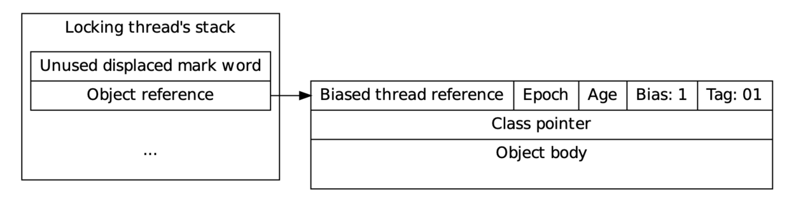

> 多线程访问相同的共享可变的变量时，通常需要使用加锁的方式实现同步，避免竞态条件发生。同步的其中一个特征就是互斥，通过使访问顺序串行化，使得并发结果合法和可预期。synchronized是java的关键字，其通过java的内置锁机制实现多线程同步。
## 一、synchronized的三种锁形态
synchronized在jdk1.5前只有重量级锁，开销较大。为了应对低竞争的场景在jdk1.5增加了偏向锁和轻量级锁。对象的锁状态通过对象头里的markword标识。


### 1. 偏向锁


1）场景：在一个时刻只有一个线程请求锁，没有竞争；

2）关键参数：

```java
-XX:+UseBiasedLocking  # 是否开启偏向锁，jdk1.6以后默认开启
-XX:BiasedLockingStartupDelay=4000 # 偏向锁延迟启动时间，因为可预想的JVM启动时会有竞争，所以设置此参数来避免升级过程
-XX:BiasedLockingDecayTime=25000  # 重置撤销次数的时间阈值
-XX:BiasedLockingBulkRevokeThreshold=40 # 偏向锁批量撤销阈值
-XX:BiasedLockingBulkRebiasThreshold=20 # 偏向锁批量重偏向阈值
```

Note: 
* 查看jvm各参数默认值
`java -XX:+PrintFlagsInitial`
* 查看jvm运行参数值（其中被赋值号为`:=`的值是被修改过，与初始值不同）
`java -XX:+PrintFlagsFinal`
* 查看jvm运行时的参数的命令
`jinfo -flags <pid>`  `jinfo -flag <name> <pid>`

3）实现原理：markword标识出偏向锁状态，且保存当前持有锁的线程ID。然后在其线程栈上隐式保存递归次数。


4）优点：在无竞争的情况下开销较小，包括cpu（无须切换上下文和线程调度）和内存（无须分配管程对象）开销。

5）缺点：**锁撤销开销较大，需要挂起锁定线程，遍历其线程栈，修改锁记录。甚至比轻量级锁和重量级锁的开销还大。**目前HotSpot使用安全点的STW和启发式撤销方法，减少撤销次数，提高性能。

6）可重偏向的条件

* 线程ID为空
* epoch无效

Note1: 当类元数据中的epoch与类对象的对象头中的epoch值相等时，表示当前偏向锁有效；否则该偏向锁失效，可重偏向；通过引入epoch减小了重偏向的开销；


Note2：在调用hashcode时会撤销偏向锁来还原hashcode的占位；

Note3: 调用wait,notify会膨胀为重量级锁。触发管程对象分配和初始化；

### 2. 轻量级锁（也称为thin lock）


1）场景：在一段时间内请求的锁的线程较少，且持有锁的线程执行时间短，持有锁的时间短，其他等待线程在有限的自旋等待期可以得到锁。

2）实现结构——栈上锁记录

> 锁记录在堆栈上分配，在解释执行期间显式分配，或在编译时隐式分配。锁定记录包含一个可以放置移位标记字的位置，以及一个指向被锁定对象的指针。对象指针在分配时由解释器或编译器初始化，当锁被薄锁或胖锁时，移位的标记字被初始化。
> from: www.diva-portal.org/smash/get/diva2:754541/FULLTEXT01.pdf


3）锁升级过程
> 当一个线程试图获取一个已经被其他线程持有的轻量级锁（CAS失败）时，非所有者线程将尝试对该锁进行膨胀。**在锁膨胀期间，为对象分配和初始化重量级对象监视器结构。**膨胀线程将尝试在循环中对锁进行升级，直到成功，或直到其他线程成功地升级锁为止。
> from: www.diva-portal.org/smash/get/diva2:754541/FULLTEXT01.pdf

Note1：调用wait,notify会膨胀为重量级锁。触发管程对象分配和初始化；

Note2：**管程对象不是一开始就初始化的，而是触发fat lock时才会初始化。**

### 3. 重量级锁（也称为fat lock）


1）管程对象——monitor

通过对象关联的管程对象实现线程阻塞，唤醒机制。其主要依赖操作系统级的互斥量来实现。

2）WaitSet,EntrySet


* 准备争抢会进入临界区的线程会进入EntrySet；
* 只有一个线程会进去临界区，独占锁；
* 获取锁的线程执行wait方法会让出锁，并进去WaitSet；
* WaitSet中的线程需要被唤醒才能进入EntrySet，然后再参与竞争；

3）优点：

在多线程并发激烈的情况下性能表现好，让未获得锁的线程让出时间片和cpu使用权，减少资源消耗。

## 二、与juc包AQS对比
AQS是抽象队列同步器用来实现同步机制，AQS也有类似synchronized的等待队列和条件队列。synchronized实现了阻塞非公平锁且只有单一条件队列，AQS提供了更多机制。

|              | synchronized | AQS                |
| ------------ | ------------ | ------------------ |
| 是否公平     | 非公平       | 公平和非公平都支持 |
| 是否阻塞     | 阻塞         | 阻塞和非阻塞都支持 |
| 是否支持超时 | 不支持       | 支持               |
| 条件队列数   | 1个          | 无限制             |
| 读写锁       | 不支持       | 支持               |

## # 参考

1. [Java 的偏向锁是怎么实现的？ - RednaxelaFX的回答 - 知乎](https://www.zhihu.com/question/55075763/answer/142524888)
1. [Evaluating and improving biased locking in the HotSpot virtual machine](http://www.diva-portal.org/smash/get/diva2:754541/FULLTEXT01.pdf)
1. [https://www.cnblogs.com/LemonFive/p/11248248.html](https://www.cnblogs.com/LemonFive/p/11248248.html)
1. [https://zhuanlan.zhihu.com/p/127884116](https://zhuanlan.zhihu.com/p/127884116)