<!-- date: 2020.06.16 18:56 -->
## 一、AQS介绍

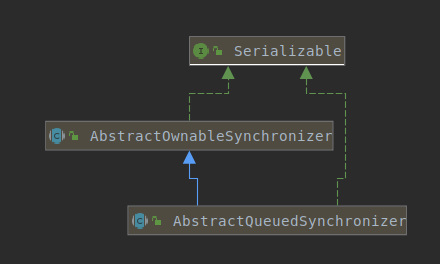

### 1、前置问题

1）同步队列，等待队列和条件队列的区别？

2）AQS和monitor区别？队列的对比？

3）类继承结构？

### 2、AQS的类注释

> Doug Lea开发juc包的核心组件是AQS，是实现Semaphore，ReentrantLock，ReadWriteLock，CountDownLatch等的基础。

AQS提供了一个框架，可用于实现依赖先进先出（FIFO）等待队列的阻塞锁和相关同步器（信号量、事件等）。对于大多数依赖单个原子整数值来表示状态的同步器来说，这个类是一个有用的基础。子类必须定义用来更改此状态的受保护方法，以及定义此状态对于获取或释放此对象意味着什么。考虑到这些，这个类中的其他方法执行所有排队和阻塞机制。子类可以维护其他状态，但是必须使用方法getState,setState,compareAndSetState来原子性的更新其值，来维护同步。

子类应该被定义为一个非公共的内部类，来实现外部类的同步属性。AbstractQueuedSynchronizer没有实现任何同步接口。相反，它定义了诸如acquiredinterruptibly之类的方法，这些方法可以由具体锁和相关同步器酌情调用，以实现它们的公共方法。

这个类支持默认的独占模式和共享模式。以独占模式获取时，其他线程尝试的获取无法成功。共享模式下多线程获取可能（非必须）成功。这个类只有通过“当共享模式获取成功时，下一个等待线程（如果存在）也必须确定它是否也可以获取”的机制才能区别两者。在不同模式下等待的线程共享同一个FIFO队列。通常，实现子类只支持其中一种模式，但这两种模式也可以都支持，例如在ReadWriteLock。仅支持独占模式或共享模式的子类不需要定义支持未使用模式的方法。

本类定义了ConditionObject内部类，它可以被支持独占模式的子类(AQS子类)用作条件（Condition）实现，对于这种模式，isheldexclusly报告是否以独占方式保持与当前线程的同步，使用当前getState值调用的方法release完全释放这个对象，并且acquire，给定这个保存的状态值，最终将这个对象恢复到它以前的获取状态。(本段待优化)
AQS类内没有方法会去创建条件（condition），如果无法满足此约束，请不要使用他。ConditionObject的行为当然取决于其同步器实现的语义。

这个类提供内部队列的检查、检测和监视方法，以及针对条件对象的类似方法。可以把AbstractQueuedSynchronizer导入需要的类来实现同步机制。

此类的序列化仅存储底层原子整数维护状态，因此反序列化对象具有空线程队列。需要序列化的典型子类将定义 readObject方法，该方法在反序列化时将其还原为已知的初始状态。

### 3、AQS$Node类注释

同步队列是CLH队列的变种。CLH常用于实现自旋锁。我们用它来实现阻塞的同步器，但是使用相同的策略来保持前驱节点内线程的一些控制信息。每个结点里的“status”字段用于跟踪线程是否应该阻塞。
当前驱结点release后，当前结点被唤醒。否则，队列里的每个结点都被作为特定通知类型的监视器，其内部的线程是唯一的等待线程。“status”字段不控制线程是否被授予锁等资源。当线程在队首时可以尝试去占有。但是在队首并不保证占有成功，只是由权利去竞争。所以当前被唤醒的竞争线程有可能因竞争失败而重新wait，等待下次唤醒。

要在CLH里入队一个结点，你需要原子性的把它插入队列并设为tail。出队时只需要设置head字段。

```
     +------+  prev +-----+       +-----+
head |      | <---- |     | <---- |     |  tail
     +------+       +-----+       +-----+
```

由于插入CLH队列只需要“tail”保证原子性操作，所以在未入队到入队间有个简单的原子点界限。同样出队时只需要更新“head”。但是这期间需要多做一点工作来确定后继结点是谁，部分是为了处理由超时或中断导致的取消操作。

“prev”字段（原始的CLH中不会使用）主要用于取消场景。如果一个结点被取消，则他的后继结点会重新通过该字段连接至非取消状态的前驱结点。

我们使用“next”字段实现阻塞机制。每个结点的线程ID都被自己持有，所以前驱结点通过该字段来发送signal信号给next结点，以此来唤醒其持有的线程。决定next结点时必须避免与新入队的结点设置前驱结点的“next”字段的场景产生竞态条件。 This is solved when necessary by checking backwards from the atomically updated "tail" when a node’s successor appears to be null。

取消在基本算法中引入了保守性。因为我们必须轮询其他节点的取消，所以我们可能会忽略已取消的节点是在我们前面还是后面。常用处理的方法是一旦取消当前结点，则unpark其后继结点，使他们能找到新的前驱结点，除非我们能找到一个未取消的前驱结点来承担这一职责。

CLH队列需要一个dummy头结点。但是我们并没有一开始就创建他，因为如果不存在竞争时此举会产生多余的开销。反之，我们在第一次竞争时再创建头结点，并把head和tail指向他。

条件队列也使用此类，但是使用了额外的连接。条件只需要以简单的队列连接结点即可，因为他们仅在独占时访问。一旦await，结点便被插入条件队列。一旦signal，结点便被转移到主队列。“status”字段有个特殊的值来标识结点处于哪个队列。

### 4、AQS和monitor关系

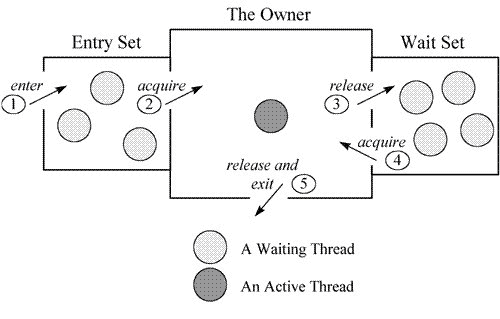

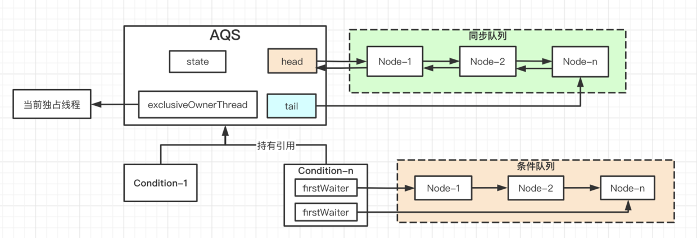

> AQS的同步队列相当于Object Monitor的EntrySet；AQS的条件队列和等待队列是一个东西，相当于Object Monitor的WaitSet。
> 参考：[https://www.cnblogs.com/549294286/p/3688829.html](https://www.cnblogs.com/549294286/p/3688829.html)

|      | 线程特征                           | 队列特征 | 线程来源                          |
| ---- | ------------------------------ | ---- | ----------------------------- |
| 同步队列 | 在同步队列中等待unpark信号去竞争锁           | 双向链表 | 1）条件队列；2）新的线程获取锁失败；           |
| 条件队列 | 在条件队列中等待signal信号，然后转移至同步队列参与竞争 | 单向链表 | 获取锁的线程在该线程上下文对某个条件对象执行await方法 |

### 5、AQS的获取方法

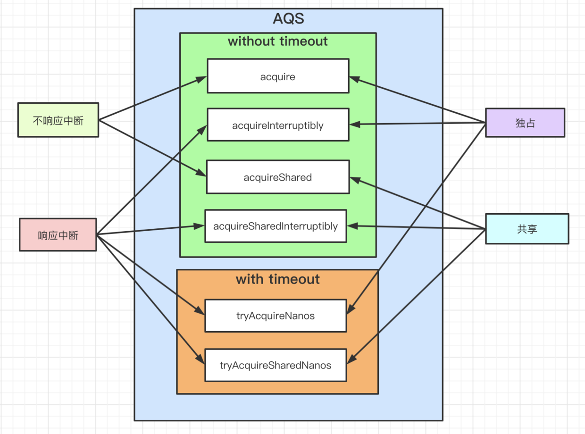

### 6、AQS的acquire和acquireShared流程图

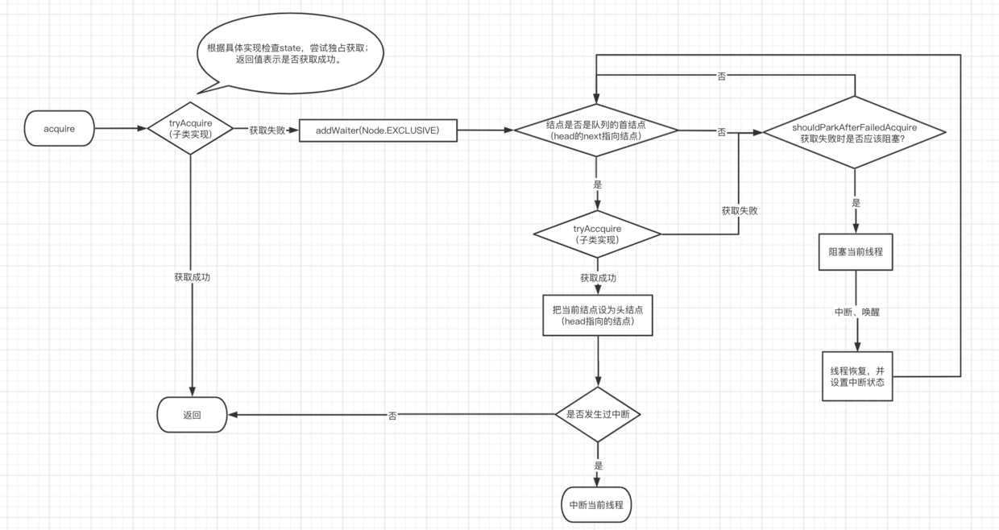

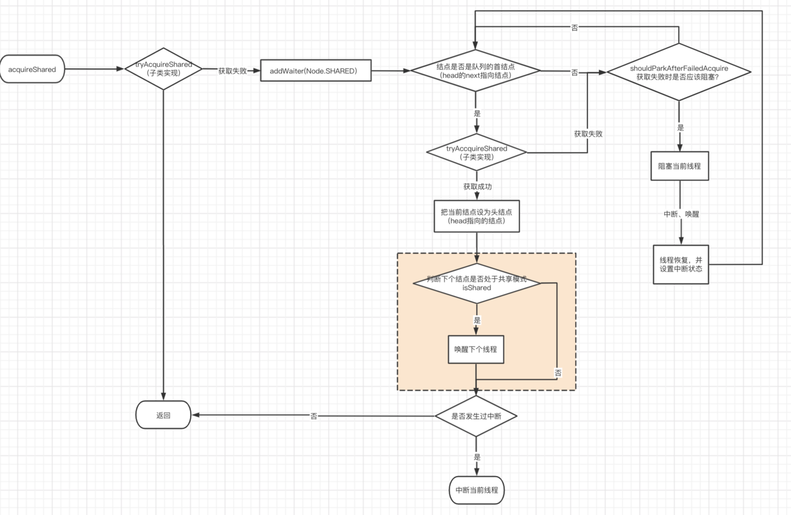

> **shouldParkAfterFailedAcquire方法流程：**
> 
> 检查当前结点的前驱结点的waiteStatus
> 
> 1）如果是是SIGNAL，则返回true
> 
> 2）如果是已取消，则在队列中剔除当前结点前连续的取消结点；返回false；
> 
> 3）否则，设置前驱结点的waiteStatus为SIGNAL。返回false。
> 
> Note：
> 
> 1）通过addWaiter增加的结点waitStatus=0； 会再第二次进入本方法时才返回true；
> 
> 2）确保前驱结点为SIGNAL才阻塞当前线程。因为只有前驱结点的waiteStatus为SIGNAL时才会在前驱结点release或cancel时唤醒其后继结点，才不至于使线程一直下去 。

### 7、AQS的release方法流程图

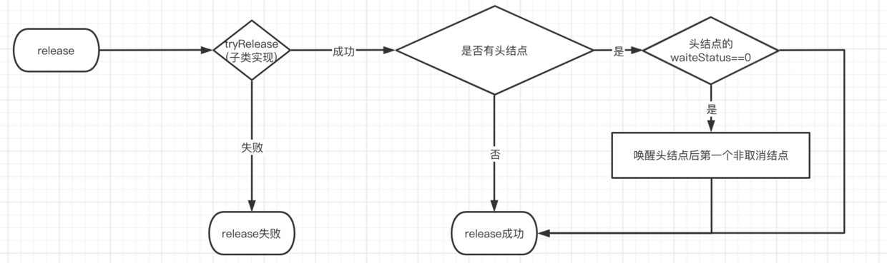

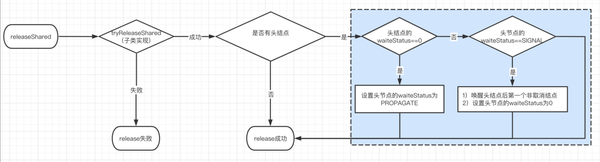

### 8、Node类关键属性

```java
static final class Node {
        /** Marker to indicate a node is waiting in shared mode */
        static final Node SHARED = new Node();
        /** Marker to indicate a node is waiting in exclusive mode */
        static final Node EXCLUSIVE = null;

        /** waitStatus value to indicate thread has cancelled */
        static final int CANCELLED =  1;
        /** waitStatus value to indicate successor's thread needs unparking */
        static final int SIGNAL    = -1;
        /** waitStatus value to indicate thread is waiting on condition */
        static final int CONDITION = -2;
        /**
         * waitStatus value to indicate the next acquireShared should
         * unconditionally propagate
         */
        static final int PROPAGATE = -3;
        /**
        * 值只可取CANCELLED（1）,SIGNAL（-1）,CONDITION（-2）,PROPAGATE（-3）,0。当值非负时意味着结点无需唤醒。
        * 所以，大多数代码不需要检查特定值，只需要检查符号即可。
        * 结点作为同步队列结点时初始化为0，作为条件队列结点时初始化为CONDITION（-2）。  
        **/
        volatile int waitStatus;
        /** 前驱结点**/  
        volatile Node prev;
        /** 后继结点**/  
        volatile Node next;
        /** 结点持有线程**/  
        volatile Thread thread;
        /** 连接条件队列的下个结点，或者为SHARED。
        * 因为条件队列只有在独占模式下保持时才被访问，所以我们只需要一个简单的链接队列来保持节点在等待条件时的状态。然后将它们转移到队列以重新获取。
        * 由于条件只能是互斥的，所以我们通过使用SHARED表示共享模式。
        **/  
        Node nextWaiter;
}
```

### 9、acquire源码

```java
  /**
  * 以排他的方式去占有，且在此过程中忽略中断。实现时会至少调用一次tryAcquire方法。
  * 1）若本方法返回则表示获取成功;
  * 2）否则，当前线程插入同步队列，状态在阻塞和非阻塞间反复转换，调用tryAcquire方法直到成功。
  * 
  * Note: 此方法可用于实现java.util.concurrent.locks.Lock#lock方法。
  **/
public final void acquire(int arg) {
    //  若tryAcquire失败，则把当前线程封装在Node中插入同步队列，入队后再尝试获取资源       
    if (!tryAcquire(arg) && acquireQueued(addWaiter(Node.EXCLUSIVE), arg)) {
            selfInterrupt();
    }
}

/**
* 以排他的方式去占有，该方法会查询对象的许可状态（state of the object permits）是否可以被排他的获取，如果是则成功占有。
* 本方法常用于线程执行占有操作。如果本方法返回失败且线程还没有入队，则acquire方法会把当前线程插入同步队列，直到被其他线程的release信号唤醒。
*
* Note：本方法可被用于实现java.util.concurrent.locks.Lock#tryLock方法
**/
protected boolean tryAcquire(int arg) {
    throw new UnsupportedOperationException();
}

/**
* 根据指定的模式和当前线程创建Node并插入同步队列
**/
private Node addWaiter(Node mode) {
  Node node = new Node(Thread.currentThread(), mode);
  // 尝试快速入队（是完整入队逻辑中的一个分支逻辑），若失败再执行完整入队逻辑
  Node pred = tail;
  if (pred != null) {
    node.prev = pred;
    if (compareAndSetTail(pred, node)) {
      pred.next = node;
      return node;
    }
  }

  // 完整入队逻辑
  enq(node);
  return node;
}

/**
* 把节点插入同步队列，必要时执行初始化逻辑
**/
private Node enq(final Node node) {
  for (;;) {
    Node t = tail;
      if (t == null) { // Must initialize
        // 惰性初始化
        if (compareAndSetHead(new Node()))
          tail = head;
        } else {
          node.prev = t;
          if (compareAndSetTail(t, node)) {
            t.next = node;
            return t;
        }
      }
   }
}

/**
* 在同步队列中的线程通过排他、不中断的模式去acquire。
* 本方法也可以用于条件等待方法。
**/
final boolean acquireQueued(final Node node, int arg) {
        boolean failed = true;
        try {
            boolean interrupted = false;
            for (;;) {
                final Node p = node.predecessor();
                if (p == head && tryAcquire(arg)) {
                    setHead(node);
                    p.next = null; // help GC
                    failed = false;
                    return interrupted;
                }
                if (shouldParkAfterFailedAcquire(p, node) &&
                    parkAndCheckInterrupt())
                    interrupted = true;
            }
        } finally {
            if (failed)
                cancelAcquire(node);
        }
}
```

### 10、AQS的acquireShared源码

```java
 /**
     * Acquires in shared mode, ignoring interrupts.  Implemented by
     * first invoking at least once {@link #tryAcquireShared},
     * returning on success.  Otherwise the thread is queued, possibly
     * repeatedly blocking and unblocking, invoking {@link
     * #tryAcquireShared} until success.
     *
     * @param arg the acquire argument.  This value is conveyed to
     *        {@link #tryAcquireShared} but is otherwise uninterpreted
     *        and can represent anything you like.
     */
    public final void acquireShared(int arg) {
        if (tryAcquireShared(arg) < 0)
            doAcquireShared(arg);
    }

    private void doAcquireShared(int arg) {
        final Node node = addWaiter(Node.SHARED);
        boolean failed = true;
        try {
            boolean interrupted = false;
            for (;;) {
                final Node p = node.predecessor();
                if (p == head) {
                    int r = tryAcquireShared(arg);
                    if (r >= 0) {
                        setHeadAndPropagate(node, r);
                        p.next = null; // help GC
                        if (interrupted)
                            selfInterrupt();
                        failed = false;
                        return;
                    }
                }
                if (shouldParkAfterFailedAcquire(p, node) &&
                    parkAndCheckInterrupt())
                    interrupted = true;
            }
        } finally {
            if (failed)
                cancelAcquire(node);
        }
    }
```

### 11、AQS的release方法源码

```java
/**
* 在排他模式下release。当tryRease返回true时，unblocking一个或多个线程。
* 
* Note: 本方法用于实现java.util.concurrent.locks.Lock#unlock方法。
**/
public final boolean release(int arg) {
 if (tryRelease(arg)) {
            Node h = head;
            if (h != null && h.waitStatus != 0)
                unparkSuccessor(h);
            return true;
  }
  return false;
}

/**
* 如果存在后继节点，则唤醒后继节点
**/
private void unparkSuccessor(Node node) {
        /*
        * 如果状态是负数，则尝试去清除SIGNAL信号（该信号标识其后继节点需要唤醒）。
        * 即使清除失败或状态已被等待的线程改变也没关系。
         */
        int ws = node.waitStatus;
        if (ws < 0)
            compareAndSetWaitStatus(node, ws, 0);

        /*
        * 正常情况下被unpark的线程是其后继结点。
        * 但是如果其后继结点为空或已被取消，则从tail向前回溯来发现真正的未取消的后继结点。
         */
        Node s = node.next;
        if (s == null || s.waitStatus > 0) {
            s = null;
            for (Node t = tail; t != null && t != node; t = t.prev)
                if (t.waitStatus <= 0)
                    s = t;
        }
        if (s != null)
            LockSupport.unpark(s.thread);
}
```

## 二、使用AQS的实现

> 以下流程图是通过阅读JDK8源码得出。

### 1、ReentrantLock

> ReentrantLock中state表示锁定次数，为0时表示未被锁定。默认使用非公平锁。

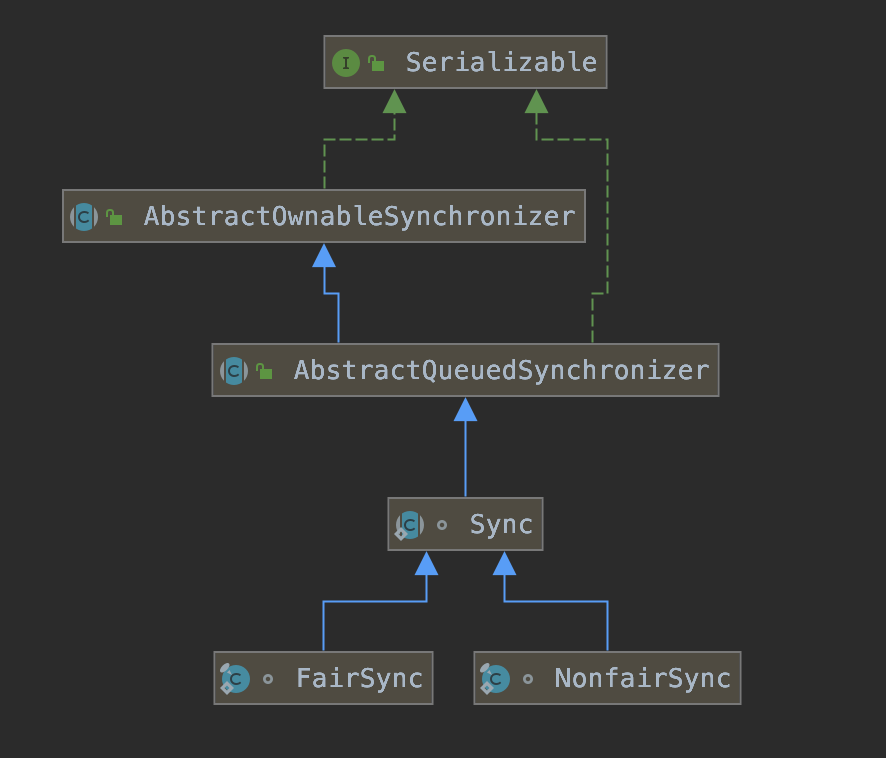

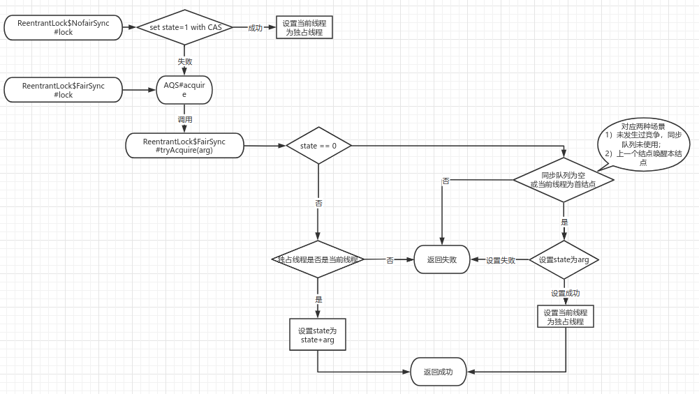

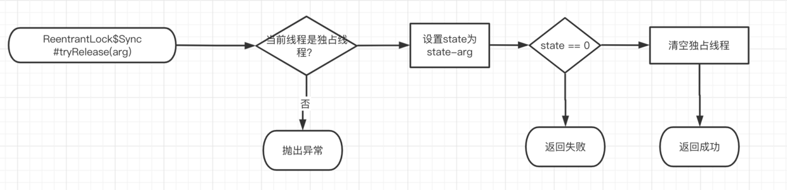

### 2、ReentrantReadWriteLock

> state为int类型，高16位用于读锁，低16位用于写锁。默认非公平锁。

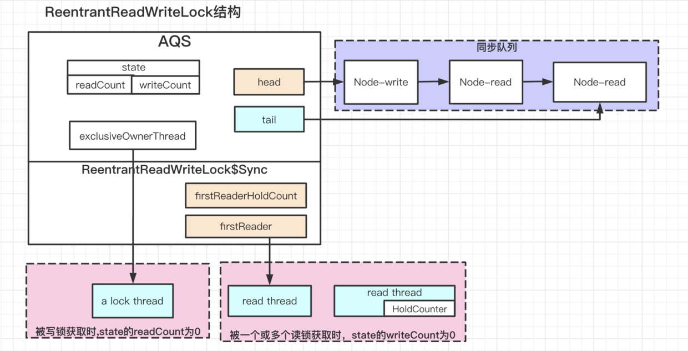

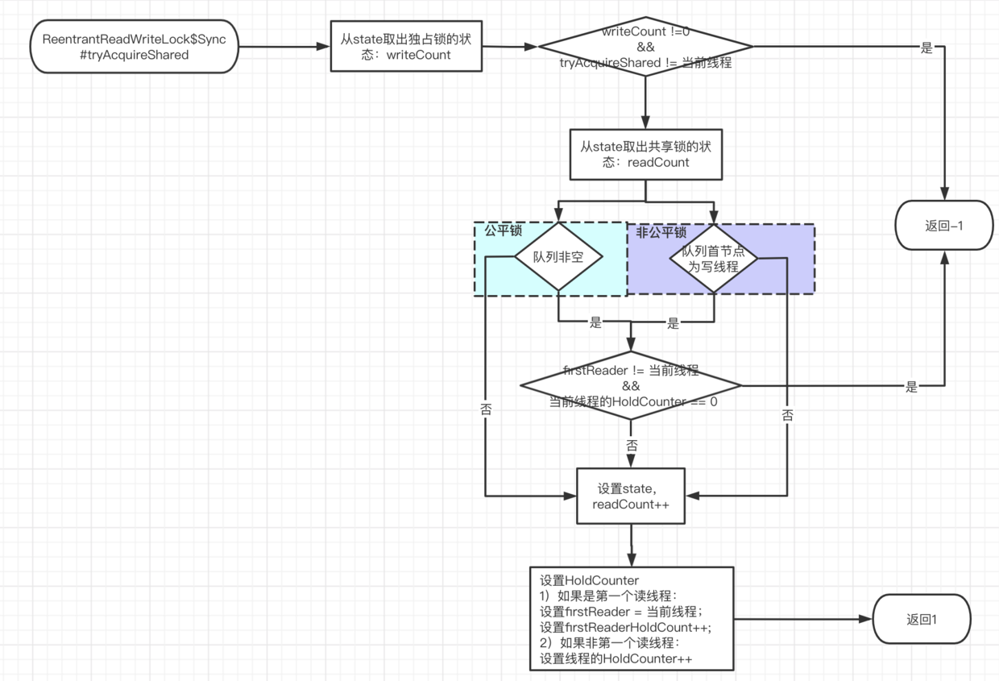

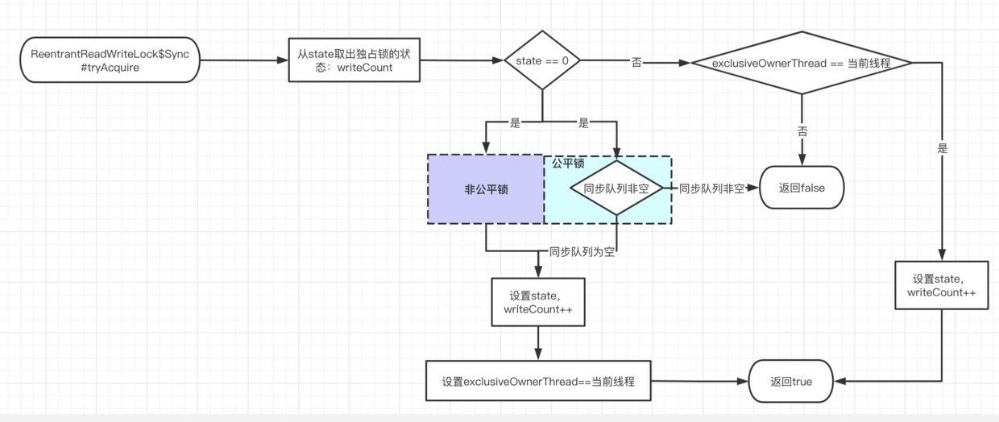

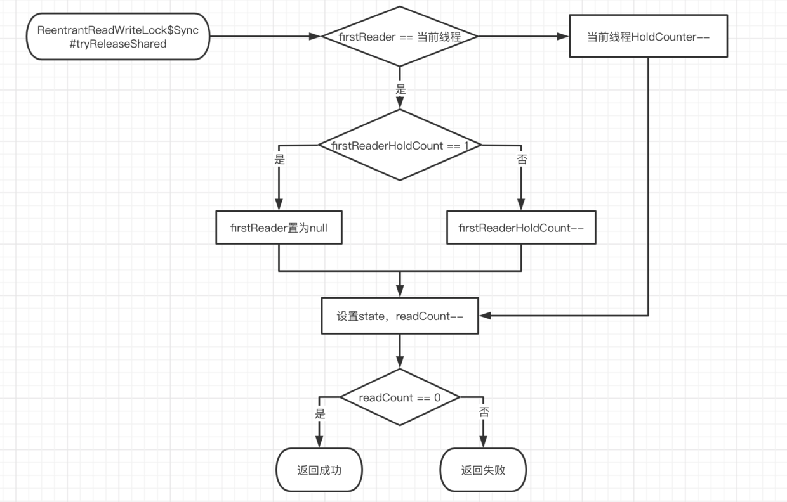

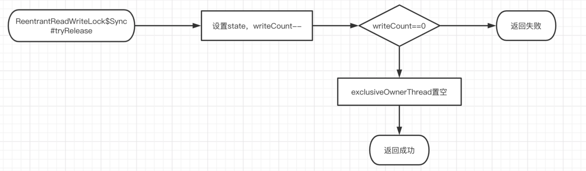

### 3、Semaphore

> state表示许可数量。默认非公平锁。

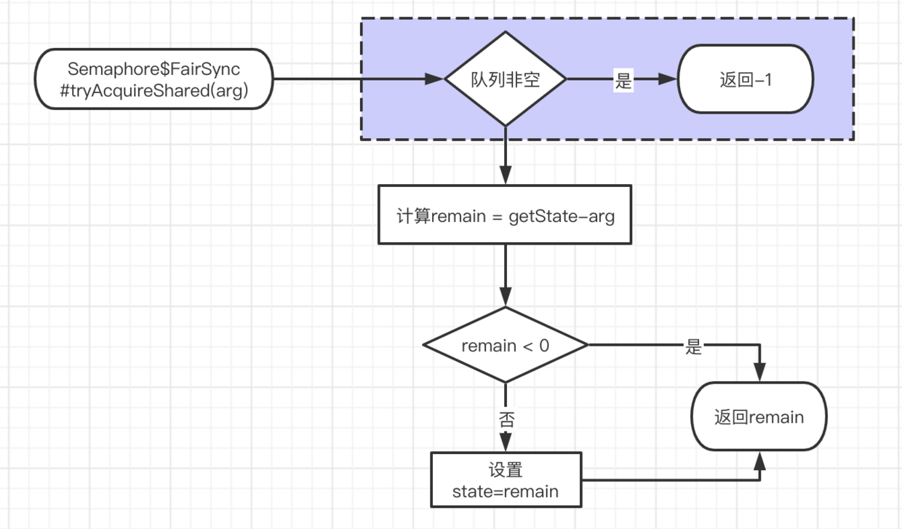

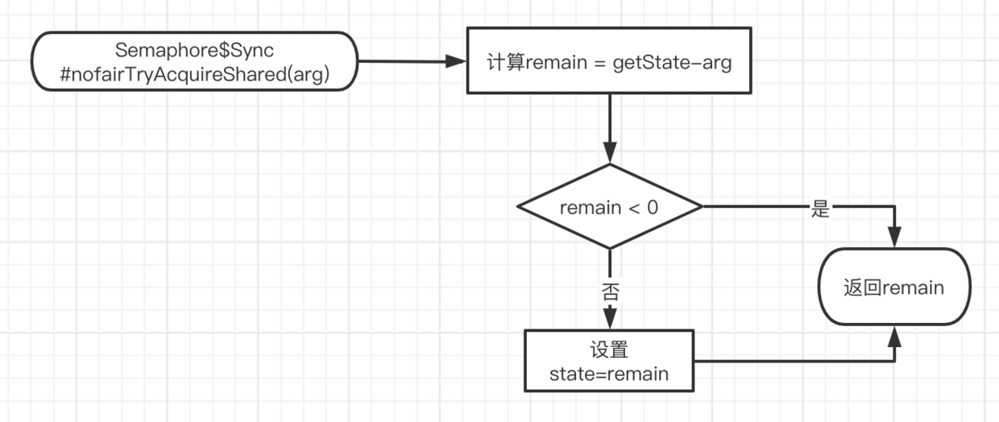

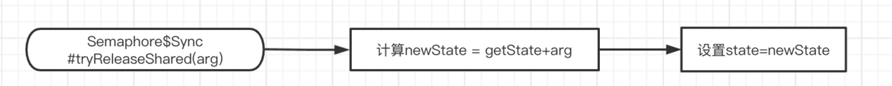

### 4、CountDownLatch

> state是初始化时传入的参数。

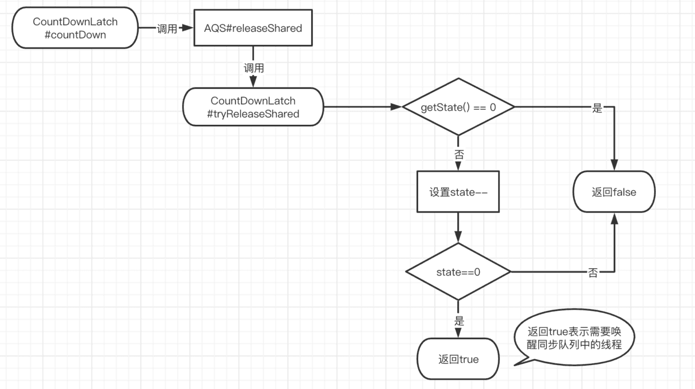

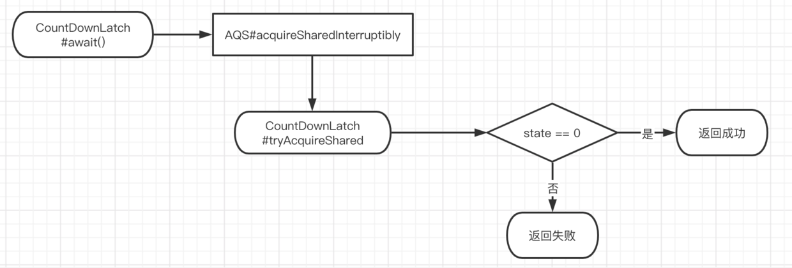
