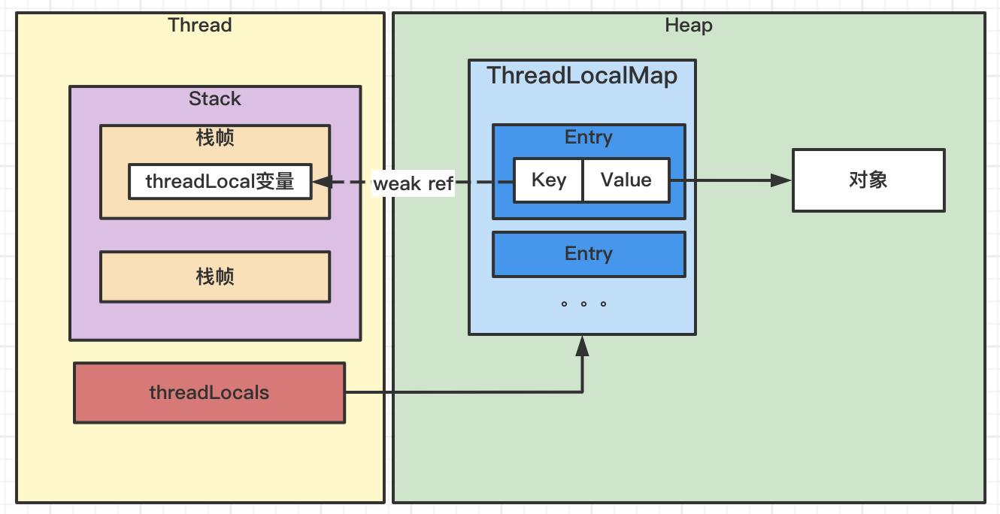

## 一、ThreadLocal内存和引用结构

## 二、内存泄漏原因

1）ThreadLocalMap中Entry的Key对ThreadLocal变量的引用是弱引用，ThreadLocal变量可随着实例回收而回收。

2）ThreadLocalMap中Entry的Value对ThreadLocal创建的值是强引用，GC Root是线程对象Thread，跟随线程的生命周期。而现在很多框架如Tomat等使用的是线程池，线程可能在JVM运行期间都不会被销毁。

3）如果ThreadLocal变量在回收前没有调用remove方法，删除Entry，则会导致内存泄漏。

## 三、解决方案

在ThreadLocal回收前及时调用Remove方法，否则会在线程销毁时才回收。