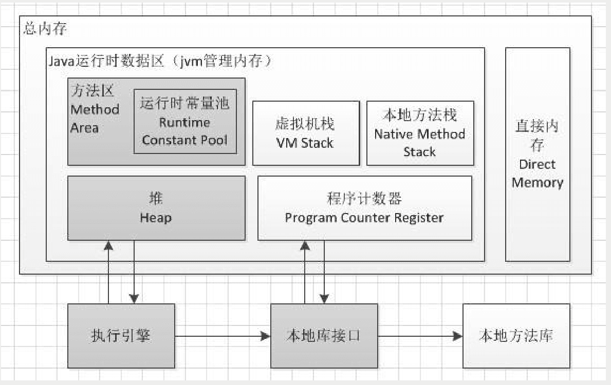
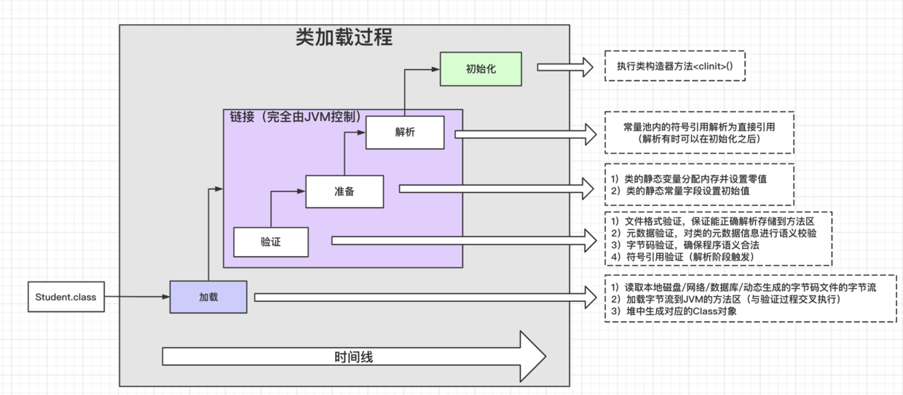
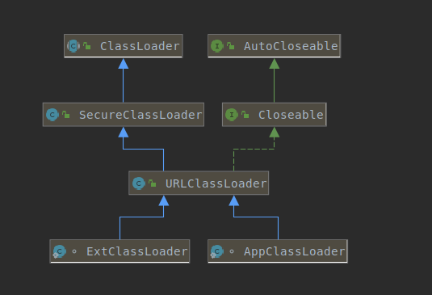

<!-- date: 2020.06.10 22:37 -->
## 一、前置问题

1. 类加载顺序是什么？是严格有序的吗？
2. 验证过程验证的什么内容？
3. 什么是双亲委派？为什么要采用双亲委派？
4. 什么是全盘委托？
5. 什么情况下需要自定义类加载器？
6. 三种类加载器分别加载哪里的类？
7. ClassLoader,URLClassLoader, AppClassLoader的各自职责？
8. findClass和loadClass的区别?
9. UrlClassPath的实现原理？
10. 自定义类加载器一般需要实现哪个方法？
11. 自己写一个String类可以被classloader加载吗？
12. 类加载到哪里了？方法区还是堆？

## 二、JVM结构图



## 三、类加载顺序

### 1、加载顺序



> 类加载是指类加载器把类字节码加载到方法区，然后在堆上创建对应的class对象来封装对方法区的数据结构。

加载 -> 验证 -> 准备 -> 解析 -> 初始化

1）加载：classloader从其可见的资源路径中加载指定的java字节码，即class文件；

2）验证：验证class文件的正确性；

3）准备：给类的静态变量分配空间并赋予默认值；

4）解析：解析符号引用为直接引用，其中符号指类的静态方法的方法名替换为该方法所在的内存地址指针，也叫直接引用

5）初始化：执行类构造器方法<clinit>，即把类的静态变量初始化为指定的值，执行静态代码块。

这个顺序是开始执行的顺序，不是串行执行，通常是在一个过程执行中触发下一个过程。

### 2、ClassLoader.load vs Class.forName

#### 1）方法说明

```java
// initialize：是否执行类初始化操作，即是否执行<cinit>方法。
Class.forName(String className, boolean initialize, ClassLoader loader)

// 等价于：Class.forName(String className, true, currentLoader)
// currentLoader为`真正加载当前类的classLoader`（最后被委托的类加载器，执行defineClass方法的类加载器实例），`非线程上下文的ClassLoader`
Class.forName(String className)

// resolve：是否解析类，即是否解析符号为直接地址
ClassLoader.load(String className, boolean resolve)

// 等价：ClassLoader.load(String className, false)
ClassLoader.load(String className)
```

#### 2） 关联点

Class.forName最终也是调用ClassLoader去加载类的。

#### 3）区别

##### I、是否执行类初始化操作

* Class.forName可以控制是否执行类初始化操作；
* ClassLoader不会触发类初始化操作；

案例：数据库驱动需要使用Class.forName来触发静态库注册驱动；

##### II、是否会解析数组类型

* Class.forName会解析数组类型，如`[Ljava.lang.String;`
* ClassLoader不会解析数组类型，加载时会抛出ClassNotFoundException;

##### III、是否有缓存

* 类是缓存真正加载类的ClassLoader里的，此时需要避免`委托给应用类加载器，而使用自定义类加载器去加载类`；考虑打破双亲委派或指定AppClassLoader不可见路径；
* 只要指定每次加载类的ClassLoader即可实现热加载；

```java
public class HotLoadClassTest {
    private final File path = new File("/Users/kivi/Documents");

    @Test
    public void testClassForName() throws Throwable {
        Class aClass = Class.forName("MyString", true, new MyClassLoader(new URL[]{path.toURL()}));
        aClass.getDeclaredMethod("echo").invoke(null);

        /** 替换MyString实现，可加载最近类 **/
        aClass = Class.forName("MyString", true, new MyClassLoader(new URL[]{path.toURL()}));
        aClass.getDeclaredMethod("echo").invoke(null);
    }

    @Test
    public void testClassLoader() throws Throwable {
        Class<?> aClass = new MyClassLoader(new URL[]{path.toURL()}).loadClass("MyString");
        aClass.getDeclaredMethod("echo").invoke(null);

        /** 替换MyString实现，可加载最近类 **/
        aClass = new MyClassLoader(new URL[]{path.toURL()}).loadClass("MyString");
        aClass.getDeclaredMethod("echo").invoke(null);
    }

    public static class MyClassLoader extends URLClassLoader {
        public MyClassLoader(URL[] urls) {
            super(urls);
        }
}

public class MyString {
    private static int invokeTime = 0;

    static {
        System.out.println("here is MyString static block");
    }

    public static void echo() {
        System.out.println("第" + (invokeTime++) + "次被调用");
    }
}
```

#### 4）数据库驱动注册与Class.forName

```java
package com.mysql.cj.jdbc;
public class Driver extends NonRegisteringDriver implements java.sql.Driver {
    public Driver() throws SQLException {
    }

    // 数据库驱动注册时必须使用Class.forName加载类，以此来保证执行注册逻辑的静态代码块
    static {
        try {
            DriverManager.registerDriver(new Driver());
        } catch (SQLException var1) {
            throw new RuntimeException("Can't register driver!");
        }
    }
}
```

## 四、类加载器

### 1、加载器类型

| 加载器     | 实现     | 加载路径                  | 备注          |
| ------- | ------ | --------------------- | ----------- |
| 启动类加载器  | C++实现  | 加载jre/lib下的rt.jar等核心包 |             |
| 扩展类加载器  | Java实现 | 加载jre/lib/ext扩展目录的包   | Lancher的内部类 |
| 应用加载器   | Java实现 | 加载classpath的包         | Lancher的内部类 |
| 自定义类加载器 | Java实现 | 自定义路径                 |             |

### 2、类继承结构



| 类              | 职责                                                   | 关键方法                                       |
| -------------- | ---------------------------------------------------- | ------------------------------------------ |
| ClassLoader    | 1）实现双亲委派；2）加载类字节码到内存；                                | loadClass(), defineClass()                 |
| URLClassLoader | 根据URL定位资源                                            | findClass(), getResource(), getResources() |
| AppClassLoader | 定义应用类加载器的资源路径（System.getProperty("java.class.path")） |                                            |
| ExtClassLoader | 定义扩展类加载器的资源路径（System.getProperty("java.ext.dirs")）   |                                            |

## 五、双亲委派和全盘委托


1）双亲委派是指先由父加载器去加载，如果父加载器无法找到类，再由自身加载。

2）全盘委托是指当一个ClassLoader装载一个类时，除非显示地使用另一个ClassLoader，否则该类所依赖及引用的类也由这个CladdLoader载入。

## 六、SPI的ServiceLoader加载类原理

由于ServcieLoader类加载器的是启动类加载器，其无法加载应用的类，故获取当前线程的上下文类加载器来加载META-INF/services下声明的类。

```java
public final class ServiceLoader<S> implements Iterable<S> {
  public static <S> ServiceLoader<S> load(Class<S> service) {
        ClassLoader cl = Thread.currentThread().getContextClassLoader();
        return ServiceLoader.load(service, cl);
  }
}
```

## 七、自定义类加载器

应用开发时有些业务场景往往需要自定义类加载器，原因一般有以下几种：

1）资源隔离；例如多租户系统，Tomcat的多应用等

2）热加载，热部署；

3）加载非classpath中的资源；

以上的情景中有些需要打破双亲委派；

## 八、自定义的java.lang.String类无法被加载

1）如果不自定义类加载器，则双亲委派机制始终加载rt.jar的String类；

2）如果自定义类加载器，打破双亲委派，但是由于defineClass里约束了不能加载以*java.*起始的类，会抛出异常。

```java
public abstract class ClassLoader {
 protected final Class<?> defineClass(String name, byte[] b, int off, int len, ProtectionDomain protectionDomain) throws ClassFormatError {
        protectionDomain = preDefineClass(name, protectionDomain);
        String source = defineClassSourceLocation(protectionDomain);
        Class<?> c = defineClass1(name, b, off, len, protectionDomain, source);
        postDefineClass(c, protectionDomain);
        return c;
  }
  private ProtectionDomain preDefineClass(String name, ProtectionDomain pd) {
        if (!checkName(name))
            throw new NoClassDefFoundError("IllegalName: " + name);

        // Note:  Checking logic in java.lang.invoke.MemberName.checkForTypeAlias
        // relies on the fact that spoofing is impossible if a class has a name
        // of the form "java.*"
        if ((name != null) && name.startsWith("java.")) {
            throw new SecurityException
                ("Prohibited package name: " +
                 name.substring(0, name.lastIndexOf('.')));
        }
        if (pd == null) {
            pd = defaultDomain;
        }

        if (name != null) checkCerts(name, pd.getCodeSource());

        return pd;
    }
}
```

## 九、sun.misc.Launcher类

该类初始化时主要执行以下动作：

1）初始化扩展类加载器，parentClassLoader为null（因为启动类加载器由c++实现）；

2）初始化应用类加载器，并设其parentClassLoader为扩展类加载器；

3）设置sun.misc.Launcher#loader为应用类加载器；（java.lang.ClassLoader#getSystemClassLoader返回的就是该字段）

4）设置当前线程的ContextClassLoader为应用类加载器；

```java
public Launcher() {
        // Create the extension class loader
        ClassLoader extcl;
        try {
            extcl = ExtClassLoader.getExtClassLoader();
        } catch (IOException e) {
            throw new InternalError(
                "Could not create extension class loader", e);
        }

        // Now create the class loader to use to launch the application
        try {
            loader = AppClassLoader.getAppClassLoader(extcl);
        } catch (IOException e) {
            throw new InternalError(
                "Could not create application class loader", e);
        }

        // Also set the context class loader for the primordial thread.
        Thread.currentThread().setContextClassLoader(loader);

        // Finally, install a security manager if requested
        String s = System.getProperty("java.security.manager");
        if (s != null) {
            // init FileSystem machinery before SecurityManager installation
            sun.nio.fs.DefaultFileSystemProvider.create();

            SecurityManager sm = null;
            if ("".equals(s) || "default".equals(s)) {
                sm = new java.lang.SecurityManager();
            } else {
                try {
                    sm = (SecurityManager)loader.loadClass(s).newInstance();
                } catch (IllegalAccessException e) {
                } catch (InstantiationException e) {
                } catch (ClassNotFoundException e) {
                } catch (ClassCastException e) {
                }
            }
            if (sm != null) {
                System.setSecurityManager(sm);
            } else {
                throw new InternalError(
                    "Could not create SecurityManager: " + s);
            }
        }
```