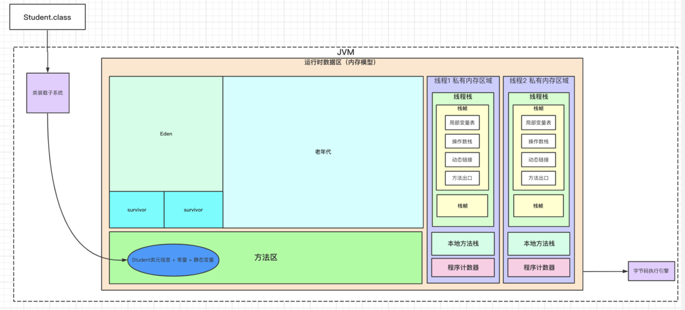
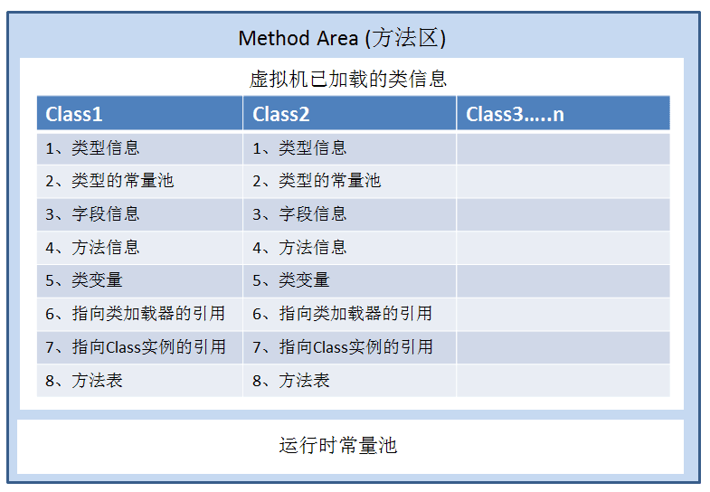
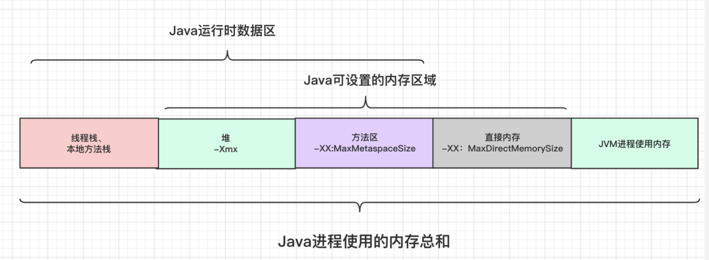
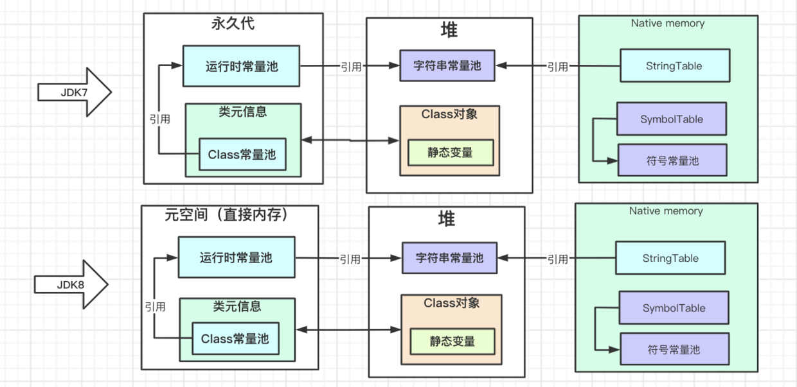
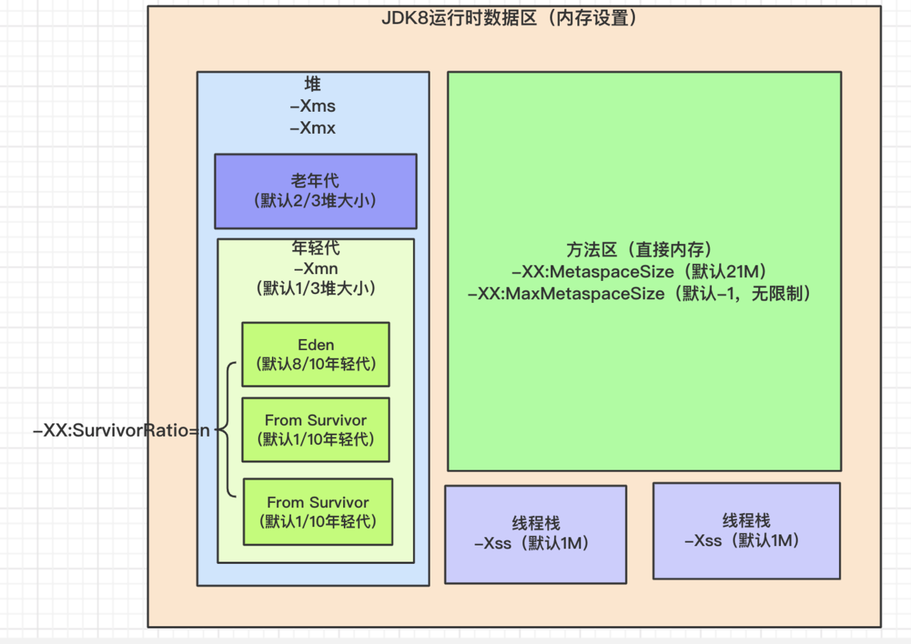
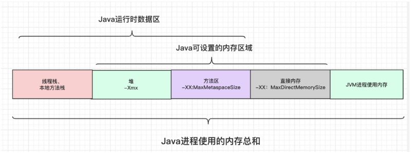
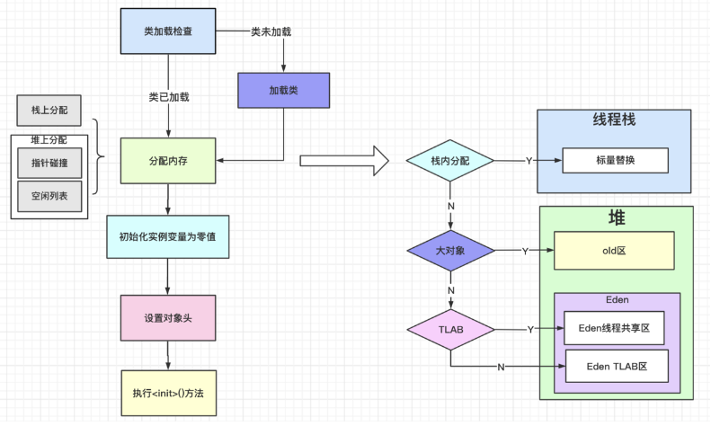
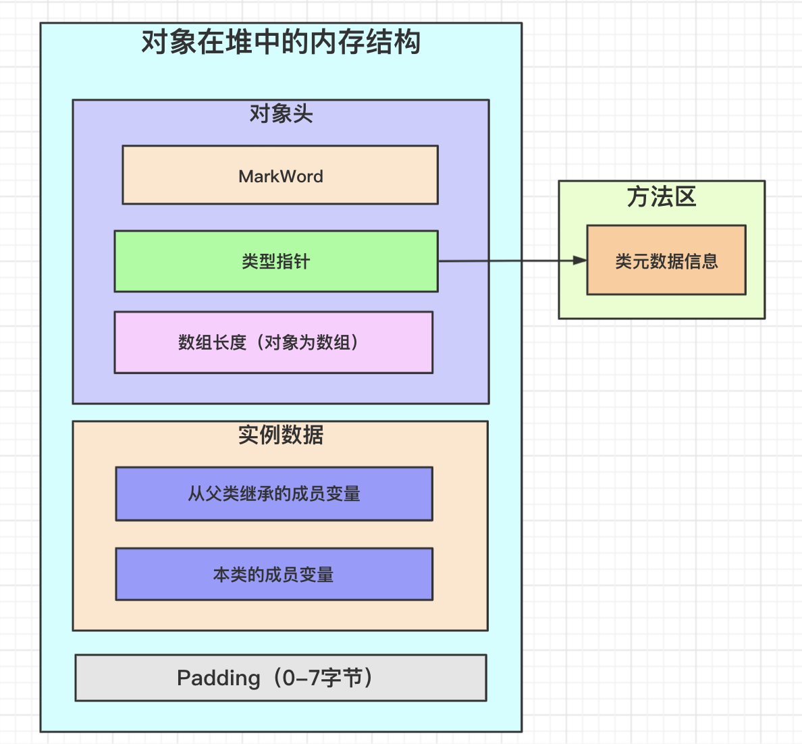
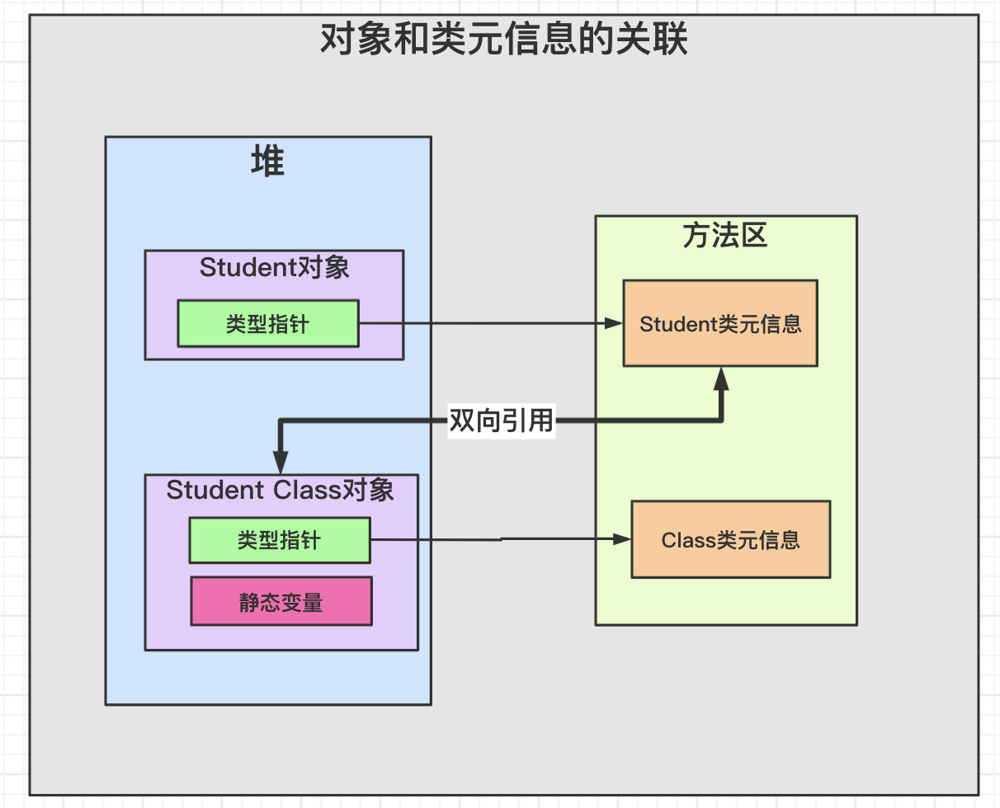

## 一、运行时数据区
Java虚拟机规范规定的运行时内存主要有以下区域：

1）堆：对象存储区域

2）方法区：类元信息，运行时常量池

3）线程栈和本地方法栈：方法执行时的栈帧信息

4）程序计数器：记录当前线程要执行下一行代码的位置，执行native方法时为空。

Note：栈帧中的动态链接指向当前方法在方法区的地址；

### 方法区结构（JDK1.6及以下版本）

### HotSpot虚拟机实现
在HotSpot实现时会有些许差别，例如：

1）合并本地方法栈和线程栈

2）方法区的实现

## 二、内存设置

### Java常用内存设置参数

例子：如下命令会进行如下设置：

1）设置堆大小为512m

2）设置年轻代中Eden区和Survivor区比例`Eden : From Survivor : To Survivor=8:1:1`。

> java -Xms512m -Xmx512m -XX:SurvivorRatio=8 person/kivi/MainTest
### Java进程的内存
直接内存受限于进程在当前系统下可使用的内存。例如32位系统，应用使用上线为4GB。

## 三、类装载过程

见—[类加载机制](1.类加载机制.md)

## 四、对象创建过程

## 五、对象结构

Note:

1）MarkWord的长度是一个字，与指针压缩无关。字是CPU一次能并行处理的二进制位数，一般为系统的位数。

2）指针压缩的对象是oop，即对象的引用地址。

* 地址<=32位，无需启动压缩；
* 地址在区间(pic/1240-20210115023606994.png)

## 七、类，类对象，类元信息的关联

## 八、OutOfMemeory发生位置

1、堆区：空间不足，无法创建新对象。

2、方法区：空间不足，无法加载类元数据信息。

3、线程栈：空间不足，无法为线程分配线程栈。

## 参考

1. [https://docs.oracle.com/javase/specs/](https://docs.oracle.com/javase/specs/)
1. [https://zhuanlan.zhihu.com/p/108668874](https://zhuanlan.zhihu.com/p/108668874)
1. [https://www.breakyizhan.com/javamianshiti/2839.html](https://www.breakyizhan.com/javamianshiti/2839.html)