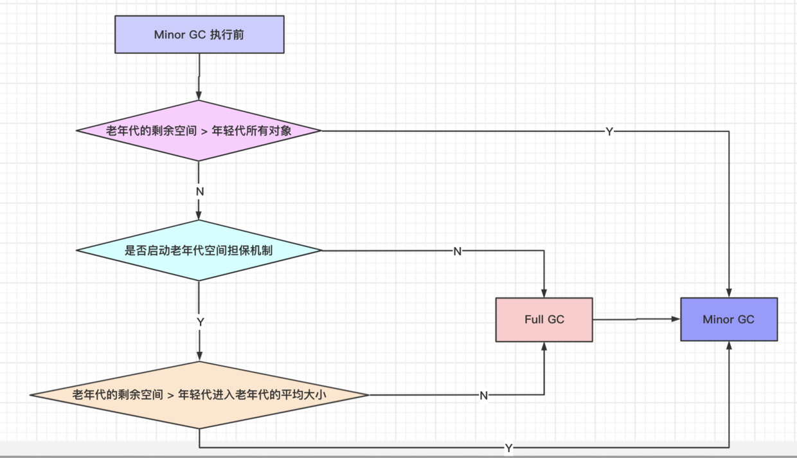

<!-- date: 2020.06.11 09:42 -->
## 一、前置问题

1. 垃圾回收的条件是什么？
2. 什么是STW?为什么要有STW？
3. 安全点是什么？为什么要有安全点？
4. 对象的分配策略？
5. 对象分配到老年代的场景?
6. 什么是空间担保机制？
   
## 二、内存动态分配和垃圾收集
   
Java语言由JVM负责内存的分配以及垃圾收集。带来的好处是这减少了程序员的工作，不容易出现内存泄漏，内存溢出，访问越界等问题。但是也带来了挑战，当需要排查内存泄漏等问题时就需要了解JVM的内存分配和垃圾收集机制。
   
## 三、垃圾回收
   
> JVM的各个内存区域存放了不同的内容，如方法区主要是类元信息和运行时常量池，堆存放对象实例。由于类元数据信息的生命周期几乎会持续整个java进程，所以方法区的空间使用较稳定，运行中产生的垃圾较少。对象的生命周期大部分都是朝生夕死，时刻都有对象死去和新生，所以堆是垃圾收集的重点关注区域。

垃圾收集器在回收类和对象时，判断其是否是垃圾有不同的标准：

### 1、回收类条件

1）该类的所有实例已回收

类的实例会通过类型指针应用类元信息，程序可能随时会通过该实例访问类元数据来调用某个方法等。

2）加载该类的ClassLoader被回收

ClassLoader保存了其加载类的引用。例如，方法java.lang.ClassLoader#findLoadedClass就从中查找是否加载了某个类。

3）该类对应的 java.lang.Class 对象没有在任何地方被引用，无法在任何地方通过反射访问该类的方法。
Class对象作为类元数据的镜像对象，它如果在程序中被引用，也可能会随时访问类元信息。

### 2、回收对象条件

回收对象有两种主流方法1）引用计数，2）可达性分析。考虑到引用计数无法解决循环依赖时的垃圾回收问题，JVM选择了可达性分析。

可达性分析的操作：

1）从GCRoot开始遍历和标记所有引用关联的对象

2）标记的对象都是可达的，非垃圾对象；没有标记到的，被认为的垃圾对象；

3）垃圾对象被垃圾收集器回收

## 四、STW和安全点

### 1、STW - stop the world

执行垃圾回收时，垃圾回收器要求所有工作线程暂停（即STW），类似快照，在此基础上进行垃圾的回收操作。线程暂停的点就是安全点。

### 2、安全点

*安全点的设置原则*

1）方法栈帧执行前后设置安全点，可以减少保存上下文的工作，且此时可认为已执行完完整的CPU指令。

2）循环尾部，考虑循环可能时较耗时的操作，故作此折中。

*常见安全点位置*

1）循环的末尾（原则2）

2）方法临返回前（原则1）

3）调用方法之后（原则1）

4）抛异常的位置（原则1）

## 五、堆的分代规则

考虑到对象的生命周期不同，JVM的堆也进行了相应划分。

1、老年代：原则上存放长期存活的对象，如缓存，Class对象，线程池等；

2、年轻代：原则上存放朝生夕死的对象，如方法内的局部变量，数据转换的临时对象等；

其中，80%以上的对象基本都属于朝生夕死的，原则上不应该让其流转至老年代。因为在老年代回收对象的开销比年轻代大得多，回收算法也更复杂。

## 六、对象在堆各个代中的流转规则

### 1、对象优先分配到年轻代

### 2、分配至老年代条件

1）*时间维度*

年龄超过`-XX:MaxTenuringThreshold `后会由年轻代进入老年代。（默认15岁，CMS默认6岁）

2）*空间维度*

I、超过`-XX:PretenureSizeThreshold`的大对象直接分配到老年代（大对象指一个对象占用的连续内存较大，比如数组，大字符串）；

II、年轻代的survivor的空间使用超过`-XX:TargetSurvivorRatio`时，根据`动态年龄判断原则`把大龄对象移入老年代；

### 3、空间担保机制

`-XX:+HandlePromotionFailure`开启老年代的空间担保机制，其目的是为了减少fullgc次数，用历史平均值代替当前年轻代的所有对象大小，减少触发full gc的次数。

该机制会在执行minor gc之前判断老年代的剩余空间是否可以容纳所有年轻代的所有对象：

1）如果可以容纳，则执行minor gc

2）否则，继续判断老年代剩余空间是否可以容纳年轻代历史移动对象到老年的平均大小：

* 如果可以容纳，则执行minor gc

* 如果不可以容纳，则先执行full gc

