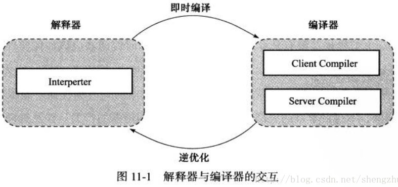
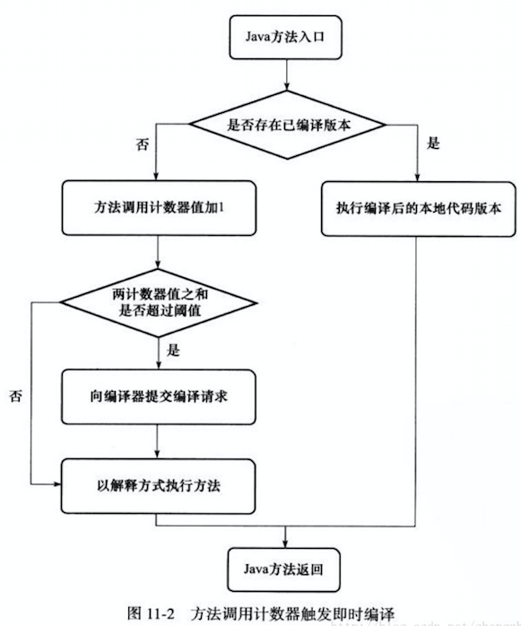

<!-- date: 2020.08.13 23:12 -->
市面上对字节码解释器的资料较少，不过我们只要把握其以下三个作用即可：

## 一、衔接JVM栈结构和CPU寄存器结构

解释器把Java字节码解释为汇编或机器码使其能在CPU集群器结构上运行。

## 二、插桩

1）在代码合适位置增加安全点——GC STW

2）在代码合适位置增加内存栅栏——可见性和有序性

3）在代码合适位置增加读写屏障——GC 三色标记，维护卡表状态

4）其他一些辅助代码；

## 三、JMM规则下优化代码

## 四、JIT

just-in-time即时编译器，负责把热点代码编译为机器码，来优化执行速度。

[图片来源](https://www.cnblogs.com/msymm/p/9395234.html)

## # 参考

1. https://www.cnblogs.com/msymm/p/9395234.html
