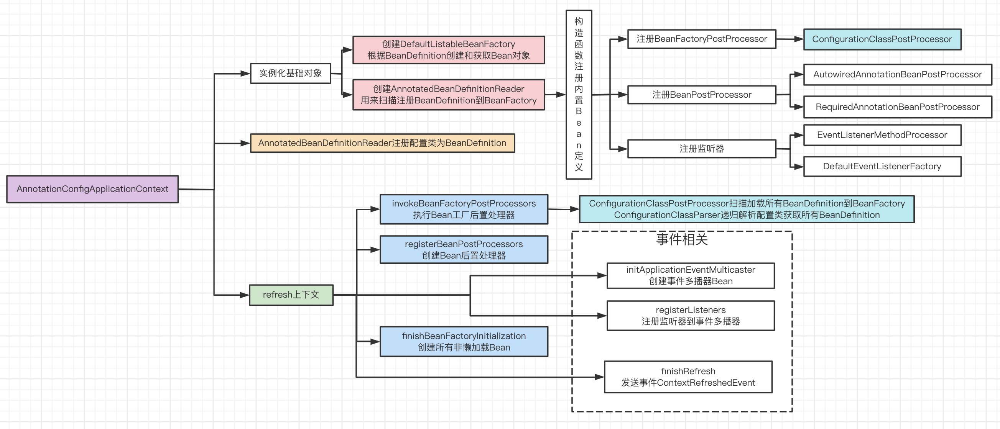
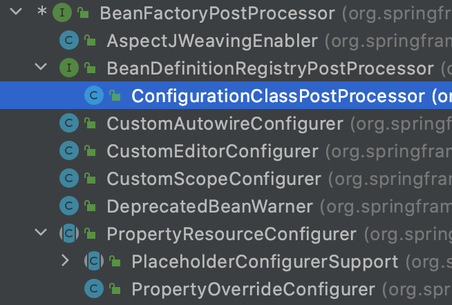
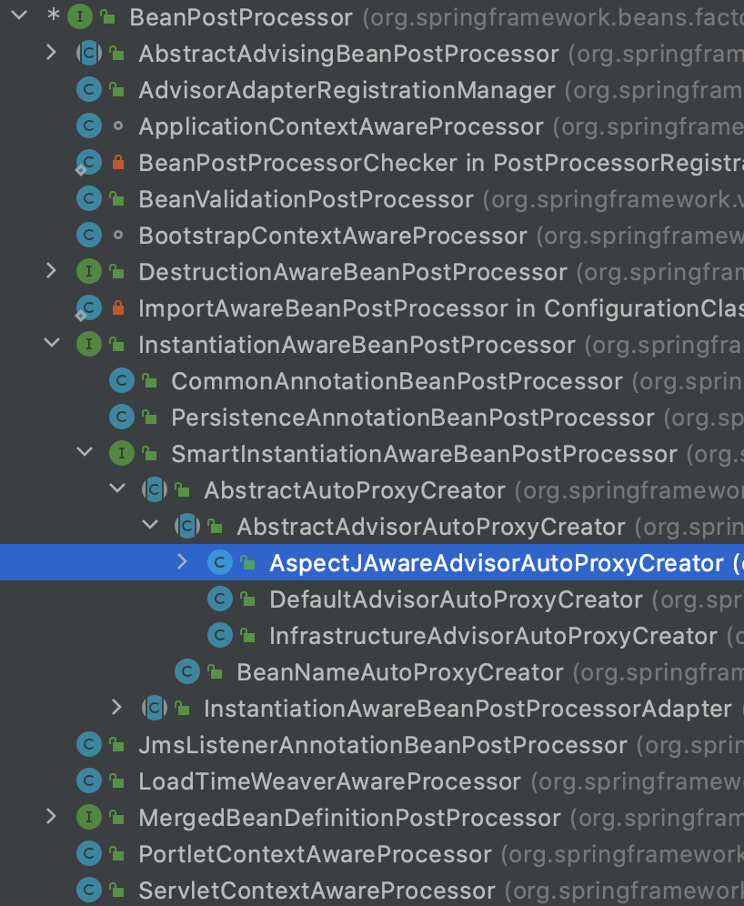
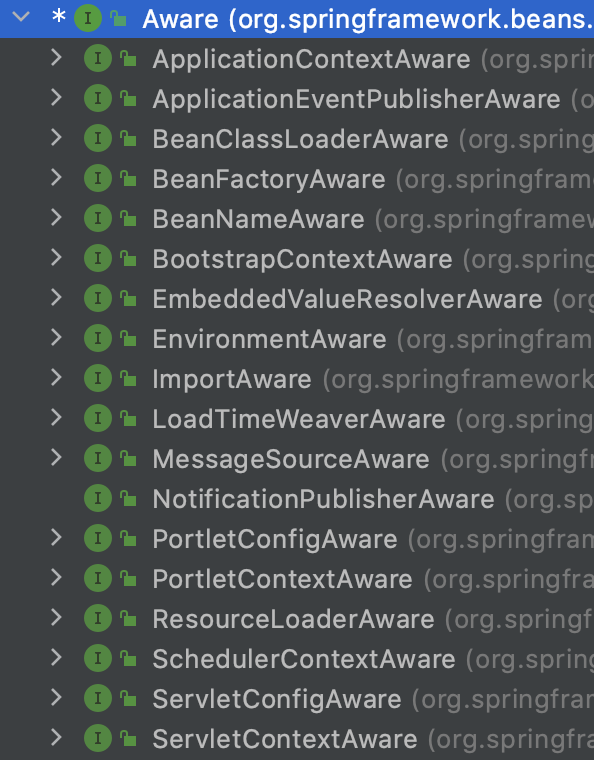

## 一、IOC容器启动

## 二、扩展点

### 1、BeanDefinition后置处理器

#### 1）两个扩展点

I、BeanFactoryPostProcessor

II、BeanDefinitionRegistryPostProcessor

扩展了上面接口，增加了bean定义注册方法。`AnnotationConfigApplicationContext`构造函数注册的ConfigurationClassPostProcessor。

#### 2）两者执行顺序

I、BeanDefinitionRegistryPostProcessor#postProcessBeanDefinitionRegistry

II、BeanFactoryPostProcessor#postProcessBeanFactory

#### 3）ConfigurationClassPostProcessor

I、ConfigurationClassPostProcessor#postProcessBeanDefinitionRegistry，解析配置类，含注解Configuration，Component，ComponentScan，Import，ImportResource，Bean。

解析逻辑在ConfigurationClassParser，解析配置类注解顺序：

* PropertySource
* ComponentScan
    * ComponentScanAnnotationParser进行解析bean定义，使用ClassPathBeanDefinitionScanner进行扫描。当发现解析出的为配置类时，递归调用ConfigurationClassParser#parse进行递归解析。
* Import
* ImportResource
* Bean

II、ConfigurationClassPostProcessor#postProcessBeanFactory，为配置类生成CGLib动态代理

### 2、Bean创建扩展点

BeanPostProcessor，如实现AOP。

### 3、Bean初始化扩展点

Aware接口

