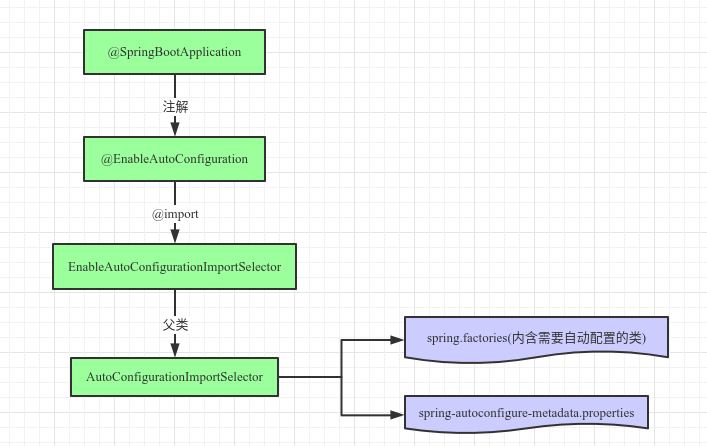

#### 一、SpringBoot自动配置原理

简单的SpingBoot启动示例：

```java
@SpringBootApplication
public class SpringBootdemoApplication {
    public static void main(String[] args) {
        SpringApplication.run(SpringBootdemoApplication.class, args);
    }
}
```

##### 1）注解*@SpringBootApplication*

除去元注解外，我们只需关注*@EnableAutoConfiguration*即可

```java
@Target(ElementType.TYPE)
@Retention(RetentionPolicy.RUNTIME)
@Documented
@Inherited
@SpringBootConfiguration
@EnableAutoConfiguration
@ComponentScan(excludeFilters = {
        @Filter(type = FilterType.CUSTOM, classes = TypeExcludeFilter.class),
        @Filter(type = FilterType.CUSTOM, classes = AutoConfigurationExcludeFilter.class) })
public @interface SpringBootApplication {
    @AliasFor(annotation = EnableAutoConfiguration.class, attribute = "exclude")
    Class<?>[] exclude() default {};

    @AliasFor(annotation = EnableAutoConfiguration.class, attribute = "excludeName")
    String[] excludeName() default {};

    @AliasFor(annotation = ComponentScan.class, attribute = "basePackages")
    String[] scanBasePackages() default {};

    @AliasFor(annotation = ComponentScan.class, attribute = "basePackageClasses")
    Class<?>[] scanBasePackageClasses() default {};
}
```

##### 2）注解*@EnableAutoConfiguration*

```java
@Target(ElementType.TYPE)
@Retention(RetentionPolicy.RUNTIME)
@Documented
@Inherited
@AutoConfigurationPackage
@Import(EnableAutoConfigurationImportSelector.class)
public @interface EnableAutoConfiguration {
    String ENABLED_OVERRIDE_PROPERTY = "spring.boot.enableautoconfiguration";

    Class<?>[] exclude() default {};

    String[] excludeName() default {};
```

其中，`@AutoConfigurationPackage`是把当前类所在的包通过*org.springframework.boot.autoconfigure.AutoConfigurationPackages.Registrar*注册进Spring的内置bean（*org.springframework.boot.autoconfigure.AutoConfigurationPackages*），以供本身（JPA框架）或其他第三方集成（mybatis扫描entity）调用。

##### 3）*EnableAutoConfigurationImportSelector*

```java
public class EnableAutoConfigurationImportSelector 
    extends AutoConfigurationImportSelector {

    @Override
    protected boolean isEnabled(AnnotationMetadata metadata) {
        if (getClass().equals(EnableAutoConfigurationImportSelector.class)) {
            return getEnvironment().getProperty(
                    EnableAutoConfiguration.ENABLED_OVERRIDE_PROPERTY, Boolean.class,
                    true);
        }
        return true;
    }
}
```

本类没有关键信息，向上查看其父类逻辑*AutoConfigurationImportSelector*。

##### 4）*AutoConfigurationImportSelector*

而AutoConfigurationImportSelector实现了DeferredImportSelector接口，实现延迟加载，用来处理条件性Bean。以下为spring doc的说明。

> public interface DeferredImportSelector  extends ImportSelector
> 
> A variation of [`ImportSelector`](https://docs.spring.io/spring-framework/docs/4.3.19.RELEASE/javadoc-api/org/springframework/context/annotation/ImportSelector.html) that runs after all `@Configuration` beans have been processed. This type of selector can be particularly useful when the selected imports are `@Conditional`.
> 
> Implementations can also extend the [`Ordered`](https://docs.spring.io/spring-framework/docs/4.3.19.RELEASE/javadoc-api/org/springframework/core/Ordered.html) interface or use the [`Order`](https://docs.spring.io/spring-framework/docs/4.3.19.RELEASE/javadoc-api/org/springframework/core/annotation/Order.html) annotation to indicate a precedence against other [`DeferredImportSelector`](https://docs.spring.io/spring-framework/docs/4.3.19.RELEASE/javadoc-api/org/springframework/context/annotation/DeferredImportSelector.html)s.

在此类主要加载了*META-INF/spring.facotries*文件中的自动配置类属性，然后从方法*selectImports*返回，完成自动注册配置类beanDefition。

```java
public class AutoConfigurationImportSelector
        implements DeferredImportSelector, BeanClassLoaderAware, ResourceLoaderAware,
        BeanFactoryAware, EnvironmentAware, Ordered {
    // 通过BeanFactoryAware注入
    private ConfigurableListableBeanFactory beanFactory;

    @Override
    public String[] selectImports(AnnotationMetadata annotationMetadata) {
        if (!isEnabled(annotationMetadata)) {
            return NO_IMPORTS;
        }
        try {
            /*
            * 加载META-INF/spring-autoconfigure-metadata.properties文件，
            * 内部声明了配置类的Order，Condition等信息
            */
            AutoConfigurationMetadata autoConfigurationMetadata = AutoConfigurationMetadataLoader.loadMetadata(this.beanClassLoader);

            /*
            * 读取META-INF/spring.facotries文件中自动配置属性。
            * key=org.springframework.boot.autoconfigure.EnableAutoConfiguration
            */
            AnnotationAttributes attributes = getAttributes(annotationMetadata);
            List<String> configurations = 
                getCandidateConfigurations(annotationMetadata, attributes);

            /*
            * 忽略非关键逻辑（对配置类进行去重，排除规则，排序等）
            */

            fireAutoConfigurationImportEvents(configurations, exclusions);
            return configurations.toArray(new String[configurations.size()]);
        }
        catch (IOException ex) {
            throw new IllegalStateException(ex);
        }
    }

    protected List<String> getCandidateConfigurations(AnnotationMetadata metadata,
            AnnotationAttributes attributes) {
        List<String> configurations = SpringFactoriesLoader.loadFactoryNames(
                getSpringFactoriesLoaderFactoryClass(), getBeanClassLoader());

        Assert.notEmpty(configurations, "No auto configuration classes found in META-INF/spring.factories. If you are using a custom packaging, make sure that file is correct.");
        return configurations;
    }
}
```

##### 5）总结



#### 二、案例1 - Interceptor加载

##### 1. 注册Interceptor代码示例

```java
@Configuration
public class MyWebMvcConfig extends WebMvcConfigurationSupport {
    /*
     * 拦截器配置
     */
    @Override
    public void addInterceptors(InterceptorRegistry registry) {
        // 注册自定义拦截器，添加拦截路径和排除拦截路径
        registry.addInterceptor(new Test1Interceptor()) // 添加拦截器1
                .addPathPatterns("/**") // 添加拦截路径
                .excludePathPatterns(// 添加排除拦截路径
                        "/hello")
                .order(0);
        registry.addInterceptor(new Test2Interceptor()) // 添加拦截器2
                .addPathPatterns("/**") // 添加拦截路径
                .excludePathPatterns(// 添加排除拦截路径
                        "/test1")
                .order(1);
        super.addInterceptors(registry);
    }

}

作者：朝雾轻寒
链接：https://juejin.cn/post/6844903975469203469
来源：掘金
```

##### 2. Interceptor实现自动配置流程

1）spring.factories文件的自动配置key中含有：*org.springframework.boot.autoconfigure.web.WebMvcAutoConfiguration*

2）该配置类解析时会解析其内部静态类*org.springframework.boot.autoconfigure.web.WebMvcAutoConfiguration.EnableWebMvcConfiguration*

```java
@Configuration
@ConditionalOnWebApplication
@ConditionalOnClass({ Servlet.class, DispatcherServlet.class, WebMvcConfigurerAdapter.class })
@ConditionalOnMissingBean(WebMvcConfigurationSupport.class)
@AutoConfigureOrder(Ordered.HIGHEST_PRECEDENCE + 10)
@AutoConfigureAfter({ DispatcherServletAutoConfiguration.class, ValidationAutoConfiguration.class })
public class WebMvcAutoConfiguration {
    @Configuration
    @Import(EnableWebMvcConfiguration.class)
    @EnableConfigurationProperties({ WebMvcProperties.class, ResourceProperties.class })
    public static class WebMvcAutoConfigurationAdapter extends WebMvcConfigurerAdapter {
        ...
    }

    @Configuration
    public static class EnableWebMvcConfiguration extends DelegatingWebMvcConfiguration{
        @Bean
        @Override
        public RequestMappingHandlerAdapter requestMappingHandlerAdapter() {
            RequestMappingHandlerAdapter adapter = super.requestMappingHandlerAdapter();
            adapter.setIgnoreDefaultModelOnRedirect(this.mvcProperties == null ? true
                    : this.mvcProperties.isIgnoreDefaultModelOnRedirect());
            return adapter;
        }
        ...
    }

}
```

3）*EnableWebMvcConfiguration*的父类*DelegatingWebMvcConfiguration*，调用被@Aut1owiried声明的setConfigurers方法，注册WebMvcConfigurer的子类（**MyWebMvcConfig**）。

```java
@Configuration
public class DelegatingWebMvcConfiguration extends WebMvcConfigurationSupport {
    @Autowired(required = false)
    public void setConfigurers(List<WebMvcConfigurer> configurers) {
        if (!CollectionUtils.isEmpty(configurers)) {
            this.configurers.addWebMvcConfigurers(configurers);
        }
    }

    protected void addInterceptors(InterceptorRegistry registry) {
        this.configurers.addInterceptors(registry);
    }
}
```

4）调用工厂方法*WebMvcAutoConfiguration$EnableWebMvcConfiguration#requestMappingHandlerMapping()*时会调用到*DelegatingWebMvcConfiguration#addInterceptors*完成注册。

```java
@Bean
@Primary
@Override
public RequestMappingHandlerMapping requestMappingHandlerMapping() {
    // Must be @Primary for MvcUriComponentsBuilder to work
    return super.requestMappingHandlerMapping();
}
```

#### 三、案例2 - mybatis自动加载

1）mybatis有个*mybatis-spring-boot-autoconfigure*工程，用来mybatis相关bean的自动加载。

```xml
<dependency>
      <groupId>org.mybatis.spring.boot</groupId>
      <artifactId>mybatis-spring-boot-autoconfigure</artifactId>
</dependency>
```

2）该工程增加以下两个配置文件用于被Spring自动扫描并实现注入。

*META-INF/spring-autoconfigure-metadata.properties*

```properties
#Thu Jan 16 22:08:16 CST 2020
com.baomidou.mybatisplus.autoconfigure.MybatisPlusAutoConfiguration.AutoConfigureAfter=org.springframework.boot.autoconfigure.jdbc.DataSourceAutoConfiguration,com.baomidou.mybatisplus.autoconfigure.MybatisPlusLanguageDriverAutoConfiguration
com.baomidou.mybatisplus.autoconfigure.MybatisPlusAutoConfiguration.ConditionalOnClass=org.apache.ibatis.session.SqlSessionFactory,org.mybatis.spring.SqlSessionFactoryBean
com.baomidou.mybatisplus.autoconfigure.MybatisPlusAutoConfiguration=
com.baomidou.mybatisplus.autoconfigure.MybatisPlusLanguageDriverAutoConfiguration=
com.baomidou.mybatisplus.autoconfigure.MybatisPlusLanguageDriverAutoConfiguration.ConditionalOnClass=org.apache.ibatis.scripting.LanguageDriver
com.baomidou.mybatisplus.autoconfigure.MybatisPlusAutoConfiguration.ConditionalOnSingleCandidate=javax.sql.DataSource
```

*META-INF/spring.facotries*

```properties
# Auto Configure
org.springframework.boot.autoconfigure.EnableAutoConfiguration=\
  com.baomidou.mybatisplus.autoconfigure.MybatisPlusLanguageDriverAutoConfiguration,\
  com.baomidou.mybatisplus.autoconfigure.MybatisPlusAutoConfiguration
```

3）总结

如果我们的工程时依赖于springboot，那么也可以通过声明spring.facotries的方式来无侵入的注入另一个模块的bean。否则就得在代码里写大量的*@Import*或者*@ComponentScan*。

#### # 参考

1. 本仓库副本：[spring.facotries](../../../src/main/resources/META-INF/spring.factories)     [spring-autoconfigure-metadata.properties](../../../src/main/resources/META-INF/spring-autoconfigure-metadata.properties)
2. [使用Interceptor - 廖雪峰](https://www.liaoxuefeng.com/wiki/1252599548343744/1347180610715681)
3. [Spring MVC - 拦截器（Interceptor）](https://juejin.cn/post/6844903975469203469)